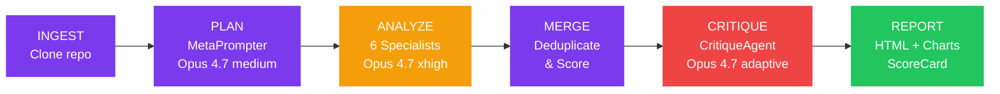
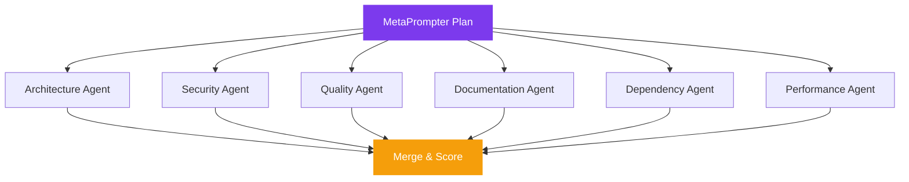
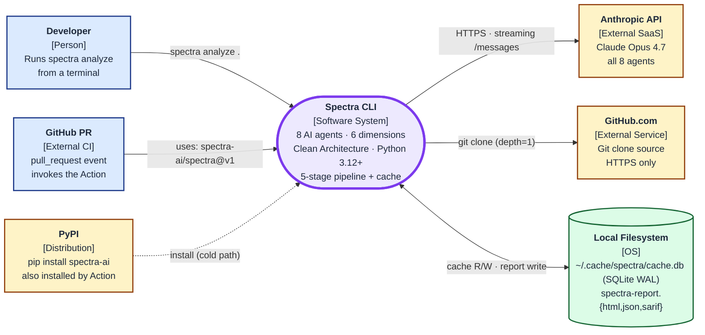
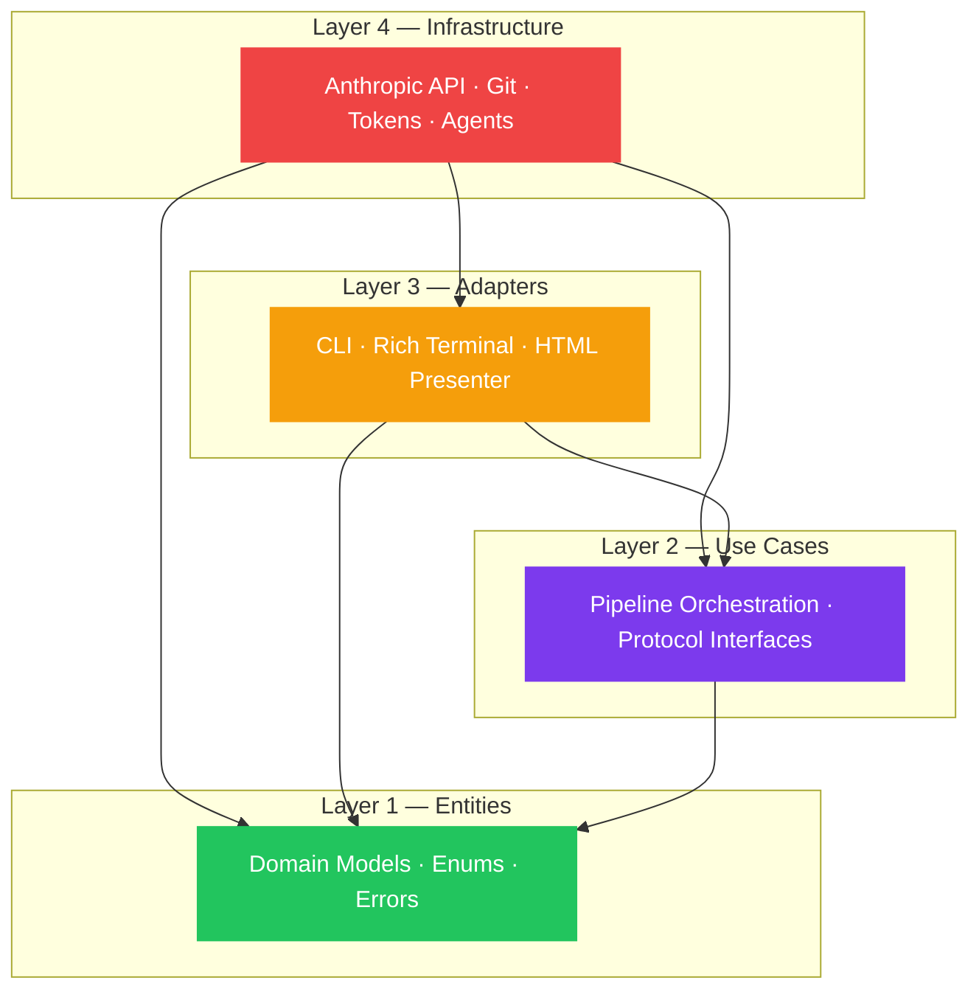

<div align="center">

# SPECTRA

### The full spectrum of your codebase

**Spectra grades any repository on architecture, security, quality, docs, maintainability, and performance — in under 5 minutes.** It runs 8 specialized Claude agents in parallel (Opus 4.7) so you get a full audit instead of a single linter's opinion. Built for developers running self-checks, teams gating PRs in CI, and reviewers who need a second pair of eyes before merge.

#### <a id="disclaimer"></a>Disclaimer

**Indicative analysis — not auditor-grade evidence.** Spectra runs 8 LLM agents over your code; findings are heuristic and require human verification before being treated as compliance evidence, audit input, or pass/fail signal in regulated workflows. Use Spectra as a fast directional signal — pair it with deterministic SAST/DAST tooling and a human reviewer for anything compliance-bound. The same notice ships in every HTML, JSON, and SARIF report ([source](src/spectra/entities/disclaimer.py)).

<!-- TODO: 15-second hero GIF showing spectra analyze <repo> → grade pop -->

[](https://python.org)
[](tests/)
[](tests/)
[](LICENSE)
[](https://anthropic.com)

[Quickstart](#quickstart) · [What You Get](#what-you-get) · [Compare](#how-spectra-compares) · [Architecture](#architecture) · [CLI Reference](#cli-reference)

</div>

---

## Quickstart

Three lines, under a minute:

```bash
pip install spectra-ai
export ANTHROPIC_API_KEY=sk-ant-...
spectra analyze https://github.com/your/repo
```

Open `spectra-report.html` when it finishes. Requires Python 3.12+ and an [Anthropic API key](https://console.anthropic.com/).

### Drop into any GitHub Action

```yaml
- uses: spectra-ai/spectra@v1
  with:
    anthropic-api-key: ${{ secrets.ANTHROPIC_API_KEY }}
```

---

## The Problem

AI-generated code ships faster than ever, but quality assurance hasn't kept up. One LLM call can't catch architecture drift, security flaws, and documentation gaps at the same time.

**Spectra deploys 8 AI agents — 6 parallel specialists, a planning agent, and a critique agent — to give you the full spectrum in under 5 minutes.**

---

## What You Get

A weighted ScoreCard plus a self-contained HTML report. Here's what the terminal looks like at the end of a run:

<!-- sample output, illustrative -->
```
▸ INGEST: cloned expressjs/express (1,247 files, 184K LOC)
▸ PLAN:   MetaPrompter built 6-agent plan (4.2K tokens)
▸ ANALYZE: 6 specialists running in parallel...
   ✓ Architecture     12.4s   8 findings
   ✓ Security          9.8s   14 findings (3 critical)
   ✓ Quality          11.2s   11 findings
   ✓ Documentation     7.6s   6 findings
   ✓ Maintainability   8.1s   4 findings
   ✓ Performance      10.5s   3 findings
▸ MERGE:    deduplicated 46 → 38 findings
▸ CRITIQUE: validated findings, dropped 4 false positives (Opus 4.7 + thinking)
▸ REPORT:   spectra-report.html

┌─────────────────────────────────────────────┐
│  SPECTRA SCORECARD                          │
│  repo: expressjs/express                    │
│  Overall: B- (80/100)                       │
├─────────────────────────────────────────────┤
│  Architecture   █████████░  89  A-          │
│  Security       ██████░░░░  67  D+          │
│  Quality        █████████░  87  B+          │
│  Documentation  ██████░░░░  68  C-          │
│  Maintainability██████████  92  A           │
│  Performance    ████████░░  76  C+          │
├─────────────────────────────────────────────┤
│  34 findings · 3 critical · 87s · $2.41     │
└─────────────────────────────────────────────┘

✓ Top issues: SQL injection in middleware/parser.js:142
              prototype pollution in utils/merge.js:38
              missing auth on /admin/* routes
```

> **See Spectra analyze itself:** [spectra-self-report.html](spectra-self-report.html) — B+ (86/100), 60 findings, $9.24

---

## Three Things That Set Spectra Apart

| 8 AI agents in parallel | Incremental cache | GitHub Action |
|---|---|---|
| Six specialists (architecture, security, quality, docs, maintainability, performance) plus a MetaPrompter planner and a CritiqueAgent that filters false positives. All Opus 4.7. Specialists fan out via `asyncio.gather` so the wall clock is the slowest agent, not the sum. | Re-run the same repo and finish in seconds. Composite-key cache (`content × dimension × model × prompt × schema × spectra version`) means only changed files re-analyze. Three subcommands manage it: `spectra cache stats / clear / prune`. | Drop `spectra-ai/spectra@v1` into any PR workflow with one block of YAML. The Action installs from PyPI, runs `spectra analyze`, and posts SARIF to the GitHub Security tab. Min-score gate fails the build below threshold. |

### Other things you get

- **Multi-model strategy** — Opus 4.7 (medium effort) for planning, Opus 4.7 (xhigh effort) for deep analysis, Opus 4.7 with adaptive thinking for critique
- **Self-contained HTML reports** — Radar charts, interactive findings, keyboard navigation, file hotspot heatmaps — one file, works offline
- **Due diligence frameworks** — OWASP Top 10, SOC 2 Trust Criteria, PCI DSS 4.0, NIST CSF 2.0, and Investment Readiness scoring
- **Cost transparency** — Every report shows exact token usage and dollar cost
- **Clean Architecture** — 4-layer dependency rule, frozen Pydantic models, zero `Any` types — the tool that audits architecture follows strict architecture itself

---

## How Spectra Compares

Honest tradeoffs. Spectra is built for full-repo audits — not for inline PR comments or IDE feedback. Use it alongside, not instead of, the tools your team already runs.

| | **Spectra** | CodeRabbit | DeepSource | Sourcery | Codeball |
|---|:---:|:---:|:---:|:---:|:---:|
| Whole-repo audit (one report, six dimensions) | ✓ | partial | partial | — | — |
| Multiple specialist agents in parallel | ✓ (8) | — | — | — | — |
| False-positive filtering pass | ✓ (CritiqueAgent) | — | — | — | — |
| Self-contained HTML report (offline) | ✓ | — | — | — | — |
| SARIF output for GitHub Security tab | ✓ | — | ✓ | — | — |
| Compliance scoring (OWASP / SOC 2 / PCI DSS / NIST) | ✓ | — | partial | — | — |
| Incremental cache (re-runs in seconds) | ✓ | — | ✓ | — | — |
| Inline PR comments on diffs | — | ✓ | ✓ | ✓ | ✓ |
| IDE plugin (VS Code, JetBrains) | — | — | — | ✓ | — |
| Real-time review on every push | — | ✓ | ✓ | — | ✓ |
| Pricing model | Per-run API cost ($1-10) | SaaS subscription | SaaS subscription | SaaS subscription | SaaS subscription |
| Open source (MIT) | ✓ | — | — | — | — |

If you need inline PR comments while reviewing diffs, run CodeRabbit. If you need an architecture-level audit with security and compliance scoring before a release or due-diligence review, run Spectra. They complement each other.

---

## How It Works



The ANALYZE stage fans out to 6 parallel specialists:



---

## Agent Roster

| Agent | Model | Role |
|-------|-------|------|
| **MetaPrompter** | Opus 4.7 (medium effort) | Reads file tree (never full code), builds analysis plan |
| **ArchitectureAgent** | Opus 4.7 | Layering, coupling, dependency analysis |
| **SecurityAgent** | Opus 4.7 | OWASP Top 10, CWE mapping, vulnerability detection |
| **QualityAgent** | Opus 4.7 | Code smells, complexity, test coverage gaps |
| **DocumentationAgent** | Opus 4.7 | API docs, README quality, inline comments |
| **DependencyAgent** | Opus 4.7 | Supply chain, outdated packages, license risks |
| **PerformanceAgent** | Opus 4.7 | N+1 queries, memory leaks, async anti-patterns |
| **CritiqueAgent** | Opus 4.7 + Adaptive Thinking | Validates all findings, removes false positives |

---

## ScoreCard

Every analysis produces a weighted ScoreCard:

| Dimension | Weight | Agent |
|-----------|--------|-------|
| Architecture | 25% | ArchitectureAgent |
| Security | 25% | SecurityAgent |
| Quality | 20% | QualityAgent |
| Documentation | 10% | DocumentationAgent |
| Maintainability | 10% | DependencyAgent |
| Performance | 10% | PerformanceAgent |

**Grades:** A+ (95-100) · A (90-94) · A- (87-89) · B+ (83-86) · B (80-82) · B- (77-79) · C+ (73-76) · C (70-72) · C- (67-69) · D+ (63-66) · D (60-62) · D- (57-59) · F (0-56)

---

## Report Features

Every analysis generates a self-contained HTML report with:

- **Executive summary** — Top strengths and concerns at a glance
- **Radar chart** — Scores across all 6 dimensions
- **Interactive findings** — Filter by severity/dimension, text search, keyboard navigation (`j`/`k`, `o`, `/`)
- **File hotspot heatmap** — Files ranked by finding density
- **Technical debt quantification** — Estimated hours and cost to remediate
- **ROI analysis** — Estimated return on fixing identified issues
- **Compliance mapping** — OWASP Top 10, SOC 2, PCI DSS 4.0, NIST CSF 2.0

Works offline. No external dependencies. One HTML file. Print-friendly for PDF export.

---

## Architecture

### System context

Spectra in its environment — who invokes it and what it talks to. Two install paths (local pip + GitHub Action), one PyPI package. Source: [`docs/diagrams/system-context.md`](docs/diagrams/system-context.md).



### Clean Architecture layers

Four strict layers with one rule:



**The dependency rule:** Source code dependencies only point inward. No exceptions.

### Design Patterns

| Pattern | Where | Why |
|---------|-------|-----|
| **Facade** | `AnalyzeRepository` | Orchestrates the 6-stage pipeline behind one call |
| **Strategy** | Agent implementations | Swap agents via factory without touching orchestrator |
| **Decorator** | LLM call chain | Logging → Retry → Anthropic adapter (composable) |
| **Observer** | `ProgressObserver` | Rich terminal updates decoupled from business logic |
| **Template Method** | `BaseAgent` | Common agent lifecycle, specialized per dimension |
| **Composition Root** | `main.py` | All dependencies wired at startup, no service locator |

---

## How Spectra Uses Claude

### Multi-Model Strategy

| Agent | Model | Why This Model |
|-------|-------|----------------|
| MetaPrompter | **Opus 4.7 (medium effort)** | Planning from file tree — fast, no deep reasoning needed |
| 6 Specialists | **Opus 4.7 (xhigh effort)** | Deep code understanding across all 6 dimensions |
| CritiqueAgent | **Opus 4.7 + Adaptive Thinking** | Meta-reasoning to validate findings and reject false positives |

### Key Capabilities Used

- **Parallel execution** — 6 agents via `asyncio.gather` with semaphore rate limiting
- **Token budget management** — 800K tokens distributed by MetaPrompter's plan
- **Adaptive thinking** — CritiqueAgent reasons through each finding before passing judgment
- **Structured output** — Every agent returns Pydantic-validated JSON
- **Prompt engineering** — Few-shot JSON examples, hallucination guardrails, CWE/OWASP references
- **Graceful degradation** — If 2+ agents fail, partial report in DEGRADED state

---

## Technology Stack

| Component | Technology |
|-----------|-----------|
| Language | Python 3.12+ |
| AI Models | Claude Opus 4.7 (all 8 agents) |
| AI SDK | `anthropic` Python SDK |
| CLI Framework | Typer |
| Terminal UI | Rich |
| Data Models | Pydantic v2 (frozen) |
| Git Operations | GitPython |
| Token Counting | tiktoken |
| Report Rendering | Jinja2 |
| HTTP Client | httpx |
| Testing | pytest, pytest-asyncio |
| Linting | Ruff (40+ rules), mypy (strict) |

---

## Numbers That Matter

| Metric | Value |
|--------|-------|
| Tests | 1,355 passed |
| Coverage | 97% |
| Agents | 8 (6 parallel + MetaPrompter + CritiqueAgent) |
| Dimensions | 6 |
| Cost | $5-10 per analysis (Opus 4.7, full mode, real Anthropic spend) |
| Speed | Under 5 minutes end-to-end |
| Architecture | Clean Architecture, 4 layers |
| Error codes | 11 typed (SPEC-001 to SPEC-011) |

---

## See It Run on Real Repos

We scan well-known OSS projects on every release and check the results into the
repo. **Real Anthropic API spend, no cherry-picking, one shot per repo.**

| Repo | Stars | Grade | Findings | Cost | Report |
|---|---:|:---:|---:|---:|:---:|
| [`anthropics/anthropic-sdk-python`](https://github.com/anthropics/anthropic-sdk-python) | Anthropic | **B+ (86)** | 50 | $7.41 | [📄 HTML](docs/launch/reports/anthropic-sdk-python.html) · [📦 JSON](docs/leaderboard-data/anthropic-sdk-python.json) |
| [`garrytan/gstack`](https://github.com/garrytan/gstack) | 86k | **C (73)** | 49 (1 critical) | $9.16 | [📄 HTML](docs/launch/reports/gstack.html) · [📦 JSON](docs/leaderboard-data/gstack.json) |
| [`garrytan/gbrain`](https://github.com/garrytan/gbrain) | 12k | **C+ (73)** | 61 | $5.25 | [📄 HTML](docs/launch/reports/gbrain.html) · [📦 JSON](docs/leaderboard-data/gbrain.json) |
| [`garrytan/gbrain-evals`](https://github.com/garrytan/gbrain-evals) | 65 | **C+ (76)** | 55 (1 critical) | $6.32 | [📄 HTML](docs/launch/reports/gbrain-evals.html) · [📦 JSON](docs/leaderboard-data/gbrain-evals.json) |
| [`garrytan/alphaclaw`](https://github.com/garrytan/alphaclaw) | ~64 | **C+ (75)** | 50 | $5.30 | [📄 HTML](docs/launch/reports/alphaclaw.html) · [📦 JSON](docs/leaderboard-data/alphaclaw.json) |

Full leaderboard with per-finding entry-point links: [`docs/launch/leaderboard.md`](docs/launch/leaderboard.md).

---

## CI Integration

The official GitHub Action installs Spectra from PyPI and runs `spectra analyze` on every PR — no Python setup, no extra steps. See [docs/github-action.md](docs/github-action.md) for the full reference.

```yaml
# .github/workflows/spectra-analyze.yml
name: Spectra Analysis
on:
  pull_request:
    branches: [main]
jobs:
  analyze:
    runs-on: ubuntu-latest
    steps:
      - uses: actions/checkout@v4
      - uses: spectra-ai/spectra@v1
        with:
          min-score: 70
        env:
          ANTHROPIC_API_KEY: ${{ secrets.ANTHROPIC_API_KEY }}
```

The Action also writes SARIF, which GitHub picks up under the **Security** tab — findings show inline on the PR.

---

## CLI Reference

Two top-level commands: `spectra analyze` and `spectra cache`.

### `spectra analyze`

```bash
spectra analyze <repo-url-or-path> [flags]
```

The argument can be an HTTPS Git URL, a local path, or `.` for the current working tree (no clone).

| Flag | Default | Purpose |
|------|---------|---------|
| `--quick` | off | Skip the CritiqueAgent pass (saves ~40s, keeps false positives) |
| `--format` | `html` | Output format: `html`, `json`, or `sarif` |
| `--output` | `spectra-report.html` | Custom report path |
| `--min-score` | none | Quality gate — exit 1 if overall score is below this number |
| `--force` | off | Bypass cache, force a fresh analysis |
| `--no-cache` | off | Disable cache reads and writes for this run |
| `--no-gitignore` | off | Do not honor `.gitignore` (`.spectraignore` is still applied) |
| `--allow-secrets` | off | Continue past pre-flight secret detection (logs WARN) |

### Pre-flight: secret scan + workspace filtering

Spectra runs a fast pre-flight stage between INGEST and PLAN that:

1. **Honors `.gitignore`** (root + every nested `.gitignore`) so excluded files
   never reach a prompt or cache key. Use `--no-gitignore` to opt out.
2. **Honors `.spectraignore`** — same `gitwildmatch` syntax — for Spectra-only
   exclusions you don't want polluting your `.gitignore`. Always applied.
3. **Scans for hard-coded secrets** with a curated regex list (AWS keys,
   GitHub PATs, Anthropic keys, bearer tokens, Slack webhooks, RSA/OpenSSH
   private keys, plus an `.env*` heuristic). On detection, fails with
   `SPEC-011` listing every match. Override with `--allow-secrets` (CI-safe;
   the run continues but every finding is logged at WARN).

Example `.spectraignore`:

```
# Generated client SDKs we don't author
clients/generated/
# Vendored protobuf stubs
**/proto/*_pb2.py
# Large fixtures
tests/fixtures/large_repo/
```

### Per-agent model + effort

Override the default Claude Opus 4.7 wiring per agent role.

```bash
# Run all 6 specialists on Sonnet 4.6 (cheaper, slightly less accurate)
spectra analyze <repo> --model claude-sonnet-4-6

# Bump security agent's effort to max while keeping others at xhigh
spectra analyze <repo> --security-effort max

# Use Haiku for documentation only (it's cheap and docs don't need much reasoning)
spectra analyze <repo> --documentation-model claude-haiku-4-5

# Power-user JSON override
spectra analyze <repo> \
  --model-overrides '{"security":"claude-opus-4-7","documentation":"claude-haiku-4-5"}' \
  --effort-overrides '{"security":"max"}'
```

| Flag | Default | Allowed |
|---|---|---|
| `--model` | `claude-opus-4-7` (specialists) | `claude-opus-4-7`, `claude-opus-4-6`, `claude-sonnet-4-6`, `claude-haiku-4-5` |
| `--effort` | `xhigh` (specialists), `medium` (meta), `high` (critique) | `low`, `medium`, `high`, `xhigh`, `max` |
| `--<role>-model` | inherits `--model` | same as above |
| `--<role>-effort` | inherits `--effort` | same as above |

Roles: `meta`, `architecture`, `security`, `quality`, `documentation`, `dependency`, `performance`, `critique`.

**Constraint:** `max` effort is Opus-tier only (Sonnet 4.6 and Haiku 4.5 reject it).

JSON overrides win over per-flag overrides when both are present.

### `spectra cache`

Spectra writes a SQLite cache to `${XDG_CACHE_HOME:-~/.cache}/spectra/cache.db` (WAL mode). Three subcommands manage it:

| Subcommand | What it does |
|------------|--------------|
| `spectra cache stats` | Show entry count, on-disk size, per-dimension hit rate (rolling last 100 lookups) |
| `spectra cache clear` | Drop all cache entries (full reset) |
| `spectra cache prune` | Physically delete stale rows that no current key matches — safe to run anytime |

Cache I/O failures are never fatal — the pipeline degrades to no-cache for the rest of the run (see SPEC-010).

---

## Verifying releases

Every release ships with two independent supply-chain attestations: SLSA L3 build provenance (via GitHub's attest-build-provenance) and a Sigstore keyless signature on every wheel. Both are produced inside the publish workflow and bound to the tag commit.

### 1. Verify SLSA build provenance

Confirms the artifact was built by `leocder07/spectra`'s publish workflow on the expected tag commit — defeats the tag-move attack class.

```bash
# Install once
brew install gh   # or: see https://cli.github.com/

# Download the wheel from PyPI (or the release page)
pip download --no-deps spectra-ai==0.4.0 -d /tmp/spectra-verify

# Verify provenance
gh attestation verify /tmp/spectra-verify/spectra_ai-0.4.0-py3-none-any.whl \
  --repo leocder07/spectra
```

Expected output: `Loaded digest sha256:... ✓ Verification succeeded!`

### 2. Verify Sigstore signature

Confirms the wheel was signed by the publish workflow's OIDC identity. Bundles are attached to each GitHub Release as `*.sigstore` assets.

```bash
# Install once
pip install "sigstore>=3.0,<4.0"

# Download wheel + bundle
VER=0.4.0
gh release download "v${VER}" --repo leocder07/spectra \
  --pattern "spectra_ai-${VER}*.sigstore*"
pip download --no-deps "spectra-ai==${VER}" -d .

# Verify
python -m sigstore verify identity \
  --bundle "spectra_ai-${VER}-py3-none-any.whl.sigstore" \
  --cert-identity "https://github.com/leocder07/spectra/.github/workflows/publish.yml@refs/tags/v${VER}" \
  --cert-oidc-issuer "https://token.actions.githubusercontent.com" \
  "spectra_ai-${VER}-py3-none-any.whl"
```

Expected output: `OK: spectra_ai-0.4.0-py3-none-any.whl`

If either check fails, do not install — open an issue at https://github.com/leocder07/spectra/security/advisories/new.

---

## Privacy & Data Processing

Spectra runs on the Customer's machine; the only outbound data flow is to Anthropic's API for inference, governed by the Customer's own Anthropic agreement. We publish a template Data Processing Addendum, an authoritative sub-processor list, and a per-edge data flow diagram so procurement and legal teams have a starting position rather than a blank page.

- [`docs/legal/DPA.md`](docs/legal/DPA.md) — GDPR Art. 28 — compatible Data Processing Addendum (template — requires legal review)
- [`docs/legal/SUBPROCESSORS.md`](docs/legal/SUBPROCESSORS.md) — Sub-processor declaration (Anthropic only)
- [`docs/legal/DATA_FLOW.md`](docs/legal/DATA_FLOW.md) — Per-edge data flow diagram, v0.5.0 baseline
- [`SECURITY.md`](SECURITY.md) — Vulnerability reporting, supported versions, hardening already shipped

---

## Contributing

```bash
# Clone and install
git clone https://github.com/leocder07/spectra.git
cd spectra
pip install -e ".[dev]"

# Run tests
pytest tests/ -v

# Lint
ruff check src/ tests/
mypy src/
```

PRs welcome. Please follow the Clean Architecture dependency rule — it's enforced.

---

<div align="center">

### Built for the Anthropic Build with Claude Hackathon

[](https://anthropic.com)

Built with Claude Opus 4.7 and Claude Code.

**MIT License** · [Repository](https://github.com/leocder07/spectra)

</div>
