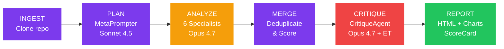
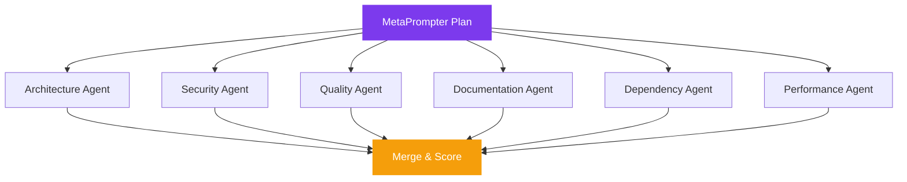
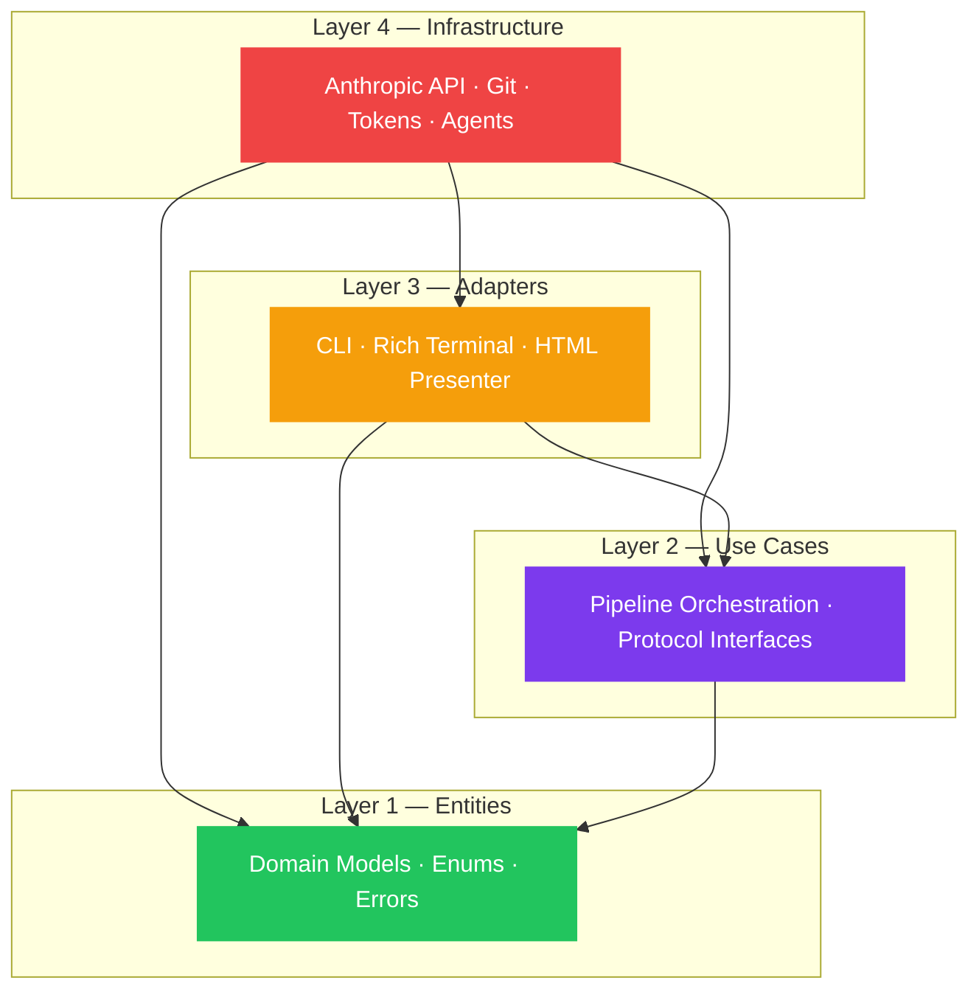

<div align="center">

# SPECTRA

### The full spectrum of your codebase

**8 AI agents analyze your entire repository in under 5 minutes.**

[](https://python.org)
[](tests/)
[](tests/)
[](LICENSE)
[](https://anthropic.com)

[Installation](#installation) · [Try It](#try-it) · [How It Works](#how-it-works) · [Architecture](#architecture) · [Agent Roster](#agent-roster)

</div>

---

## The Problem

AI-generated code ships faster than ever, but quality assurance hasn't kept up. One LLM call can't catch architecture drift, security flaws, and documentation gaps at the same time.

**Spectra deploys 8 AI agents — 6 parallel specialists, a planning agent, and a critique agent — to give you the full spectrum in under 5 minutes.**

---

## Installation

```bash
pip install spectra-ai
```

Requires Python 3.12+ and an [Anthropic API key](https://console.anthropic.com/).

---

## Try It

```bash
export ANTHROPIC_API_KEY=sk-ant-...
spectra analyze https://github.com/expressjs/express
```

Open `spectra-report.html` when it's done.

```bash
# Options
spectra analyze .                            # Analyze the current working tree (no clone)
spectra analyze <repo-url> --quick           # Skip critique pass (~40s)
spectra analyze <repo-url> --format json     # Machine-readable output
spectra analyze <repo-url> --format sarif    # SARIF for GitHub Security tab
spectra analyze <repo-url> --min-score 70    # Quality gate (exit 1 if below)
spectra analyze <repo-url> --output my.html  # Custom report path
spectra analyze <repo-url> --force           # Bypass cache, force a fresh analysis
spectra analyze <repo-url> --no-cache        # Disable cache reads and writes for this run
```

---

## Key Features

- **8 AI agents, 6 dimensions** — Architecture, Security, Quality, Documentation, Maintainability, Performance analyzed in parallel
- **Under 5 minutes** — 6 specialists run concurrently via `asyncio.gather`, not sequentially
- **Multi-model strategy** — Sonnet 4.5 for planning, Opus 4.7 for deep analysis, Opus 4.7 + Extended Thinking for critique
- **False positive filtering** — CritiqueAgent uses extended thinking to validate every finding before it reaches the report
- **Self-contained HTML reports** — Radar charts, interactive findings, keyboard navigation, file hotspot heatmaps — one file, works offline
- **Due diligence frameworks** — OWASP Top 10, SOC 2 Trust Criteria, PCI DSS 4.0, NIST CSF 2.0, and Investment Readiness scoring
- **Cost transparency** — Every report shows exact token usage and dollar cost
- **Clean Architecture** — 4-layer dependency rule, frozen Pydantic models, zero `Any` types — the tool that audits architecture follows strict architecture itself

---

## How It Works



The ANALYZE stage fans out to 6 parallel specialists:



---

## Agent Roster

| Agent | Model | Role |
|-------|-------|------|
| **MetaPrompter** | Sonnet 4.5 | Reads file tree (never full code), builds analysis plan |
| **ArchitectureAgent** | Opus 4.7 | Layering, coupling, dependency analysis |
| **SecurityAgent** | Opus 4.7 | OWASP Top 10, CWE mapping, vulnerability detection |
| **QualityAgent** | Opus 4.7 | Code smells, complexity, test coverage gaps |
| **DocumentationAgent** | Opus 4.7 | API docs, README quality, inline comments |
| **DependencyAgent** | Opus 4.7 | Supply chain, outdated packages, license risks |
| **PerformanceAgent** | Opus 4.7 | N+1 queries, memory leaks, async anti-patterns |
| **CritiqueAgent** | Opus 4.7 + Extended Thinking | Validates all findings, removes false positives |

---

## ScoreCard

Every analysis produces a weighted ScoreCard:

| Dimension | Weight | Agent |
|-----------|--------|-------|
| Architecture | 25% | ArchitectureAgent |
| Security | 25% | SecurityAgent |
| Quality | 20% | QualityAgent |
| Documentation | 10% | DocumentationAgent |
| Maintainability | 10% | DependencyAgent |
| Performance | 10% | PerformanceAgent |

**Grades:** A+ (95-100) · A (90-94) · A- (87-89) · B+ (83-86) · B (80-82) · B- (77-79) · C+ (73-76) · C (70-72) · C- (67-69) · D+ (63-66) · D (60-62) · D- (57-59) · F (0-56)

### Example Output

```
┌─────────────────────────────────────────────┐
│  SPECTRA SCORECARD                          │
│  repo: expressjs/express                    │
│  Overall: B- (80/100)                       │
├─────────────────────────────────────────────┤
│  Architecture   █████████░  89  A-          │
│  Security       ██████░░░░  67  D+          │
│  Quality        █████████░  87  B+          │
│  Documentation  ██████░░░░  68  C-          │
│  Maintainability██████████  92  A           │
│  Performance    ████████░░  76  C+          │
├─────────────────────────────────────────────┤
│  46 findings · 3 critical · 87s · $2.41     │
└─────────────────────────────────────────────┘
```

> **See Spectra analyze itself:** [spectra-self-report.html](spectra-self-report.html) — B+ (86/100), 60 findings, $9.24

---

## Report Features

Every analysis generates a self-contained HTML report with:

- **Executive summary** — Top strengths and concerns at a glance
- **Radar chart** — Scores across all 6 dimensions
- **Interactive findings** — Filter by severity/dimension, text search, keyboard navigation (`j`/`k`, `o`, `/`)
- **File hotspot heatmap** — Files ranked by finding density
- **Technical debt quantification** — Estimated hours and cost to remediate
- **ROI analysis** — Estimated return on fixing identified issues
- **Compliance mapping** — OWASP Top 10, SOC 2, PCI DSS 4.0, NIST CSF 2.0

Works offline. No external dependencies. One HTML file. Print-friendly for PDF export.

---

## Architecture

Clean Architecture with four strict layers:



**The dependency rule:** Source code dependencies only point inward. No exceptions.

### Design Patterns

| Pattern | Where | Why |
|---------|-------|-----|
| **Facade** | `AnalyzeRepository` | Orchestrates the 6-stage pipeline behind one call |
| **Strategy** | Agent implementations | Swap agents via factory without touching orchestrator |
| **Decorator** | LLM call chain | Logging → Retry → Anthropic adapter (composable) |
| **Observer** | `ProgressObserver` | Rich terminal updates decoupled from business logic |
| **Template Method** | `BaseAgent` | Common agent lifecycle, specialized per dimension |
| **Composition Root** | `main.py` | All dependencies wired at startup, no service locator |

---

## How Spectra Uses Claude

### Multi-Model Strategy

| Agent | Model | Why This Model |
|-------|-------|----------------|
| MetaPrompter | **Sonnet 4.5** | Fast planning from file tree — no deep reasoning needed |
| 6 Specialists | **Opus 4.7** | Deep code understanding across all 6 dimensions |
| CritiqueAgent | **Opus 4.7 + Extended Thinking** | Meta-reasoning to validate findings and reject false positives |

### Key Capabilities Used

- **Parallel execution** — 6 agents via `asyncio.gather` with semaphore rate limiting
- **Token budget management** — 800K tokens distributed by MetaPrompter's plan
- **Extended thinking** — CritiqueAgent reasons through each finding before passing judgment
- **Structured output** — Every agent returns Pydantic-validated JSON
- **Prompt engineering** — Few-shot JSON examples, hallucination guardrails, CWE/OWASP references
- **Graceful degradation** — If 2+ agents fail, partial report in DEGRADED state

---

## Technology Stack

| Component | Technology |
|-----------|-----------|
| Language | Python 3.12+ |
| AI Models | Claude Opus 4.7, Claude Sonnet 4.5 |
| AI SDK | `anthropic` Python SDK |
| CLI Framework | Typer |
| Terminal UI | Rich |
| Data Models | Pydantic v2 (frozen) |
| Git Operations | GitPython |
| Token Counting | tiktoken |
| Report Rendering | Jinja2 |
| HTTP Client | httpx |
| Testing | pytest, pytest-asyncio |
| Linting | Ruff (40+ rules), mypy (strict) |

---

## Numbers That Matter

| Metric | Value |
|--------|-------|
| Tests | 1,096 passed |
| Coverage | 97% |
| Agents | 8 (6 parallel + MetaPrompter + CritiqueAgent) |
| Dimensions | 6 |
| Cost | $1-10 per analysis |
| Speed | Under 5 minutes end-to-end |
| Architecture | Clean Architecture, 4 layers |
| Error codes | 9 typed (SPEC-001 to SPEC-009) |

---

## CI Integration

Use the official GitHub Action — one step, no Python setup needed. See [docs/github-action.md](docs/github-action.md) for the full reference.

```yaml
# .github/workflows/spectra-analyze.yml
name: Spectra Analysis
on:
  pull_request:
    branches: [main]
jobs:
  analyze:
    runs-on: ubuntu-latest
    steps:
      - uses: actions/checkout@v4
      - uses: spectra-ai/spectra@v1
        with:
          min-score: 70
        env:
          ANTHROPIC_API_KEY: ${{ secrets.ANTHROPIC_API_KEY }}
```

---

## Contributing

```bash
# Clone and install
git clone https://github.com/leocder07/spectra.git
cd spectra
pip install -e ".[dev]"

# Run tests
pytest tests/ -v

# Lint
ruff check src/ tests/
mypy src/
```

PRs welcome. Please follow the Clean Architecture dependency rule — it's enforced.

---

<div align="center">

### Built for the Anthropic Build with Claude Hackathon

[](https://anthropic.com)

Built with Claude Opus 4.7, Claude Sonnet 4.5, and Claude Code.

**MIT License** · [Repository](https://github.com/leocder07/spectra)

</div>
