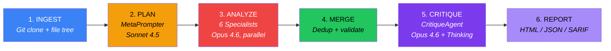

# Spectra Documentation

> **Spectra** deploys 8 AI agents to analyze your entire repository across 6 dimensions in under 5 minutes.
> Clean Architecture. Python 3.12+. Opus 4.6 where it counts.

---

## Try It

```bash
pip install -e ".[dev]"
spectra analyze https://github.com/expressjs/express
```

That's it. You'll get an HTML report with a ScoreCard, dimension-by-dimension findings, compliance mapping, and an ROI estimate.

---

## Key Numbers

| Metric | Value |
|--------|-------|
| AI Agents | 8 (MetaPrompter + 6 specialists + CritiqueAgent) |
| Analysis Dimensions | 6 (Architecture, Security, Quality, Documentation, Maintainability, Performance) |
| Analysis Time | Under 5 minutes |
| Tests | 1,130+ |
| Coverage | 98% |
| Design Patterns | 11 documented |
| Error Codes | SPEC-001 to SPEC-009 |

---

## Architecture at a Glance



---

## Documentation Index

### Architecture

| Document | Description |
|----------|-------------|
| [**HLD.md**](architecture/HLD.md) | System overview, 4-layer architecture, 8 agents, design decisions, tech stack |
| [**LLD.md**](architecture/LLD.md) | Component catalog, data flow, error handling, token budget, parallel execution |

### Architecture Decision Records

| ADR | Decision |
|-----|----------|
| [ADR-001](architecture/adr/ADR-001-clean-architecture.md) | 4-layer Clean Architecture with strict dependency rule |
| [ADR-002](architecture/adr/ADR-002-parallel-agent-pipeline.md) | 8-agent parallel pipeline design |
| [ADR-003](architecture/adr/ADR-003-extended-thinking-critique-only.md) | Extended thinking restricted to CritiqueAgent |
| [ADR-004](architecture/adr/ADR-004-frozen-pydantic-models.md) | Frozen Pydantic models for all domain entities |

### Diagrams

| Diagram | What It Shows |
|---------|---------------|
| [System Architecture](diagrams/hld-system-architecture.md) | Clean Architecture layers, decorator chain, pipeline, agent roster |
| [Component Interaction](diagrams/lld-component-interaction.md) | DI wiring, LLMGateway protocol, agent factory dispatch |
| [Data Flow](diagrams/lld-data-flow.md) | Data transformations through all 6 stages |
| [Sequence — Pipeline](diagrams/sequence-analysis-pipeline.md) | Full pipeline sequence with all 8 agents, error paths |
| [Class — Domain Model](diagrams/class-domain-model.md) | UML class diagram of all entities, protocols, agents |
| [ER — Entities](diagrams/er-domain-entities.md) | Entity relationships and cardinality |
| [State — Pipeline](diagrams/state-pipeline.md) | Pipeline state machine with error transitions |
| [State — Agent Lifecycle](diagrams/state-agent-lifecycle.md) | Agent template method lifecycle, parallel execution, critique |
| [Design Patterns](diagrams/design-patterns-catalog.md) | 11 patterns with GoF categories and source references |

### API & Guides

| Document | Description |
|----------|-------------|
| [**API Reference**](api/API.md) | All public classes, protocols, functions |
| [**Getting Started**](guides/getting-started.md) | Install, run, understand output in 2 minutes |

---

## Project Structure

```
src/spectra/
├── entities/          # Layer 1 — Domain models, enums, errors (ZERO imports)
├── use_cases/         # Layer 2 — Pipeline, orchestration, interfaces
├── adapters/          # Layer 3 — CLI, progress display, presenter
└── infrastructure/    # Layer 4 — Anthropic, Git, agents, reports, DI wiring
    └── agents/        # 8 agent implementations
```

---

## CLI Commands

```bash
# Full analysis (all 8 agents, HTML report)
spectra analyze https://github.com/user/repo

# Quick mode (skip CritiqueAgent)
spectra analyze https://github.com/user/repo --quick

# JSON output
spectra analyze https://github.com/user/repo --format json

# SARIF output (IDE integration)
spectra analyze https://github.com/user/repo --format sarif

# Quality gate (exit 1 if below threshold)
spectra analyze https://github.com/user/repo --min-score 80

# Custom output path
spectra analyze https://github.com/user/repo --output ./my-report.html
```
