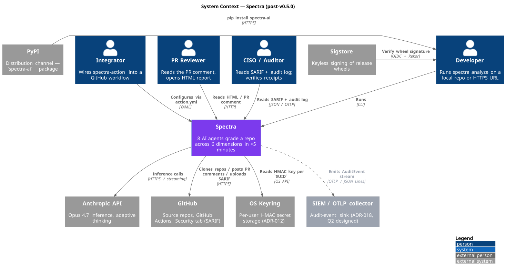

# 01 — System Context

**Status:** Stable · **Baseline:** v0.6.0 · **Last revised:** 2026-04-30

## Purpose

Establish what Spectra *is* — and what it explicitly is not — by naming every actor that interacts with the system and every external system it depends on.

## Audience

Engineering leads making integration decisions, CISOs framing the threat model, integrators wiring Spectra into a CI workflow.

## Diagram

Source: [`diagrams/01-system-context.puml`](./diagrams/01-system-context.puml)

## What Spectra is

A Python 3.12+ CLI that runs 8 LLM agents over a repository and produces a graded HTML / JSON / SARIF report in under five minutes. Distributed via PyPI as `spectra-ai`. Optionally invoked via the `spectra-action` GitHub Action.

## What Spectra is not

- **Not a SaaS.** No control plane, no hosted leaderboard today. Every run executes on the customer's machine or CI runner.
- **Not auditor-grade evidence.** Every report renders the indicative-analysis disclaimer ([`src/spectra/entities/disclaimer.py`](../../src/spectra/entities/disclaimer.py)). Buyers in regulated workflows pair Spectra with deterministic SAST/DAST tooling and a human reviewer.
- **Not multi-tenant by design.** Cache, secret material, and audit log are scoped to a single OS user (`$UID`). Fleet-tier capabilities are deferred to Q3+ (strategy ADR-019).

## Actors

| Actor | Role |
|-------|------|
| Developer | Runs `spectra analyze` on a local checkout or HTTPS URL. Reads `spectra-report.html`. |
| Integrator | Wires `spectra-action` into a `.github/workflows/*.yml` file. |
| PR reviewer | Reads the markdown-safe PR comment ([`pr_comment_renderer.py`](../../src/spectra/adapters/pr_comment_renderer.py)) on the PR; opens the linked HTML report. |
| CISO / Auditor | Reads the SARIF feed, the audit log (`--audit-sink`), and verifies the Ed25519 scan receipt via `spectra verify` (v0.6.0). |

## External systems

| System | What Spectra does with it |
|--------|---------------------------|
| **Anthropic API** | All 8 agents make `messages.create` calls. Streaming for specialists; adaptive thinking + `task_budget=80_000` for the CritiqueAgent. |
| **GitHub** | Source clone target. The action posts the PR comment via `gh` and uploads SARIF for the Security tab. |
| **PyPI** | Distribution channel. Trusted publisher (OIDC), no API token. See [10-deployment-and-release](./10-deployment-and-release.md). |
| **Sigstore** | Keyless signing of release wheels. Bundles attached to each GitHub Release. |
| **OS Keyring** | Stores the per-`$UID` 32-byte HMAC secret used to sign cache rows ([ADR-012](../../../spectra-wt-strategy/docs/strategy/architecture/ADR-012-cache-hmac-per-user-namespace.md)). |
| **SIEM / OTLP collector** *(v0.6.0)* | Receives the JSON-Lines audit-event stream via `--audit-sink otlp:<url>` ([ADR-018](../../../spectra-wt-strategy/docs/strategy/architecture/ADR-018-audit-log-and-identity.md)). |

## Trust boundaries

- The customer machine is trusted (cache rows bound by HMAC keyed in the OS keyring; `0700` cache directory; `0600` `cache.db`).
- Anthropic is trusted to honor its data policy — Workbench API does not retain prompts or completions for training. Spectra additionally fences each analyzed file with a per-call random nonce so injected directives cannot escape the data block.
- GitHub is trusted as the clone source and as the OIDC issuer for both PyPI publishing and Sigstore signing.
- The internet is *not* trusted: `spectra analyze https://...` only accepts HTTPS; `git@`/`ssh://` are rejected at the CLI seam ([`cli_controller._validate_repo_url`](../../src/spectra/adapters/cli_controller.py)).

## Invariants and key decisions

- **CLI-only commitment.** A SaaS control plane does not exist. Identity is derived from the runtime — `SPECTRA_USER_ID` env var, then OIDC token in CI, then `git config user.email`, then hostname (strategy ADR-018 §2). Never user-prompted per command.
- **Workbench API only.** Bedrock / Vertex parity is on the Q4 roadmap (strategy ADR-016 sibling gateway).
- **Distribution fingerprint.** Wheels carry both an `actions/attest-build-provenance` SLSA L3 attestation and a Sigstore `.sigstore` bundle. Verification commands are documented in [README — Verifying releases](../../README.md).

## Open questions

1. Should `spectra serve` (HTTP/MCP server) ship in Q5 alongside Managed Agents (strategy ADR-016)? Greenlight unlocks Slack-bot + hosted-Q&A; rejection keeps the CLI-only commitment. Listed in strategy [INDEX §Open architectural questions](../../../spectra-wt-strategy/docs/strategy/architecture/INDEX.md).
2. Bedrock / Vertex priority — customer-driven, gated on a named procurement deal.
