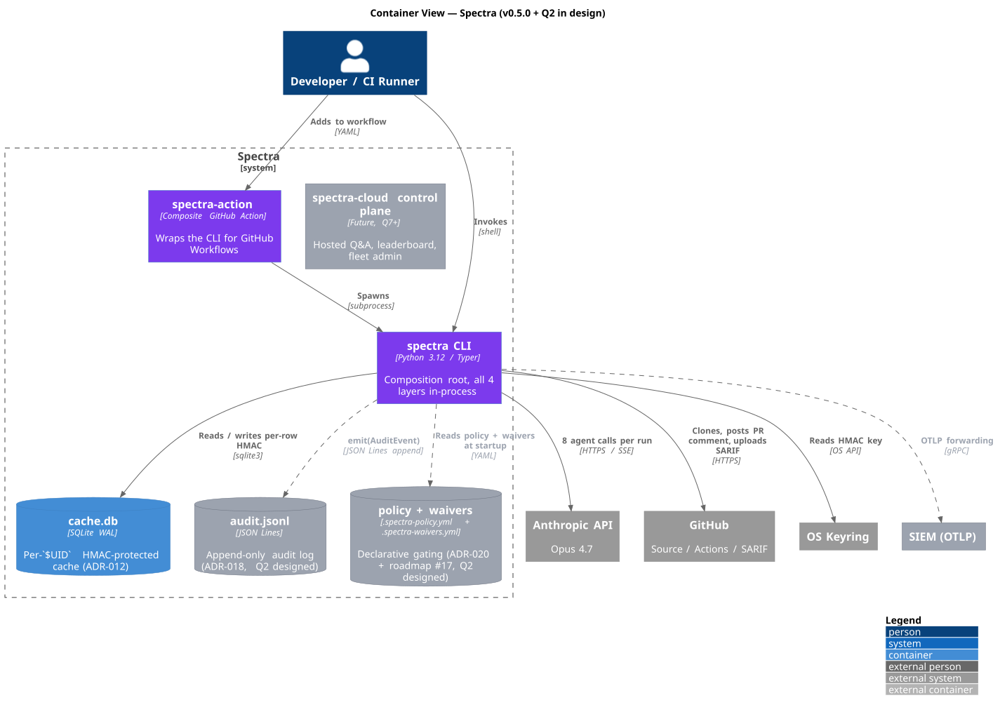
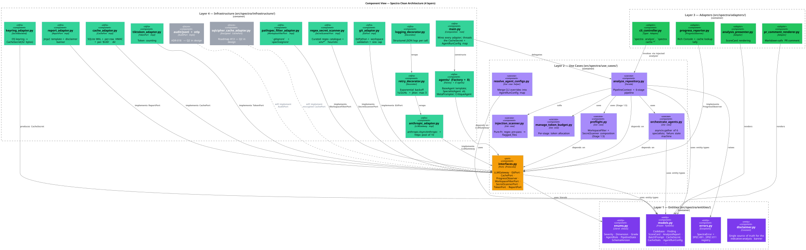
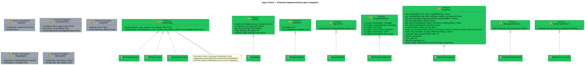

# 02 — Component Architecture

**Status:** Stable · **Baseline:** v0.6.0 · **Last revised:** 2026-04-30

## Purpose

Describe the four-layer Clean Architecture of Spectra, the dependency rule that holds it together, and the ports + adapters that compose every external interaction.

## Audience

Engineers writing code in any layer. Reviewers gating PRs on architectural compliance.

## Container view (C4 Level 2)



Source: [`diagrams/02-component-c4-l2.puml`](./diagrams/02-component-c4-l2.puml)

A Spectra deployment has one in-process Python container (the `spectra` CLI), an optional GitHub Action wrapper, and a small set of on-disk stores. The Q7+ control-plane container is shown for context and is not on the immediate roadmap.

## Component view (C4 Level 3)



Source: [`diagrams/02-component-c4-l3.puml`](./diagrams/02-component-c4-l3.puml)

## The Dependency Rule

| Layer | Path | May import from | Never imports from |
|-------|------|-----------------|---------------------|
| 1 — Entities | [`src/spectra/entities/`](../../src/spectra/entities/) | stdlib + pydantic | Any other `spectra.*` module |
| 2 — Use Cases | [`src/spectra/use_cases/`](../../src/spectra/use_cases/) | Layer 1 | Layers 3, 4 |
| 3 — Adapters | [`src/spectra/adapters/`](../../src/spectra/adapters/) | Layers 1, 2 | Layer 4 |
| 4 — Infrastructure | [`src/spectra/infrastructure/`](../../src/spectra/infrastructure/) | Layers 1, 2, 3 | (outermost) |

Violation = immediate rejection. The CLI controller ([`adapters/cli_controller.py`](../../src/spectra/adapters/cli_controller.py)) does not import infrastructure; the composition root ([`infrastructure/main.py`](../../src/spectra/infrastructure/main.py)) injects the analyzer callable via `set_analyzer_factory()`. The cache subsystem is the canonical example of the additive, port-based extension pattern: `CachePort` lives in Layer 2 ([`use_cases/interfaces.py`](../../src/spectra/use_cases/interfaces.py)); `SqliteCacheAdapter` lives in Layer 4 ([`infrastructure/cache_adapter.py`](../../src/spectra/infrastructure/cache_adapter.py)).

## Ports

The Layer-2 ports (Protocol classes) define every boundary. Adding a capability without growing the port surface is preferred — sibling Protocols (e.g. the future `ManagedAgentGateway` in strategy ADR-016) are the safe extension shape.



Source: [`diagrams/03-domain-port-protocols.puml`](./diagrams/03-domain-port-protocols.puml)

| Port | File | Implemented by | Status |
|------|------|----------------|--------|
| `LLMGateway` | `interfaces.py` | `AnthropicAdapter`, `RetryDecorator`, `LoggingDecorator` (decorator chain) | Stable |
| `GitPort` | `interfaces.py` | `GitAdapter` | Stable |
| `TokenPort` | `interfaces.py` | `TiktokenAdapter` | Stable |
| `ReportPort` | `interfaces.py` | `ReportAdapter` | Stable |
| `ProgressObserver` | `interfaces.py` | `RichProgressReporter` | Stable |
| `CachePort` | `interfaces.py` | `SqliteCacheAdapter` | Stable |
| `WorkspaceFilterPort` | `interfaces.py` | `PathspecFilterAdapter` | Stable (v0.5.0) |
| `SecretScannerPort` | `interfaces.py` | `RegexSecretScanner` | Stable (v0.5.0) |
| `AuditPort` | `interfaces.py` | `JsonLinesAuditAdapter`, `OtlpAuditAdapter`, `StdoutAuditAdapter` | Stable (v0.6.0) — [ADR-018](./adr/ADR-018-audit-log-and-identity.md) |
| `CostTrackerPort` | `interfaces.py` | `InMemoryCostTracker`, `SqliteCostTracker` | Stable (v0.6.0) — [ADR-013](./adr/ADR-013-task-budget-and-rate-coordination.md) |
| `PolicyPort` | `interfaces.py` | `YamlPolicyAdapter` | Stable (v0.6.0) — roadmap #17 |
| `WaiverPort` | `interfaces.py` | `YamlWaiverAdapter` (Ed25519-verified) | Stable (v0.6.0) — roadmap #18 |
| `ReceiptSigner` | `interfaces.py` | `Ed25519ReceiptSigner` | Stable (v0.6.0) — roadmap #57 |
| `MemoryPort` | (additive) | `LocalFileMemoryAdapter`, `DeveloperMemoryAdapter`, `ManagedAgentMemoryAdapter` | Q4 designed — [ADR-014](./adr/ADR-014-anthropic-memory-stores-for-team-org.md) |
| `ManagedAgentGateway` | (sibling Protocol) | `AnthropicManagedAgentAdapter` | Q5 designed — [ADR-016](./adr/ADR-016-managed-agents-gateway.md) |

## Composition root

[`infrastructure/main.py`](../../src/spectra/infrastructure/main.py) is the only module that performs dependency injection. It:

1. Builds the decorator chain `LoggingDecorator(RetryDecorator(AnthropicAdapter(api_key)))`.
2. Resolves per-agent `AgentRunConfig` from CLI overrides via [`use_cases/resolve_agent_configs.py`](../../src/spectra/use_cases/resolve_agent_configs.py).
3. Constructs `AgentFactory(gateway, configs)` and uses it to create all 8 agents.
4. Provisions the `SqliteCacheAdapter` with the `CacheSecret` fetched from `KeyringSecretAdapter` for the current `$UID`.
5. Calls `cache.bind_run_context(model_versions, prompt_versions, schema_version, spectra_version)` exactly once so every Phase 3 cache key is composed from the same atomic four-tuple.
6. Hands a `PipelineContext` value object to the use-case facade.

No other module performs DI. No service locator. No framework magic. The CLI seam ([`cli_controller.set_analyzer_factory()`](../../src/spectra/adapters/cli_controller.py)) lets the composition root inject the analyzer callable without the adapter ever importing infrastructure.

## Decorator chain

Every LLM call passes through:

```
LoggingDecorator (structured JSON, request id, timing)
  → RetryDecorator (exp backoff 1s/2s/4s + jitter, max 3, SPEC-002 / SPEC-003)
    → AnthropicAdapter (anthropic.AsyncAnthropic, httpx pool of 10, streaming)
```

All three satisfy `LLMGateway` via structural subtyping. See [05 — Agent Architecture](./05-agent-architecture.md) for the rationale.

## Code standards (enforced)

From [`CLAUDE.md`](../../CLAUDE.md):

- Functions: ≤20 lines, ≤3 parameters, cyclomatic complexity ≤10.
- No `Any`. No `# type: ignore` (except clearly-marked Protocol-bridging spots in the cache adapter).
- No `print()` in `src/` — use `ProgressObserver` via `RichProgressReporter`.
- Every entity: `frozen=True` Pydantic model.
- Fallible operations: `Result` dataclass pattern (the orchestrator's `_AnalysisResult`, the cache's `PreflightResult`).
- All agent outputs validated against a Pydantic model BEFORE merge.
- `Literal` types for enums (`Severity`, `Dimension`, `Grade`, `AgentRole`, `PipelineState`).

`ruff check src/ tests/` and `mypy src/` gate every CI run; coverage gate is `--cov-fail-under=70`.

## Invariants and key decisions

- **One composition root.** All wiring lives in `main.py`. The CLI controller ([`cli_controller.py`](../../src/spectra/adapters/cli_controller.py)) discovers the analyzer via injected factory.
- **Ports never import infrastructure.** They live in Layer 2 ([`interfaces.py`](../../src/spectra/use_cases/interfaces.py)) and are typed against entity types only.
- **Adapters wrap with no business logic.** A specialist agent has no fallback if its model rejects a request — it raises and the orchestrator's failure state machine decides.
- **Frozen entities.** Mutability lives in two narrow places: `_PipelineState` (use-case private, single-task scope) and `SqliteCacheAdapter._run_versions` (set once at startup via `bind_run_context`).
- **The cache subsystem is purely additive.** `cache_port=None` in `PipelineContext` skips both reads and writes. `--no-cache` is fully supported and CI-safe.

## Open questions

1. The `nonce` field on `BatchPrompt` lives in Layer 1 today (entities/models.py:466). It is correctly Layer 1 — the value object owns its own immutability — but the *generation strategy* (`secrets.token_urlsafe(16)`) is stdlib-only, so the rule holds. If the strategy ever needs to swap (e.g. UUIDv7), the swap belongs at construction, not in the model.
2. Whether `injection_scanner.scan_files_for_injection` should remain a pure function in Layer 2 or graduate to a port. Today it is pure-fn because the regex set is curated and stable; the day the marker list becomes pluggable, port it.
