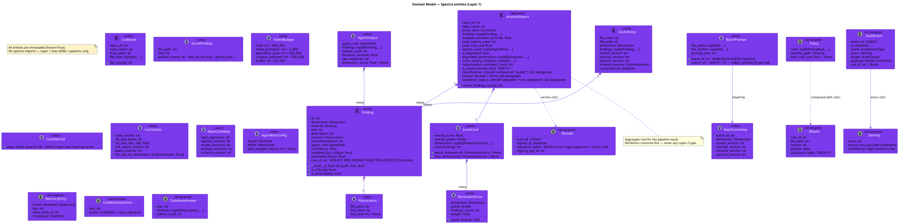

# 03 — Domain Model

**Status:** Stable · **Baseline:** v0.6.0 · **Last revised:** 2026-04-30

## Purpose

Catalogue every Layer-1 entity and value object with its invariants, equality semantics, and the ADR that motivates it. Provides the reference for engineers writing tests against the domain and for reviewers asserting that a new field belongs in entities and not in a port.

## Audience

Engineers touching `src/spectra/entities/`. Reviewers gating Layer-1 changes. Anyone validating a serialized `AnalysisReport` against the contract.

## Diagram



Source: [`diagrams/03-domain-class-diagram.puml`](./diagrams/03-domain-class-diagram.puml)

## Layer-1 invariants

These hold for every entity in [`src/spectra/entities/`](../../src/spectra/entities/):

1. **Frozen.** Every Pydantic model has `model_config = ConfigDict(frozen=True)` (or the equivalent class kwarg `frozen=True`). Once constructed, an instance never mutates. Required for asyncio safety — outputs from parallel specialists are merged without copy.
2. **Zero spectra imports.** `entities/` imports stdlib + pydantic only. Verified by convention; check by `grep -r "from spectra" src/spectra/entities/` returning nothing other than the inner-entities cross-reference.
3. **`Literal` for enums.** No `enum.Enum`. JSON-serialisable without custom encoders; exhaustive type checking; cheaper to compare. See [`enums.py`](../../src/spectra/entities/enums.py).
4. **`tuple` over `list` for collections of entities.** Hashable, immutable, asyncio-safe. The pattern is `tuple[Finding, ...]`, not `list[Finding]`.
5. **`Result`-style returns for fallible value-object construction.** Construction itself raises; serialisation never raises; deserialisation raises with the offending field named.

## Core entities

### `Finding` ([`models.py:53`](../../src/spectra/entities/models.py))

The atom of the system. Every specialist produces these; the CritiqueAgent validates them; the renderer displays them.

```python
class Finding(BaseModel, frozen=True):
    id: str
    dimension: Dimension          # architecture | security | quality | …
    severity: Severity            # critical | high | medium | low | info
    title: str
    description: str
    location: FileLocation
    recommendation: str
    agent_role: AgentRole
    confidence: float             # 0.0..1.0
    validated_by_critique: bool = False
    estimated_hours: float = 0.0
    code_snippet: str = ""
    rule_id: str = ""             # ADR-011 sentinel
```

**Equality semantics — load-bearing.** `__hash__` and `__eq__` collapse two findings to one when their `(file_path, line_start, dimension)` triple matches. This is what lets the orchestrator deduplicate the union of cached + fresh findings in O(n) via `dict.fromkeys(...)` (analyze_repository.py:909-926). Adding fields to `Finding` does NOT break dedupe; changing the equality triple does.

**`rule_id` sentinel.** Empty by default; set to the literal `"SPEC-PROMPT-INJECTION-DETECTED"` by the CritiqueAgent when it appends a `compromised_findings` entry ([ADR-011 §2](../../../spectra-wt-strategy/docs/strategy/architecture/ADR-011-prompt-injection-isolation.md)). The orchestrator uses this exact string to mark the run compromised. Adding new sentinels without coordinating with the orchestrator silently breaks the contract.

### `SecretFinding` ([`models.py:116`](../../src/spectra/entities/models.py))

Pre-flight secret-scan match — distinct from a code-quality `Finding`. Owned by the workspace boundary, not by an analysis dimension. Triggers `SPEC-011 SecretDetectedError` when found and `--allow-secrets` is not set.

### `ScoreCard` ([`models.py:163`](../../src/spectra/entities/models.py)) + `DimensionScore` ([`models.py:137`](../../src/spectra/entities/models.py))

Aggregate of per-dimension scores. The `dimensions` field is a `tuple[DimensionScore, ...]` so the value object is hashable and safe to pass to renderers from any thread.

### `AnalysisReport` ([`models.py:243`](../../src/spectra/entities/models.py))

Aggregate root for the pipeline result. Carries the deduplicated findings, the score card, the agent telemetry, and three policy-relevant flags:

- `is_degraded`: ≥2 specialists failed (SPEC-007).
- `degraded_dimensions`: tuple of dimensions whose specialist failed.
- `is_compromised`: CritiqueAgent flagged a prompt-injection attempt (ADR-011 §2). The renderer surfaces a banner; the public-mode renderer (v0.6.0) refuses to publish a grade.

**v0.6.0 additions** (shipped — formerly annotated grey in the class diagram):

- `classification: Literal["confidential", "public"]` — drives the dual-mode renderer (default `confidential`; `public` redacts file paths and finding text).
- `receipt: Receipt | None` — Ed25519-signed scan receipt for third-party verification (roadmap #57).
- `validation_status: Literal["validated", "non-validated"]` — stamped `non-validated` when `--quick` skips the CritiqueAgent (roadmap #20).

### `Codebase` ([`models.py:284`](../../src/spectra/entities/models.py))

Representation of the cloned (or local) repository. `file_tree` is a sorted tuple — order matters because it feeds `compute_repo_signature(file_tree)` and any path drift would invalidate the cache. The MetaPrompter never receives the contents — only this `file_tree` ([CLAUDE.md — Agent Hard Rule #1](../../CLAUDE.md)).

## Cache entities

These exist to keep the cache subsystem purely additive — see [06 — Cache Architecture](./06-cache-architecture.md).

| Entity | File | Purpose |
|--------|------|---------|
| `CacheEntry` | `models.py:355` | Phase 1 — per-(file_hash, dimension) row |
| `CacheStats` | `models.py:408` | Aggregate metrics surfaced by `CachePort.stats()` |
| `BatchPrompt` | `models.py:440` | Phase 3 — per `focus_area` analysis batch (carries the ADR-011 `nonce`) |
| `BatchCacheKey` | `models.py:469` | Phase 3 composite key |
| `RepoCacheKey` | `models.py:496` | Phase 2 composite key |
| `CacheSecret` | `models.py:389` | 32-byte HMAC key wrapper, `min_length=32 max_length=32` enforced at construction |

**`BatchPrompt.nonce` invariants** ([ADR-011 §1](../../../spectra-wt-strategy/docs/strategy/architecture/ADR-011-prompt-injection-isolation.md)):

- Generated per call by `secrets.token_urlsafe(16)`. Default factory ensures the boundary is never optional.
- **Excluded from the `prompt_version` cache key.** The nonce changes every call; including it would invalidate the cache on every run. The architectural commitment is: nonce fences DATA, not INSTRUCTION; instruction is what the cache key tracks.
- The same nonce appears in the open fence, the close fence, and the system-prompt reinforcement. The model can verify the boundary in-context.

## Per-agent runtime config

### `AgentRunConfig` ([`models.py:571`](../../src/spectra/entities/models.py))

```python
class AgentRunConfig(BaseModel, frozen=True):
    model: ModelId          # claude-opus-4-7 | claude-opus-4-6 | claude-sonnet-4-6 | claude-haiku-4-5
    effort: EffortLevel     # low | medium | high | xhigh | max
    task_budget_tokens: int | None = None
```

The `_validate_opus_tier_effort` model validator rejects `xhigh` / `max` on non-Opus models. `_DEFAULT_AGENT_CONFIGS` (line 605) is the canonical source of the per-role baseline:

| Role | Default model | Default effort | Task budget |
|------|---------------|----------------|-------------|
| `meta_prompter` | claude-opus-4-7 | medium | — |
| `architecture` / `security` / `quality` / `documentation` / `dependency` / `performance` | claude-opus-4-7 | xhigh | — |
| `critique` | claude-opus-4-7 | high | 80_000 |

CLI overrides ([`use_cases/resolve_agent_configs.py`](../../src/spectra/use_cases/resolve_agent_configs.py)) merge into this map at startup. v0.6.0 generalises `task_budget_tokens` to every agent ([ADR-013](../../../spectra-wt-strategy/docs/strategy/architecture/ADR-013-task-budget-and-rate-coordination.md)) and adds the `CostTrackerPort` budget gate (SPEC-014).

## Errors

[`errors.py`](../../src/spectra/entities/errors.py) defines the `SpectraError` registry — the one source of truth for error codes, messages, retry semantics, and max retry counts.

| Code | Message | Retryable | Max retries |
|------|---------|-----------|-------------|
| SPEC-001 | Git clone failed | Yes | 2 |
| SPEC-002 | Anthropic API unreachable | Yes | 3 |
| SPEC-003 | Rate limited (429) | Yes | 3 |
| SPEC-004 | Token budget exceeded | No | 0 |
| SPEC-005 | Agent output validation failed | Yes | 1 |
| SPEC-006 | Agent timeout (120s) | No | 0 |
| SPEC-007 | 2+ agents failed | No | 0 |
| SPEC-008 | CritiqueAgent failed | No | 0 |
| SPEC-009 | Report render failed | No | 0 |
| SPEC-010 | Cache I/O failed | No (degrade) | 0 |
| SPEC-011 | Secret detected in workspace | No | 0 |

`AgentError` and `GitError` wrap a `SpectraError`. `SpectraRetryError` is what `RetryDecorator` raises when an operation is signalled retryable. `SecretDetectedError` carries the tuple of `SecretFinding` discovered by the pre-flight scanner.

## Q2 / Q4-designed entities

The following entities are documented in ADRs but not yet in `models.py`. Their grey colour in the class diagram marks them as designed-not-shipped.

| Entity | ADR | Purpose |
|--------|-----|---------|
| `Receipt` | roadmap #57 | UUIDv7 scan id + Ed25519 signature over `repo_signature` + `score_card` |
| `Waiver` | roadmap #17 | Per-rule, per-file suppression; Ed25519-signed by an authorised key |
| `Policy` | roadmap #17 | Tuple of `PolicyRule` + severity gate + max-cost cap |
| `AuditEvent` + `Identity` + `AuditTarget` | [ADR-018](../../../spectra-wt-strategy/docs/strategy/architecture/ADR-018-audit-log-and-identity.md) | Append-only structured event with bounded primitive payload |
| `MemoryEntry` | [ADR-014](../../../spectra-wt-strategy/docs/strategy/architecture/ADR-014-anthropic-memory-stores-for-team-org.md) | Scoped memory key/value (developer / team / org) |
| `CodebaseQuestion` + `CodebaseAnswer` | [ADR-015](../../../spectra-wt-strategy/docs/strategy/architecture/ADR-015-query-codebase-use-case.md) | Inputs/outputs of `spectra ask` |

## Bounded contexts

Spectra is a single bounded context today: *grade a codebase across six dimensions*. The Q4 work splits this into two:

- **Grading context** — the existing `analyze_repository` use case, owns `Finding` / `ScoreCard` / `AnalysisReport`.
- **Q&A context** — the new `query_codebase` use case (ADR-015), owns `CodebaseQuestion` / `CodebaseAnswer` / `Citation`. Shares `Codebase` and `MemoryEntry`; never produces or consumes `Finding`.

Until Q4, both fit in one models module. When the Q&A context lands, split `models.py` into `models/grading.py` + `models/qa.py` + `models/shared.py` to keep each context navigable.

## Invariants and key decisions

- **No mutation in entities.** Every value object is reconstructed with `model_copy(update={...})`. Bug-prone shared state is impossible.
- **Equality is documented behaviour.** `Finding.__hash__` and `Finding.__eq__` are documented in the docstring because deduplication relies on them. Changing the equality triple is a breaking change.
- **Defaults are kind to the future.** New fields land with sane defaults so existing serialised reports remain valid (`rule_id: str = ""`, `is_compromised: bool = False`).
- **No `Any`.** `dict[str, str | int | float | bool]` (the `AuditEvent.payload` shape) is the strongest typing we get without nesting; the adapter enforces the keyword-allowlist at the boundary.

## Open questions

1. When `is_compromised=True`, should we also prevent serialising the report to JSON (forcing the renderer-side refusal to be the only path)? Today the JSON path emits the report with the flag set; the consumer is expected to gate. Cleaner contract is "compromised reports never serialize without a banner header"; cost is one renderer change. Q2 tracking item.
2. `CacheStats.hit_rate_by_dimension` defaults to an empty dict. Consumers loop over the six known dimensions. When a Q6 plugin adds a 7th dimension (`defi`), this contract still works — but only if `Dimension` becomes an open `str` literal. Track the dimension count as a deliberate breaking change rather than slipping it.
