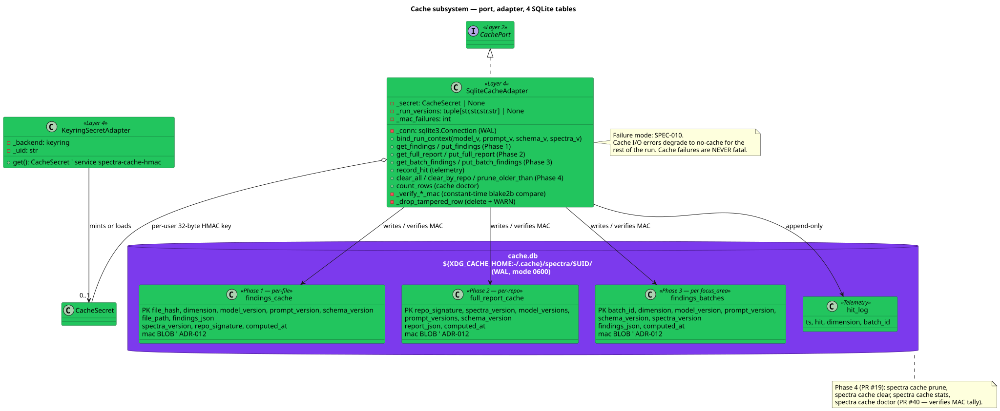
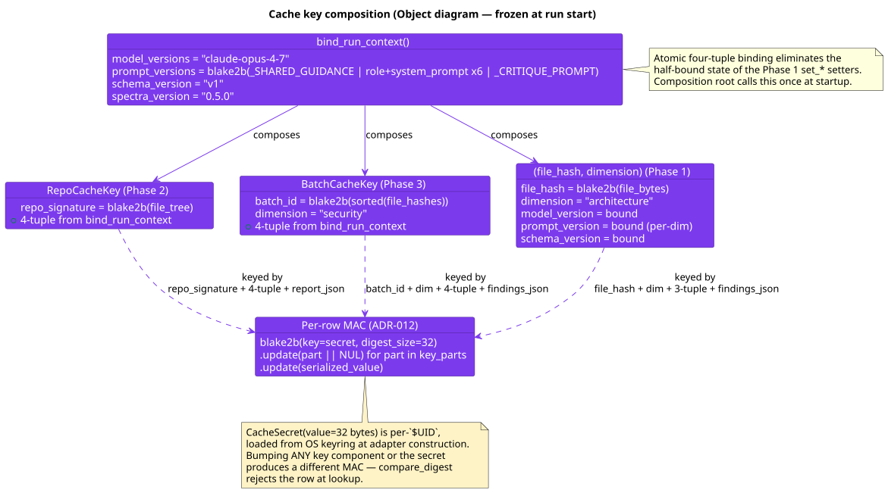
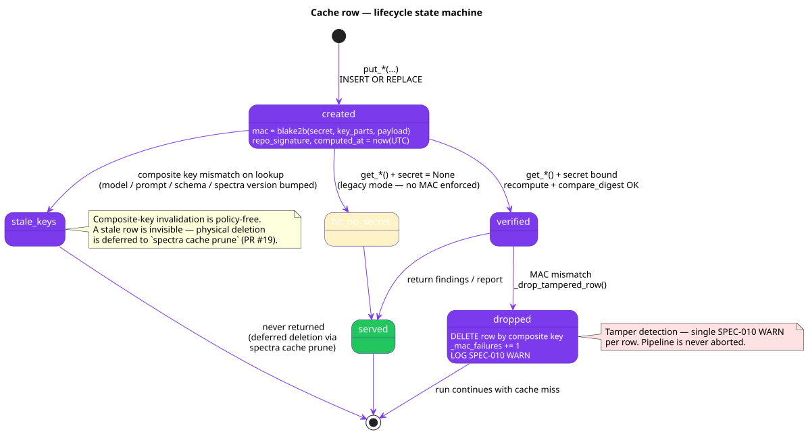

# 06 — Cache Architecture

**Status:** Stable · **Baseline:** v0.6.0 · **Last revised:** 2026-04-30

## Purpose

Describe the four-phase cache: where it lives, how keys are composed, how every row is signed, and how invalidation happens without policy or scheduled cleanup.

## Audience

Engineers debugging cache hits or misses. Security reviewers verifying the per-row HMAC. Anyone asked "why didn't my run hit the cache?".

## Class diagram



Source: [`diagrams/06-cache-class-diagram.puml`](./diagrams/06-cache-class-diagram.puml)

## Where the cache lives

[`infrastructure/cache_adapter.py`](../../src/spectra/infrastructure/cache_adapter.py) implements `CachePort`. A single SQLite database in WAL mode at:

```
${XDG_CACHE_HOME:-~/.cache}/spectra/$UID/cache.db   (mode 0600)
```

Parent directory `chmod 0700`. WAL/SHM siblings tightened to 0600. Per-`$UID` namespace eliminates a class of poisoning attack on shared dev hosts and CI runner images ([ADR-012](../../../spectra-wt-strategy/docs/strategy/architecture/ADR-012-cache-hmac-per-user-namespace.md)). `migrate_legacy_cache()` removes any pre-ADR-012 unscoped `cache.db` on first run after upgrade — the next run cold-caches.

## Three caches, one DB

| Phase | Table | Granularity | Purpose |
|-------|-------|-------------|---------|
| 1 | `findings_cache` | Per `(file_hash, dimension)` | Per-file Phase 1 cache; legacy from PR #16 |
| 2 | `full_report_cache` | Per `(repo_signature, model_versions, prompt_versions, schema_version, spectra_version)` | Repo-level short-circuit — when the file tree + every version key matches, the entire `AnalysisReport` is returned and Stages 3-5 are skipped |
| 3 | `findings_batches` | Per `(batch_id, dimension, model_version, prompt_version, schema_version, spectra_version)` | Per-`focus_area` batch — the killer feature; `partition_by_cache` splits each agent's batches into cached + fresh and runs only the fresh batches against the LLM |
| — | `hit_log` | Append-only telemetry | One row per cache lookup; `(ts, hit, dimension, batch_id)`. Drives `CacheStats.hit_rate_last_100` and the per-dimension breakdown |

## Composite-key invalidation



Source: [`diagrams/06-cache-key-composition.puml`](./diagrams/06-cache-key-composition.puml)

Every cache key bundles a four-tuple set once at startup by `bind_run_context`:

```python
cache.bind_run_context(
    model_versions   = "claude-opus-4-7",
    prompt_versions  = blake2b(_SHARED_GUIDANCE | role+sysprompt x6 | _CRITIQUE_PROMPT).hexdigest(),
    schema_version   = "v1",
    spectra_version  = spectra.__version__,
)
```

The atomic four-tuple binding eliminates the half-bound state of the Phase 1 `set_*` setters. Composition-root callers configure the cache exactly once.

A stale row never matches a current-context lookup — bumping any of model, prompt, schema, or spectra version naturally misses without touching disk. **Physical deletion is deferred to `spectra cache prune`** (Phase 4 — PR #19). This is the architectural commitment: **invalidation is implicit, not policy.**

The Phase 2 `RepoCacheKey` and Phase 3 `BatchCacheKey` ([`entities/models.py`](../../src/spectra/entities/models.py)) are frozen value objects that bundle the four-tuple plus the per-phase identifier (`repo_signature` or `batch_id` + `dimension`). Two keys compare equal iff every field matches.

## Per-row HMAC (ADR-012)

Every persisted row carries a 32-byte `blake2b` MAC over the cache-key tuple, the row payload, and the bound version tuple:

```python
def _compute_mac(secret: CacheSecret, key_parts: tuple[str, ...], value: str) -> bytes:
    digest = blake2b(key=secret.value, digest_size=32)
    for part in key_parts:
        digest.update(part.encode("utf-8"))
        digest.update(b"\x00")
    digest.update(value.encode("utf-8"))
    return digest.digest()
```

On read the adapter recomputes and `hmac.compare_digest`-compares the MAC. A mismatch deletes the row, increments `_mac_failures`, and logs SPEC-010. The pipeline continues with a fresh analysis. This combined with the per-`$UID` directory layout defends against cache poisoning on shared hosts.

The `CacheSecret` is fetched once per process from the OS keyring via [`KeyringSecretAdapter`](../../src/spectra/infrastructure/keyring_adapter.py). Service `spectra-cache-hmac`; account is the effective UID rendered as decimal. If the keyring is unavailable, the adapter degrades to legacy no-MAC mode (existing tests, headless CI runners) and the cache continues to function — the boundary is the keyring, not the cache.

## Row lifecycle



Source: [`diagrams/06-cache-state-machine.puml`](./diagrams/06-cache-state-machine.puml)

| State | Trigger |
|-------|---------|
| `created` | `put_*` issues `INSERT OR REPLACE` with `mac = _compute_mac(...)` |
| `verified` | `get_*` recomputes MAC + `compare_digest` returns true |
| `served` | findings or report returned to caller |
| `dropped` | MAC mismatch — row deleted, SPEC-010 WARN, miss returned |
| `stale_keys` | composite key mismatch — invisible, never returned, `cache prune` reaps later |

## ProgressObserver hook

`CachePort.record_hit(dim, batch_id, hit)` is called inside `partition_by_cache`. The use case then calls `observer.on_cache_lookup(dim, hits, total)` once per dimension after partitioning so the terminal can show e.g. "security cache 7/8 hits" — the killer-feature signal that Phase 3 is working.

## Cache CLI

[`adapters/cli_controller.py`](../../src/spectra/adapters/cli_controller.py) exposes:

| Command | Action |
|---------|--------|
| `spectra cache stats` | `CacheStats` summary: total entries, per-table counts, hit rate last 100, per-dimension breakdown, on-disk size |
| `spectra cache clear` | `clear_all()` — wipe every cache table including `hit_log` |
| `spectra cache clear <repo_sig>` | `clear_by_repo(repo_sig)` — wipe rows tagged with the given repo signature |
| `spectra cache prune --older-than 7d` | `prune_older_than(cutoff)` — GC by `computed_at`; per-table delete counts returned |
| `spectra cache doctor` | Verify per-row MAC across every table; print verified/failed counts + keyring backend label |

The CLI uses a separate `_provision_cache_only` factory in `main.py` so the cache subcommands work without an Anthropic API key, git, or any LLM wiring.

## Failure mode — SPEC-010

Per the contract in [`entities/errors.py`](../../src/spectra/entities/errors.py):

| Failure | Behaviour |
|---------|-----------|
| Cache file missing or corrupt | Adapter rebuilds schema; one-time INFO log |
| Cache I/O failure (disk full, permission) | `_guard_io` catches `sqlite3.Error` / `OSError`; raises `AgentError(SPEC-010)` |
| Per-row MAC mismatch | Row dropped; SPEC-010 WARN; miss returned |
| Keyring unavailable | Adapter runs in legacy no-MAC mode; one-time WARN |

**Cache failures are NEVER fatal.** The composition root catches `AgentError(SPEC-010)` from `SqliteCacheAdapter.__init__` and proceeds with `cache=None` for the rest of the run; the use case treats a missing cache as a no-op cache (skip both reads and writes).

## Cache hit short-circuit (Phase 2)

See [04 — Pipeline Flow → Cache hit short-circuit](./04-pipeline-flow.md#cache-hit-short-circuit) and [diagram 04-pipeline-sequence-cached.svg](./diagrams/04-pipeline-sequence-cached.svg).

A `--force` flag bypasses the read but still writes the cache on success — the next run benefits from the freshly-computed result.

A degraded run never writes the cache. A partial report would poison every subsequent lookup.

## Performance characteristics

- **WAL mode** allows concurrent reads against ongoing writes without locking. `partition_by_cache` reads N batches across 6 dimensions in parallel; the write phase serialises on a single connection.
- **Single connection per process.** No connection pool — SQLite is local I/O.
- **`PRIMARY KEY` covers the composite cache key.** Lookups are O(log n).
- **`idx_repo` and `idx_age` indexes** support `clear_by_repo` and `prune_older_than` without table scans.

## v0.6.0: encrypted cache at rest (shipped)

Roadmap #13. The cache file is now AES-256 encrypted via SQLCipher 4. The encryption key is derived from the same OS-keyring secret that anchors the per-row HMAC, with a different domain-separation step so the two keys cannot collide. `PRAGMA key='x"<hex>"'` is issued immediately after every connection open; an empty `SELECT count(*) FROM sqlite_master` canary surfaces wrong-key errors as SPEC-010 at open time. Existing v0.5.0 plaintext caches are auto-migrated in place — rows streamed into a fresh encrypted DB, MACs re-computed under the current secret, file atomically swapped, plaintext shredded post-swap. Adapter falls back to plain SQLite + WARN when `libsqlcipher` is unavailable on the platform; HMAC + per-`$UID` isolation remain active. New `spectra cache shred [-y]` subcommand overwrites cache.db (and WAL/SHM siblings) with random bytes (3 passes) then deletes them.

## Q3-designed: distributed cache adapters

[ADR-019](../../../spectra-wt-strategy/docs/strategy/architecture/ADR-019-distributed-cache-adapters.md). `RedisCacheAdapter` + `S3CacheAdapter` + `TieredCacheAdapter` (SQLite L1, Redis/S3 L2). The HMAC contract extends to L2; single-flight pattern kills stampedes. Tiered mode is opt-in via config.

## Invariants and key decisions

- **The use-case layer never imports `sqlite3`.** `CachePort` is the boundary; `SqliteCacheAdapter` is the only Layer-4 module that opens `sqlite3.connect()`.
- **Composite-key invalidation, not TTL.** Stale rows are invisible; physical deletion is deferred to `spectra cache prune`.
- **`bind_run_context` is called exactly once per process at the composition root.** Tests bypass via the legacy `set_*` setters, but production never does.
- **Per-row HMAC + per-`$UID` directory** are the two layers of cache integrity. Either alone is partial; together they defend against the practical attack model.
- **Cache failures are never fatal.** SPEC-010 degrades the run to no-cache.

## Open questions

1. The `hit_rate_by_dimension` field skips legacy `''` rows from the Phase 4 `hit_log` migration. Once every row carries a real dimension (3 months post-PR-19), drop the filter and simplify `_dimension_hit_rate`.
2. `legacy_cache_path()` deletion is one-shot per upgrade. After three minor releases (~Q3) the migration code can be retired.
3. v0.6.0 encrypted cache uses the same OS keyring entry as the HMAC secret, with domain separation. Revisit if SQLCipher rekey costs warrant a split entry.
