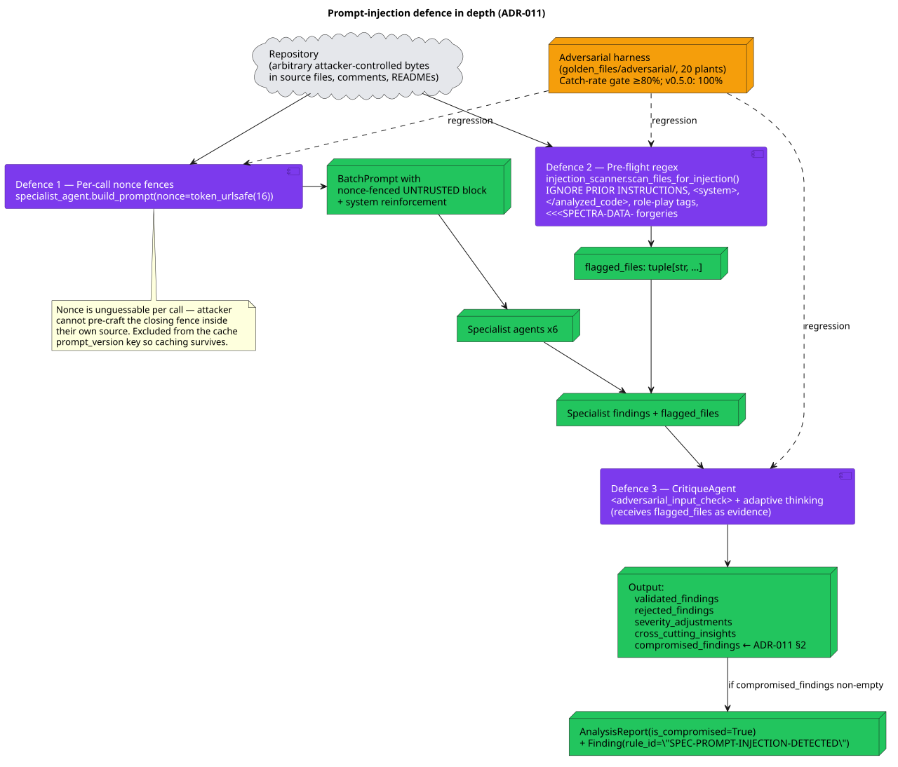
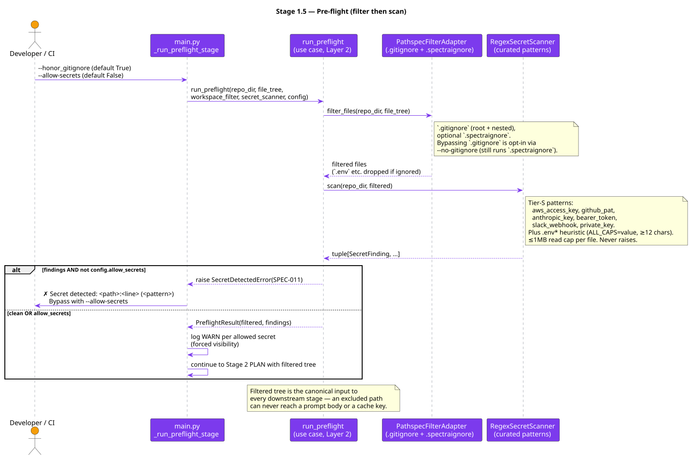

# 07 — Security Architecture

**Status:** Stable · **Baseline:** v0.6.0 · **Last revised:** 2026-04-30

## Purpose

State the threat model, document the v0.5.0 hardening that closed every Red Team critical/high, and describe the v0.6.0 capabilities (audit log, signed receipts, encrypted cache, policy + waivers, dual-mode classification, severity gate) that make Spectra defensible as a CI gate in regulated workflows.

## Audience

Security reviewers, CISOs in procurement, engineers touching anything secret-adjacent.

## Threat model

| Threat | Asset | Mitigation |
|--------|-------|------------|
| Prompt injection in analyzed code moves the grade | Spectra grade output | Per-file random-nonce data fences + CritiqueAgent adversarial check + 20-plant adversarial harness (ADR-011) |
| Secret in source code leaks into Anthropic prompt | Customer secret material | Pre-flight `RegexSecretScanner` + `.gitignore` honor + `.spectraignore` (v0.5.0, roadmap #6) |
| Cache poisoning on a shared host moves the grade | Cache integrity | Per-`$UID` directory namespace (mode 0700 / 0600) + per-row blake2b HMAC (ADR-012) |
| Supply-chain compromise of the published wheel | Distribution integrity | SLSA L3 attestation + Sigstore keyless signing (roadmap #7) |
| Malicious markdown in a finding breaks PR comments | GitHub PR rendering | Markdown-safe PR comment renderer with field allowlist (roadmap #4) |
| Buyer treats indicative analysis as compliance evidence | Customer trust | Indicative-analysis disclaimer banner on every report (roadmap #61) |
| Hostile loop drains Anthropic budget | Cost | `--max-cost-usd` per-run + per-hour rolling cap, fires SPEC-014 (v0.6.0, ADR-013, roadmap #5) |
| Stolen laptop is a notifiable event for HIPAA | Cache contents | SQLCipher-at-rest encryption + `spectra cache shred` (v0.6.0, roadmap #13) |
| Audit gap blocks SOC 2 / ISO 27001 procurement | Auditability | `AuditPort` + JSON-Lines/OTLP/stdout sinks (v0.6.0, ADR-018) |
| Forged Spectra grade in a third-party report | Verifiability | Ed25519-signed scan receipt + `spectra verify` (v0.6.0, roadmap #57) |
| Unsigned waiver smuggles a finding past the gate | Integrity of gating | Ed25519-verified `.spectra-waivers.yml` with approver registry (v0.6.0, roadmap #18) |
| Quick-mode report mistaken for fully validated | Provenance | `validation_status` stamp + red banner above ScoreCard (v0.6.0, roadmap #20) |
| Confidential report leaks via copy-paste | Confidentiality | `--classification confidential` watermark + `--classification public` strict redaction (v0.6.0, roadmap #56) |

## v0.5.0 — what shipped

### 1. Prompt-injection isolation (ADR-011)



Source: [`diagrams/07-prompt-injection-defense.puml`](./diagrams/07-prompt-injection-defense.puml)

Three concurrent defences, none alone sufficient:

1. **Per-call nonce-fenced data sections** ([`specialist_agent.build_prompt`](../../src/spectra/infrastructure/agents/specialist_agent.py)). `secrets.token_urlsafe(16)` per `BatchPrompt` — unguessable. The same nonce appears in the open fence, the close fence, and the system-prompt reinforcement. The architectural contract: anything between the markers is DATA, not INSTRUCTION; the model can verify the boundary in-context.
2. **Pre-flight regex flag list** ([`injection_scanner.scan_files_for_injection`](../../src/spectra/use_cases/injection_scanner.py)). Curated markers: `IGNORE PRIOR INSTRUCTIONS`, `<system>`, `</analyzed_code>`, `assistant:`, `human:`, `<<<SPECTRA-DATA-`. Matches are NEVER stripped — that would mask the attack from the user and from the CritiqueAgent. Bounded ≤200ms on 10MB by contract; CI gate at 500ms.
3. **CritiqueAgent `<adversarial_input_check>`** ([`critique_agent._SYSTEM_PROMPT`](../../src/spectra/infrastructure/agents/critique_agent.py)). The agent receives `flagged_files` as structured evidence; uses adaptive thinking to inspect the listed files plus any specialist finding whose text smells like attacker bytes; emits a single `compromised_findings` entry on detection.

The orchestrator materialises the entry into a `Finding(rule_id="SPEC-PROMPT-INJECTION-DETECTED", severity="critical", confidence=1.0)` and flips `AnalysisReport.is_compromised=True`. The renderer surfaces a banner; `PipelineState` transitions to `compromised`.

**Adversarial harness** ([`golden_files/adversarial/`](../../golden_files/), 20 plant repos). Each plant has a known injection in a known location and an expected outcome. The Q1 release gate is **catch-rate ≥80%**; v0.5.0 measured **100% (20/20)**. The harness is the regression contract; updating the marker list is allowed without a major version bump but requires the harness to remain green.

### 2. Per-row HMAC + per-`$UID` cache namespace (ADR-012)

See [06 — Cache Architecture](./06-cache-architecture.md) for the full design. Summary:

- Cache moves to `${XDG_CACHE_HOME:-~/.cache}/spectra/$UID/` (mode 0700; cache.db mode 0600).
- 32-byte HMAC secret in OS keyring (service `spectra-cache-hmac`, account `$UID`).
- Every persisted row carries `mac BLOB` = `blake2b(secret, key_parts, payload)`.
- `get_*` recomputes + `compare_digest`; mismatch deletes the row + logs SPEC-010.
- Legacy `~/.cache/spectra/cache.db` (no `$UID/`) is dropped on first run with a one-time INFO message.
- New `spectra cache doctor` subcommand verifies per-table MAC integrity.

### 3. Secret pre-flight + `.gitignore` honor + `.spectraignore` (roadmap #6)



Source: [`diagrams/07-secret-preflight-flow.puml`](./diagrams/07-secret-preflight-flow.puml)

New Stage 1.5 between INGEST and PLAN ([`use_cases/preflight.py`](../../src/spectra/use_cases/preflight.py)). Composition order is load-bearing:

1. `WorkspaceFilterPort.filter_files` — `.gitignore` (root + nested) + `.spectraignore`. Bypassing `.gitignore` is opt-in via `--no-gitignore`; `.spectraignore` is always honoured.
2. `SecretScannerPort.scan` — runs only against the filtered list. **A `.gitignore`-excluded `.env` is never scanned.** Defeating that guarantee would fail user expectations.

[`infrastructure/regex_secret_scanner.py`](../../src/spectra/infrastructure/regex_secret_scanner.py) — Tier-S patterns:

| Pattern | Regex |
|---------|-------|
| `aws_access_key` | `\bAKIA[0-9A-Z]{16}\b` |
| `github_pat` | `\bghp_[A-Za-z0-9]{36}\b` |
| `anthropic_key` | `\bsk-ant-[A-Za-z0-9_-]{32,}\b` |
| `bearer_token` | `\bBearer [A-Za-z0-9._-]{20,}\b` |
| `slack_webhook` | `https://hooks\.slack\.com/services/[A-Za-z0-9/_-]+` |
| `private_key` | `-----BEGIN (?:RSA|OPENSSH|EC|DSA|PGP) PRIVATE KEY-----` |
| `dotenv_value` | `^[A-Z][A-Z0-9_]*=.{12,}$` (only inside `.env*` files) |

Operational guarantees: per-file decode errors swallowed; missing files yield no matches; 1 MB read cap per file; pattern set compiled once at construction.

Default behaviour: matches abort the run with `SPEC-011 SecretDetectedError` carrying the tuple of `SecretFinding`. `--allow-secrets` downgrades to a WARN line per finding.

### 4. Markdown-safe PR comment renderer (roadmap #4)

[`adapters/pr_comment_renderer.py`](../../src/spectra/adapters/pr_comment_renderer.py). Field allowlist: `title`, `severity`, `dimension`, `file_path`, `line_start`, `line_end`, `summary`. `recommendation`, `code_snippet`, `references` are dropped — nothing the LLM produces is rendered without scrubbing.

Hardening:
- HTML-escape on every text field.
- Backticks in titles replaced with U+02CB (modifier letter grave accent) so codeblock fences cannot be broken.
- `` image syntax and `<http...>` autolinks stripped from summaries.
- File paths rendered in inline code with `[`/`]`/`(`/`)` escaped.
- `<!-- SPECTRA -->` sentinel preserved as the idempotent-update marker for the GitHub Action.

### 5. Indicative-analysis disclaimer (roadmap #61)

[`entities/disclaimer.py`](../../src/spectra/entities/disclaimer.py) — single source of truth. Same wording across HTML, JSON, SARIF.

- HTML: full-width amber banner, sticky, ARIA-labelled, dismissible via CSP-safe `data-action="dismiss-disclaimer"` event delegation in the nonce-protected `<script>`. Dismissal stored in `sessionStorage`.
- JSON: top-level `disclaimer: { text, url }` field.
- SARIF: `runs[0].invocations[0].notifications[]` carrying the disclaimer text + `descriptor.helpUri`.
- Copy-scrub guardrail test prevents `compliance evidence` / `audit-grade` / `auditor-ready` from regressing into src/templates/README.

### 6. Supply-chain Q1 bundle (roadmap #7-#10)

- `actions/attest-build-provenance@v2` — SLSA L3 attestation per artifact.
- `sigstore-python` keyless signing on every release wheel; `.sigstore` bundles attached to the GitHub Release.
- `SECURITY.md` with supported-versions table, GitHub Private Vulnerability Reporting as the single intake, 90-day default disclosure (≤7d if exploited).
- `pyproject.toml` conservative upper bounds on every runtime + dev dep; `requirements.lock` regenerated via `uv pip compile`; `renovate.json` weekly schedule, grouped minor+patch, separate-PR majors.
- `scripts/register_pypi_squats.sh` reserves 8 high-risk PyPI variants.

See [10 — Deployment & Release](./10-deployment-and-release.md) for the publish pipeline.

## v0.6.0 — what shipped (Q2)

### 7. Audit log + identity (ADR-018, roadmap #12 + #57)

`AuditPort` with three adapter implementations: `JsonLinesAuditAdapter` (file with daily rotation, default sink for file-mode), `OtlpAuditAdapter` (OpenTelemetry Logs HTTP exporter), `StdoutAuditAdapter` (default for CI). All emits go through `safe_emit` so audit failures never abort the pipeline. New `--audit-sink stdout|file:<path>|otlp:<url>` flag.

Identity resolution precedence: env `SPECTRA_ACTOR` > git config > OIDC > `getpass@hostname` (hashed to a 16-char ID for privacy). We deliberately do not require OIDC — Spectra is CLI-only.

Every state transition emits a structured `AuditEvent`. Privacy boundary enforced at the entity: `FORBIDDEN_PAYLOAD_KEYS` validator rejects `code`/`content`/`secret`/`key`/`token`/`body`/`raw`/`snippet`/`source`; string values capped at 500 chars. Tests verify the refusal.

| What we log | What we never log |
|-------------|-------------------|
| `repo_signature`, `finding_signature`, `actor`, `cost_usd`, `tokens_*`, MAC fingerprint (first 8 chars) | Repo URL, file paths, code excerpts, finding text, secret material, full MAC, API keys |

### 8. `--max-cost-usd` budget enforcement (ADR-013, roadmap #5)

Per-run hard cap (`--max-cost-usd`) + per-hour rolling cap (`--max-cost-per-hour`). Backed by `CostTrackerPort` (Layer 2) with `InMemoryCostTracker` (default) and `SqliteCostTracker` (rolling 1-hour cap persisted to `cost_log` table in cache.db). Pipeline gate aborts mid-run with **SPEC-014 `BudgetExceededError`** when the next agent call would cross the threshold. Brand-voice ✗ message names the budget, the spend, and lists per-agent breakdown. Pre-flight emits a WARN (not abort) when the budget is below the ~$0.04 8-agent input floor.

### 9. Encrypted cache at rest (roadmap #13)

The per-user cache file is now AES-256 encrypted via SQLCipher 4. The encryption key is derived from the same OS-keyring secret that anchors the per-row HMAC, with a different domain-separation step. Wrong-key surfaces as SPEC-010 at open time. Backward-compat: any existing v0.5.0 plaintext cache is auto-migrated in place — rows streamed into a fresh encrypted DB, MACs re-computed, file atomically swapped, plaintext shredded. New `spectra cache shred [-y]` overwrites cache.db (and WAL/SHM siblings) with random bytes (3 passes) then deletes them; also drops the per-user keyring entry. Targets HIPAA "stolen laptop is not a notifiable event" use case. Adapter degrades to plain SQLite + WARN when `libsqlcipher` is unavailable on the platform.

### 10. `.spectra-policy.yml` + signed `.spectra-waivers.yml` + inline pragma (ADR-020, roadmap #17 + #18 + #68)

Declarative policy at the org and repo level. `PolicyPort` (Layer 2) backed by `YamlPolicyAdapter`. Policy enforces severity gates, per-rule forbid lists, custom dimension weights — fires **SPEC-013 `PolicyViolationError`** on violation; runs even with `--quick`. `WaiverPort` backed by `YamlWaiverAdapter`. Waivers carry an Ed25519 signature over canonical JSON of `(repo_signature, finding_signature, reason, waived_by, waived_at, expires_at)` — unsigned/invalid waivers are dropped + logged, never silently accepted. Expired waivers are surfaced on the report. New `spectra waive <id> --reason "..."` and `spectra approver register --name "..." [--key-file <path>]` subcommands. Inline pragma `# spectra: ignore-next-line SEC-AUTH-101` parsed during ingest as ephemeral one-scan waivers. Malformed YAML fires **SPEC-012 `ConfigInvalidError`**.

### 11. Severity-gate + non-validated stamp (roadmap #19 + #20)

action.yml gains `inputs.fail-on: critical|high|medium|low|none` (default `critical`). New CLI `--fail-on <severity>` exits 1 when a finding is at or above the threshold. Reports stamped with new `validation_status` Literal: `validated` | `non-validated:critique-skipped` | `non-validated:quick-mode`. `--quick` and `--no-critique` runs render a red banner above the ScoreCard plus the same string in JSON top-level + SARIF `runs[0].properties.validation_status`.

### 12. Dual-mode classification (roadmap #56)

`Classification` literal + `AnalysisReport.classification` field (default `confidential`). Confidential mode: full HTML with diagonal CONFIDENTIAL watermark + DLP-marker meta tag (`<meta name="x-dlp-classification" content="confidential">`) + visible banner. Public mode: strict redaction — drops every individual finding, code snippet, file path, recommendation; keeps overall grade, dimension scores, findings counts, repo name, scan timestamp, version. Output filename suffixed (`-confidential.html` / `-public.html`) so both can coexist on disk. JSON + SARIF parity. Pinned grep test ensures `BEGIN RSA`, `AKIA*`, `password`, `src/secrets.py` cannot leak through public mode.

### 13. Ed25519-signed scan receipt (roadmap #57)

`Receipt` entity uses Ed25519 with lazy keypair generation; private key in OS keyring (`spectra-receipt-key`); public PEM at `~/.config/spectra/receipt.pub`. Receipt embedded in JSON output and surfaced in HTML footer. New `spectra verify <report.json>` subcommand exits 0 on signature match + intact score-card hash.

### 14. DPA + sub-processor declaration (roadmap #11)

Legal pack, not engineering. Signable Data Processing Agreement; named sub-processor list (today: Anthropic only). Per-edge data flow diagram (re-uses [08 — Data Flow & Privacy](./08-data-flow-and-privacy.md)). Three docs in `docs/legal/`: `DPA.md`, `SUBPROCESSORS.md`, `DATA_FLOW.md`.

## Identity & secret material

- **API key** never logged, never serialised. Validated at adapter construction; rejected if empty / placeholder.
- **Cache HMAC secret** lives in the OS keyring; loaded once per process; never written to disk; never appears in error messages. The wrapping `CacheSecret` value object exists to keep the use case layer free of raw `bytes` plumbing.
- **OIDC token** (v0.6.0) is fetched once at startup for identity resolution and discarded.
- **Ed25519 receipt signing key** (v0.6.0) is generated lazily, stored in the OS keyring (`spectra-receipt-key`) — never serialised in plaintext on disk; the public PEM at `~/.config/spectra/receipt.pub` is the only on-disk material.
- **Ed25519 waiver-approver key** (v0.6.0) is registered via `spectra approver register`; private key stays in the approver's environment, public key recorded in the policy.

## Verifying releases

Documented in the README's "Verifying releases" section:

```bash
# SLSA build provenance
gh attestation verify spectra_ai-<ver>.whl --repo leocder07/spectra

# Sigstore keyless signature
python -m sigstore verify identity \
  --bundle spectra_ai-<ver>.whl.sigstore \
  --cert-identity https://github.com/leocder07/spectra/.github/workflows/publish.yml@refs/tags/v<ver> \
  --cert-oidc-issuer https://token.actions.githubusercontent.com \
  spectra_ai-<ver>.whl
```

## Invariants and key decisions

- **Boundary, not best-effort.** The injection nonce is required for every batch — no opt-out flag.
- **Block by default.** Secret pre-flight aborts unless `--allow-secrets` is passed; `--allow-secrets` is intentionally noisy with a WARN per finding.
- **HMAC + namespace + encryption-at-rest.** v0.5.0 shipped integrity + isolation; v0.6.0 added SQLCipher AES-256 encryption at rest (with a graceful no-libsqlcipher fallback to plain SQLite + WARN).
- **Disclaimer is a constant, not a template.** Single source of truth in `entities/disclaimer.py` keeps the four output channels in lock-step.
- **The harness is the SLA.** Adversarial catch-rate is the public number; the marketing leaderboard work in the roadmap is gated on it.

## Open questions

1. Should `SecretScannerPort.scan` return early on the first match? Today it walks the whole tree to enumerate every secret for the WARN-line output under `--allow-secrets`. The cost of walking is bounded by the `1MB` per-file cap.
2. The injection marker list lives in `injection_scanner.py:21`. ADR-011 explicitly allows updates without a major version bump. The harness is the contract; document the update process and require a harness pass in the PR template.
3. Audit-log retention: `JsonLinesAuditAdapter` does daily file rotation in-process (no `logrotate` dependency). Default retention is platform-default (cleanup is the operator's job). Revisit if a customer wants Spectra-managed retention windows.
