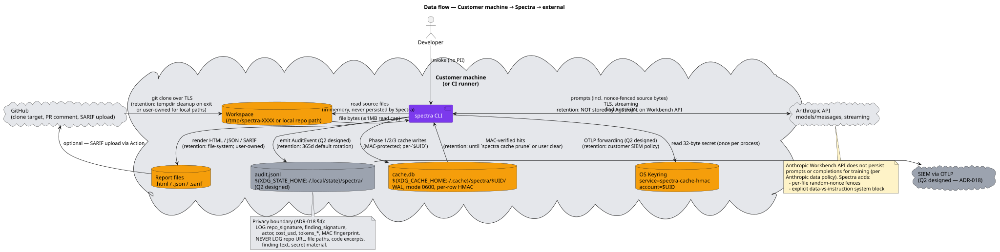

# 08 — Data Flow & Privacy

**Status:** Stable · **Baseline:** v0.6.0 · **Last revised:** 2026-04-30

## Purpose

Document, for each class of data Spectra handles, where it originates, where it travels, where it persists, and for how long. This document is the engineering reference for the v0.6.0 DPA + sub-processor declaration (roadmap #11, shipped).

## Audience

Procurement leads writing a DPA, CISOs auditing data flows, engineers touching anything that crosses a process or network boundary.

## Diagram



Source: [`diagrams/08-data-flow.puml`](./diagrams/08-data-flow.puml)

## Data classes

| Class | Examples |
|-------|----------|
| Source code | Repository file contents |
| Repository identity | Repo URL, file tree, repo_signature |
| Findings | Title, description, recommendation, code snippet |
| Secret material | API keys, private keys, bearer tokens (pre-flight detection) |
| Cache material | Per-row HMAC keys, MAC bytes |
| Telemetry | Cache hit log, agent timings, token counts |
| Identity | `actor` resolved from env / OIDC / git / hostname |
| Audit events | `AuditEvent` payload (v0.6.0 — `AuditPort` with stdout/file/OTLP sinks) |
| Cost data | Per-call token counts × pricing |

## Source code

| Hop | Encryption | Persistence | Retention |
|-----|------------|-------------|-----------|
| GitHub → workspace | TLS (HTTPS git clone) | Filesystem (tempdir for URL sources, user-owned for local paths) | tempdir cleaned on process exit (`shutil.rmtree` in `finally`); local paths user-owned |
| Workspace → CLI process | none (in-process read) | In-memory | Process lifetime |
| CLI → Anthropic API | TLS (HTTPS) | NOT stored by Anthropic on Workbench API ([Anthropic data policy](https://www.anthropic.com/legal/commercial-terms)) | Anthropic retention: zero (per policy) |
| CLI → cache.db | At rest: no encryption today (Q2: SQLCipher); per-row HMAC ensures integrity | SQLite WAL on local disk | Until `spectra cache prune` or user deletion |

**The 1 MB read cap** in `regex_secret_scanner._read_text_bounded` and the 100K-token heuristic cap in `_read_key_source_files` ([`main.py`](../../src/spectra/infrastructure/main.py)) bound both the in-memory footprint and the API payload.

**Per-file random-nonce fences** wrap every analyzed file in the prompt. The boundary is explicit at the model level (ADR-011 §1).

## Repository identity

| Hop | Encryption | Persistence | Retention |
|-----|------------|-------------|-----------|
| User → CLI | none (CLI argument) | In-memory | Process lifetime |
| CLI → cache | per-row HMAC | `findings_cache.repo_signature`, `full_report_cache.repo_signature` | Until `spectra cache prune` or user deletion |
| CLI → audit log (Q2) | optional TLS (OTLP) | `audit.jsonl` | Default 365d via logrotate |

**`repo_signature`** is `blake2b(file_tree)` — a 32-hex-char digest of the sorted file path list. It is *not* a hash of file contents; two repos with the same file structure produce the same signature. The audit log stores this digest, never the URL or paths.

## Findings

| Hop | Encryption | Persistence | Retention |
|-----|------------|-------------|-----------|
| Specialist → orchestrator | in-process (Pydantic value object) | In-memory | Process lifetime |
| Orchestrator → cache | per-row HMAC | `findings_cache.findings_json`, `findings_batches.findings_json`, `full_report_cache.report_json` | Until `spectra cache prune` |
| Orchestrator → report file | TLS not applicable (local file) | `spectra-report.html` / `.json` / `.sarif` | User-owned |
| Orchestrator → PR comment | TLS (GitHub API) | GitHub PR comment thread | GitHub-owned; idempotent update via `<!-- SPECTRA -->` sentinel |
| Orchestrator → audit log (Q2) | optional TLS | `finding_signature` only — never the title, description, recommendation | Default 365d |

## Secret material

| Hop | Encryption | Persistence | Retention |
|-----|------------|-------------|-----------|
| Pre-flight scanner read | none (in-process) | In-memory | Process lifetime |
| `SecretFinding` to user | none (terminal) | Console output: file_path:line + pattern_name only | Terminal session |
| `SecretFinding` to log | none | `pattern_name` (e.g. `aws_access_key`) — **never the secret itself** | Filesystem log retention |

**The actual secret value never leaves the source file.** The CLI prints `pattern_name` and `(file_path, line)` only. By design — surfacing the secret in the terminal would re-leak it.

When a secret is detected and `--allow-secrets` is set, the file is included in the analysis and its contents (including the secret) flow to the Anthropic prompt. The `--allow-secrets` flag is documented as noisy and requires explicit per-finding WARN lines so the developer cannot miss the consequence.

## Cache material

| Hop | Encryption | Persistence | Retention |
|-----|------------|-------------|-----------|
| OS keyring → `KeyringSecretAdapter.get()` | OS-level (Keychain/SecretService/CredVault) | Keyring DB; service `spectra-cache-hmac`, account `$UID` | Until user clears the keyring entry |
| `KeyringSecretAdapter` → `SqliteCacheAdapter._secret` | none (in-process) | In-memory `bytes` (32 bytes) | Process lifetime |
| `_compute_mac` → `cache.db.mac` | The MAC value itself; the secret never touches disk | `findings_cache.mac`, `full_report_cache.mac`, `findings_batches.mac` | Same as the row |

The HMAC secret is read once per process, cached in `SqliteCacheAdapter._secret`, and never written to disk in any form. The `CacheSecret` Pydantic model exists to keep raw `bytes` plumbing out of the use-case layer. `KeyringSecretAdapter._read_existing` never logs the value; malformed values are regenerated with a one-time WARN.

## Telemetry

| Source | Field | Sink |
|--------|-------|------|
| Specialist | `tokens_used`, `duration_seconds` | `agent_outputs[]` in-memory; aggregated into `AnalysisReport.total_tokens_used` and `total_cost_usd` |
| Cache | `hit`, `dimension`, `batch_id`, `ts` | `hit_log` table; aggregated into `CacheStats.hit_rate_last_100` and per-dimension breakdown |
| Pipeline | Stage transitions | `RichProgressReporter` (terminal only); not persisted |

No outbound telemetry today. Spectra does not phone home.

## Identity (v0.6.0)

| Source | Confidence | Used for |
|--------|------------|----------|
| `SPECTRA_USER_ID` env var | medium | Audit `actor` field |
| OIDC token (CI) | high | Audit `actor` = `ci:gh-actions:{repository}@{ref}` |
| `git config user.email` | medium | Audit `actor` |
| Hostname fallback | low | Audit `actor` = `unknown@<hostname>` |

The resolver runs once at process start and emits an `auth.identity_resolved` event. The identity is in-memory only; never written to a Spectra-owned config file.

## Audit events (v0.6.0)

`AuditEvent` ([ADR-018](../../../spectra-wt-strategy/docs/strategy/architecture/ADR-018-audit-log-and-identity.md)):

```
event_id: UUIDv7
ts: datetime UTC
event: scan.started | scan.completed | scan.degraded | scan.compromised |
       scan.budget_exceeded | memory.* | cache.mac_mismatch | cache.cleared |
       report.classification_changed | rule_pack.loaded | plugin.loaded |
       auth.identity_resolved
actor: Identity
target: AuditTarget         # repo_signature, memory key, etc.
payload: dict[str, primitive]   # bounded; no nested; max 500 chars per value
spectra_version: str
run_id: str | None
```

| Sink | Adapter | Default? |
|------|---------|----------|
| `${XDG_STATE_HOME:-~/.local/state}/spectra/audit.jsonl` | `JsonlAuditAdapter` | Yes |
| OpenTelemetry Logs collector | `OtlpAuditAdapter` | Opt-in via `SPECTRA_AUDIT_BACKEND=otlp` |
| AWS CloudWatch Logs | `CloudWatchAuditAdapter` | Optional extra |

**Privacy boundary enforced at the adapter:** payload keys named `code`, `content`, `secret`, `key`, `token`, `body` are refused. Tests verify the refusal.

## Cost data

`AnalysisReport.total_cost_usd` is computed from `sum(tokens_used / 1000 * model_rate)` per agent ([`entities/models.py:estimate_cost`](../../src/spectra/entities/models.py)). Persisted to:

- The HTML / JSON / SARIF report (visible to anyone who can read the report).
- The `cost_usd` field of every Q2 audit event.
- (Q2) The `CostTrackerPort` SQLite table for `--max-cost-usd` enforcement.

## Sub-processors

Today: **Anthropic** is the only sub-processor.

Q2 enterprise customers may add:
- AWS (CloudWatch audit sink) — opt-in.
- Customer's own SIEM (via OTLP) — customer-owned.

The DPA pack (Q2, roadmap #11) will name Anthropic explicitly and document the conditions under which AWS is engaged.

## Privacy guarantees

1. Spectra never phones home.
2. Anthropic does not retain prompts or completions for training (per Anthropic data policy on the Workbench API).
3. The cache is per-`$UID` and tamper-detected. A second user on the same host cannot read or write your cache rows (Unix permissions + per-user HMAC).
4. The audit log (Q2) records signatures, not content. The disciplined fields list is in [ADR-018 §4](../../../spectra-wt-strategy/docs/strategy/architecture/ADR-018-audit-log-and-identity.md).
5. Secret material is detected pre-prompt; matched secrets default to abort, never silently re-leak.

## Invariants and key decisions

- **No silent telemetry.** Every outbound network call is initiated by an explicit user action (run, post PR comment, upload SARIF) or a configured sink (Q2 OTLP).
- **Signatures, not content.** Audit events log `repo_signature` and `finding_signature` — derivative blake2b digests with no inverse mapping back to source.
- **Filtered tree is canonical.** A `.gitignore`-excluded path can never reach a prompt, the cache key, or the audit log. The pre-flight composition (`filter` then `scan`) enforces this at one point.
- **The disclaimer is data, not branding.** It sits in every output channel, including SARIF `notifications`, so machine pipelines surface it.

## Open questions

1. Q2 — should the `JsonlAuditAdapter` truncate payload values >500 chars or refuse the event? Truncation hides bugs; refusal blocks the pipeline. Current ADR-018 design: truncate + log a SPEC code so the operator can fix.
2. Q2 — should the Ed25519 signing key live in the same OS keyring service as the cache HMAC (rotated together) or a separate service (rotated separately)? Separate service is cleaner; same service is simpler. Decide before the receipt PR lands.
3. Local-path scans surface absolute paths in error messages. Should we redact the home directory prefix? Today we don't; the user is the owner of the path. Track if a customer hits it.
