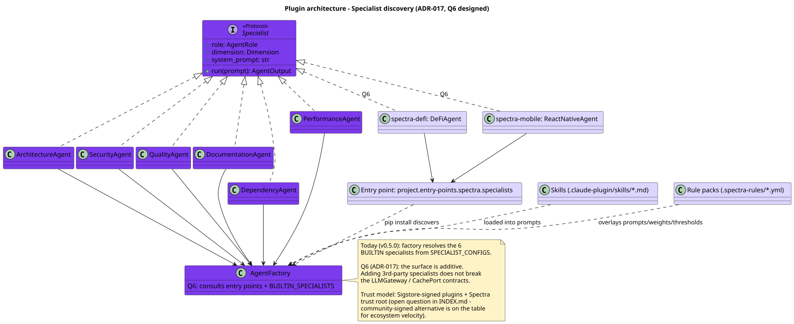

# 09 — Extensibility

**Status:** Q6 designed · **Baseline:** v0.5.0 · **Last revised:** 2026-04-30

## Purpose

Describe how Spectra grows new capabilities without breaking the dependency rule or the public CLI contract: the plugin entry-point shape (Q6), the Skills mechanism, the rule-pack overlay, and the MCP-server tool wiring.

## Audience

Engineers extending Spectra with a new specialist, a new dimension, or a new analyser. Reviewers gating any change to `AgentFactory` or the prompt composition.

## Diagram



Source: [`diagrams/09-extensibility-plugin.puml`](./diagrams/09-extensibility-plugin.puml)

## Today (v0.5.0)

The 6 specialists are hardcoded in [`SPECIALIST_CONFIGS`](../../src/spectra/infrastructure/agents/specialist_prompts.py). Each entry is a tuple `(dimension, id_prefix, system_prompt, default_model)`. `AgentFactory.create_specialists()` iterates a fixed canonical list:

```python
specialist_roles = ["architecture", "security", "quality", "documentation", "dependency", "performance"]
```

Adding a 7th specialist today requires editing the entity layer (`Dimension` literal), the use-case layer (scoring weights, role-to-dimension map), the infrastructure layer (`SPECIALIST_CONFIGS`, `AgentFactory`), and the renderer template. This is intentional friction — dimensions are a load-bearing part of the public contract.

Q6 lifts the constraint cleanly via plugin discovery.

## Q6 design (ADR-017)

[ADR-017](../../../spectra-wt-strategy/docs/strategy/architecture/ADR-017-custom-rules-plugin-architecture.md). Four extension surfaces, each with its own audience:

### 1. Specialist plugins (entry-point discovery)

```toml
# pyproject.toml of a 3rd-party package
[project.entry-points."spectra.specialists"]
defi = "spectra_defi:DeFiAgent"
mobile = "spectra_mobile:ReactNativeAgent"
```

`AgentFactory` becomes plugin-aware:

```python
class Specialist(Protocol):                    # Q6 — Layer 2 port
    role: AgentRole
    dimension: Dimension
    system_prompt: str
    async def run(self, user_prompt: str) -> AgentOutput: ...
```

Discovery is `importlib.metadata.entry_points(group="spectra.specialists")`. Built-ins live in a `BUILTIN_SPECIALISTS` registry that registers the same 6 as today, exposed through the same entry-point group for uniformity.

**Trust model.** Plugins must be Sigstore-signed and the signing identity must chain to a Spectra trust root. This is the open question in [INDEX § Open architectural questions](../../../spectra-wt-strategy/docs/strategy/architecture/INDEX.md): Sigstore-rooted vs community-signed. Sigstore-rooted is the safer default; community-signed accelerates ecosystem velocity and is on the table for a founder call before Q6.

### 2. Skills (per-language knowledge packs)

`.claude-plugin/skills/*.md` — Anthropic Skills primitive. A Skill is a markdown file with structured front-matter + body content that loads into a specialist's system prompt at construction. Examples:

- `rust-ownership.md` — borrowed/moved/lifetime invariants, when to flag a `Clone` as a smell.
- `kotlin-coroutines.md` — structured concurrency patterns, when `runBlocking` is a code smell.

Skills are project-scoped (`.claude-plugin/`) so a repo can ship its own conventions. The composition root scans `.claude-plugin/skills/` and threads relevant skills into specialists by language tag.

### 3. YAML rule packs

`.spectra-rules/*.yml` — declarative overlays for specialist prompts, scoring weights, and severity thresholds. Examples:

```yaml
# .spectra-rules/owasp-top-10.yml
applies_to: security
overlay_prompt: |
  ## OWASP Top 10 (2021) emphasis
  - A01: Broken access control — flag any unguarded resource access
  - A02: Cryptographic failures — flag md5/sha1 in non-checksum context
  …
severity_thresholds:
  cwe-79: high
  cwe-89: critical
weight_multiplier: 1.2  # security findings count 20% more in this repo
```

Rule packs are CRP-respectful: no rule pack forces a dependency on classes it doesn't use. They overlay prompts; they don't replace specialists.

### 4. MCP server tool wiring (Managed Agents path)

[ADR-016 §4](../../../spectra-wt-strategy/docs/strategy/architecture/ADR-016-managed-agents-gateway.md). When the specialists become Managed Agents (Q5/Q6), each specialist gains a configurable tool list. Curated examples in the [agentic architecture vision](../../../spectra-wt-strategy/docs/strategy/architecture/agentic-architecture.md):

| Specialist | MCP server | Purpose |
|------------|-----------|---------|
| Security | `truffle-hog-mcp` | Deterministic secret detection (cross-checks Spectra's regex pre-flight) |
| Security | `semgrep-mcp` | OWASP rule pack execution |
| Dependency | `osv-mcp` | OSV.dev / NVD vulnerability lookup |
| Performance | `pyspy-mcp` | Optional code-execution perf harness |

The use case never knows where the tool runs — Anthropic-side or local — because the `ManagedAgentGateway` Protocol abstracts the call.

## Backwards compatibility

The plugin surface is **purely additive**. Adding a 3rd-party specialist does not break the `LLMGateway` / `CachePort` / `Specialist` contracts. The 6 BUILTIN specialists keep working with zero plugins installed.

Adding a 7th dimension (e.g. `defi`) does require an entity-layer change to the `Dimension` Literal. This is by design — see [03 — Domain Model § Open questions](./03-domain-model.md#open-questions) and [INDEX § Open architectural questions Q3](../../../spectra-wt-strategy/docs/strategy/architecture/INDEX.md).

## Composition root impact

Q6 changes [`infrastructure/main.py`](../../src/spectra/infrastructure/main.py) in two narrow places:

1. `AgentFactory(gateway, configs, plugins=plugin_registry)` — accepts a registry built by entry-point discovery + Sigstore verification.
2. The cache `prompt_versions` digest extends to include the loaded rule-pack digests so a rule-pack edit invalidates affected cache rows.

Everything else is unchanged. Use case, ports, entities — none touched.

## Q4 designed: `query_codebase` use case

[ADR-015](../../../spectra-wt-strategy/docs/strategy/architecture/ADR-015-query-codebase-use-case.md). New Layer-2 use case + `spectra ask` / `spectra brief` CLI subcommands. Prompt-cached preamble drives ~$0.05 per cached call. Streaming Markdown answers with citations into `FileLocation` value objects. Per-Q&A audit event.

The Q&A use case shares the `Codebase` and `MemoryPort` entities with `analyze_repository` but never produces or consumes `Finding`. This is the bounded-context split flagged in [03 — Domain Model § Bounded contexts](./03-domain-model.md#bounded-contexts).

## Q4 designed: Memory tiers (ADR-014)

`MemoryPort` Protocol with three adapters:

| Adapter | Scope | Backend |
|---------|-------|---------|
| `LocalFileMemoryAdapter` | developer (single user, single host) | Local filesystem |
| `DeveloperMemoryAdapter` | developer (cross-host) | Anthropic Memory Tool |
| `ManagedAgentMemoryAdapter` | team / org | Anthropic Memory Stores |

A composite adapter routes by scope. The use case calls `memory.read(scope, key)` / `memory.write(scope, key, value)` and never knows where the value lives.

## Q5 designed: Managed Agents gateway (ADR-016)

`ManagedAgentGateway` is a sibling Protocol of `LLMGateway` — additive, not replacing. `AnthropicManagedAgentAdapter` ships in Q5 alongside the legacy adapter; A/B leaderboard runs in Q5; cut-over in Q6. Legacy `LLMGateway` stays for Bedrock / Vertex parity (Q4 work).

## Invariants and key decisions

- **Additive over replacement.** Every Q4-Q6 capability lands as a sibling Protocol or an additive entry point. The dependency rule never bends.
- **Sigstore-by-default for plugins.** Trust model is "verify the chain or refuse to load". Community-signed is an open product call.
- **Rule packs overlay; they do not own.** Specialists own their dimensions; rule packs add emphasis or thresholds but never replace the specialist.
- **Skills are project-scoped.** A repo's `.claude-plugin/skills/` overrides the global Spectra defaults — the repo is the source of truth for its own conventions.

## Open questions

1. Plugin trust model — Sigstore + Spectra trust root vs community-signed (per INDEX). Decide before Q6 RC.
2. When does a 7th dimension become a deliberate breaking change? Today's threshold language: "X named procurement asks or $Y ARR with that dimension as a buying signal". Numbers are the founder's call.
3. Should rule packs influence the `prompt_versions` cache key, or maintain their own per-repo invalidation key? Today's design: include in `prompt_versions` for simplicity. Cost: rule-pack edits invalidate the cache cross-repo. Revisit if this hurts.
