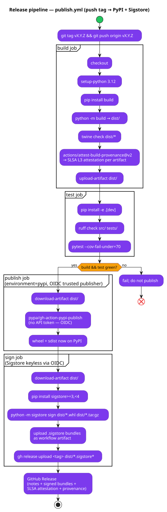

# 10 — Deployment & Release

**Status:** Stable · **Baseline:** v0.5.0 · **Last revised:** 2026-04-30

## Purpose

Document how Spectra is built, signed, published, and consumed — from `git tag` to `pip install spectra-ai` to a verifiable wheel on a customer machine.

## Audience

Maintainers cutting a release. Customers verifying release integrity. Integrators choosing between the CLI and the GitHub Action.

## Distribution shapes

| Shape | Where it lives | Who consumes |
|-------|----------------|--------------|
| `spectra-ai` PyPI wheel + sdist | [pypi.org/project/spectra-ai](https://pypi.org/project/spectra-ai/) | Developers, CI runners |
| `spectra-ai/spectra@v1` GitHub Action | [github.com/leocder07/spectra/blob/main/action.yml](../../action.yml) | GitHub Workflow integrators |
| Sigstore signature bundles | GitHub Release assets | Anyone verifying a wheel |
| SLSA attestations | GitHub attestation API | Anyone verifying a wheel |

## Release pipeline



Source: [`diagrams/10-publish-pipeline.puml`](./diagrams/10-publish-pipeline.puml)

[`.github/workflows/publish.yml`](../../.github/workflows/publish.yml). Triggered on `push: tags: ["v*"]`. Four jobs:

### 1. `build`

- `actions/checkout@v4`
- `actions/setup-python@v5` with Python 3.12 + pip cache
- `pip install build`
- `python -m build` → `dist/*.whl` + `dist/*.tar.gz`
- `twine check dist/*` (metadata sanity)
- **`actions/attest-build-provenance@v2`** generates a SLSA L3 attestation per artifact (signed by GitHub's trusted issuer; verifiable via `gh attestation verify`)
- Upload `dist/` as workflow artifact

### 2. `test`

- `pip install -e .[dev]`
- `ruff check src/ tests/`
- `pytest --cov-fail-under=70`

### 3. `publish` (depends on build + test)

Environment `pypi` — PyPI [trusted publisher](https://docs.pypi.org/trusted-publishers/) configured at `pypi.org/manage/project/spectra-ai/settings/publishing/` to accept tokens minted by the GitHub workflow:

- `actions/download-artifact@v4` → `dist/`
- `pypa/gh-action-pypi-publish@release/v1` — **OIDC trusted publishing, no API token secret in the repo**

### 4. `sign` (depends on publish)

- `pip install "sigstore>=3.0,<4.0"`
- `python -m sigstore sign dist/*.whl dist/*.tar.gz` — keyless, OIDC issuer = `https://token.actions.githubusercontent.com`
- Upload `.sigstore` bundles as workflow artifact
- Attach `.sigstore` bundles to the GitHub Release via `gh release upload`

## Verifying a release

Anyone with `gh` and `sigstore-python` installed can verify a wheel without trusting any third-party intermediary.

```bash
# 1. SLSA build provenance — proves the wheel was built by THIS repo
gh attestation verify spectra_ai-<ver>-py3-none-any.whl --repo leocder07/spectra

# 2. Sigstore keyless signature — proves the wheel was signed by THIS workflow at THIS tag
python -m sigstore verify identity \
  --bundle spectra_ai-<ver>-py3-none-any.whl.sigstore \
  --cert-identity https://github.com/leocder07/spectra/.github/workflows/publish.yml@refs/tags/v<ver> \
  --cert-oidc-issuer https://token.actions.githubusercontent.com \
  spectra_ai-<ver>-py3-none-any.whl
```

Both verifications must pass. A wheel with one but not the other is suspicious.

The README's "Verifying releases" section is the customer-facing copy.

## Dependency hygiene

[`pyproject.toml`](../../pyproject.toml) carries conservative upper bounds on every runtime + dev dep. Examples:

```toml
"anthropic>=0.40,<1.0"
"keyring>=24,<26"
"pathspec>=0.12,<1.0"
"sigstore>=3.0,<4.0"     # if shipped as default
```

[`requirements.lock`](../../requirements.lock) is regenerated via `uv pip compile` on every dep update. The lockfile is committed.

[`renovate.json`](../../renovate.json) — weekly schedule, grouped minor + patch updates, separate PR per major bump, vulnerability alerts any-time, dashboard autoclose.

[`scripts/register_pypi_squats.sh`](../../scripts/register_pypi_squats.sh) reserves 8 high-risk PyPI variants (`spectra_ai`, `spectraai`, `spectra-cli`, `spectra-py`, `spectraapi`, `spectra-analyzer`, `spectra-code`, `spectra-review`). Each squat resolves to an empty stub package whose long description directs to the canonical `spectra-ai`.

## Security disclosure

[`SECURITY.md`](../../SECURITY.md):

- Supported versions: latest minor only.
- Intake: GitHub Private Vulnerability Reporting (single channel; no scattered emails).
- Default disclosure window: 90 days. Exploited-in-wild: ≤7 days.
- CVE assignment: GitHub CNA.
- Explicit in-scope / out-of-scope lists.

## CLI distribution

```bash
pip install spectra-ai
export ANTHROPIC_API_KEY=sk-ant-...
spectra analyze https://github.com/your/repo
```

`spectra` is a `[project.scripts]` entry point that calls [`infrastructure.main:cli`](../../src/spectra/infrastructure/main.py). `cli()` injects the analyzer factory into the CLI controller and starts Typer.

Subcommands ([`adapters/cli_controller.py`](../../src/spectra/adapters/cli_controller.py)):

| Subcommand | Action |
|------------|--------|
| `spectra analyze <source>` | Run the 6-stage pipeline; render report |
| `spectra cache stats` | Print `CacheStats` summary |
| `spectra cache clear [<repo_sig>]` | Wipe cache (all or per-repo) |
| `spectra cache prune --older-than <duration>` | GC by `computed_at` |
| `spectra cache doctor` | Verify per-row HMAC across every table |
| `spectra render pr-comment <report.json>` | Emit markdown-safe PR comment |

## GitHub Action

[`action.yml`](../../action.yml) is a composite action that:

1. Sets up Python 3.12 + pip cache.
2. `pip install spectra-ai` (or pinned version via `with: version`).
3. Runs `spectra analyze` against the checked-out repo.
4. Calls `spectra render pr-comment` to produce the markdown.
5. Posts the comment via `gh pr comment` with the `<!-- SPECTRA -->` sentinel for idempotent updates.
6. Optionally uploads SARIF via `github/codeql-action/upload-sarif@v3` for the GitHub Security tab.

Inputs ([action.yml](../../action.yml)):

| Input | Purpose | Default |
|-------|---------|---------|
| `anthropic-api-key` | API key for inference | required |
| `version` | Pinned `spectra-ai` version | `latest` |
| `format` | `html` / `json` / `sarif` | `html` |
| `severity-gate` *(Q2)* | Exit non-zero when finding ≥ this severity | none |
| `classification` *(Q2)* | `confidential` / `public` | `confidential` |

## Cutting a release

Maintainer workflow:

1. Update `CHANGELOG.md` `[Unreleased]` section.
2. Bump version in [`pyproject.toml`](../../pyproject.toml) and [`src/spectra/__init__.py`](../../src/spectra/__init__.py).
3. Move `[Unreleased]` to `[<version>] - <date>` in CHANGELOG.
4. `git commit -am "chore(release): v<version>"`
5. `git tag v<version> && git push origin main v<version>`
6. CI runs `publish.yml`. The release is created automatically on the sign job.
7. Verify the wheel locally: `gh attestation verify` + `python -m sigstore verify identity`.
8. (Optional) Run `scripts/register_pypi_squats.sh` to refresh the squat stubs against the new version.

Branch protection on `main` is strict. Every PR runs `ci.yml` (`ruff` + `mypy` + `pytest`) and merges via squash.

## Manual maintainer actions

Some operations cannot be automated:

- Toggle GitHub Private Vulnerability Reporting in repo settings.
- Refresh the PyPI trusted-publisher allowlist when a new workflow file is added.
- Rotate the squat stubs' PyPI tokens annually.
- (Q2) Generate and rotate the Ed25519 signing key for scan receipts.

These are documented in [`SECURITY.md`](../../SECURITY.md) and the CHANGELOG entries that introduced them.

## Invariants and key decisions

- **No API tokens in repo secrets.** PyPI publishing uses OIDC trusted publishing; Sigstore uses keyless OIDC signing; build provenance is GitHub-issuer-signed.
- **Test-before-publish gate.** `test` job is a hard prerequisite for `publish` — a failing test means no wheel.
- **Sign every release.** Both SLSA and Sigstore. A wheel with only one signature is not a valid Spectra release.
- **Lockfile + renovate.** Every dep is pinned and regularly bumped; vulnerability alerts are non-grouped any-time PRs.
- **Squat preemption.** 8 high-risk PyPI names are reserved as stubs that direct users back to `spectra-ai`.

## Open questions

1. Should we also publish a Docker image? Today no — the Python wheel is self-contained and works on every CI runner. A container would help only for opinionated deployment shapes (e.g. a GitOps repo runs Spectra as a sidecar). Defer until a customer asks.
2. Q2 — when the Ed25519 signing key for scan receipts ships, where does the public key live? Options: a static file in this repo (`docs/keys/spectra-receipts.pub`), a GitHub Pages endpoint, or a dedicated key-rotation domain. README + ADR-018 will pick one before the receipt PR lands.
3. Q3 — should `spectra-ai` be split into `spectra-core` + `spectra-cli` + `spectra-cloud`? Splitting helps memory adapters that pull heavy boto3/SDK dependencies; cost is install ergonomics. Defer until the optional extras list grows past 4.
