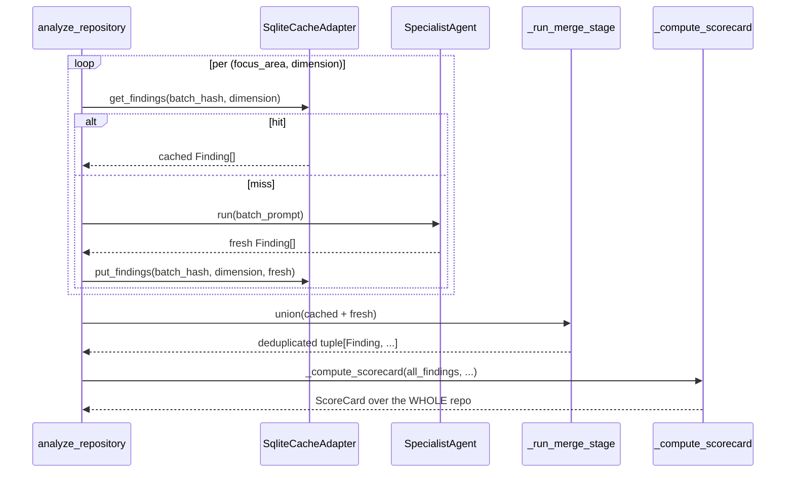

# ADR-006: CachePort + Per-`focus_area` SQLite Cache for Incremental Analysis

## Status

Accepted (2026-04-25)

## Context

Today, `spectra analyze <repo>` re-runs all 8 agents on every invocation, even when nothing meaningful changed. On a typical mid-sized repo (1.5K files, 90s wall-clock, ~$0.40 per run), a developer iterating on one PR pays the full cost three or four times a day. That's the economic argument.

The architectural argument: we want Spectra to become a daily-driver — fast enough that engineers re-run it after every commit. That requires turning the system from a stateless batch analyzer into one that remembers what it has already concluded about unchanged code. The full design lives at [`../../plans/incremental-analysis.md`](../../plans/incremental-analysis.md). This ADR records the architectural commitments that govern that design.

Three questions have to be settled at the architecture level before implementation can proceed:

1. **Where does the cache abstraction live?** Anywhere upstream of `infrastructure/` would leak persistence concerns into the use-case layer.
2. **What is the cache key granularity?** Too coarse (whole-repo) and the cache is useless on typical edits. Too fine (per-file) and the system becomes chatty on the cold path. Picking the wrong granularity locks in a cost/quality tradeoff that's hard to undo.
3. **What's the consistency guarantee for the ScoreCard?** If the cache returns stale findings for unchanged files, the dimension scores must remain correct — anything else makes the report untrustworthy.

## Decision

Three commitments:

### 1. New `CachePort` Protocol in Layer 2; `SqliteCacheAdapter` in Layer 4

Add a `CachePort` to `src/spectra/use_cases/interfaces.py` defining the cache contract in terms of domain entities (`Finding`, `Dimension`). The use-case layer depends only on this Protocol; infrastructure provides the implementation:

```python
class CachePort(Protocol):
    def get_findings(self, file_hash: str, dimension: Dimension) -> tuple[Finding, ...] | None: ...
    def put_findings(self, file_hash: str, dimension: Dimension, findings: tuple[Finding, ...],
                     model_version: str, prompt_version: str) -> None: ...
    def compute_repo_signature(self, file_tree: tuple[str, ...]) -> str: ...
    def stats(self) -> CacheStats: ...
    def clear(self, repo_signature: str | None = None) -> int: ...
```

The adapter is `infrastructure/cache_adapter.py` (`SqliteCacheAdapter`) backed by a single `~/.cache/spectra/cache.db` in WAL mode. The composite primary key is `(file_hash, dimension, model_version, prompt_version, schema_version)` — a row is reused only if all five components match, so invalidation becomes a no-op (stale rows simply never match a lookup).

**Why SQLite over alternatives:** stdlib (zero deps), single file (trivial to back up/clear), ACID, WAL mode for concurrent reads, indexed lookups, ~50 LoC adapter. JSON-per-key fans out at 10K+ files. Pickle is brittle across Python versions. Redis/LevelDB are over-engineered for a single-user local cache.

### 2. Per-`focus_area` batch granularity (Option C from the design doc)

The MetaPrompter already partitions files by `focus_areas` per agent role. We co-opt this as the natural batch boundary: each `focus_area` becomes one cache row, keyed by `blake2b(sorted_file_hashes_in_batch)`.

The design doc (§4.1) considered three options:

- **Option A — Per-file calls.** Maximum cache hit rate, but ~9K LLM calls on a 1.5K-file cold run (1500 files × 6 dims). Prohibitively chatty and loses intra-file context.
- **Option B — One whole-repo call per dimension.** Tiny diff, but useless when 1 file changes (binary 0%/100% hit rate).
- **Option C — Per-`focus_area` batches.** ~10× fewer calls than Option A, preserves intra-batch context, batch granularity aligns with how the MetaPrompter already groups cohesive concerns.

We pick **Option C** with `focus_areas` as the batching unit. Worked example from the design doc: a 1.5K-file repo with the security agent assigned 8 focus areas. Editing 1 file in `auth/` invalidates 1 batch out of 8 → 87.5% saving on that dimension.

### 3. Merge and ScoreCard always run over the union of cached + fresh findings

This is the consistency guarantee. The cache returns `tuple[Finding, ...]` for hits; specialists produce fresh `tuple[Finding, ...]` for misses. The pipeline merges *both* into the same `_run_merge_stage`, then computes the ScoreCard over the union. The result is **bit-identical to a full re-run** (modulo prompt/model identity, which are part of the cache key).



CritiqueAgent then runs over the merged set, which preserves cross-cutting analysis even though specialists only saw their own batches.

### Invalidation triggers

The cache is automatically invalidated when any of these change (per the composite key):

| Trigger | Detection | Scope |
|---------|-----------|-------|
| `--force` flag | CLI argument | Whole run |
| Spectra version bump | `spectra.__version__` differs | Whole repo |
| Model version change | `model_version` field differs | Per dimension |
| Prompt version bump | `prompt_version` field differs | Per dimension |
| Schema version bump | `schema_version` (hash of `Finding`/`AgentOutput` shape) differs | Whole repo |
| File content change | `blake2b(file_bytes)` differs | Per file |
| File deleted | Path absent from new file tree | Drop cached findings |
| Row >90 days old | `computed_at < now - 90d` | Per row (lazy GC via `spectra cache prune`) |

## Consequences

### Positive

- **80–95% hit rates on typical edits.** A single-file change in one focus area invalidates 1 of N batches in that dimension, leaves all other dimensions fully cached. The killer feature.
- **The dependency rule is preserved.** `CachePort` lives in Layer 2; `SqliteCacheAdapter` lives in Layer 4. The use-case layer never imports SQLite or filesystem code.
- **Composite key as invalidation strategy.** No "cache invalidation logic" to maintain — if the model, prompt, schema, or file changes, the row literally doesn't match the lookup. Background `spectra cache prune` handles physical deletion.
- **ScoreCard consistency is a property, not a check.** Because merge/score always operate on the union, there is no code path where the cache produces a different ScoreCard than a full re-run.
- **Optional adapter at the composition root.** `CachePort` is `None`-able in `PipelineContext` (additive change), so `--no-cache` short-circuits cleanly without if-spaghetti through the pipeline.

### Negative

- **Cross-batch findings are lost.** A specialist won't notice that two files in *different* focus areas share a vulnerability. CritiqueAgent partially compensates (it sees the union and produces `cross_cutting_insights`), but isn't a full substitute. We accept this tradeoff for v1 and add a metric (`cross_area_findings_count` from CritiqueAgent) to detect if it bites in practice.
- **The `_build_specialist_prompts` signature changes.** Returns `dict[AgentRole, list[BatchPrompt]]` instead of `dict[AgentRole, str]`. `run_specialists` is extended to gather over (agent × batch) instead of (agent). This is a non-trivial refactor.
- **Cache state can diverge from reality during a `git checkout`.** A developer switching branches sees findings computed on the previous branch's content (until the file hash changes). The composite key catches actual content changes, but two branches with identical file content share cache rows. Open question (deferred to v2): per-branch cache key.
- **One more port to maintain.** `CachePort` adds surface area to the use-case layer. We accept this because the alternative (calling SQLite directly from `analyze_repository.py`) violates the dependency rule.

### Neutral

- **`SPEC-010: Cache I/O failed`** is added to the error registry. It's non-fatal — a cache failure degrades to no-cache for that run rather than aborting the analysis.
- The pipeline now has one more conditional branch (cache-hit path), but it's behind an optional port and can be exercised in tests via a fake `CachePort` impl.

## Alternatives Considered

| Alternative | Verdict |
|-------------|---------|
| **No cache; rely on the user to use `--quick`.** | Rejected. `--quick` skips Critique but still runs all 6 specialists on all files. Doesn't move the cost/latency needle. |
| **Cache at the report level (whole `AnalysisReport`).** | Partial — this is Phase 2 of the implementation plan, useful for the trivial "nothing changed" case. Insufficient for the killer use case (developer changes 1 file). |
| **Per-file caching (Option A).** | Rejected. ~9K LLM calls on a 1.5K-file cold run. Cost balloons. Loses intra-file context. |
| **Per-dimension caching (Option B).** | Rejected as the destination, accepted as Phase 2. 0% hit rate on typical edits. |
| **Cache in repo (`.spectra-cache/`).** | Rejected for v1. Travels with the worktree but bloats `git status` and disappears on `git clean -fdx`. We can revisit if per-branch caching becomes a priority. |
| **Distributed cache (Redis, S3).** | Out of scope for v1. The dominant use case is one engineer on one machine. |
| **JSON file per cache key.** | Rejected. Filesystem fanout becomes painful at 10K+ files; no transactional invalidation; slow `cache stats`. |

## References

- Design doc: [`docs/plans/incremental-analysis.md`](../../plans/incremental-analysis.md) (462 lines, the full implementation plan)
- Planned port: `src/spectra/use_cases/interfaces.py` — `CachePort` (Phase 1, in flight)
- Planned adapter: `src/spectra/infrastructure/cache_adapter.py` — `SqliteCacheAdapter` (Phase 1, in flight)
- Planned entities: `src/spectra/entities/models.py` — `CacheEntry`, `CacheStats`, `BatchPrompt`
- Related: [ADR-005](ADR-005-opus-4-7-migration.md) — `model_version` in the cache key changes when this lands
- Related: [ADR-001](ADR-001-clean-architecture.md) — the dependency rule the new port respects

---

*Last updated: 2026-04-29.*
