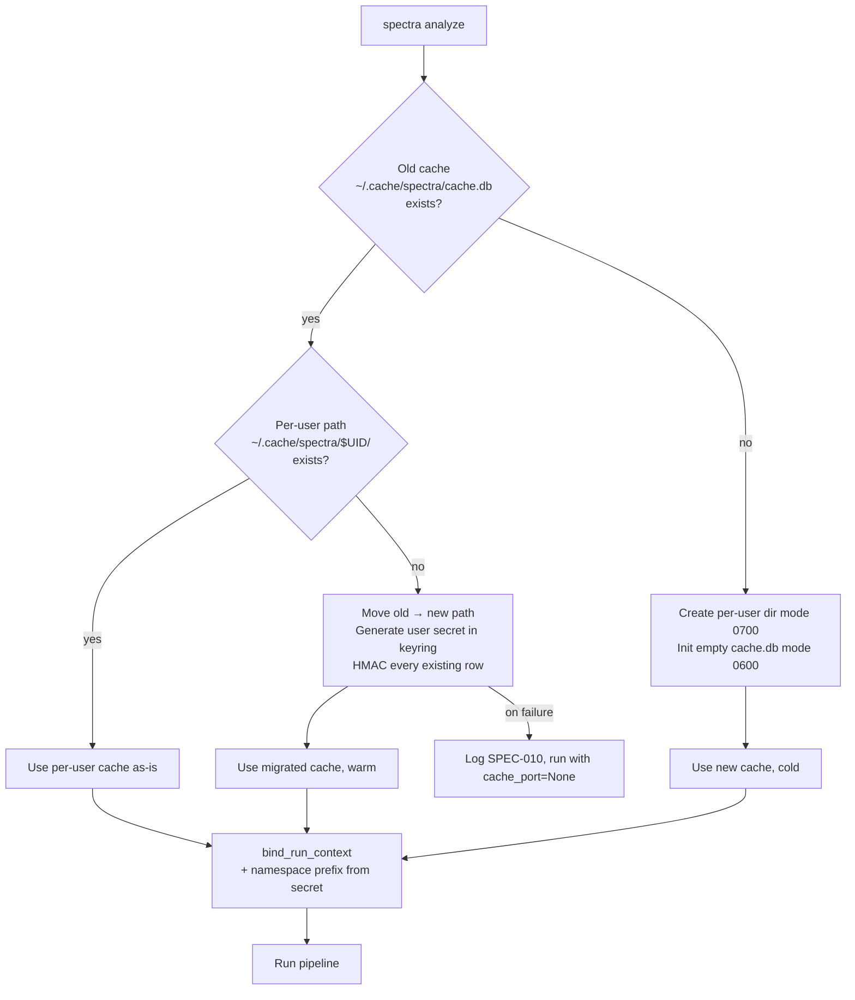

# ADR-012: Per-Row HMAC + Per-User Namespacing for the Local Cache

## Status

Proposed (2026-04-29)

## Context

Two findings converge on the same defect in the cache layer.

**Red Team T2** ([redteam-findings.md §T2](../redteam-findings.md)): `~/.cache/spectra/cache.db` is created with default umask, the row schema stores `findings_json` as plain TEXT, and there is no integrity check. On a shared dev host, CI runner image, or hot-desk Citrix VDI, an attacker with write access to the file can stuff `findings_batches` rows that match a known `repo_signature` (computed via public `blake2b`) and cause the next legitimate scan to short-circuit at Stage 2½, returning `A+, 0 findings` without an Anthropic call.

**CISO §1, §2** ([ciso-findings.md](../ciso-findings.md)): the same shared-cache file holds findings text — code excerpts, CWE references, recommendations — across users. On a multi-tenant box, analyst B can `sqlite3 cache.db` and read analyst A's confidential repo findings.

Both attack surfaces close with the same architecture: namespace the cache per OS user, and bind every row to a per-user secret via HMAC. Two design questions need an answer:

1. **Where does the per-user secret come from?** It must persist across runs (otherwise every run is a cold cache), survive `~/.cache` deletion (otherwise rotating the cache rotates the key — fine), and never appear in error messages or telemetry.
2. **What is the migration path for existing caches?** Today's caches have no HMAC column. Forcing every existing user into a cold scan on upgrade is a bad first impression; silently re-keying is the alternative.

## Decision

Three commitments — each enforced at the adapter layer, not by convention.

### 1. Per-user cache directory

Default cache path moves from `${XDG_CACHE_HOME:-~/.cache}/spectra/cache.db` to `${XDG_CACHE_HOME:-~/.cache}/spectra/$UID/cache.db`, where `$UID` is `os.geteuid()` rendered as a decimal string. Created with mode `0700` (directory) and `0600` (db, WAL, SHM files). The composition root computes the path once at startup and binds it into `SqliteCacheAdapter` — the adapter never reads `geteuid()` itself (testability).

`--cache-dir` CLI flag overrides the default for users who want to share a directory across accounts (CI runners with a single dedicated user).

### 2. Per-user secret in OS keyring; HMAC every row

A new entity `CacheSecret` (Layer 1) wraps a 32-byte high-entropy value. The `SecretBackend` port (Layer 2 — a sibling of `CachePort`) returns the secret on demand. The default Layer 4 implementation is `KeyringSecretAdapter` using the `keyring` package (`Keychain` on macOS, DPAPI on Windows, `libsecret` on Linux). On first use, if the keyring entry `spectra/cache-hmac/$UID` is absent, `KeyringSecretAdapter.ensure()` generates one with `secrets.token_bytes(32)` and writes it. There is no fallback to a file — if the keyring is unavailable, Spectra runs with `cache_port=None` and the user sees a one-line `▸ Cache disabled: keyring unavailable` message.

The `findings_batches`, `full_report_cache`, and `findings_cache` tables gain a `mac` column (`BLOB NOT NULL`). On insert:

```python
mac = hmac.new(secret, _serialize_row(row), hashlib.blake2b, digest_size=16).digest()
```

`_serialize_row` produces a deterministic byte sequence over every cache-key field plus the value. On lookup, after the SQL row is fetched, the adapter recomputes the MAC and compares with `hmac.compare_digest`. Mismatch → row is dropped + a `SPEC-010` warning is logged + the lookup returns a miss + an audit event ([ADR-018](ADR-018-audit-log-and-identity.md)) is recorded with `event="cache.mac_mismatch"`.

### 3. Cache key namespace prefix

Every cache key (`RepoCacheKey`, `BatchCacheKey`, the per-file key) gains a `namespace: str` field. The composition root binds `namespace = blake2b(secret, digest_size=8).hex()` once at startup. Two users on the same machine therefore have:

- **Different files** (`$UID` namespace),
- **Different keys** (the `namespace` prefix prevents accidental cross-binding even if they share a directory via `--cache-dir`),
- **Different MACs** (the secret is per-user).

The `namespace` field is excluded from `prompt_version` derivation (no cache-bust on user change) and included in the composite primary key (so cross-tenant rows cannot conflict).

### 4. Migration: silent re-key

Existing caches at the old path (`~/.cache/spectra/cache.db`) get a one-shot rescue at startup:

```
if old_path.exists() and not new_path.exists():
    rename(old_path, new_path)        # move file
    re_key_in_place(new_path, secret) # write MAC for every existing row
```

`re_key_in_place` is bounded — it walks every row of `findings_cache`, `full_report_cache`, `findings_batches` and computes + writes the MAC under the freshly generated user secret. Existing rows survive the upgrade with their original `prompt_version` / `model_version` / `spectra_version` intact, so the cache remains warm. Total cost: a few hundred MAC computations on a typical user's cache — well under a second.

If the migration fails (disk full, permissions), it logs the failure and proceeds with a fresh empty cache. Cache failures are never fatal (SPEC-010 contract).



## Consequences

### Positive

- **Cache poisoning closes.** An attacker who writes to `cache.db` cannot forge a row — they would need the per-user secret in the keyring, which is OS-protected. MAC mismatch causes the row to be dropped and the run to proceed normally with a fresh analysis.
- **Cross-user leakage closes on shared hosts.** Two users on the same machine have separate cache files (`$UID` directories). A `chmod o-r` would have been a fragile defence; per-user paths are the correct one.
- **Migration is silent and warm.** Existing users do not see a cold scan after upgrade — the rescue at startup re-keys their cache in place.
- **No new failure mode for happy path.** If the keyring is available (true on every macOS, Windows, and most Linux laptops), users see no behaviour change. If it is unavailable (some headless servers), Spectra runs without the cache and prints a clear one-liner.

### Negative

- **`keyring` becomes a runtime dependency.** Adds ~3MB and a small attack surface. We pin it (`>=24,<26`) and ship it in the lockfile ([ADR-020](ADR-020-config-file-yaml.md) for config; product-roadmap #9 for lockfile).
- **CI runners need a writable keyring or `--cache-dir` + cache-disabled.** GitHub-hosted runners do not ship a keyring daemon; they either run with cache disabled (the existing CI default — see [ADR-019](ADR-019-distributed-cache-adapters.md) for the team alternative) or with an env-var fallback we explicitly do not implement here.
- **Per-row MAC adds ~16 bytes/row + ~50µs CPU/row.** Negligible at our row sizes (typical < 50K rows).

### Neutral

- The `KeyringSecretAdapter` fits the existing port-and-adapter pattern. Future backends (Vault, AWS SM, OS-specific) are sibling Layer-4 implementations.
- The `mac` column is additive; the migration is one-shot. No schema versioning bump beyond `spectra_version` is needed because every row's `spectra_version` field already encodes the cutover.
- `--cache-dir` plus `--no-cache` cover the corner cases (CI, test fixtures, hostile environments).

## Alternatives Considered

| Alternative | Verdict |
|-------------|---------|
| **Just `chmod 0600` the cache file, no MAC.** | Rejected. A user with write access (same OS user, same `$UID`) can still poison rows. MAC closes that hole. |
| **HMAC with a hardcoded compile-time key.** | Rejected. The whole point is per-user secret. A shared key still allows cross-user poisoning. |
| **HMAC with a key derived from the Anthropic API key.** | Rejected. Couples cache validity to API key rotation — every key rotation invalidates every cache row. Also leaks API key entropy into a persisted MAC, which is needless. |
| **Encrypt the entire `findings_json` column with a per-user key.** | Rejected for v1. Higher cost (encrypt + decrypt every read), no integrity benefit beyond MAC. SQLCipher (full-DB encryption) ships in Q2 ([product-roadmap.md #13](../product-roadmap.md)) for HIPAA users; that is the correct layer for confidentiality. |
| **Force a cold cache on every upgrade ("delete cache.db, start fresh").** | Rejected. Punishes every existing user. Silent re-key preserves the warm-cache investment. |
| **Use a file marker (`./cache.db.spectra-mac`) instead of a column.** | Rejected. Duplicates the integrity boundary; one row, one MAC, in the same row is simpler. |
| **Skip per-user namespacing; rely on file permissions alone.** | Rejected. CI runners with reused images, hot-desks, and root-shell incidents all bypass file permissions in plausible scenarios. The Red Team called this out specifically. |

## Implementation effort

**S (1-2 days).** Breakdown: `CacheSecret` entity + `SecretBackend` port (S, ~0.5 day); `KeyringSecretAdapter` (S, ~0.5 day); `mac` column + insert/lookup paths in `SqliteCacheAdapter` + `_serialize_row` helper (S, ~0.5 day); per-user path resolution + migration rescue + tests for both happy-path and degraded-keyring (S, ~0.5 day).

## References

- Code: `src/spectra/infrastructure/cache_adapter.py:42-67` — current schema, no `mac` column
- Code: `src/spectra/infrastructure/cache_adapter.py:396-403` — `compute_repo_signature` (public, deterministic, salt-free; Red Team flagged this as the discoverability vector)
- Code: `src/spectra/adapters/cli_controller.py:351-356` — current cache-path resolution; this is where `--cache-dir` is wired
- Findings: [`docs/strategy/redteam-findings.md`](../redteam-findings.md) §T2, §S3 (future cloud-cache extends this story)
- Findings: [`docs/strategy/ciso-findings.md`](../ciso-findings.md) §1 (cleartext at rest), §2 (per-user isolation)
- Roadmap: [`docs/strategy/product-roadmap.md`](../product-roadmap.md) capability #3 (RICE 75)
- Related: [ADR-006](../../architecture/adr/ADR-006-cache-port-incremental-analysis.md) — the original `CachePort` Protocol; this ADR extends the row schema only
- Related: [ADR-009](../../architecture/adr/ADR-009-batch-granularity-per-focus-area.md) — composite key, atomic `bind_run_context`; the new `namespace` field slots in here
- Related: [ADR-018](ADR-018-audit-log-and-identity.md) — MAC mismatch emits an audit event
- Related: [ADR-019](ADR-019-distributed-cache-adapters.md) — distributed Redis/S3 caches inherit the MAC contract

---

*Last updated: 2026-04-29.*
