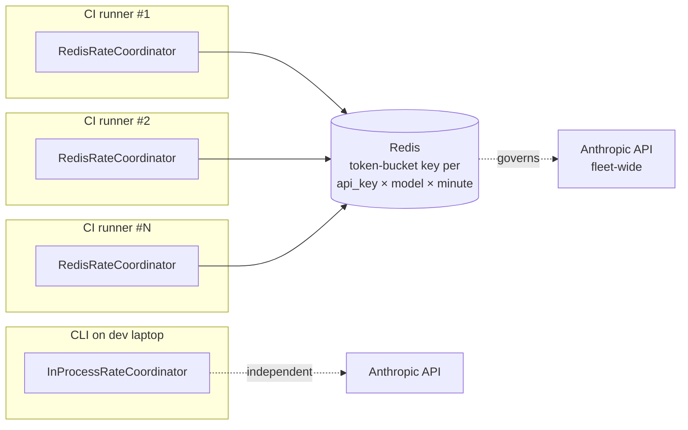

# ADR-013: `task_budget` Everywhere + Fleet-Wide Rate Coordinator

## Status

Proposed (2026-04-29)

## Context

Two cost-burn problems hit the same architectural seam.

**Red Team T4** ([redteam-findings.md §T4](../redteam-findings.md)): a malicious 9999-file repo runs all six specialists at `effort=xhigh` and burns $15-30 per scan. There is no per-run dollar ceiling, no daily ceiling, no abort signal. Spectra can be weaponized into an Anthropic-budget-drain — particularly on shared-key CI deployments.

**CTO §1** ([cto-findings.md §1](../cto-findings.md)): the per-process `Semaphore(4)` and 10-connection httpx pool are *per-process* limits. Fifty engineers on the same Anthropic Tier-N key can collectively exhaust the org RPM in seconds; the loudest team starves the rest. There is no fleet-wide back-pressure.

Today only the CritiqueAgent uses Anthropic's `task_budget` ([ADR-008](../../architecture/adr/ADR-008-adaptive-thinking-supersedes-extended.md)), and even there it is a single hardcoded constant. The other seven agents (one MetaPrompter, six specialists) have no per-call budget at all — they spend whatever the model decides until `max_tokens` runs out.

Three architectural questions:

1. **Per-agent budgets — how much, where set, who owns the dial?**
2. **Per-run dollar enforcement — where does it live in the pipeline (use case vs adapter), and how does it abort gracefully without losing partial work?**
3. **Fleet rate limiting — what is the port, what is the default backend, and what happens when the backend is unreachable?**

## Decision

Three commitments.

### 1. `task_budget` on every agent role; values driven by `AgentRunConfig`

Extend `AgentRunConfig` (Layer 1 entity) with a per-role `task_budget_tokens: int | None` field. Set defaults in `AgentFactory` (Layer 4):

| Agent | `effort` | `task_budget_tokens` | Rationale |
|-------|----------|----------------------|-----------|
| MetaPrompter | medium | 8,000 | Plans only — small input, small output, cap protects from runaway |
| ArchitectureAgent | xhigh | 60,000 | Largest reasoning surface among specialists |
| SecurityAgent | xhigh | 60,000 | Same — security is also reasoning-heavy |
| QualityAgent | xhigh | 50,000 | |
| DocumentationAgent | xhigh | 30,000 | Smaller per-call surface |
| DependencyAgent | xhigh | 40,000 | |
| PerformanceAgent | xhigh | 50,000 | |
| CritiqueAgent | high | 80,000 | Unchanged — adaptive thinking cap (ADR-008) |

The `AnthropicAdapter.analyze_with_thinking` path already supports `task_budget_tokens`. `AnthropicAdapter.analyze` (the non-thinking path used by specialists) gains the same parameter, gated behind the existing `task-budgets-2026-03-13` beta header. The values are defaults, not invariants — `AgentRunConfig` is overridable via [ADR-020](ADR-020-config-file-yaml.md) `.spectra.yml`.

### 2. Per-run + per-window cost enforcement (`CostTrackerPort`)

A new Layer-2 port:

```python
class CostTrackerPort(Protocol):
    """Tracks $/run and $/window. Aborts the pipeline when limits hit."""

    def begin_run(self, run_id: str, ceiling_usd: float) -> None: ...
    def record_call(self, run_id: str, tokens_in: int, tokens_out: int, model: str) -> CostState: ...
    def check_window(self, window: WindowSpec) -> WindowState: ...
    def end_run(self, run_id: str, status: PipelineStatus) -> None: ...

class CostState(BaseModel, frozen=True):
    spent_usd: float
    ceiling_usd: float
    abort: bool          # True when spent > ceiling
```

Default Layer-4 implementation: `SqliteCostTrackerAdapter`, writing to a new `cost_log` table in the same `cache.db` (rows are per-call; aggregations are SQL queries). Schema:

```sql
CREATE TABLE cost_log (
    ts          TEXT NOT NULL,
    run_id      TEXT NOT NULL,
    api_key_id  TEXT NOT NULL,            -- blake2b(api_key, digest_size=8) — never the key itself
    model       TEXT NOT NULL,
    tokens_in   INTEGER NOT NULL,
    tokens_out  INTEGER NOT NULL,
    cost_usd    REAL NOT NULL
);
CREATE INDEX cost_log_window ON cost_log (api_key_id, ts);
```

The orchestrator (`orchestrate_agents.py`) wraps each LLM call:

```python
state = cost_tracker.record_call(run_id, usage.input_tokens, usage.output_tokens, model)
if state.abort:
    raise CostBudgetExceeded(SPEC-004)  # already in the error taxonomy
```

`SPEC-004` already exists in the error registry. The pipeline's existing 2+-failures-→-degraded logic ([CLAUDE.md](../../../CLAUDE.md)) covers the case where the budget triggers mid-fan-out — partial findings render, the report banner shows "Aborted: budget exceeded after $X.YZ on N findings."

CLI flags: `--max-cost-usd 5.00` (per-run) and `--max-cost-usd-per-day 50.00` (per-window). Defaults: per-run $20, per-day no cap. Both overridable via `.spectra.yml`.

### 3. `RateCoordinatorPort` for fleet-wide RPM enforcement

A new Layer-2 port:

```python
class RateCoordinatorPort(Protocol):
    """Distributed RPM/TPM coordinator. Per-process is a degenerate case."""

    async def acquire(self, model: str, est_tokens: int, timeout_s: float = 30) -> Lease: ...
    async def release(self, lease: Lease, actual_tokens: int) -> None: ...
```

`Lease` is a frozen entity carrying a granted slot ID and an issued-at timestamp. The orchestrator wraps every Anthropic call between `acquire` and `release`. On `timeout_s` exhaustion, the orchestrator surfaces `SPEC-003` (already in the taxonomy) and degrades the pipeline.

Two adapters:

- **`InProcessRateCoordinator` (default).** A token bucket inside the process — replaces the current `Semaphore(4)`. Same scope as today: a single CLI invocation. Zero infrastructure.
- **`RedisRateCoordinator` (recommended for teams + CI fleets).** A Redis-backed token bucket using `INCR` + `EXPIRE` against the key `spectra:rpm:{api_key_id}:{model}:{minute_bucket}`. Lua script ensures atomicity. Fleet-wide; every CLI / runner that points at the same Redis honours the same RPM limit.

The composition root selects the adapter from `SPECTRA_RATE_COORDINATOR_URL` (env var; `redis://...` or unset → in-process) or `.spectra.yml`. SQLite is **not** offered as a fleet backend — its write contention pattern is wrong for a hot rate-limit key. Single-machine users do not need fleet coordination; they get the in-process coordinator.

When Redis is unreachable mid-run, `RedisRateCoordinator` opens a circuit breaker, falls back to `InProcessRateCoordinator` for the rest of the run, logs a warning, and emits an audit event. The fleet limit is best-effort; the per-process limit is always enforced.



### What we are NOT doing

- **Building a control plane that mediates every Anthropic call.** The CLI stays direct-to-Anthropic; the coordinator only hands out slots.
- **Per-customer billing in v1.** `cost_log` rows are local. Cost attribution per team/repo is Q3 ([product-roadmap.md #33](../product-roadmap.md)) and falls out of the OTel work.
- **Hardcoding model prices.** Prices live in a small `PRICING_TABLE` constant in Layer 4 (`pricing.py`), updated at release time. The `cost_usd` column is computed at write-time so historical analysis stays accurate even when prices change.

## Consequences

### Positive

- **No more cost-burn surprise.** Per-run + per-window caps make a hostile or runaway loop bounded. CI operators get `--max-cost-usd-per-day` as the FinOps lever.
- **Fleet-friendly.** Redis-coordinated runs let 50 engineers share an Anthropic Tier-N key without the loudest team starving the rest.
- **Adaptive thinking is now uniformly bounded.** Today only Critique has `task_budget`; the others can spend unbounded reasoning when adaptive thinking lands org-wide. This ADR closes that hole pre-emptively.
- **Per-call accounting is structured and queryable.** `cost_log` becomes the foundation for the Q3 cost-attribution work without further schema invention.

### Negative

- **`task_budget` defaults are guesses.** They will need calibration after a week of telemetry. Defaults are conservative (lower than current observed avg), so they may degrade quality on outlier-large repos. We mitigate by emitting a one-line warning when an agent hits its budget and the response truncates: `▸ security agent hit task_budget; consider --task-budget-security 100000`.
- **Redis becomes a soft dependency for teams.** Single-user installs do not need it; teams get a one-time setup cost. We document the docker-compose snippet in the README.
- **`cost_log` grows unbounded.** Add to `spectra cache prune` (Phase 4 already shipped) — drop rows older than 90 days by default.
- **Two more ports + two more adapters.** Real surface-area increase. Justified by the symmetry: both ports have a clear in-process default that needs no infrastructure.

### Neutral

- The existing `manage_token_budget.py` use case is repurposed — it tracks a token pool; `CostTrackerPort` tracks dollars. Both stay; the use case calls the port.
- The decorator chain (Logging → Retry → Anthropic) gains a third `RateCoordinatorDecorator` between Retry and Anthropic. Order matters: retries should release-and-reacquire so a stuck slot does not block fleet capacity.
- `Lease` is intentionally opaque to the orchestrator — implementations can encode whatever they need (Redis Lua tag, in-process semaphore handle, future tracing context).

## Alternatives Considered

| Alternative | Verdict |
|-------------|---------|
| **Set `task_budget` only on the specialists; leave MetaPrompter unbounded.** | Rejected. MetaPrompter is small but a malicious file tree can blow it up. Cheap insurance to cap it. |
| **Enforce dollar ceiling at the Anthropic SDK layer (httpx interceptor).** | Rejected. Couples policy to the HTTP transport. The use-case layer is the right place — it knows when to abort gracefully. |
| **SQLite as the fleet rate-coordinator backend.** | Rejected. Hot-row contention is exactly what SQLite is bad at. Redis-or-in-process keeps the choice clean. |
| **`asyncio.Semaphore` with a higher value.** | Rejected. Doesn't help across processes; doesn't help across machines. Per-process is a complement to fleet, not a substitute. |
| **Burst budgets ("free 10K tokens then enforce").** | Rejected for v1. Adds knobs nobody asked for. Revisit if the Q3 telemetry shows the hard limit hurts quality on small repos. |
| **Anthropic Batch API for cost reduction instead of budgeting.** | Complementary, not alternative. Batch API ([product-roadmap.md #23](../product-roadmap.md), Q3) cuts per-scan cost ~50%; budgeting prevents pathological scans regardless of Batch API use. Both ship. |
| **No fleet coordinator — let Anthropic 429s do the back-pressure.** | Rejected. 429 retries are wasteful and unfriendly to the noisy-neighbour repo's owner. Token-bucket ahead-of-time is cheaper for everyone. |

## Implementation effort

**M (4-7 days).** Breakdown: `CostTrackerPort` + `SqliteCostTrackerAdapter` + cost_log schema + per-call wrap (M, ~2 days); CLI flags + `.spectra.yml` integration ([ADR-020](ADR-020-config-file-yaml.md)) (S, ~0.5 day); `task_budget` on `AgentRunConfig` + `AnthropicAdapter.analyze` extension + AgentFactory defaults (S, ~1 day); `RateCoordinatorPort` + `InProcessRateCoordinator` + `RedisRateCoordinator` (Redis Lua + circuit breaker) (M, ~2 days); decorator wiring + tests for budget abort + fleet timeout (S, ~1 day).

## References

- Code: `src/spectra/infrastructure/anthropic_adapter.py:46-89` — current `_call_streaming`; `task_budget` plumbing point
- Code: `src/spectra/infrastructure/agents/agent_factory.py` — where per-role `AgentRunConfig` defaults are set
- Code: `src/spectra/use_cases/manage_token_budget.py` — existing token tracking; the new cost tracker calls into this
- Code: `src/spectra/use_cases/orchestrate_agents.py:101` — per-process `Semaphore(4)`; replace with `RateCoordinatorPort`
- Code: `src/spectra/entities/errors.py` — SPEC-003 (rate limit), SPEC-004 (budget) already defined
- Findings: [`docs/strategy/redteam-findings.md`](../redteam-findings.md) §T4 (cost burn), §T9 (no auth amplifier)
- Findings: [`docs/strategy/cto-findings.md`](../cto-findings.md) §1 (fleet rate limit)
- Roadmap: [`docs/strategy/product-roadmap.md`](../product-roadmap.md) capabilities #5, #22, #23 (Q1 + Q3)
- Related: [ADR-008](../../architecture/adr/ADR-008-adaptive-thinking-supersedes-extended.md) — `task_budget` precedent on CritiqueAgent
- Related: [ADR-018](ADR-018-audit-log-and-identity.md) — budget aborts emit audit events
- Related: [ADR-019](ADR-019-distributed-cache-adapters.md) — Redis is the same dep; reuse the connection

---

*Last updated: 2026-04-29.*
