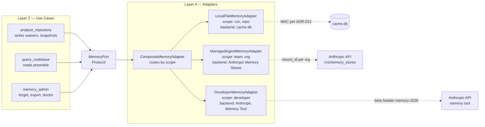

# ADR-014: Anthropic Memory Stores for the Per-Org / Per-Team Memory Tier

## Status

Proposed (2026-04-29)

## Context

The Memory persona ([memory-second-brain-findings.md](../memory-second-brain-findings.md)) proposes turning Spectra from a stateless analyzer into a "second brain" with three memory tiers:

| Tier | What lives here | Backend |
|------|-----------------|---------|
| **Per-repo** | Waivers, score timeline, decision log, ADR index | Local SQLite (extends `cache.db`) |
| **Per-developer** | Reviewer profile, severity preferences | Anthropic Memory Tool (`/memories/<dev_id>/`) |
| **Per-team / per-org** | Shared patterns, internal runbooks, custom severity overrides, cross-repo learnings | Anthropic **Memory Stores** (FUSE-mounted at `/mnt/memory/spectra-org-<org_id>/`) |

The roadmap ([product-roadmap.md Q4](../product-roadmap.md)) commits to this in Q4 alongside `spectra ask` ([ADR-015](ADR-015-query-codebase-use-case.md)). Three architectural questions need resolution before the use-case layer can be designed:

1. **What is the `MemoryPort` shape that all three tiers conform to?** The use-case layer cannot branch on tier — that would push infrastructure concerns inward.
2. **What are the privacy invariants that prevent a per-developer entry from leaking into a per-org store, or vice versa?** Get this wrong once and we ship a CISO-blocking GDPR incident.
3. **What is the fallback when Memory Stores are unavailable** — Anthropic outage, customer on Bedrock without the feature, or `--no-network` mode?

## Decision

Three commitments — one port, three adapters, four privacy invariants enforced at the adapter boundary.

### 1. `MemoryPort` Protocol (Layer 2)

The exact shape from [memory-second-brain-findings.md §4.1](../memory-second-brain-findings.md), reproduced verbatim into `src/spectra/use_cases/interfaces.py`:

```python
class MemoryPort(Protocol):
    """Cross-run memory port. All scopes flow through one port; the
    composition root wires the right adapter per scope.
    """

    async def get(self, scope: MemoryScope, key: str) -> MemoryEntry | None: ...
    async def put(self, entry: MemoryEntry) -> None: ...
    async def list(
        self, scope: MemoryScope, prefix: str | None = None, limit: int = 100,
    ) -> tuple[MemoryEntry, ...]: ...
    async def forget(self, scope: MemoryScope, key: str) -> bool: ...
    async def preamble(self, scope: MemoryScope) -> str: ...
```

`preamble()` returns a deterministic byte sequence used to seed Anthropic's prompt cache — this is what makes [ADR-015](ADR-015-query-codebase-use-case.md) `query_codebase` cost-defensible at $0.05/call.

New entities (Layer 1):

```python
MemoryScope = Literal["run", "repo", "developer", "team", "org", "public"]
MemoryKind  = Literal["finding-history", "waiver", "decision", "score-snapshot",
                      "adr-index", "preference", "pattern", "ingested-doc"]

class MemoryEntry(BaseModel, frozen=True):
    scope: MemoryScope
    owner_id: str        # repo_signature, dev_id, org_id, "public"
    kind: MemoryKind
    key: str             # caller-defined; namespaced under owner_id
    value_json: str      # opaque payload; max 64KB
    provenance: Provenance
    ttl_days: int | None = None
    created_at: datetime
```

### 2. Adapter trio (Layer 4)

```
src/spectra/infrastructure/memory/
├── __init__.py
├── local_file_adapter.py        # per-run + per-repo  (SQLite tables in cache.db)
├── developer_adapter.py         # per-developer       (Anthropic Memory Tool, client-side files)
└── managed_agent_adapter.py     # per-team + per-org  (Anthropic Memory Stores, FUSE-mounted)
```

| Adapter | Scopes | Backend | Lifetime |
|---------|--------|---------|----------|
| `LocalFileMemoryAdapter` | run, repo | New tables in `cache.db`: `memory_entries`, `waivers`, `score_timeline`, `decision_log`, `ingested_docs` — same DB, different tables. MAC-protected per [ADR-012](ADR-012-cache-hmac-per-user-namespace.md). | Months until `spectra cache clear` |
| `DeveloperMemoryAdapter` | developer | Anthropic **Memory Tool** files at `${XDG_CONFIG_HOME:-~/.config}/spectra/memories/<dev_id>/`. SDK calls: `client.beta.memory.read_file()` / `write_file()` (beta header `memory-2026-...`). | Years until `spectra memory forget --me` |
| `ManagedAgentMemoryAdapter` | team, org | Anthropic **Memory Stores** — `client.beta.memory_stores.create()` once per org at signup; the resulting `mount_id` is referenced in agent runs ([ADR-016](ADR-016-managed-agents-gateway.md)) so reads happen server-side via the FUSE mount, never as injected user-message bytes. | Subscription lifetime; deleted via `DELETE /v1/memory_stores/{id}` |

The composition root (`infrastructure/main.py`) wires a `CompositeMemoryAdapter` that routes by scope:

```python
class CompositeMemoryAdapter(MemoryPort):
    def __init__(self, local, developer, managed):
        self._routes = {
            "run": local, "repo": local,
            "developer": developer,
            "team": managed, "org": managed,
        }

    async def get(self, scope, key):
        return await self._routes[scope].get(scope, key)
```

The use-case layer never imports the three sub-adapters; it depends only on `MemoryPort`.

### 3. Privacy invariants — enforced at the adapter, not by convention

Four invariants, each with a corresponding test in `tests/infrastructure/memory/`:

**Invariant 1: per-developer ≠ per-org ≠ per-team.** Each adapter is constructed with its bound `owner_id` (dev_id, org_id, team_id) at composition time. `DeveloperMemoryAdapter.get(scope="developer", key=k)` raises `MemoryError("SPEC-011: cross-tenant read")` unless the `MemoryEntry.owner_id` matches the bound `dev_id`. `dev_id` is derived from `getpass.getuser()` hashed to 16 chars and never accepted as user input.

**Invariant 2: per-org Memory Stores are workspace-scoped.** One `mount_id` per org. The adapter holds the org's API key in an OS keyring entry (the same backend as [ADR-012](ADR-012-cache-hmac-per-user-namespace.md)'s cache HMAC secret). Reading another org's store would require a different API key Spectra never sees; cross-org reads are physically impossible, not policy-impossible.

**Invariant 3: CI mode disables per-developer + per-org writes by default.** `SPECTRA_CI=1` (auto-detected from `CI=true`) flips the dev/org adapters to read-only. Prevents shared CI runners from accumulating "the CI bot's" preferences and from polluting the org store with bot-authored entries.

**Invariant 4: Right-to-be-forgotten.**
- Engineer leaving: `spectra memory forget --developer <dev_id>` cascades to local files + Memory Tool delete + index-row removal.
- Org churn: `DELETE /v1/memory_stores/{store_id}` via `ManagedAgentMemoryAdapter.purge_org(org_id)` removes everything in one API call.
- Per-key TTL: `MemoryEntry.ttl_days` is honoured by every adapter via a periodic `forget` sweep on startup.

### 4. Adapter wiring + composition



### 5. Migration: `LocalFileMemoryAdapter` is the fallback for everything

When `ManagedAgentMemoryAdapter` cannot reach Anthropic (network, region pin to Bedrock, ZDR-only mode that disables Memory Stores) or when a customer hasn't enabled the org-tier subscription, the `CompositeMemoryAdapter` routes `team` and `org` reads/writes to a degraded `LocalFileMemoryAdapter` instance with `owner_id = "org-fallback"`. The use case is told via `MemoryEntry.provenance.source = "fallback"`. We lose cross-machine sync; we keep correctness.

The same path applies to the `DeveloperMemoryAdapter` if the Memory Tool API is unreachable — fall back to local files, same shape, no cross-machine sync.

## Consequences

### Positive

- **One port, three tiers.** Use-case code that uses memory never branches on scope — this is what makes the second-brain narrative ([product-roadmap.md Q4](../product-roadmap.md)) implementable in 9 days for M1+M2+M3 ([memory-second-brain-findings.md §6](../memory-second-brain-findings.md)).
- **Privacy boundaries are physical, not policy.** Anthropic Memory Stores enforce workspace scoping at the API; a misconfigured cross-tenant query is *impossible*, not just *forbidden*. This is the answer to every CISO question about the second-brain feature.
- **Anthropic-native primitive maps cleanly.** Memory Stores were designed for exactly this multi-agent, multi-tenant pattern. Building our own (Postgres + RBAC + multi-tenant queries) would be 3-6 months of work to reach the same compliance posture.
- **Fallback path keeps the dependency rule intact.** Use cases never know whether they got an Anthropic-backed entry or a local-file one — the composite adapter handles routing.

### Negative

- **Anthropic dependency surfaces in the org tier.** Customers who refuse Anthropic Memory Stores (Bedrock-only, on-prem) lose cross-machine team memory. We document this as the fallback contract, and the CTO's regulated-customer narrative ([product-roadmap.md §6](../product-roadmap.md)) accepts the trade.
- **`memory-2026-...` and Memory Stores beta headers are unstable.** A schema change forces an adapter refactor. Mitigation: the contract is the `MemoryPort` Protocol; adapter changes never reach Layer 2.
- **Per-org cost is real and per-call.** Memory Stores are billed by Anthropic; this is why per-org memory is a paid tier from day one ([product-roadmap.md Conflict 5](../product-roadmap.md)). Per-repo + per-developer stay free in OSS.
- **`CompositeMemoryAdapter` routing is dispatch logic.** Reasonably small, reasonably pure, but it is a class to maintain. Tests cover all six scope routes.

### Neutral

- The new SQLite tables (`memory_entries`, `waivers`, `score_timeline`, `decision_log`, `ingested_docs`) live in the existing `cache.db`. No new database, no new connection pool. They inherit the [ADR-012](ADR-012-cache-hmac-per-user-namespace.md) MAC contract.
- The `MemoryPort.preamble()` method is what [ADR-015](ADR-015-query-codebase-use-case.md) `query_codebase` calls; it's the seam between the memory tier and the prompt-cache optimisation.
- Public knowledge ([memory-second-brain-findings.md §3](../memory-second-brain-findings.md) "What we explicitly skip") is **not** a memory tier. It ships as a Spectra Skill in `.claude-plugin/spectra-public-knowledge/SKILL.md` and is signed at release ([ADR-017](ADR-017-custom-rules-plugin-architecture.md)). Adapters reject `scope="public"` writes.

## Alternatives Considered

| Alternative | Verdict |
|-------------|---------|
| **Build our own Postgres-backed memory service.** | Rejected. 3-6 months to match Memory Stores' multi-tenant + RBAC + audit posture. Re-uses no Anthropic-native cost wins. The CTO's "Anthropic-native by default" call ([product-roadmap.md §6](../product-roadmap.md)) wins on this. |
| **Embeddings + vector store (pgvector / Pinecone).** | Rejected per [memory-second-brain-findings.md §3](../memory-second-brain-findings.md). Anthropic prompt cache + Memory Store FUSE mount cover the "stable context" use case at lower op complexity than running a vector DB. Revisit only if per-repo memory exceeds 200K tokens. |
| **Per-developer in Memory Stores too.** | Rejected. Per-developer is a single-tenant, single-OS-user scope — Memory Tool's `/memories/<dev_id>/` model is the natural fit, no need for the workspace-scoped overhead. |
| **One adapter per scope (no composite).** | Rejected. Forces every use case to know which scope maps to which adapter. The composite hides routing where it belongs (Layer 4). |
| **Allow `scope="public"` writes.** | Rejected. Public knowledge ships in a signed plugin (Skill) — no runtime mutation. Closes a supply-chain attack surface. |
| **Skip the developer tier; only ship per-repo + per-org.** | Rejected. The reviewer-profile and severity-bias-correction capabilities ([memory-second-brain-findings.md §2](../memory-second-brain-findings.md) ranks 5, 9) need a per-developer scope. They land in M5; the port shape has to support them from day one to avoid a breaking change later. |

## Implementation effort

**L (10-15 days).** Breakdown: `MemoryPort` + new entities + `MemoryError(SPEC-011)` (S, ~1 day); `LocalFileMemoryAdapter` + new SQLite tables + waivers/score-timeline integration (M, ~3 days); `DeveloperMemoryAdapter` against Memory Tool API (M, ~2 days); `ManagedAgentMemoryAdapter` against Memory Stores API + mount_id management + per-org keyring (L, ~5 days); `CompositeMemoryAdapter` + composition wiring + privacy-invariant tests (M, ~3 days); `spectra memory forget|doctor|export` admin CLI (S, ~1 day).

## References

- Findings: [`docs/strategy/memory-second-brain-findings.md`](../memory-second-brain-findings.md) §1 (tiers), §4 (architecture), §5 (privacy invariants)
- Roadmap: [`docs/strategy/product-roadmap.md`](../product-roadmap.md) Q4, capabilities #50, #51, #53, #54, #55
- Related: [ADR-015](ADR-015-query-codebase-use-case.md) — `query_codebase` consumes `MemoryPort.preamble`
- Related: [ADR-016](ADR-016-managed-agents-gateway.md) — Managed Agents reference `mount_id` from this adapter
- Related: [ADR-012](ADR-012-cache-hmac-per-user-namespace.md) — local memory rows MAC-protected
- Related: [ADR-018](ADR-018-audit-log-and-identity.md) — every memory write emits an audit event
- Anthropic API: Memory Stores (`/v1/memory_stores`), Memory Tool (`memory-2026-...` beta header)

---

*Last updated: 2026-04-29.*
