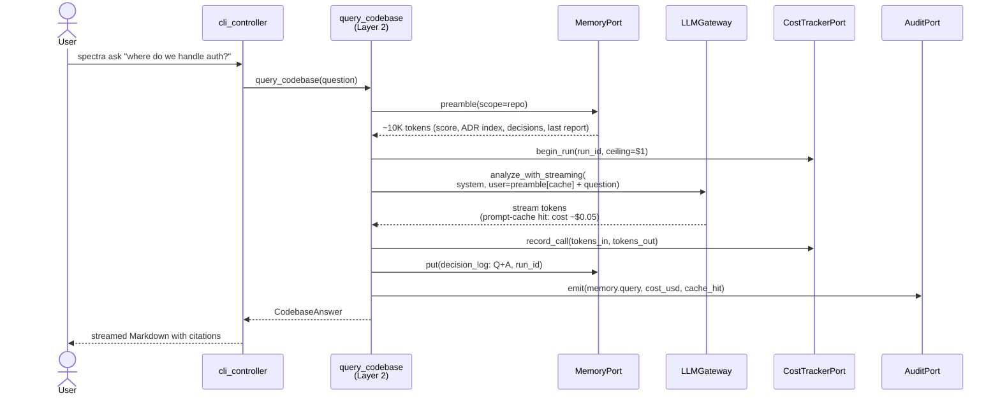

# ADR-015: `query_codebase` Use Case (the Second-Brain Q&A Capability)

## Status

Proposed (2026-04-29)

## Context

The Memory persona's #2 capability ([memory-second-brain-findings.md §2](../memory-second-brain-findings.md), rank 88/100) is `spectra ask "where do we handle auth?"` — a free-form Q&A surface over a repo that costs $0.50 on the first call and $0.05 on every cached call afterwards. The product roadmap pins it at RICE 70 in Q4 ([product-roadmap.md #51](../product-roadmap.md)) and frames it as the capability that "sells the product to non-Spectra-running team-mates."

Architecturally this is a *second* entry point — the existing `analyze_repository` use case stays untouched. `query_codebase` is parallel to it, calls into the same `MemoryPort` ([ADR-014](ADR-014-anthropic-memory-stores-for-team-org.md)) and `LLMGateway`, and produces a small structured output.

Three questions need an architectural answer before code lands:

1. **What is the prompt-cache strategy that takes the per-call cost from $0.50 to $0.05?** This is the unit-economics claim the GTM narrative depends on.
2. **CLI surface vs HTTP/MCP surface — what ships in v1 and what is deferred?** The product is CLI-only ([product-roadmap.md TL;DR](../product-roadmap.md)) but the second-brain narrative invites a server-mode evolution.
3. **Streaming vs non-streaming — what is the response shape and what does the CLI render?** Affects the user experience, the per-call cost (streaming costs the same but feels faster), and the audit log shape.

## Decision

Five commitments.

### 1. New use case `query_codebase` in Layer 2

```python
# src/spectra/use_cases/query_codebase.py — NEW

async def query_codebase(
    question: CodebaseQuestion,
    memory: MemoryPort,
    llm: LLMGateway,
    cost_tracker: CostTrackerPort,    # ADR-013
    audit: AuditPort,                 # ADR-018
    observer: ProgressObserver,
) -> CodebaseAnswer:
    """Answer a free-form question about a repo using accumulated memory.

    1. Load preamble (cacheable, ~10K tokens stable across questions).
    2. Append question (variable, ~50 tokens).
    3. Call Claude with prompt-cache markers on the preamble.
    4. Persist Q+A to decision_log (provenance, audit).
    """
```

The use case lives **in parallel** to `analyze_repository`, not inside it. Both are Layer-2 entry points; both are called by the CLI controller (Layer 3).

New entities (Layer 1, finalized from [memory-second-brain-findings.md §4.2](../memory-second-brain-findings.md)):

```python
class CodebaseQuestion(BaseModel, frozen=True):
    question: str
    repo_signature: str
    scope: MemoryScope = "repo"        # default; widens to "org" with a flag

class CodebaseAnswer(BaseModel, frozen=True):
    answer: str
    citations: tuple[Citation, ...]
    cost_usd: float
    cache_hit: bool                    # prompt cache hit on the preamble
    run_id: str                        # for audit cross-reference
```

`Citation` is a frozen entity with `(file_path, line_range, kind: Literal["adr","finding","code","decision"])`.

### 2. Aggressive prompt caching on the preamble

`MemoryPort.preamble(scope)` returns a deterministic byte sequence assembled from:

- Latest `score-snapshot` row (~200 tokens)
- Top-N most recent `decision_log` entries (~3K tokens)
- ADR index (titles + first paragraphs, file_id references via Anthropic Files API for the bodies — ~3K tokens)
- Last `AnalysisReport` summary (~3K tokens)
- File tree (≤1K tokens)

Total: ~10K tokens, stable across questions on the same repo until a write happens. The use case marks this region with `cache_control: ephemeral`:

```python
messages = [{
    "role": "user",
    "content": [
        {"type": "text", "text": preamble, "cache_control": {"type": "ephemeral"}},
        {"type": "text", "text": f"Question: {question.question}"},
    ],
}]
```

First call seeds the cache (~$0.50, ~10K input + ~500 output). Subsequent calls within the cache TTL (Anthropic's default ~5 min, refresh-on-read) cost ~$0.05 (cached input + ~500 output). The `cache_hit` field on `CodebaseAnswer` reflects what the API reports.

The preamble bytes invalidate naturally when memory rows change — `preamble()` re-derives from the underlying tables and any state change yields a different byte sequence, missing the cache. We do not manually bust; we rely on Anthropic's content-hash matching.

### 3. Streaming response, plain text output (no JSON)

The response is plain text (citations rendered inline as Markdown links). The CLI streams the response to the terminal token-by-token via Rich's `Live` display — this is what makes a 3-second answer *feel* like 0.5 seconds. The `LLMGateway.analyze_with_streaming` method already exists for the specialist path; we re-use it.

We deliberately do not return JSON: an LLM-shaped Q&A answer is conversational, and forcing JSON degrades quality without a buyer (no downstream parser exists). Citations are extracted from the answer post-hoc by a lightweight regex over `[file:line](path#L42)` Markdown patterns the system prompt requires.

The `--format json` mode wraps the plain text inside `CodebaseAnswer.model_dump_json()` for scripting — same content, different envelope.

### 4. CLI surface in v1; HTTP/MCP deferred

CLI:

```bash
spectra ask "where do we handle auth?"
spectra ask "why did we choose Postgres?" --scope org
spectra ask "show me PII handling" --format json
spectra brief                     # canned question — "10 things to know about this repo"
```

The CLI controller (Layer 3) gains an `ask` subcommand and a `brief` subcommand (`brief` is M3+M2 compose; same use case, fixed prompt).

**Deferred for v1:**

- **HTTP server mode (`spectra serve`)**. The product is CLI-only ([product-roadmap.md TL;DR](../product-roadmap.md)); a server changes the auth, audit, and operational story. Re-evaluate post-Q4 once `spectra ask` adoption signal is real.
- **MCP server**. The architecture admits an MCP wrapper trivially — `query_codebase` is a single function with structured input — but shipping it requires the same auth + multi-tenant story as the HTTP surface. Defer.

### 5. Per-question audit log entry

Every `query_codebase` invocation writes one row to the audit log ([ADR-018](ADR-018-audit-log-and-identity.md)):

```python
AuditEvent(
    event="memory.query",
    actor=identity.actor,
    repo_signature=question.repo_signature,
    payload={"question": question.question[:500],   # truncated
             "scope": question.scope,
             "cost_usd": answer.cost_usd,
             "cache_hit": answer.cache_hit},
)
```

The question text is truncated at 500 chars in the audit row to bound storage; the full question + answer goes into `decision_log` (per-repo memory) keyed by `run_id` for the archeology surface (`spectra decisions --grep <term>`).



## Consequences

### Positive

- **Unit economics survive contact with reality.** $0.05/call after the first is the entire reason this capability is shippable — without prompt caching the per-call cost would price the feature out of the OSS CLI.
- **No new infrastructure.** `query_codebase` re-uses every existing port: `MemoryPort` (ADR-014), `LLMGateway`, `CostTrackerPort` (ADR-013), `AuditPort` (ADR-018), `ProgressObserver`. The cost is one new use case + one new CLI command + new entities.
- **Clean separation from `analyze_repository`.** The two use cases share the same dependency graph but never call each other. A bug in one cannot break the other.
- **Decisions become provenance.** Every Q+A is stored in `decision_log` with a `run_id` — the next engineer who asks the same question gets the historical answers as context, and the audit log proves who asked what.
- **Compromised runs are safe.** If `spectra analyze` flagged a repo as `pipeline_state="compromised"` ([ADR-011](ADR-011-prompt-injection-isolation.md)), the per-repo memory carries that flag — `query_codebase` refuses to answer questions over a compromised repo's memory and surfaces a one-line message instead.

### Negative

- **Anthropic prompt-cache TTL is operational.** A long gap between questions on the same repo costs the full $0.50 again. We document the TTL behaviour in the `spectra ask` help text. Customers who want predictable cached questions should run `spectra ask "..." --warm` (a no-op call that just seeds the cache).
- **Plain-text answers are not machine-parseable.** A future Slack-bot integration that wants structured answers will need a separate JSON-mode prompt. We accept this; the conversational shape is the right v1.
- **`MemoryPort.preamble()` is a hot path.** Every call walks the per-repo tables. We add a 60-second in-memory cache inside `LocalFileMemoryAdapter` to absorb burst questions without re-deriving.
- **Citation extraction is regex-fragile.** A model that returns citations in a different shape (`[file](path)` vs `[file:42](path#L42)`) yields no citations. We accept this; the system prompt is explicit and the regex tolerant.

### Neutral

- The `LLMGateway` Protocol does not change — `analyze_with_streaming` already exists. We add `cache_control` plumbing in `AnthropicAdapter` if it isn't already there.
- The `--scope org` flag widens the preamble to include the per-org Memory Store ([ADR-014](ADR-014-anthropic-memory-stores-for-team-org.md)). Per-org reads cost more (FUSE-mount round-trip server-side), so the CLI surfaces this in the cost line.
- `spectra brief` is a one-line wrapper — same use case, fixed `question="Brief me on this repo: 10 things to know."` Cost: same as a regular ask.

## Alternatives Considered

| Alternative | Verdict |
|-------------|---------|
| **Embeddings + RAG over the codebase.** | Rejected per [memory-second-brain-findings.md §3](../memory-second-brain-findings.md). Anthropic prompt cache + Memory Stores cover the use case at lower cost and lower op complexity. |
| **JSON-only response.** | Rejected. Forcing JSON degrades answer quality and there is no v1 downstream parser. `--format json` envelope is enough for scripting. |
| **HTTP server mode in v1.** | Rejected. Changes the auth/multi-tenant/audit story. Defer until adoption signal validates the demand. |
| **Re-derive preamble on every call (no in-memory cache).** | Rejected. Wastes ~50ms × N questions. The 60-second adapter-side cache is invisible and bounded. |
| **Persist the prompt-cache markers explicitly in our cache.db.** | Rejected. Anthropic owns the prompt cache; mirroring it locally adds a sync problem with no benefit. |
| **Charge for `spectra ask` from day one.** | Aligned with [product-roadmap.md Conflict 5](../product-roadmap.md): per-org Memory Store *is* paid; per-repo Q&A is free with the OSS CLI. The cost goes to the user's Anthropic key, not to a Spectra meter. |
| **Use a separate cheaper model (Sonnet) for Q&A.** | Rejected for v1. Opus 4.7 with prompt caching is cost-defensible at $0.05/call; Sonnet would save ~$0.02/call and degrade citation quality. Revisit at scale. |

## Implementation effort

**M (4-6 days, matches memory-persona M3 estimate).** Breakdown: `CodebaseQuestion` / `CodebaseAnswer` / `Citation` entities + use case (S, ~1 day); `MemoryPort.preamble` impl + 60s cache (S, ~0.5 day); `cache_control` plumbing in `AnthropicAdapter` (S, ~0.5 day); CLI `ask` + `brief` subcommands + streaming via Rich Live (M, ~1.5 days); audit + cost wiring (S, ~0.5 day); citation regex + tests + golden Q&A pairs in `golden_files/qa/` (M, ~2 days).

## References

- Findings: [`docs/strategy/memory-second-brain-findings.md`](../memory-second-brain-findings.md) §2 (capability), §4.5 (use case), §6 (M3 + M4)
- Roadmap: [`docs/strategy/product-roadmap.md`](../product-roadmap.md) capability #51 (RICE 70, Q4), #52 (`spectra brief`)
- Related: [ADR-014](ADR-014-anthropic-memory-stores-for-team-org.md) — `MemoryPort` + adapters consumed by this use case
- Related: [ADR-013](ADR-013-task-budget-and-rate-coordination.md) — cost tracker bounds Q&A spend
- Related: [ADR-018](ADR-018-audit-log-and-identity.md) — every Q&A emits an audit event
- Related: [ADR-011](ADR-011-prompt-injection-isolation.md) — compromised-repo flag refuses Q&A
- Anthropic API: prompt caching (`cache_control: ephemeral`), Files API (ADR-014 ADR ingest)

---

*Last updated: 2026-04-29.*
