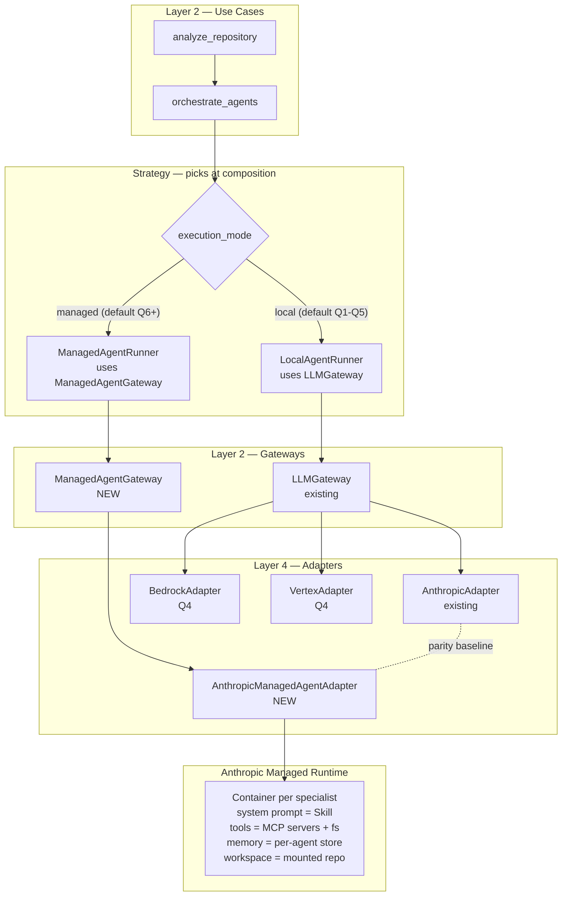

# ADR-016: Managed Agents Gateway Adapter

## Status

Proposed (2026-04-29)

## Context

The CTO's Anthropic-native bet ([cto-findings.md "How Anthropic Managed Agents could change the architecture"](../cto-findings.md), [product-roadmap.md §6](../product-roadmap.md)) is to evaluate **Anthropic Managed Agents** as the execution substrate for the six specialists in Q5-Q6. The current architecture runs each `SpecialistAgent` locally: clone repo, mount file system, call Anthropic over HTTPS, parse JSON, validate Pydantic. With Managed Agents, the per-agent loop runs inside Anthropic's container with the repo file-mounted; the `AnthropicAdapter` shrinks to a thin job-submission client; tool calls (read file, grep, regex) become real tools the managed agent invokes instead of being baked into the prompt.

This is a vendor-native bet with a clear cost-of-leaving. Three architectural questions need answers:

1. **What is the boundary that lets us adopt Managed Agents without locking us in?** A Bedrock or Vertex deployment must remain a 2-week swap.
2. **What stays in Spectra and what moves to Anthropic?** Get this wrong and either we are still doing all the work (no benefit) or we cannot port (full lock-in).
3. **How do the existing port contracts (`LLMGateway`, `MemoryPort`, etc.) accommodate the managed loop without leaking infrastructure into use cases?**

## Decision

Six commitments.

### 1. New `ManagedAgentGateway` Protocol — sibling, not replacement

Today's `LLMGateway` Protocol stays untouched — it covers the call-Claude-with-a-prompt path used by MetaPrompter, the specialists (today), and the CritiqueAgent. We add a sibling protocol:

```python
# src/spectra/use_cases/interfaces.py — additive

class ManagedAgentGateway(Protocol):
    """Submits an agent loop to a managed runtime (e.g. Anthropic Managed Agents)
    and awaits its structured output. The runtime owns concurrency, tools, and
    file-system access for the agent.
    """

    async def submit(
        self,
        spec: ManagedAgentSpec,           # role, prompt, tools, memory mount, budgets
        workspace: WorkspaceRef,          # mounted in the managed container
        timeout_s: float = 120,
    ) -> ManagedAgentResult: ...

    async def cancel(self, run_id: str) -> None: ...
```

`ManagedAgentSpec`, `WorkspaceRef`, and `ManagedAgentResult` are frozen entities (Layer 1). The first Layer-4 implementation is `AnthropicManagedAgentAdapter` using `client.beta.agents.create()` + `sessions.create()`. A future `BedrockAgentAdapter` is a sibling — both implement the same Protocol.

The use cases (`orchestrate_agents.py`) gain a *strategy choice* at composition time:

```python
# Layer 4 composition root selects the execution mode:
mode = config.execution_mode  # "local" | "managed"
runner = ManagedAgentRunner(managed_gateway) if mode == "managed" else LocalAgentRunner(llm_gateway)
```

The use case calls `runner.run_specialists(...)` — which is the abstraction over both modes. Specialists do not know whether they are running locally or in a managed container.

### 2. What stays in Spectra (the IP boundary)

| Layer | Stays in Spectra | Why |
|-------|------------------|-----|
| **Layer 1 — Entities** | All of it | Pure value objects; no execution semantics |
| **Layer 2 — Use Cases** | `analyze_repository`, `orchestrate_agents`, `manage_token_budget`, `query_codebase`, `MemoryPort`, `CachePort`, `LLMGateway`, `ManagedAgentGateway` (new), all scoring + dedupe + critique discipline | The parallel-fan-out + merge + critique discipline is *Spectra's* IP. The 6-dimension model, the scoring weights, the deduplication rules, the cross-batch reconciliation, the report rendering — none of this moves. |
| **Layer 3 — Adapters** | All of it | CLI surface stays identical |
| **Layer 4 — `MERGE` + `CRITIQUE` + `REPORT`** | All of it | These read the union of all specialist outputs and apply our scoring + ScoreCard + Jinja2 rendering. They are not LLM-bound — `MERGE` is dedupe SQL, `REPORT` is a template. `CRITIQUE` is a single Claude call with adaptive thinking ([ADR-008](../../architecture/adr/ADR-008-adaptive-thinking-supersedes-extended.md)) — it stays as a regular `LLMGateway` call. |

### 3. What moves to Managed Agents (the per-specialist loop)

The six specialist instances (architecture, security, quality, documentation, dependency, performance) move into managed-agent definitions:

- **System prompts as Skills.** Each specialist's system prompt + few-shot examples + finding schema lives in a `.claude-plugin/skills/spectra-<dimension>-specialist/SKILL.md` and is mounted into the managed agent at session start. This re-uses the Skills work already shipping for `spectra-public-knowledge` ([memory-second-brain-findings.md §3](../memory-second-brain-findings.md), Q4 #55).
- **Tools instead of pre-fetched context.** Today the specialist receives the full file batch in its prompt. With Managed Agents, the runtime mounts the workspace and the agent calls real tools: `read_file(path, line_range)`, `grep(pattern, glob)`, `list_directory(path)`. We hand-build these as MCP servers shipped in the Spectra plugin (`spectra-fs-tools`).
- **MCP servers as native tool wiring.** Semgrep, TruffleHog, OSV.dev MCP servers (where available — first-party for OSV.dev, community for Semgrep/TruffleHog) wire into the managed runtime as tools. The security agent calls them directly instead of receiving their output as text. This is "strictly better for grounding" ([cto-findings.md](../cto-findings.md)) — see [agentic-architecture.md §4](agentic-architecture.md) for the topology.
- **Per-agent memory store.** Each specialist gets its own Memory Store (`spectra-specialist-<dimension>-<org_id>`) for accumulated patterns. Per [memory-second-brain-findings.md §1](../memory-second-brain-findings.md), this is the per-org tier — workspace-scoped, no cross-org leakage. See [agentic-architecture.md §3](agentic-architecture.md).
- **Per-session container** per specialist run. Anthropic owns the lifecycle — concurrency, retries, backpressure.

### 4. Vendor-lock-in mitigations

The risk is real: Managed Agents is an Anthropic-native primitive with no Bedrock equivalent today. Mitigations:

- **`ManagedAgentGateway` is the boundary.** Never imported above Layer 4. Use cases consume `runner.run_specialists()` — they do not know whether the runner uses managed agents or the legacy `LLMGateway` path.
- **`AnthropicAdapter` (the existing `LLMGateway` impl) stays maintained as the parity baseline.** Every release runs the leaderboard adversarial harness ([ADR-011](ADR-011-prompt-injection-isolation.md)) on both paths. If parity drops > 5%, the managed path is *not* the default.
- **Bedrock + Vertex `LLMGateway` adapters ship in Q4 alongside region pinning ([product-roadmap.md #14](../product-roadmap.md)).** Customers who refuse Anthropic-direct have the legacy `LLMGateway` path with `BedrockAdapter`. They lose Managed Agents (no equivalent) but keep correctness.
- **Skills + system prompts are versioned in our repo.** A switch to Bedrock means the managed-agent definitions disappear, but the prompts they wrap stay — they fall back to in-prompt text injection in `SpecialistAgent.build_prompt`.

### 5. Performance + cost expectations

| Dimension | Local (today) | Managed (target) | Source |
|-----------|---------------|------------------|--------|
| **Wall-clock per scan** | ~250s avg (5 OSS scans) | 150-200s (warm container, no httpx pool ramp-up) | CTO §1; Anthropic Managed Agents docs |
| **$/scan** | $7 avg (xhigh effort × 6 specialists × Opus 4.7) | $5-6 (server-side prompt cache + skill cache; no per-call overhead) | CTO + Memory persona prompt-cache numbers |
| **Cold-start latency** | 0 (process is the container) | 1-3s (Anthropic spins up container) | Anthropic docs |
| **Concurrent scans per machine** | bounded by `Semaphore(4)` and httpx pool 10 | unbounded locally; Anthropic enforces account-level | CTO §1 |
| **Ops surface** | httpx pool + retry decorator + rate limiter | thin job-submit client; Anthropic owns retries + backpressure | CTO architecture summary |

Decision rule for switching the default: parity on the 25-repo leaderboard set + cost ≤ local × 1.0 + wall-clock ≤ local × 0.85.

### 6. Migration sequencing

| Quarter | What ships |
|---------|------------|
| **Q1-Q3** | `LLMGateway` path as today; no Managed Agents code |
| **Q4** | `ManagedAgentGateway` Protocol + `AnthropicManagedAgentAdapter` skeleton; Bedrock + Vertex adapters for `LLMGateway` |
| **Q5** | Managed-agent definitions for one specialist (security — highest reasoning value, easiest to validate); A/B against legacy on the leaderboard |
| **Q6** | If parity holds: roll all 6 specialists onto Managed Agents; flip default; legacy path stays for Bedrock/Vertex customers |

### 7. Diagram — composition with the strategy choice



## Consequences

### Positive

- **The dependency rule survives.** `ManagedAgentGateway` is a Layer-2 Protocol; the use cases do not import the Anthropic SDK. The strategy choice happens in the composition root.
- **Concurrency surface shrinks ~30%.** The per-process semaphore, the httpx pool, the in-process token-bucket — all become Anthropic's problem on the managed path. We keep `RateCoordinatorPort` ([ADR-013](ADR-013-task-budget-and-rate-coordination.md)) for the legacy path and as a guard for Anthropic outages.
- **Native MCP tool wiring kills a class of false positives.** Today the security specialist gets pre-fetched code as text and reasons over it; on the managed path it calls Semgrep + OSV.dev directly and reasons over their structured output. This is "strictly better for grounding" — exactly the CTO's framing.
- **Per-agent memory becomes shippable.** Each specialist accumulates pattern memory across scans of the same org's repos — this is what powers cross-repo pattern surfacing ([memory-second-brain-findings.md §2](../memory-second-brain-findings.md) #6).
- **Vendor-portable by design.** `LLMGateway` is the contract for everything outside the managed path; Bedrock/Vertex stay first-class adapters.

### Negative

- **Two execution modes to maintain.** Local + Managed must stay parity-tested on every release. The leaderboard's adversarial harness becomes the regression gate — and it has to run against both paths.
- **Anthropic-side surface area grows.** Outages on Managed Agents do not affect Anthropic API directly, so we need a fallback rule ("if managed unavailable for > 30s, fall back to LLMGateway path"). Implementable; one more thing to test.
- **Skill packaging becomes load-bearing.** A bad Skill push (typo in `SKILL.md`) breaks every managed-mode customer until we revert. Mitigation: Skills are signed at release ([ADR-017](ADR-017-custom-rules-plugin-architecture.md)) and the leaderboard runs against signed Skills in CI.
- **Cost prediction becomes fuzzier.** Managed Agents pricing as of 2026-04 is per-session-time-plus-tokens, not pure per-token. The `CostTrackerPort` (ADR-013) needs a `ManagedSessionCost` rate sheet that is updated per Anthropic pricing change.

### Neutral

- The `LLMGateway` path stays maintained indefinitely. It is the Bedrock/Vertex baseline.
- `MERGE`, `CRITIQUE`, `REPORT` stages do not change — they were designed against `LLMGateway` interfaces and are agnostic to where specialist outputs came from.
- The decision to A/B in Q5 instead of cut-over is the same playbook as ADR-005 (Opus 4.7 migration). It worked then.

## Alternatives Considered

| Alternative | Verdict |
|-------------|---------|
| **Replace `LLMGateway` with `ManagedAgentGateway`.** | Rejected. Loses Bedrock/Vertex customers and the parity baseline. Sibling protocols are the only safe path. |
| **Keep `LLMGateway` only; never adopt Managed Agents.** | Rejected. Foregoes the 30% ops-surface shrink, the native MCP tool wiring, the per-agent memory. The CTO's Anthropic-native bet ([product-roadmap.md §6](../product-roadmap.md)) wins. |
| **Wrap Managed Agents inside `LLMGateway` as a synchronous-feeling call.** | Rejected. Hides the per-session lifecycle (cancel, multi-turn, tool calls) that Managed Agents make first-class. The Protocol shape is fundamentally different — async submit + await result, not request/response. |
| **Move CritiqueAgent to Managed Agents too.** | Rejected for v1. Critique is one-shot; Managed Agents add session overhead. Adaptive thinking on `LLMGateway` is the cheaper path. Revisit if multi-turn critique ever lands. |
| **A/B on production traffic from day one.** | Rejected. Customer scans are not telemetry. The leaderboard adversarial harness is the only acceptable parity gate. |
| **Build our own agent orchestration (like the CTO's Temporal option).** | Rejected for the specialist loop. Temporal stays the right answer for the *portfolio scheduler* (Q3 #24). Per-specialist orchestration is what Managed Agents is built for; building our own does not produce a better answer. |

## Implementation effort

**XL (3-5 weeks across Q4-Q6).** Breakdown: `ManagedAgentGateway` Protocol + entities (M, ~3 days, Q4); `AnthropicManagedAgentAdapter` skeleton + one specialist proof (L, ~2 weeks, Q5); MCP tool servers (`spectra-fs-tools`, plus Semgrep/OSV.dev wiring) (L, ~1.5 weeks, Q5-Q6); per-agent memory store provisioning + per-org topology (M, ~1 week, Q6); leaderboard A/B harness extension (M, ~3 days, Q5); cut-over + fallback logic (S, ~2 days, Q6).

## References

- Findings: [`docs/strategy/cto-findings.md`](../cto-findings.md) — "How Anthropic Managed Agents could change the architecture", §1, §6
- Roadmap: [`docs/strategy/product-roadmap.md`](../product-roadmap.md) §6 (Anthropic-native bet), Q5-Q6 scope
- Related: [ADR-001](../../architecture/adr/ADR-001-clean-architecture.md) — the dependency rule that survives this change
- Related: [ADR-005](../../architecture/adr/ADR-005-opus-4-7-migration.md) — the model migration playbook reused here (A/B then cut-over)
- Related: [ADR-014](ADR-014-anthropic-memory-stores-for-team-org.md) — per-agent memory stores live in this tier
- Related: [ADR-017](ADR-017-custom-rules-plugin-architecture.md) — Skills package the specialist prompts for managed mode
- Related: [agentic-architecture.md](agentic-architecture.md) — full topology including MCP servers + per-agent memory
- Anthropic API: Managed Agents (`/v1/agents`, `/v1/sessions`), Skills (`.claude-plugin/skills/`), MCP tool wiring

---

*Last updated: 2026-04-29.*
