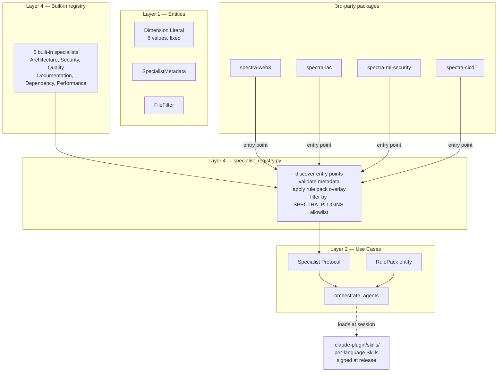

# ADR-017: Custom Rules + Plugin Architecture for Org-Specific Specialists

## Status

Proposed (2026-04-29)

## Context

The CTO's #4 platform ask ([cto-findings.md §5](../cto-findings.md), [product-roadmap.md #39 / #40](../product-roadmap.md)) is a plugin system that lets a 3rd-party ship a custom specialist as a pip package without forking Spectra. The Red Team's Hat 2 table ([redteam-findings.md](../redteam-findings.md)) names four net-new specialists buyers want — Web3, IaC, ML security, CI/CD — and twelve "prompt enrichments" to existing specialists. Both views converge on the same architecture: **specialists become plugins, prompts become versioned overlays, Skills package per-language/framework knowledge.**

The 6 hardcoded specialists in `src/spectra/infrastructure/agents/specialist_prompts.py` are the Strategy pattern's parameter list — they are *almost* a plugin system already. Three architectural questions need to be settled before the Q6 plugin work can land:

1. **What is the `Specialist` Protocol contract that 3rd-parties implement?** Get it wrong and either we fragment the ecosystem (different shape per language) or we leak Spectra internals.
2. **How do plugins discover themselves at runtime?** Python entry points are the obvious answer; the question is which entry-point group, what the manifest looks like, and how we sandbox a malicious plugin.
3. **How do versioned rule packs (YAML overlays on prompts + weights + thresholds) interact with the cache key?** Today `prompt_version = blake2b(prompt_text)` ([ADR-009](../../architecture/adr/ADR-009-batch-granularity-per-focus-area.md)). A rule-pack overlay must invalidate the cache *only* for the specialists it touches.

## Decision

Five commitments.

### 1. `Specialist` Protocol (Layer 2)

```python
# src/spectra/use_cases/interfaces.py — additive

class Specialist(Protocol):
    """A pluggable analysis specialist. The 6 built-in dimensions implement
    this Protocol; 3rd-party packages register more via entry points.
    """

    @property
    def name(self) -> str: ...                       # stable identifier, lowercase
    @property
    def dimension(self) -> Dimension: ...            # which dimension this contributes to
    @property
    def system_prompt(self) -> str: ...              # the analysis prompt
    @property
    def schema_version(self) -> SchemaVersion: ...   # bumped when output shape changes
    @property
    def file_filter(self) -> FileFilter: ...         # globs/extensions; gates whether this specialist runs
    @property
    def dimension_weight(self) -> float: ...         # 0.0-1.0; defaults from SPECIALIST_CONFIGS
    @property
    def enabled(self) -> bool: ...                   # gated by config or rule pack

    def estimate_tokens(self, batch: BatchPrompt) -> int: ...   # for budget allocation
```

The 6 built-in specialists (Architecture, Security, Quality, Documentation, Dependency, Performance) are refactored to implement this Protocol. They keep their identity but become discoverable via the same entry-point mechanism as 3rd-party plugins — there is no "first-class vs second-class" distinction in the runtime.

### 2. Entry-point discovery via `pyproject.toml`

Plugins register under the `spectra.specialists` entry-point group:

```toml
# Example 3rd-party plugin's pyproject.toml
[project.entry-points."spectra.specialists"]
web3 = "spectra_web3.specialist:Web3Specialist"
iac  = "spectra_iac.specialist:IaCSpecialist"
```

A new Layer-4 module `infrastructure/specialist_registry.py` discovers entry points at startup, instantiates each `Specialist`, validates the Protocol shape (Pydantic-validated `SpecialistMetadata`), and adds them to the orchestration set. The composition root injects the resulting `tuple[Specialist, ...]` into `orchestrate_agents`.

Discovery rules:

- **Strict allow-list in CI.** `SPECTRA_PLUGINS=web3,iac` env var (or the equivalent `.spectra.yml` field, see [ADR-020](ADR-020-config-file-yaml.md)) restricts the active plugin set. CI defaults to "no plugins unless declared." This closes the obvious "pip install installed a malicious specialist" attack.
- **Signature verification (Q6).** Plugins ship a Sigstore signature; `spectra plugin verify <name>` checks against the published Spectra plugin trust root. Unsigned plugins emit a warning at first use; CI mode rejects them.
- **Per-plugin `task_budget` cap.** Inherits from [ADR-013](ADR-013-task-budget-and-rate-coordination.md) — a malicious plugin cannot blow the cost ceiling.

### 3. Versioned rule packs — YAML overlay on prompts, weights, thresholds

A rule pack is a versioned YAML file (`.spectra-rules-v3.yaml`) that overlays prompt fragments, dimension weights, severity thresholds onto the active specialist set:

```yaml
# .spectra-rules.yaml — checked into the repo
version: v3
prompts:
  security:
    appended:
      - file: rules/jwt-none-algorithm.md
      - file: rules/oauth-scope-confusion.md
weights:
  security: 0.30        # bump from 0.25 default
thresholds:
  fail_on: critical
  warn_on: high
plugins:
  enabled: [web3, iac, cicd]
```

The orchestrator loads the rule pack at startup (precedence: project-local > org-default > built-in). The rule pack's content hash becomes part of the `prompt_version` derivation:

```python
prompt_version = blake2b(
    specialist.system_prompt + rule_pack.fragments_for(specialist.name)
).hexdigest()
```

Per-specialist `prompt_version` invalidates only the affected cache rows ([ADR-009](../../architecture/adr/ADR-009-batch-granularity-per-focus-area.md) composite key). The cache stays warm for unaffected dimensions when only one specialist's overlay changes.

### 4. Skill packs for per-language / per-framework knowledge

Skills ship as bundled directories under `.claude-plugin/skills/`:

```
.claude-plugin/skills/
├── spectra-public-knowledge/         # CVE feed, framework deprecations (memory persona M7)
├── spectra-python-patterns/          # Python-specific anti-patterns
├── spectra-javascript-patterns/
├── spectra-rust-patterns/
├── spectra-go-patterns/
├── spectra-aws-iac/
├── spectra-k8s-iac/
└── spectra-solidity/
```

Each Skill is a `SKILL.md` + supporting files. The Skills are loaded into the system prompt at session start when running on Managed Agents ([ADR-016](ADR-016-managed-agents-gateway.md)) or text-injected when running on `LLMGateway`. They are **content**, not code — no entry-point execution, no plugin runtime.

Skills are signed at release ([memory-second-brain-findings.md §5](../memory-second-brain-findings.md) #8) — `spectra memory doctor` verifies signatures on load. A tampered Skill cannot inject hostile "knowledge" into every scan.

### 5. Backward compatibility — the 6 built-ins are now just registered specialists

The current `SPECIALIST_CONFIGS` dict becomes a built-in registry that registers each of the 6 specialists exactly the way a 3rd-party would. There is **no breaking change** for users: `spectra analyze` with no plugins behaves identically to today.

The `Dimension` Literal stays at the existing 6 values — adding a new dimension is a Layer-1 entity-layer change ([cto-findings.md §5](../cto-findings.md) calls this out as XL effort and we keep it deferred). 3rd-party specialists must map their findings to one of the existing 6 dimensions. This is a deliberate constraint: it forces the ecosystem to work within the existing scoring model.



## Consequences

### Positive

- **Buyers ship their own specialists without forking.** A platform team's "internal-rules-v3" is a private package + a `.spectra-rules.yaml` overlay. Spectra never sees the source of the prompts.
- **Cache stays warm under plugin changes.** Only the affected specialist's `prompt_version` changes; other dimensions reuse cached findings. Critical for portfolio scanning where 312 services × 6 specialists × cold cache = unacceptable cost.
- **The dependency rule survives.** `Specialist` is a Layer-2 Protocol. Plugins are installed Python packages discovered at Layer 4. Use cases never import plugin code.
- **Skills compose cleanly with Managed Agents.** When [ADR-016](ADR-016-managed-agents-gateway.md) flips the default, Skills are mounted into the managed agent's session — the same content-as-data primitive works in both modes.
- **Built-ins lose no privileges.** They go through the same registry as plugins. Easier to test (`SpecialistRegistry.from_dict({...})` works for unit tests), easier to debug (one code path), easier to extend.

### Negative

- **Plugin trust is an operational concern.** A malicious specialist can read the workspace and exfil findings. We mitigate with the `SPECTRA_PLUGINS` allowlist (CI default = empty) and Sigstore signing. Customers in high-assurance environments will still need to vendor-review plugins.
- **Schema versioning per specialist becomes load-bearing.** A plugin that bumps its `schema_version` invalidates its own cache rows; failing to bump after an output shape change serves stale findings. We document this and add a `spectra plugin lint` command in Q6 that diffs `schema_version` against the previous git revision.
- **Rule packs invite YAML drift.** A repo with `.spectra-rules.yaml` v2 referencing a plugin not installed locally fails with a clear "plugin missing" error — but only at runtime. We add a `spectra rules validate` command that checks plugin availability at lint time.
- **The 6-dimension constraint is rigid.** Buyers who really want a new top-level dimension need entity-layer change. We accept this for v1; a 7th dimension is an XL, ADR-worthy change.

### Neutral

- The `SPECIALIST_CONFIGS` constant in `specialist_prompts.py` becomes a `BUILTIN_SPECIALISTS` registry function. Same data, different shape.
- Plugins inherit the `LLMGateway` (or `ManagedAgentGateway`) injection from the orchestrator — they do not pick their own API keys, do not pick their own model, and do not bypass the `RateCoordinatorPort` ([ADR-013](ADR-013-task-budget-and-rate-coordination.md)). This is enforced at the registry boundary.
- Rule packs are out-of-band data; they are not signed by default. Customers who need signed rule packs can use `spectra rules sign --key ...` (out of v1 scope; revisit per buyer demand).

## Alternatives Considered

| Alternative | Verdict |
|-------------|---------|
| **Plugin loaded as a Python module via `importlib`.** | Same outcome as entry points but with no manifest. Entry points give us discoverability, validation, and a clean uninstall story. |
| **Plugins as MCP servers only (no Python entry points).** | Future direction with [ADR-016](ADR-016-managed-agents-gateway.md), but Python entry points work for the legacy `LLMGateway` path too. We support both. |
| **Allow plugins to add new dimensions.** | Rejected for v1. The scoring + ScoreCard + report rendering are dimension-bound; a 7th dimension is an entity-layer change. Defer. |
| **Rule packs as JSON instead of YAML.** | Rejected. YAML is the format buyers already author for `.spectra-policy.yml` ([product-roadmap.md #17](../product-roadmap.md)) — keep it consistent. |
| **One global `prompt_version` for all specialists.** | Rejected. Bumping any one prompt invalidates the entire cache. Per-specialist `prompt_version` is the correct granularity. |
| **No plugin allowlist; trust whatever pip installs.** | Rejected. CI environments need a positive declaration of plugins; otherwise a malicious transitive install runs in every scan. |
| **Hardcode the 4 vertical specialists (Web3, IaC, ML, CI/CD) directly into Spectra.** | Rejected. Forces every user to pay the cost of every specialist. Plugin model lets buyers opt in to what they need ([product-roadmap.md Conflict 3](../product-roadmap.md)). |

## Implementation effort

**M-L (10-15 days, Q6).** Breakdown: `Specialist` Protocol + `SpecialistMetadata` + `RulePack` entities (S, ~1 day); refactor 6 built-ins to implement Protocol (M, ~2 days); `specialist_registry.py` with entry-point discovery + allowlist + Sigstore verify (M, ~3 days); `RulePack` loader + per-specialist `prompt_version` derivation + cache integration (M, ~2 days); `spectra plugin list|verify`, `spectra rules validate|lint` CLI subcommands (M, ~2 days); 4 vertical-specialist sample plugins (Web3, IaC, ML, CI/CD) shipped as separate packages (L, ~5 days — content work, not architecture).

## References

- Code: `src/spectra/infrastructure/agents/specialist_prompts.py` — current `SPECIALIST_CONFIGS`; refactor target
- Code: `src/spectra/infrastructure/agents/specialist_agent.py` — parameterized specialist class
- Code: `src/spectra/use_cases/orchestrate_agents.py` — currently iterates over hardcoded role list
- Code: `src/spectra/entities/enums.py` — `Dimension` Literal (stays at 6)
- Findings: [`docs/strategy/cto-findings.md`](../cto-findings.md) §5 (custom rules), §6 (build vs buy)
- Findings: [`docs/strategy/redteam-findings.md`](../redteam-findings.md) Hat 2 table
- Roadmap: [`docs/strategy/product-roadmap.md`](../product-roadmap.md) Q6 (capabilities #39-#49), Conflict 3
- Related: [ADR-009](../../architecture/adr/ADR-009-batch-granularity-per-focus-area.md) — `prompt_version` derivation extends here
- Related: [ADR-013](ADR-013-task-budget-and-rate-coordination.md) — plugins inherit cost guards
- Related: [ADR-016](ADR-016-managed-agents-gateway.md) — Skills mount into managed-agent sessions
- Related: [ADR-020](ADR-020-config-file-yaml.md) — `.spectra.yml` carries `plugins.enabled` allowlist

---

*Last updated: 2026-04-29.*
