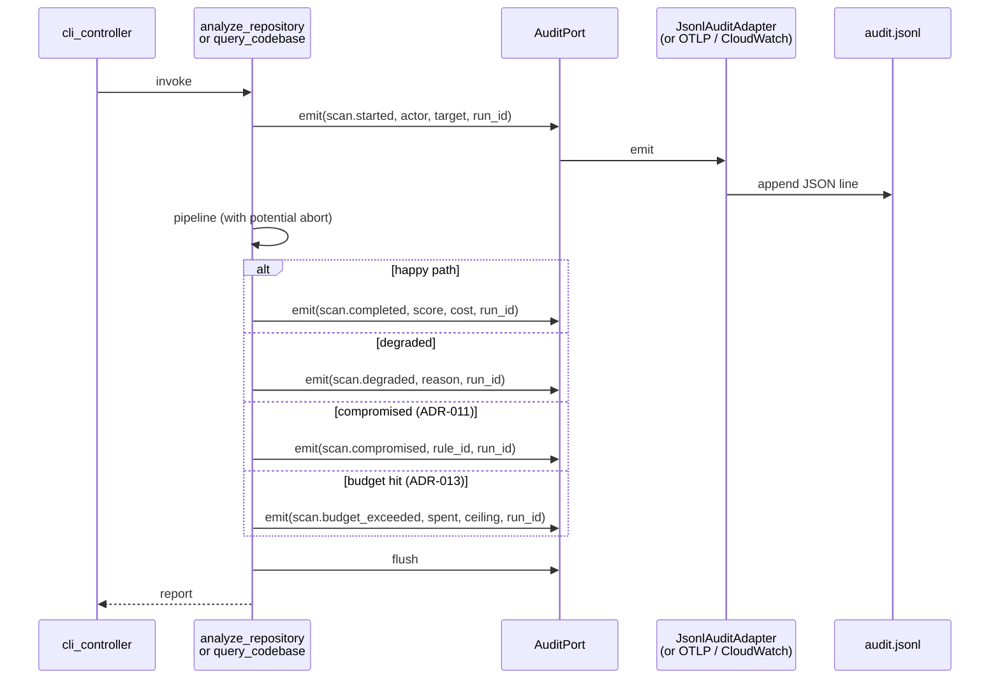

# ADR-018: Audit Log + Identity

## Status

Accepted (2026-04-30) — audit log + identity shipped (v0.6.0)

## Context

The CISO ([ciso-findings.md §2](../ciso-findings.md)) makes audit a hard procurement gate. SOC 2 CC7.2 / CC7.3, HIPAA 164.312(b), ISO 27001 A.8.15 — every framework wants the same thing: who ran what, when, against what, with what outcome. Today Spectra's only audit signal is a `hit_log` table for cache telemetry (`cache_adapter.py`). There is no structured event for "scan started," "scan completed," "scan degraded," "memory write," "cache MAC mismatch," "Q&A asked."

Three architectural questions need to be answered:

1. **Identity — where does it come from when there is no Spectra-operated control plane?** The product is CLI-only ([product-roadmap.md TL;DR](../product-roadmap.md)); we cannot mint identities ourselves.
2. **Sink — where do audit events go?** A regulated org has a Splunk; an OSS user has a file; a curious developer has stdout. One sink does not fit.
3. **Retention + privacy boundary.** Audit events contain `repo_signature`, finding counts, cost — the obvious privacy questions are around question text ([ADR-015](ADR-015-query-codebase-use-case.md)) and finding excerpts.

## Decision

Four commitments.

### 1. `AuditPort` Protocol + `AuditEvent` entity

```python
# src/spectra/use_cases/interfaces.py — additive

class AuditPort(Protocol):
    """Append-only structured event sink. Adapters route to file, syslog,
    OTLP, Splunk HEC, or CloudWatch.
    """

    async def emit(self, event: AuditEvent) -> None: ...
    async def flush(self) -> None: ...
```

```python
# src/spectra/entities/models.py — additive, frozen

AuditEventType = Literal[
    "scan.started", "scan.completed", "scan.degraded", "scan.compromised",
    "scan.budget_exceeded", "memory.write", "memory.forget", "memory.query",
    "cache.mac_mismatch", "cache.cleared",
    "report.classification_changed", "rule_pack.loaded", "plugin.loaded",
    "auth.identity_resolved",
]

class AuditEvent(BaseModel, frozen=True):
    event_id: str                       # UUIDv7 — sortable, globally unique
    ts: datetime                        # UTC
    event: AuditEventType
    actor: Identity                     # who
    target: AuditTarget                 # what (repo_signature, memory key, etc.)
    payload: dict[str, str | int | float | bool]   # bounded primitives, no nested
    spectra_version: str
    run_id: str | None                  # links event to a scan or query
```

`payload` is a flat dict of primitive types — no nested structures, no free-form text > 500 chars. This bounds row size and keeps SIEM ingestion cheap.

### 2. Identity resolution — env > git > OIDC > hostname

`Identity` is a frozen entity:

```python
class Identity(BaseModel, frozen=True):
    actor: str                          # human-readable: "alice@example.com" or "ci:gh-actions:org/repo"
    source: Literal["env", "git", "oidc", "hostname"]
    confidence: Literal["high", "medium", "low"]   # high = OIDC; medium = env or git; low = hostname
```

The `IdentityResolver` (Layer 2 use case helper) resolves once per process at startup, with explicit precedence:

1. **`SPECTRA_USER_ID` env var** (`actor=value, source=env, confidence=medium`). Set by enterprise wrappers; explicit.
2. **OIDC token in CI** (`source=oidc, confidence=high`). When `GITHUB_ACTIONS=true` and an OIDC token is fetched, `actor = "ci:gh-actions:{repository}@{ref}"` from the token claims. GitLab CI, Bitbucket, generic OIDC providers covered analogously.
3. **`git config user.email`** (`source=git, confidence=medium`). The dev-laptop default. Set by `git config --global user.email`; not user-provided per command.
4. **Hostname fallback** (`actor=f"unknown@{platform.node()}", source=hostname, confidence=low`). Last-resort for headless / malformed environments. Audit reviewers see "low confidence" and know to dig deeper.

The resolver emits an `auth.identity_resolved` event on every startup so the audit trail itself is auditable.

We deliberately do not require OIDC. Spectra is CLI-only ([product-roadmap.md TL;DR](../product-roadmap.md)); requiring OIDC would force a control plane we are not building. Customers who need stronger identity wire it via `SPECTRA_USER_ID` from their own auth flow.

### 3. Adapter trio — file (default), OTLP, CloudWatch

```
src/spectra/infrastructure/audit/
├── __init__.py
├── jsonl_adapter.py             # default — append to file or stdout
├── otlp_adapter.py              # OpenTelemetry Logs OTLP
└── cloudwatch_adapter.py        # AWS CloudWatch Logs (boto3 dependency, optional extra)
```

| Adapter | Sink | Use case | Default? |
|---------|------|----------|----------|
| `JsonlAuditAdapter` | File at `${XDG_STATE_HOME:-~/.local/state}/spectra/audit.jsonl` (or `path` from config) | OSS users, single-machine devs, stdout for testing | Yes |
| `OtlpAuditAdapter` | OpenTelemetry Logs collector | Most enterprises (Honeycomb, Datadog, Splunk via OTel collector, custom SIEM) | No (set via config) |
| `CloudWatchAuditAdapter` | AWS CloudWatch Logs | AWS-native customers; FedRAMP shops with CloudWatch as the IL2/IL4 sink | No (optional extra `pip install spectra-ai[aws]`) |

Composition root selects via `SPECTRA_AUDIT_BACKEND` env var or `.spectra.yml` `audit.backend` field ([ADR-020](ADR-020-config-file-yaml.md)). The use case never knows which adapter is wired; it calls `audit.emit(event)`.

Splunk HEC, syslog, and file-via-rsyslog are reachable via the OTLP collector — we do not ship native adapters for each. This matches the CISO's "JSON Lines audit emission with pluggable sinks" framing ([product-roadmap.md TL;DR](../product-roadmap.md) #2).

### 4. Privacy boundary — never log content, always log signatures

| What we log | What we never log |
|-------------|-------------------|
| `repo_signature` (blake2b hash of file tree) | Repo URL, file paths, code excerpts |
| `finding_signature` (blake2b hash of file_path + rule_id + severity) | Finding title, description, recommendation |
| `actor` (email or CI ref) | Personal data beyond what the actor field already implies |
| `cost_usd`, `tokens_in`, `tokens_out` | API key, model output |
| Question prefix (≤500 chars) for `memory.query` | Full question (lives in `decision_log` per [ADR-015](ADR-015-query-codebase-use-case.md)) |
| Cache MAC fingerprint (first 8 chars) for mismatch events | Full MAC, secret material |
| `pipeline_state`, `degraded_reason` ([ADR-011](ADR-011-prompt-injection-isolation.md)) | Full critique reasoning |

`AuditPort` adapters MUST refuse `payload` keys named `code`, `content`, `secret`, `key`, `token`, `body` — enforced at the adapter boundary. Tests verify the refusal.

Default retention: 365 days for the file adapter (rotation via `logrotate` or platform default). OTLP and CloudWatch retention is owned by the customer's collector. We document this; we do not enforce it.



## Consequences

### Positive

- **One CISO question gets one answer.** "Where is the audit log?" → "Wherever your collector sinks it; we emit JSON Lines on every state transition." This unblocks SOC 2 CC7.2 conversations on day one.
- **No control plane required.** The CLI-only commitment ([product-roadmap.md TL;DR](../product-roadmap.md)) survives — identity is resolved from the existing environment, audit goes to the customer's existing pipeline.
- **Privacy boundary is enforced at the adapter, not by convention.** The list of forbidden payload keys is one place to audit; tests verify the refusal. A future reviewer can grep for the constant and trust it.
- **Cross-references for free.** `run_id` ties scan events to memory writes to cost rows to cache lookups. An auditor can reconstruct one scan's full lifecycle from the audit log.
- **The compromised-pipeline state ([ADR-011](ADR-011-prompt-injection-isolation.md)) becomes operationally visible.** A `scan.compromised` event in the SIEM lights up an alert; without this, prompt-injection detection is invisible to security ops.

### Negative

- **Identity is best-effort, not authoritative.** `SPECTRA_USER_ID` from env can be lied about. We mark it `confidence=medium` so the auditor knows. OIDC in CI is the high-confidence path; we cannot enforce OIDC outside CI.
- **OTLP collector is operational dependency.** Customers must run one. We document the collector setup in the README; the burden is real but unavoidable for the SIEM-native value prop.
- **`audit.jsonl` grows unbounded by default.** Documented; we point at `logrotate`. Adding rotation logic to Spectra would reproduce a wheel that exists everywhere.
- **`memory.query` events mean every Q&A is logged.** Bounded by the 500-char question prefix. Customers with extreme privacy needs can disable Q&A audit via `audit.events.exclude: [memory.query]` in `.spectra.yml`.

### Neutral

- The `event_id` is UUIDv7 — sortable, globally unique. Replaces a per-event database sequence we would otherwise need.
- `AuditEvent` payload uses `dict[str, primitive]` (not `dict[str, Any]`) — this is enforced at Pydantic validation. Keeps SIEM mapping deterministic.
- The adapter trio matches [ADR-014](ADR-014-anthropic-memory-stores-for-team-org.md) shape — composite at the composition root, one Protocol, three implementations. Same testing discipline.

## Alternatives Considered

| Alternative | Verdict |
|-------------|---------|
| **Build a Spectra-operated control plane that owns identity and audit.** | Rejected per [product-roadmap.md TL;DR](../product-roadmap.md) — CLI-only. The CISO's audit ask does not require a control plane; emitting structured events to the customer's stack is sufficient. |
| **Require OIDC for all events.** | Rejected. Forces a heavy dependency on dev laptops with no equivalent identity provider. Best-effort with explicit confidence is honest. |
| **Log to a single SQLite table** (`audit_log` next to `cache.db`). | Rejected. Local SQLite is not a SIEM. We do log to a local file by default, but adapters route to where customers actually look (their own collector). |
| **Include findings JSON in audit events for "complete provenance."** | Rejected. Findings text contains source code excerpts. The audit log goes to a collector; we do not push code into a collector. Findings live in the report; audit references the `finding_signature`. |
| **Native Splunk HEC adapter, native syslog adapter, native datadog adapter.** | Rejected. OTLP collector solves all three with one adapter on our side. We do not maintain N×M adapter combinations. |
| **No identity at all — just `actor=null` always.** | Rejected. Even low-confidence `unknown@hostname` is more useful than null for incident response and is what compliance frameworks expect. |
| **Sign every audit event with an Ed25519 chain (tamper-evident log).** | Aligned with the Q2 signed scan receipt ([product-roadmap.md #57](../product-roadmap.md)) but separate work. The audit log itself is append-only; tamper-evidence is the *receipt*'s job, not every event's job. Revisit if a customer asks. |

## Implementation effort

**M (5-7 days).** Breakdown: `AuditEvent` + `Identity` + `AuditTarget` entities with payload-type validation (S, ~1 day); `AuditPort` Protocol + `IdentityResolver` use-case helper (S, ~1 day); `JsonlAuditAdapter` + privacy-key refusal + tests (S, ~1 day); `OtlpAuditAdapter` (M, ~2 days); `CloudWatchAuditAdapter` as optional extra (S, ~1 day); orchestrator + memory + cache + Q&A wiring of emit calls (S, ~1 day).

## References

- Code: `src/spectra/infrastructure/cache_adapter.py:hit_log` — only existing audit-shaped table; AuditPort supplements (not replaces) it
- Code: `src/spectra/use_cases/analyze_repository.py` — emit `scan.*` events at lifecycle points
- Code: `src/spectra/entities/errors.py` — error codes already cover the failure events; audit emits them as structured events
- Findings: [`docs/strategy/ciso-findings.md`](../ciso-findings.md) §2 (audit), §3 (compliance), §4 (waivers reference audit)
- Findings: [`docs/strategy/cto-findings.md`](../cto-findings.md) §3 (cost attribution per team — falls out of audit)
- Roadmap: [`docs/strategy/product-roadmap.md`](../product-roadmap.md) capability #12 (RICE 78, Q2), #57 (signed receipt)
- Related: [ADR-011](ADR-011-prompt-injection-isolation.md) — emits `scan.compromised` events
- Related: [ADR-013](ADR-013-task-budget-and-rate-coordination.md) — emits `scan.budget_exceeded` events
- Related: [ADR-014](ADR-014-anthropic-memory-stores-for-team-org.md) — emits `memory.*` events
- Related: [ADR-015](ADR-015-query-codebase-use-case.md) — emits `memory.query` events
- Related: [ADR-012](ADR-012-cache-hmac-per-user-namespace.md) — emits `cache.mac_mismatch` events
- OpenTelemetry: Logs Data Model (OTLP)

---

*Last updated: 2026-04-29.*
