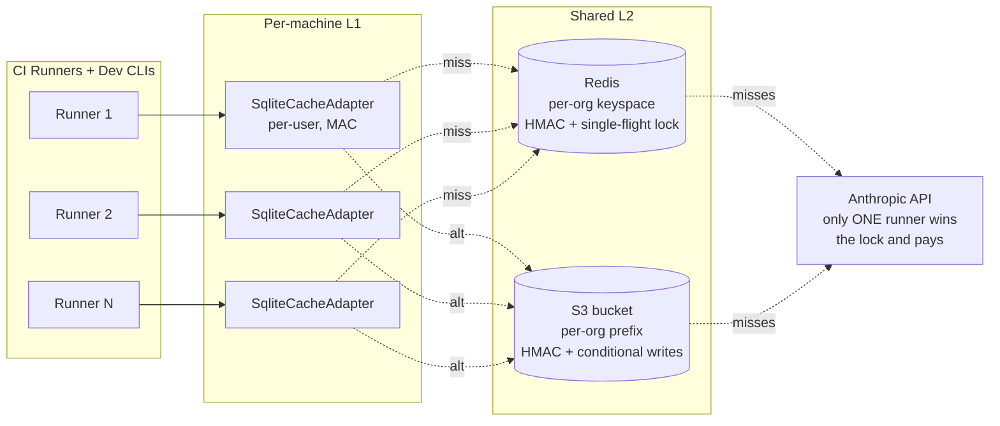

# ADR-019: Distributed Cache Adapters (Redis + S3)

## Status

Proposed (2026-04-29)

## Context

The CTO's #1 platform ask ([cto-findings.md §1](../cto-findings.md)) is a distributed cache. Today `SqliteCacheAdapter` is per-machine. Fifty engineers on the same team scanning the same set of services do not share each other's cache; CI runners with ephemeral workspaces start cold every time. The product roadmap ranks this RICE 70 in Q3 ([product-roadmap.md #21](../product-roadmap.md)).

The architecture is favourable: `CachePort` ([ADR-006](../../architecture/adr/ADR-006-cache-port-incremental-analysis.md)) is the contract; the SQLite adapter is one implementation. Two questions need to be settled:

1. **Which backend is the recommended default for teams?** Redis (low latency, requires infrastructure) or S3 (zero infrastructure for any AWS shop, higher latency).
2. **Multi-writer concurrency.** When 50 PRs land at once and 50 CI runners cold-cache the same set of files, how do we avoid stampedes (every runner runs the same expensive Anthropic call)?

## Decision

Three commitments.

### 1. Two new adapters, both implementing the existing `CachePort` Protocol

```
src/spectra/infrastructure/cache/
├── __init__.py
├── sqlite_adapter.py        # existing — local default
├── redis_adapter.py         # NEW — recommended for teams
├── s3_adapter.py            # NEW — recommended for compliance-friendly + zero-infra
└── tiered_adapter.py        # NEW — composes Sqlite (L1) + Redis/S3 (L2)
```

The `CachePort` Protocol stays exactly as-is. No breaking change for existing users — `SqliteCacheAdapter` remains the single-user default.

**`RedisCacheAdapter` schema:**

- Per-row keys: `spectra:cache:findings_batches:{namespace}:{batch_id}:{dimension}:{prompt_v}:{model_v}:{schema_v}:{spectra_v}` → MessagePack-serialized findings tuple.
- TTL: configurable, default 30 days. Redis handles eviction; no `cache prune` cron needed.
- HMAC: every value is MAC-protected per [ADR-012](ADR-012-cache-hmac-per-user-namespace.md), with the key derived from a per-org secret stored in keyring (single-machine) or AWS Secrets Manager / Vault (CI fleet).
- Hot-key rate limiting: re-uses `RateCoordinatorPort` ([ADR-013](ADR-013-task-budget-and-rate-coordination.md)) for the same Redis instance.

**`S3CacheAdapter` schema:**

- Per-row objects: `s3://{bucket}/{prefix}/{namespace}/{batch_id}/{dimension}/{prompt_v}-{model_v}-{schema_v}-{spectra_v}.msgpack`.
- Lifecycle policy: customer-managed (typically 30-day expiration via S3 Lifecycle Rules).
- HMAC: same per-row contract, secret in AWS SM.
- Concurrency: S3 conditional writes (`If-None-Match: *`) prevent the lost-update problem on the same key. Different writers attempting the same key see one win — the others discard.

### 2. Recommended default for teams: **Redis as L2 with SQLite as L1 (`TieredCacheAdapter`)**

The default team configuration is a tiered adapter:

```python
# composition root (Layer 4)
cache = TieredCacheAdapter(
    l1=SqliteCacheAdapter(per_user_path),
    l2=RedisCacheAdapter(REDIS_URL),
    write_policy="write-through",     # L1 + L2 on every put
    read_policy="l1-then-l2",         # check L1 first; promote on L2 hit
)
```

| Behaviour | Where | Cost |
|-----------|-------|------|
| Lookup | L1 (~50µs SQLite) → L2 (~2ms Redis) on miss → fresh Anthropic call on miss-miss | L1 hit free; L2 hit ~2ms; miss ~3-30s |
| Write | L1 (always) + L2 (always, async — fire-and-forget with retry) | Negligible local; ~2ms Redis on write-back |
| Eviction | L1 honours `spectra cache prune`; L2 honours Redis TTL | None to operate |

**Why Redis as the recommended default for teams:**

- Latency: ~2ms vs S3's ~50ms-200ms. For 50 batches × 6 dimensions = 300 cache lookups per scan, the latency gap is 15s vs 0.6s. Cache lookups should be invisible.
- Distributed lock primitives (single-flight, see #3 below) are first-class in Redis.
- Re-uses the same Redis instance as `RateCoordinatorPort` ([ADR-013](ADR-013-task-budget-and-rate-coordination.md)) — one piece of infrastructure for two ports.

**Why S3 stays first-class anyway:**

- Zero infrastructure for AWS shops — every customer already has an S3 bucket and IAM.
- Compliance-friendly: bucket-level encryption, object-lock, audit via CloudTrail. No new compliance footprint.
- The right answer for read-mostly portfolio workloads where 50 PRs/day → 1 weekly portfolio scan, not the inverse.

The customer picks via `.spectra.yml` ([ADR-020](ADR-020-config-file-yaml.md)):

```yaml
cache:
  l1: sqlite
  l2: redis        # or "s3" or "none"
  redis_url: ${REDIS_URL}
  s3_bucket: spectra-cache-prod
  s3_prefix: org-acme/
```

### 3. Single-flight to prevent stampedes

When 50 CI runners cold-cache the same `(batch_id, dimension)` simultaneously, the naive design has 50 Anthropic calls for the same work. Single-flight collapses to 1 call + 49 waiters:

```python
# RedisCacheAdapter.get_or_compute(key, compute_fn)
lock_key = f"{key}:lock"
got_lock = await redis.set(lock_key, run_id, nx=True, px=120_000)   # 2-minute lease

if got_lock:
    result = await compute_fn()                # only one runner does the LLM call
    await self.put(key, result)
    await redis.delete(lock_key)
    return result
else:
    # wait, then read the cache
    return await self._wait_for_key(key, timeout_s=120)
```

The S3 adapter uses S3's conditional writes (`PutObject` with `If-None-Match: *`) plus a small DynamoDB or filesystem-marker fallback for the lock; in practice S3-backed teams accept some duplicate work because their write rate is low.

`SqliteCacheAdapter` does not need single-flight — it serves one process. `TieredCacheAdapter` delegates single-flight to L2 (where the contention actually is).



### 4. Migration: existing SQLite users keep working

Existing `~/.cache/spectra/$UID/cache.db` users are unaffected — the default stays SQLite-only. Switching to tiered requires explicit `.spectra.yml` config or `--cache-backend redis|s3` CLI flag. No automatic upgrade, no schema migration in the existing SQLite cache.

When a user opts into tiered, their L1 SQLite stays as-is. The L2 cache populates incrementally as scans run; there is no bulk-import. This is the same warm-cache philosophy as [ADR-012](ADR-012-cache-hmac-per-user-namespace.md).

## Consequences

### Positive

- **Teams stop redoing each other's work.** A 50-engineer org sharing a Redis sees the cache hit rate climb from ~30% (per-laptop) to ~85% (shared). The Anthropic bill drops accordingly.
- **CI runners become warm-cache.** Every PR scan reads its predecessors' findings on shared files; only PR-touched files miss. The "every PR is a cold scan" cost vanishes.
- **`CachePort` Protocol survives unchanged.** [ADR-006](../../architecture/adr/ADR-006-cache-port-incremental-analysis.md) and [ADR-009](../../architecture/adr/ADR-009-batch-granularity-per-focus-area.md) compose perfectly with the new adapters — composite key, atomic `bind_run_context`, MAC contract all reused.
- **Single-flight kills the stampede.** 50 simultaneous PRs on the same monorepo file → 1 Anthropic call instead of 50. Direct cost saving.
- **Two backend choices match the two real customer profiles.** Redis for low-latency / dev-loop teams; S3 for compliance / zero-infra orgs. No false universal default.

### Negative

- **L2 = real infrastructure.** Customers must run Redis or maintain an S3 bucket. We ship a docker-compose snippet for Redis and a CloudFormation template for S3; the burden is real but bounded.
- **MAC contract becomes per-org instead of per-user.** Teams need a shared secret, which lives in their secret manager (AWS SM, Vault, or in-cluster K8s secret). We document the rotation playbook.
- **Single-flight has a 2-minute upper bound.** A real LLM call that takes > 2 minutes (`asyncio.wait_for(timeout=120)` per agent — [CLAUDE.md](../../../CLAUDE.md)) lets the lock expire and a second call fire. Acceptable: at our timeout horizon we already abort the call. The wasted work is bounded at 1 duplicate per dimension per timeout.
- **L2 outages degrade to L1-only.** When Redis is down, `TieredCacheAdapter` opens a circuit breaker and serves only from L1. SPEC-010 contract holds — cache failures never abort the pipeline.

### Neutral

- Tiered cache is a deliberately simple composition — it does not invent a new Protocol; it delegates. Same testing surface as the underlying adapters.
- S3 adapter's `If-None-Match` plus filesystem-marker single-flight is a known pattern. We import nothing fancy.
- Per-org secret rotation invalidates the entire L2 cache (HMAC mismatch on every row). This is intentional — secret rotation is a security event; cold-cache cost is acceptable.
- For solo developers, `RedisCacheAdapter` running locally on Docker is one `docker compose up` away. We document this for power users who want single-flight even for solo usage (e.g. running 5 parallel scans by hand).

## Alternatives Considered

| Alternative | Verdict |
|-------------|---------|
| **Redis-only — drop S3.** | Rejected. AWS-shop customers without Redis hate "install a new service" asks. S3 wins for them. |
| **S3-only — drop Redis.** | Rejected. Latency sinks the dev-loop story. 300 cache lookups × 100ms = 30s overhead per scan, unacceptable. |
| **Postgres as the L2.** | Rejected. Schema, migrations, connection pooling — ops surface for no benefit over Redis (which we already need for [ADR-013](ADR-013-task-budget-and-rate-coordination.md) rate coordination). |
| **Memcached.** | Rejected. No persistence, no single-flight primitives, no Lua. Redis covers everything Memcached does plus more. |
| **Bypass L1 when L2 is configured.** | Rejected. L1 is ~50µs vs L2's ~2ms — that 40× gap matters when an analyze run has 300 cache lookups. Tiered is strictly better. |
| **Skip single-flight; let Anthropic absorb the duplicate calls.** | Rejected. Direct money on the table; ~10× cost on cold portfolio scans. Single-flight is 30 lines of Lua. |
| **Build a Spectra-operated cache service (SaaS).** | Rejected per [product-roadmap.md TL;DR](../product-roadmap.md). Customer brings the infrastructure; we ship the adapters. |
| **Use Anthropic's Memory Stores as the cache.** | Rejected. Memory Stores are for stable model context, not for finding-result caching with composite-key invalidation. Wrong tool. |

## Implementation effort

**M (6-9 days).** Breakdown: `RedisCacheAdapter` with HMAC + single-flight Lua + circuit breaker (M, ~3 days); `S3CacheAdapter` with conditional-write single-flight (M, ~2 days); `TieredCacheAdapter` composition + read/write policies (S, ~1 day); secret rotation playbook + per-org keyring + AWS SM adapter for the secret (S, ~1 day); load test (50 simulated runners on monorepo) + stampede regression test (M, ~2 days).

## References

- Code: `src/spectra/use_cases/interfaces.py` — `CachePort` Protocol (unchanged)
- Code: `src/spectra/infrastructure/cache_adapter.py` — `SqliteCacheAdapter` (unchanged; becomes the L1 default)
- Findings: [`docs/strategy/cto-findings.md`](../cto-findings.md) §1 (distributed cache), §6 (build vs buy)
- Findings: [`docs/strategy/redteam-findings.md`](../redteam-findings.md) §S3 (cloud-cache poisoning) — addressed by per-org HMAC
- Roadmap: [`docs/strategy/product-roadmap.md`](../product-roadmap.md) capability #21 (RICE 70, Q3), #22 (fleet rate)
- Related: [ADR-006](../../architecture/adr/ADR-006-cache-port-incremental-analysis.md) — `CachePort` Protocol that all adapters implement
- Related: [ADR-009](../../architecture/adr/ADR-009-batch-granularity-per-focus-area.md) — composite key + atomic bind, reused in L2
- Related: [ADR-012](ADR-012-cache-hmac-per-user-namespace.md) — MAC contract extends to L2
- Related: [ADR-013](ADR-013-task-budget-and-rate-coordination.md) — Redis is the same dep
- Related: [ADR-018](ADR-018-audit-log-and-identity.md) — cache events route to AuditPort

---

*Last updated: 2026-04-29.*
