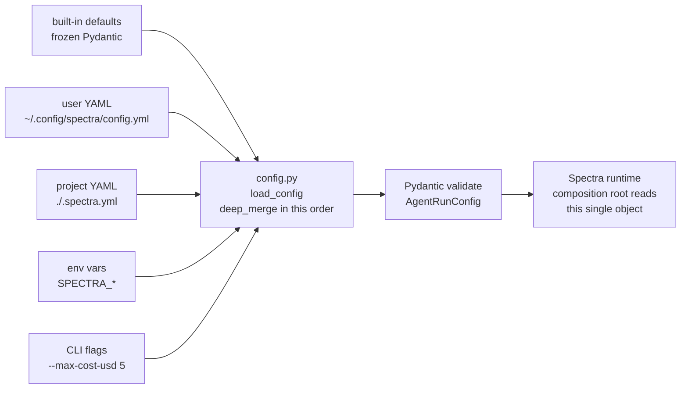

# ADR-020: `--config-file` + Portable YAML Config (Deferred from PR #32)

## Status

Accepted (2026-04-30) — portable YAML config shipped

## Context

Power users have been asking for a checked-in config file for the better part of two minor releases. The existing CLI has 16 flags spread across `analyze`, `cache`, and (soon) `ask`, `memory`, `plugin`, `rules`. Each new ADR in this batch adds more — `--max-cost-usd`, `--max-cost-usd-per-day` ([ADR-013](ADR-013-task-budget-and-rate-coordination.md)), `--cache-backend` ([ADR-019](ADR-019-distributed-cache-adapters.md)), `--audit-backend` ([ADR-018](ADR-018-audit-log-and-identity.md)), `--memory-org-id` ([ADR-014](ADR-014-anthropic-memory-stores-for-team-org.md)), `--plugins web3,iac` ([ADR-017](ADR-017-custom-rules-plugin-architecture.md)). The flag explosion is real and `.spectra.yml` is the obvious answer — deferred from PR #32 because it touched too many surfaces at once.

The CTO's `.spectra-policy.yml` ([cto-findings.md §5](../cto-findings.md), [product-roadmap.md #17](../product-roadmap.md)) is *adjacent* to this work but architecturally distinct: that file expresses *org governance* (severity gates, required dimensions, allowed waiver authors). This ADR covers *runtime config* (which models, which cache backend, which budgets). Both can coexist; the policy file enforces the YAML config, but the YAML config does not enforce policy.

Three architectural questions:

1. **What is the schema?** Pydantic for validation; what are the top-level sections?
2. **What is precedence between sources?** A clean rule beats a complicated rule.
3. **How do we keep the YAML and CLI in sync without writing every option twice?**

## Decision

Three commitments.

### 1. Schema: top-level sections matching the new ports

```yaml
# .spectra.yml — checked into the repo (or ~/.config/spectra/config.yml)
version: 1                            # config schema version, not Spectra version

models:
  metaprompter: claude-opus-4-7
  specialists: claude-opus-4-7
  critique:    claude-opus-4-7

effort:
  metaprompter: medium
  specialists:  xhigh
  critique:     high

task_budget:                          # ADR-013
  metaprompter:        8000
  architecture:        60000
  security:            60000
  quality:             50000
  documentation:       30000
  dependency:          40000
  performance:         50000
  critique:            80000

cost:                                 # ADR-013
  max_per_run_usd: 20.00
  max_per_day_usd: 100.00

cache:                                # ADR-019
  l1: sqlite                          # always
  l2: redis                           # or "s3" or "none"
  redis_url: ${REDIS_URL}
  s3_bucket: spectra-cache-prod
  s3_prefix: org-acme/

audit:                                # ADR-018
  backend: jsonl                      # jsonl | otlp | cloudwatch | none
  jsonl_path: ${XDG_STATE_HOME}/spectra/audit.jsonl
  otlp_endpoint: http://localhost:4318/v1/logs
  events:
    exclude: []                       # e.g. [memory.query] for high-privacy

memory:                               # ADR-014
  org_id: acme                        # required for team/org tier
  developer_id: auto                  # auto = blake2b(getpass.getuser())
  backend:
    repo: local
    developer: anthropic-memory-tool
    org: anthropic-memory-stores
  fallback: local                     # if Anthropic unreachable

plugins:                              # ADR-017
  enabled: [web3, iac, cicd]          # explicit allowlist
  rules_file: .spectra-rules.yaml

rate:                                 # ADR-013
  coordinator: redis
  redis_url: ${REDIS_URL}
  per_minute: 50                      # Anthropic Tier-N RPM

classification:                       # product-roadmap #56 (Q2)
  default: confidential               # confidential | public

execution:                            # ADR-016 (Q5+)
  mode: local                         # local | managed
```

Implemented as a frozen Pydantic model `AgentRunConfig` (Layer 1) — extends the existing `AgentRunConfig` rather than replacing it. Every field has a sensible default; an empty file produces a working Spectra.

`${ENV_VAR}` interpolation is supported (one pass; no nested expansion). Done at config-load time, not per-call.

### 2. Precedence: CLI > env > project YAML > user YAML > defaults

```
1. CLI flag         (e.g. --max-cost-usd 5)
2. Environment var  (e.g. SPECTRA_COST_MAX_PER_RUN=5)
3. Project YAML     (./.spectra.yml in the repo or its parents up to git root)
4. User YAML        (${XDG_CONFIG_HOME:-~/.config}/spectra/config.yml)
5. Built-in default
```

Each level is **fully merged**, not replaced. A CLI flag that sets `cache.l2 = none` does not also reset `cache.l1`. The merge happens at config-load time in `infrastructure/config.py`:

```python
def load_config(cli_overrides: dict, env: Mapping) -> AgentRunConfig:
    merged = _DEFAULTS
    merged = _deep_merge(merged, _load_yaml_or_empty(_user_config_path()))
    merged = _deep_merge(merged, _load_yaml_or_empty(_find_project_yaml()))
    merged = _deep_merge(merged, _from_env(env))
    merged = _deep_merge(merged, cli_overrides)
    return AgentRunConfig.model_validate(merged)
```

The project YAML is searched starting at `cwd` and walking up to the git repository root (or filesystem root if not in a git repo). First `.spectra.yml` found wins; we do not concatenate.

### 3. Validation: same Pydantic model as the CLI; no string-typed config

Every config field has a Pydantic-validated type (`Literal`, `int`, `float`, `Url`, etc.). An invalid YAML produces a structured error with the exact field path:

```
✗ Config error in /path/to/.spectra.yml at cache.l2:
   Expected one of: sqlite, redis, s3, none — got: redis-cluster
```

The CLI controller (`spectra config validate [path]`) is the validator entry point — runs before any other command and prints the merged config (with secrets redacted) when called as `spectra config show`.

Migration: nothing to migrate. Existing users without `.spectra.yml` see no change. `spectra config init` writes a commented-out template to `.spectra.yml` for users who want to start.



## Consequences

### Positive

- **CLI flag count stops growing.** New ADRs add YAML fields; CLI flags only when worth a dedicated UX surface (e.g. `--no-cache`, `--quick`, `--format`).
- **Reproducible scans.** Checked-in `.spectra.yml` means CI runs and dev runs share configuration. No more "works on my machine" because someone forgot a flag.
- **One mental model.** Every new port (cache, audit, memory, rate) gets a section. Engineers learn the structure once.
- **Org-wide defaults via user YAML.** Sysadmins can pre-provision `~/.config/spectra/config.yml` on dev images; users override per-project with `.spectra.yml`.
- **The precedence rule is dictate-able.** "CLI > env > project > user > default" is one sentence in the README.

### Negative

- **YAML is not the friendliest format.** Indentation errors, anchor confusion. We mitigate with `spectra config validate` and a published JSON Schema (Q5 — drives IDE autocomplete in VSCode/Cursor).
- **The schema is now load-bearing.** A breaking change to a section requires a `version` bump and a migration helper. We cap this at one major-version-of-Spectra per schema-version-of-config.
- **Env-var interpolation has security implications.** Logging or printing the merged config could leak secrets. `spectra config show` always redacts fields whose path matches `*url*`, `*key*`, `*secret*`, `*token*`.
- **A bad checked-in `.spectra.yml` breaks every CI run for the org.** We document `.spectra.yml.lock` (a hash of the active config) in the audit event for `scan.started` ([ADR-018](ADR-018-audit-log-and-identity.md)) so post-incident analysis knows which config was active.

### Neutral

- The Pydantic model is `AgentRunConfig` (existing) extended with new sections. No breaking change for callers that already pass an `AgentRunConfig` object.
- `.spectra-policy.yml` ([product-roadmap.md #17](../product-roadmap.md)) is a separate file with a separate schema (governance vs runtime). They share no fields; they coexist.
- `.spectra-rules.yaml` ([ADR-017](ADR-017-custom-rules-plugin-architecture.md)) is a separate file too. Three files, three concerns: runtime config (this ADR), org governance (#17), and prompt overlays (ADR-017).
- `${ENV_VAR}` interpolation is one-pass and lazy at config-load. Tested for cycles (which we forbid by construction).

## Alternatives Considered

| Alternative | Verdict |
|-------------|---------|
| **TOML instead of YAML.** | Rejected. YAML is the format buyers already use for `.github/workflows`, `.spectra-policy.yml`, `.spectra-rules.yaml`. Consistency wins. |
| **JSON instead of YAML.** | Rejected. No comments. Power users want comments in their checked-in config. |
| **Single CLI subcommand to set every option (`spectra config set cache.l2 redis`).** | Useful supplement, not replacement. Add in Q5 if asked. |
| **Read config from `pyproject.toml` `[tool.spectra]`.** | Rejected. Not every Spectra-analyzed repo is Python. `.spectra.yml` is language-agnostic. |
| **Merge by replacement instead of deep merge.** | Rejected. Forces users to copy-paste defaults to set one field. Deep merge matches user intuition. |
| **No precedence rule — last-source-wins.** | Rejected. Surprising behaviour. Clear precedence (CLI highest) matches every other CLI tool. |
| **Validate only at runtime, not at config-load.** | Rejected. Errors at runtime are 10× worse than errors at startup. Validate as early as possible. |
| **Skip `.spectra.yml` entirely; ship a Python config DSL (`spectra.config.py`).** | Rejected. Forbidden by the "no Python config" tradition; YAML is what every CI/CD tool uses. |

## Implementation effort

**S-M (3-5 days).** Breakdown: extend `AgentRunConfig` Pydantic model with new sections (S, ~1 day); `config.py` loader with deep-merge + precedence + env interpolation (S, ~1 day); `spectra config init|show|validate` CLI subcommands (S, ~1 day); JSON Schema generation from Pydantic for IDE autocomplete (S, ~0.5 day); composition-root rewire to read `AgentRunConfig` (S, ~0.5 day); tests for every precedence permutation (M, ~1 day).

## References

- Code: `src/spectra/entities/models.py` — `AgentRunConfig` (extend)
- Code: `src/spectra/adapters/cli_controller.py` — current 16-flag surface; reduces post-this-ADR
- Code: `src/spectra/infrastructure/main.py` — composition root reads `AgentRunConfig`
- Findings: [`docs/strategy/cto-findings.md`](../cto-findings.md) §5 (config + policy mention)
- Roadmap: [`docs/strategy/product-roadmap.md`](../product-roadmap.md) — implicit prereq for #17 (`.spectra-policy.yml`), #5, #21, #22
- Related: ADR-013, ADR-014, ADR-016, ADR-017, ADR-018, ADR-019 — all add fields to this schema

---

*Last updated: 2026-04-29.*
