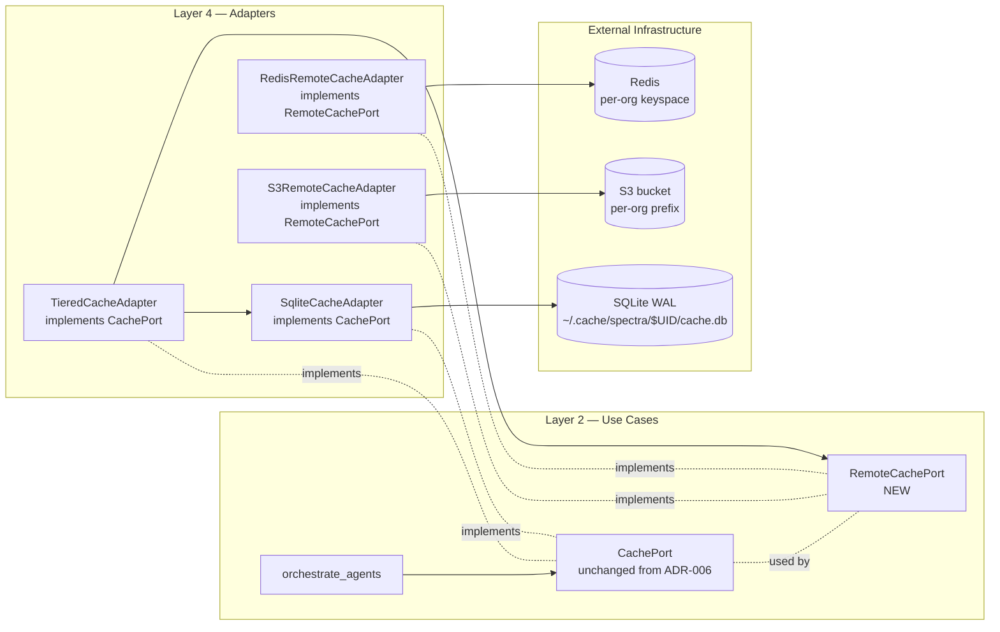

# ADR-021: Distributed Cache Port + Adapter Trio (supersedes ADR-019)

## Status

Accepted (2026-04-30) — distributed cache port + adapter trio shipped (Q3); supersedes ADR-019

## Context

[ADR-019](ADR-019-distributed-cache-adapters.md) (Proposed, 2026-04-29) declared two new adapters
(`RedisCacheAdapter`, `S3CacheAdapter`) plus a `TieredCacheAdapter`, all
implementing the existing `CachePort` ([ADR-006](ADR-006-cache-port-incremental-analysis.md)).
Six weeks of follow-up review surfaced three load-bearing questions that ADR-019
left implicit:

1. **Port shape — extend `CachePort`, or split into `LocalCachePort` +
   `RemoteCachePort`?** The two access patterns are not symmetric. Local SQLite
   is sync-friendly, ~50µs, single-machine consistency. Remote (Redis / S3) is
   async-mandatory, ~2ms-200ms, eventually consistent across writers, and needs
   single-flight + circuit-breaker semantics that the local adapter does not
   expose. Forcing one Protocol forces every adapter to implement primitives
   the other does not need (Redis-style `acquire_lock` would be a no-op on
   SQLite; SQLite-style `compute_repo_signature` is wasted on S3).
2. **Composite-key invariant across writers.** [ADR-006](ADR-006-cache-port-incremental-analysis.md)
   guarantees the composite key
   `(content, dimension, model, prompt, schema, spectra)` plus per-org HMAC
   ([ADR-012](ADR-012-cache-hmac-per-user-namespace.md)) is enforced *inside* a
   single SQLite file. With a remote L2, the same key is now written by N
   processes against M (potentially heterogeneous) Spectra versions. We have to
   declare what happens when two writers disagree on the prompt version for the
   same content hash.
3. **Failure-mode contract.** SPEC-010 says cache I/O failures degrade to
   no-cache for the rest of the run. The tiered adapter has *two* I/O surfaces.
   What does "degrade" mean when L2 (Redis) fails but L1 (SQLite) is healthy?
   What if L1 fails but L2 is up? ADR-019 did not pin this.

Q3 RICE 70 ([product-roadmap.md #21](../../strategy/product-roadmap.md))
remains the trigger; this ADR settles the three questions above before any
adapter code lands.

## Decision

Five commitments.

### 1. Port split — `CachePort` (Layer 2, unchanged) + new `RemoteCachePort` (Layer 2)

`CachePort` stays exactly as defined in [ADR-006](ADR-006-cache-port-incremental-analysis.md)
— sync-friendly, single-machine, owns the composite key, owns
`compute_repo_signature`. Every existing call site keeps working unmodified.

A new sibling Protocol captures the distributed semantics:

```python
# src/spectra/use_cases/interfaces.py — additive

class RemoteCachePort(Protocol):
    """Distributed cache backend. Async-mandatory, single-flight aware,
    eventually consistent across writers. Composite-key invariant (ADR-006)
    holds at the row level; remote-specific concerns (locks, TTL) live here.
    """

    async def get(self, key: CompositeKey) -> CacheEntry | None: ...
    async def put(self, key: CompositeKey, entry: CacheEntry, ttl_s: int) -> None: ...
    async def acquire_single_flight(
        self, key: CompositeKey, lease_s: int
    ) -> SingleFlightLease | None: ...
    async def release_single_flight(self, lease: SingleFlightLease) -> None: ...
    async def health(self) -> RemoteCacheHealth: ...   # for circuit breaker
```

`CompositeKey` is a frozen entity carrying the six components from
[ADR-006](ADR-006-cache-port-incremental-analysis.md) plus the per-org
HMAC namespace from [ADR-012](ADR-012-cache-hmac-per-user-namespace.md). It is
owned by Layer 1 — *not* `RemoteCachePort` — so `CachePort` and
`RemoteCachePort` share the same key entity but neither imports the other.

Why split: ports model intent. A use case asking for a remote cache is asking
for "shared state that may be down" semantics; a use case asking for the local
cache is asking for "always available" semantics. One Protocol cannot honestly
type both.

### 2. Adapter trio — `RedisRemoteCacheAdapter`, `S3RemoteCacheAdapter`, `TieredCacheAdapter`

```
src/spectra/infrastructure/cache/
├── __init__.py
├── sqlite_adapter.py            # existing — implements CachePort (L1)
├── redis_adapter.py             # NEW — implements RemoteCachePort
├── s3_adapter.py                # NEW — implements RemoteCachePort
└── tiered_adapter.py            # NEW — implements CachePort, composes L1 + RemoteCachePort
```

`TieredCacheAdapter` is the public face for teams: it implements `CachePort`
(so existing call sites are untouched), holds a `CachePort` reference for L1
and a `RemoteCachePort` reference for L2, and owns the read/write policy +
single-flight delegation + circuit breaker.

```python
class TieredCacheAdapter(CachePort):
    def __init__(
        self,
        l1: CachePort,
        l2: RemoteCachePort,
        breaker: CircuitBreaker,
        policy: TieredPolicy,        # write_through | write_back | read_only_l2
    ) -> None: ...
```

**Composition root selects the trio:**

```python
# infrastructure/main.py — composition root
match config.cache:
    case CacheConfig(l2="none"):
        cache = SqliteCacheAdapter(per_user_path)
    case CacheConfig(l2="redis", redis_url=url):
        cache = TieredCacheAdapter(
            l1=SqliteCacheAdapter(per_user_path),
            l2=RedisRemoteCacheAdapter(url, hmac_secret),
            breaker=CircuitBreaker(failure_threshold=3, recovery_s=60),
            policy=TieredPolicy.WRITE_THROUGH,
        )
    case CacheConfig(l2="s3", bucket=b, prefix=p):
        cache = TieredCacheAdapter(
            l1=SqliteCacheAdapter(per_user_path),
            l2=S3RemoteCacheAdapter(b, p, hmac_secret),
            breaker=CircuitBreaker(failure_threshold=3, recovery_s=60),
            policy=TieredPolicy.WRITE_BACK,    # S3 is async-friendly
        )
```

| Adapter | Backend | Latency | Single-flight | Default TTL |
|---------|---------|---------|---------------|-------------|
| `SqliteCacheAdapter` | local file | ~50µs | n/a (one process) | none (manual `cache prune`) |
| `RedisRemoteCacheAdapter` | Redis | ~2ms | Lua + `SET NX PX` | 30 days |
| `S3RemoteCacheAdapter` | S3 | ~50-200ms | conditional `If-None-Match: *` | bucket lifecycle policy |
| `TieredCacheAdapter` | composes L1 + L2 | L1 hit free; L2 hit ~2ms; miss-miss = LLM call | delegates to L2 | from L2 |

### 3. Composite-key invariant across writers

The composite-key contract from [ADR-006](ADR-006-cache-port-incremental-analysis.md)
holds *unchanged* at the row level: every row is keyed by
`(content, dimension, model, prompt, schema, spectra)`. The only addition for
distributed writers is the per-org **HMAC namespace prefix**
([ADR-012](ADR-012-cache-hmac-per-user-namespace.md)) so two orgs sharing a
Redis cluster cannot read each other's rows.

When writer A (Spectra v0.7.0, prompt v3) and writer B (Spectra v0.6.0,
prompt v2) target the same content + dimension, they write to *different keys*
— the version components diverge. There is no "stale row" problem because no
two writers can ever produce the same key for divergent context. This is the
same invariant from [ADR-006](ADR-006-cache-port-incremental-analysis.md);
distribution does not weaken it.

Two writers on the *same* version writing the *same* key write the *same*
serialised bytes (specialist outputs are deterministic at temperature 0 modulo
sampling stochasticity). Last-write-wins is safe. Conditional writes
(`SET NX` on Redis, `If-None-Match: *` on S3) are used by single-flight; the
write contract itself is idempotent.

The HMAC ([ADR-012](ADR-012-cache-hmac-per-user-namespace.md)) covers the row
*value*, not the key. A reader who computes the HMAC and finds it does not
match the stored MAC discards the row and treats it as a miss (logged as
`cache.mac_mismatch` per [ADR-018](ADR-018-audit-log-and-identity.md)). This
defends against a compromised L2.

### 4. Failure-mode contract — explicit per layer

SPEC-010 ("cache I/O failures degrade to no-cache for the rest of the run")
expands into a 2x2 matrix for the tiered adapter:

| L1 healthy | L2 healthy | Behaviour |
|-----------|-----------|-----------|
| ✅ | ✅ | Normal — L1 → L2 → fresh |
| ✅ | ❌ | Circuit breaker opens on L2; L1-only for the rest of the run; one-line warning + audit event |
| ❌ | ✅ | L1 disabled for the rest of the run; L2-only (slower but correct); one-line warning + audit event |
| ❌ | ❌ | SPEC-010 — no cache for the rest of the run; pipeline continues, full LLM cost |

The circuit breaker is per-process and owned by `TieredCacheAdapter`. It uses
a simple count-based threshold (3 failures in 60s opens for 60s) — not a
percentile-based EWMA, not a half-open probe state machine. Simpler is
correct here: cache is non-critical, the cost of an extra failed call is
bounded, and we do not want the breaker to be itself a failure mode.

When the breaker opens on L2, the adapter:

1. Stops issuing L2 reads and writes for `recovery_s` seconds.
2. Emits one `cache.l2_circuit_opened` audit event ([ADR-018](ADR-018-audit-log-and-identity.md)).
3. Surfaces a one-line warning via `ProgressObserver.on_cache_lookup` so the
   user sees why their scan got slower.
4. Auto-closes after `recovery_s` and resumes L2 traffic; on next failure the
   threshold counts again.

**Cache failures are never fatal** — same contract as [CLAUDE.md](../../../CLAUDE.md)
and ADR-006. The only escalation path is "fewer hits, longer scan, higher
LLM bill." The pipeline never aborts for cache reasons.

### 5. Migration — opt-in, no schema migration of existing SQLite

Existing single-user installs are unaffected — `SqliteCacheAdapter` stays the
default; no `.spectra.yml` is required to keep working.

Switching to tiered requires explicit configuration via
[ADR-020](ADR-020-config-file-yaml.md) `.spectra.yml`:

```yaml
cache:
  l1: sqlite
  l2: redis                       # or s3 or none
  redis_url: ${SPECTRA_REDIS_URL}
  s3_bucket: spectra-cache-prod
  s3_prefix: org-acme/
  l2_ttl_days: 30
  hmac_secret_source: aws-sm      # or vault | keyring | env
  hmac_secret_id: spectra/cache-hmac/prod
```

The L1 SQLite cache is **not bulk-imported** into the new L2. The L2 populates
incrementally as scans run. This is a deliberate cost trade: bulk import would
require enumerating, MAC-recomputing, and uploading every L1 row — for a cache
that exists precisely so the next scan can re-fill it cheaply.



## Consequences

### Positive

- **The dependency rule survives intact.** `RemoteCachePort` is a Layer-2
  Protocol; no use case imports `redis-py` or `boto3`. Composition selects
  the adapter at startup.
- **Honest typing.** Sync use cases reference `CachePort`; async-aware
  composition references `RemoteCachePort`. Neither carries primitives the
  other cannot honour.
- **Teams stop redoing each other's work.** Same outcome as ADR-019
  predicted — 50-engineer org L2 hit rate climbs from ~30% (per-laptop) to
  ~85% (shared); LLM bill drops accordingly.
- **Failure modes are explicit.** The 2x2 matrix is testable. We can write
  property-based tests for each cell.
- **`SqliteCacheAdapter` becomes a strictly composable ingredient.** It is
  the L1 in tiered mode and the only adapter in single-user mode. Same code
  paths.
- **HMAC + composite key extends without modification.** Per-row HMAC
  ([ADR-012](ADR-012-cache-hmac-per-user-namespace.md)) and composite key
  ([ADR-006](ADR-006-cache-port-incremental-analysis.md)) compose with both
  remote backends with no schema change.

### Negative

- **Two ports to learn.** Engineers reading the code for the first time see
  `CachePort` and `RemoteCachePort` and have to internalise that one is the
  composition contract and one is the remote contract. We mitigate by
  putting both Protocols in the same module with a header comment explaining
  the split.
- **Per-org HMAC secret rotation invalidates the entire L2.** This is
  intentional (rotation is a security event; cold-cache cost is acceptable)
  but customers need to know. We document it in the operator runbook.
- **L2 = real infrastructure.** Customers must run Redis or maintain an S3
  bucket. Documented; we ship a `docker-compose.yml` for Redis and a CFN /
  Terraform snippet for S3.
- **Single-flight is bounded by the lease duration.** A real LLM call that
  takes longer than the lease (default 120s — same as the agent timeout
  in [CLAUDE.md](../../../CLAUDE.md)) lets the lock expire and a second
  call fire. Bounded waste: at most 1 duplicate per dimension per timeout.

### Neutral

- `TieredCacheAdapter` is a small composition (~150 LoC). It is not its own
  Protocol; it implements `CachePort`. Same testing surface as the
  underlying adapters.
- `SqliteCacheAdapter` is unchanged. `CachePort` is unchanged. ADR-006
  semantics are preserved.
- The `cache.l2 = none` config produces an installation
  byte-for-byte equivalent to today's single-user behaviour. Zero risk for
  existing users.
- For solo developers, `redis://localhost:6379` running in Docker is one
  `docker compose up` away — power-user mode for parallel local scans.

## Alternatives Considered

| Alternative | Verdict |
|-------------|---------|
| **Extend `CachePort` to cover async + single-flight semantics.** | Rejected. Sync-only use cases would need to know about leases and breakers. Two Protocols are honest; one Protocol is convenient but lies. |
| **Make `RemoteCachePort` a sub-Protocol of `CachePort` (inheritance).** | Rejected. Protocol inheritance in Python is structural — every `RemoteCachePort` would advertise `compute_repo_signature` (which is local-only). Composition over inheritance, even at the type level. |
| **Single `RemoteCacheBackend` enum + one adapter that switches internally.** | Rejected. `match` over a runtime enum inside an adapter is the framework-driving-architecture anti-pattern. Adapter-per-backend is the Clean Architecture answer. |
| **Drop `TieredCacheAdapter`; let the use case orchestrate L1 + L2 directly.** | Rejected. The tiered policy (write-through vs write-back, read order, breaker integration) is infrastructure concern, not use-case concern. Use case sees `CachePort`; adapter does the orchestration. |
| **Postgres as the L2.** | Rejected. Schema migrations, connection pooling, and write contention on a hot row — all worse than Redis for this workload. Postgres is reserved for [ADR-022](ADR-022-postgres-history-store.md) (history). |
| **Memcached.** | Rejected. No persistence, no Lua, no single-flight primitives. Strictly worse than Redis. |
| **Cloudflare Workers KV / Durable Objects.** | Rejected. Vendor-specific, single-region eventual consistency in many configurations, no documented HMAC story. Reconsider if a customer asks. |
| **Replace ADR-019's `SingleFlightLease` with leader election (Raft).** | Rejected. Raft for cache stampede prevention is a 100x complexity multiplier for a 10x problem. `SET NX PX` is the right tool. |
| **Skip the circuit breaker; let every L2 call retry.** | Rejected. A degraded L2 (slow, not down) under retry storm is worse than a circuit-broken L2. The breaker is cheap insurance. |

## Implementation effort

**M-L (8-12 days).** Breakdown: `RemoteCachePort` + `CompositeKey` entity
extraction from existing adapter (S, ~1 day); `RedisRemoteCacheAdapter` with
HMAC + Lua single-flight + breaker (M, ~3 days); `S3RemoteCacheAdapter` with
conditional-write single-flight + breaker (M, ~2 days); `TieredCacheAdapter`
with policy enum + read/write paths (S, ~1 day); composition root rewire +
`.spectra.yml` plumbing (S, ~1 day); HMAC secret loaders (keyring / AWS SM /
Vault / env) (S, ~1 day); load test (50 simulated runners, monorepo) +
stampede regression test + 2x2 failure-matrix tests (M, ~2 days).

## References

- Code: `src/spectra/use_cases/interfaces.py` — `CachePort` (unchanged); add
  `RemoteCachePort`
- Code: `src/spectra/entities/models.py` — extract `CompositeKey` as a frozen
  entity (today implicit inside the adapter)
- Code: `src/spectra/infrastructure/cache_adapter.py` — becomes
  `infrastructure/cache/sqlite_adapter.py` (file move only)
- Code: `src/spectra/infrastructure/main.py` — composition root selects the
  trio
- Findings: [`docs/strategy/cto-findings.md`](../../strategy/cto-findings.md) §1
  (distributed cache), §6 (build vs buy)
- Findings: [`docs/strategy/redteam-findings.md`](../../strategy/redteam-findings.md)
  §S3 (cloud-cache poisoning) — addressed by per-org HMAC namespace
- Roadmap: [`docs/strategy/q3-plan.md`](../../strategy/q3-plan.md) capability #21
- Roadmap: [`docs/strategy/product-roadmap.md`](../../strategy/product-roadmap.md)
  capability #21 (RICE 70, Q3), #22 (fleet rate)
- Supersedes: [ADR-019](ADR-019-distributed-cache-adapters.md)
- Related: [ADR-006](ADR-006-cache-port-incremental-analysis.md) — `CachePort`
  Protocol that `TieredCacheAdapter` implements
- Related: [ADR-009](ADR-009-batch-granularity-per-focus-area.md) — composite
  key + atomic bind, reused in L2
- Related: [ADR-012](ADR-012-cache-hmac-per-user-namespace.md) — per-org HMAC
  namespace
- Related: [ADR-013](ADR-013-task-budget-and-rate-coordination.md) — Redis is
  the same dependency; reuse the connection
- Related: [ADR-018](ADR-018-audit-log-and-identity.md) — cache events
  (`cache.mac_mismatch`, `cache.l2_circuit_opened`) route to AuditPort
- Related: [ADR-020](ADR-020-config-file-yaml.md) — `cache:` section schema

---

*Last updated: 2026-04-30.*
