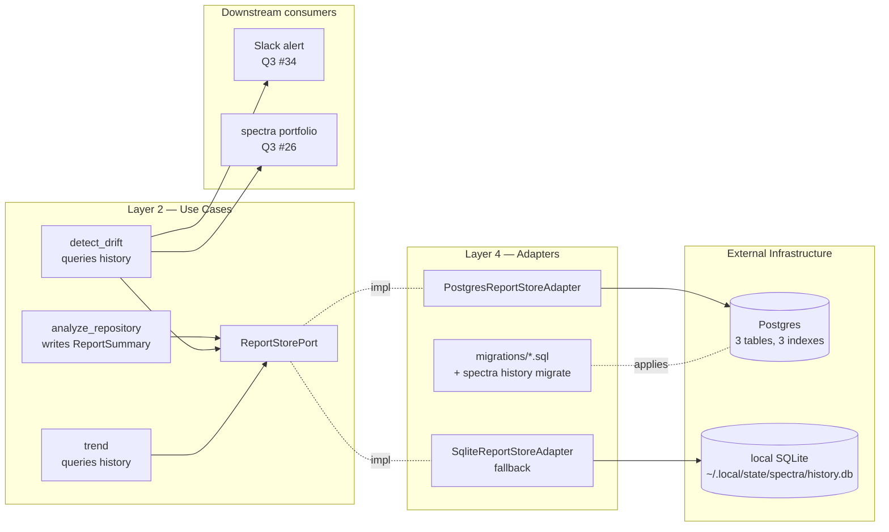

# ADR-022: Postgres History Store + `ReportStorePort` for Trend / Drift Detection

## Status

Accepted (2026-04-30) — Postgres history store + ReportStorePort shipped (Q3)

## Context

Today every Spectra run is stateless — the report renders, the cache holds
finding rows, and the audit log holds events, but there is no
"what was last week's grade?" query. The CTO's portfolio narrative
([cto-findings.md §2](../../strategy/cto-findings.md), [product-roadmap.md #25](../../strategy/product-roadmap.md))
needs:

- `spectra trend <repo>` — score over the last N weeks
- `spectra portfolio status` — grade + finding deltas across all registered repos
- `spectra alert` — Slack ping when a previously-A repo drops to C

All three are queries over scan history. The audit log
([ADR-018](ADR-018-audit-log-and-identity.md)) is the wrong store for this
— it is event-shaped (append-only, signature-only payload, optimised for
SIEM ingestion). It does not carry the score card, the per-dimension grade,
or the per-severity finding count, and it cannot be queried with
`SELECT score FROM ... WHERE repo_signature = ? ORDER BY ts DESC LIMIT 12`.

The cache ([ADR-006](ADR-006-cache-port-incremental-analysis.md)) is the
wrong store too — it is finding-row-shaped, keyed by content + dimension +
versions, and rotates as soon as the composite key shifts. It does not
preserve historical grades.

We need a third store: scan-shaped, queryable, durable across version
upgrades.

Three architectural questions:

1. **Where does the abstraction live?** A `ReportStorePort` in Layer 2 keeps
   the use case free of database concerns.
2. **What backend?** SQLite (we already use it) vs Postgres (real concurrent
   queries, real connection pool, real time-series performance). Trade-offs
   on operational surface vs query power.
3. **How do we ship migrations?** Alembic adds machinery; raw SQL files
   add discipline. Pick one and commit.

## Decision

Five commitments.

### 1. New `ReportStorePort` in Layer 2; `PostgresReportStoreAdapter` in Layer 4

```python
# src/spectra/use_cases/interfaces.py — additive

class ReportStorePort(Protocol):
    """Persistent scan history, queryable for trend + drift use cases.
    Adapter-agnostic; first impl is Postgres, fallback is SQLite for
    single-user mode.
    """

    async def put_report(self, summary: ReportSummary) -> None: ...
    async def get_history(
        self, repo_signature: str, since: datetime
    ) -> tuple[ReportSummary, ...]: ...
    async def get_latest(self, repo_signature: str) -> ReportSummary | None: ...
    async def list_repositories(
        self, org_id: str
    ) -> tuple[RepositoryHandle, ...]: ...
    async def detect_drift(
        self, repo_signature: str, lookback_days: int = 28
    ) -> DriftReport: ...
```

`ReportSummary` is a frozen Layer-1 entity. It carries enough to power every
trend / portfolio query without re-reading the full HTML report:

```python
class ReportSummary(BaseModel, frozen=True):
    scan_id: str                              # UUIDv7
    repo_signature: str                       # blake2b of file tree
    repo_handle: RepositoryHandle             # display name + canonical URL
    timestamp: datetime                       # UTC
    score_card: ScoreCard                     # overall + per-dimension
    finding_count_by_severity: dict[Severity, int]
    finding_count_by_dimension: dict[Dimension, int]
    pipeline_state: PipelineState             # complete | degraded | compromised
    validation_status: ValidationStatus       # full | quick | no_critique
    model_versions: dict[AgentRole, str]
    prompt_versions: dict[Dimension, str]
    spectra_version: str
    cost_usd: float
    duration_seconds: float
    receipt_id: str | None                    # ADR-018 signed receipt
```

Note: no `findings` list, no `code_excerpts`, no PII. Trend queries do not
need them; the full report stays in object storage / the customer's report
sink. This keeps the history store small (~5 KB / row) and side-steps the
privacy boundary that [ADR-018](ADR-018-audit-log-and-identity.md) draws.

### 2. Backend choice — Postgres for portfolio mode; SQLite as the single-user fallback

```
src/spectra/infrastructure/history/
├── __init__.py
├── sqlite_report_store.py       # NEW — single-user fallback
├── postgres_report_store.py     # NEW — portfolio mode default
└── migrations/
    ├── 001_initial_schema.sql
    ├── 002_add_finding_dimensions.sql
    └── ...
```

**Why Postgres for portfolio:**

- Concurrent writers (every CI runner inserts on scan completion).
- Range queries by `(repo_signature, timestamp)` — Postgres gives us
  index-only scans for free; SQLite serializes writes.
- Window functions for drift detection (`LAG()` over time-ordered rows).
- Parallel queries for the leaderboard endpoint at fleet scale.

**Why SQLite as a fallback:**

- Single-developer mode does not need Postgres infra.
- The Protocol is identical; `SqliteReportStoreAdapter` is ~120 LoC.
- CI use cases without a customer-managed Postgres still get `spectra trend`
  for one repo at a time.
- Composition root picks based on `.spectra.yml` or `SPECTRA_HISTORY_BACKEND`
  env var.

### 3. Schema — three tables, conservative, queryable

```sql
-- 001_initial_schema.sql

CREATE TABLE reports (
    scan_id              UUID         PRIMARY KEY,
    repo_signature       VARCHAR(64)  NOT NULL,
    repo_handle_url      TEXT         NOT NULL,
    repo_handle_name     TEXT         NOT NULL,
    org_id               VARCHAR(64)  NOT NULL,
    ts                   TIMESTAMPTZ  NOT NULL,
    overall_score        REAL         NOT NULL,
    overall_grade        VARCHAR(2)   NOT NULL,
    pipeline_state       VARCHAR(16)  NOT NULL,
    validation_status    VARCHAR(16)  NOT NULL,
    spectra_version      VARCHAR(16)  NOT NULL,
    model_versions       JSONB        NOT NULL,
    prompt_versions      JSONB        NOT NULL,
    cost_usd             REAL         NOT NULL,
    duration_seconds     REAL         NOT NULL,
    receipt_id           UUID         NULL,
    created_at           TIMESTAMPTZ  NOT NULL DEFAULT now()
);

CREATE TABLE report_dimension_scores (
    scan_id              UUID         NOT NULL REFERENCES reports(scan_id) ON DELETE CASCADE,
    dimension            VARCHAR(20)  NOT NULL,
    score                REAL         NOT NULL,
    grade                VARCHAR(2)   NOT NULL,
    finding_count        INTEGER      NOT NULL,
    PRIMARY KEY (scan_id, dimension)
);

CREATE TABLE report_severity_counts (
    scan_id              UUID         NOT NULL REFERENCES reports(scan_id) ON DELETE CASCADE,
    severity             VARCHAR(10)  NOT NULL,
    count                INTEGER      NOT NULL,
    PRIMARY KEY (scan_id, severity)
);

CREATE INDEX reports_repo_ts        ON reports (repo_signature, ts DESC);
CREATE INDEX reports_org_ts         ON reports (org_id, ts DESC);
CREATE INDEX reports_org_grade      ON reports (org_id, overall_grade);
```

Three tables, three indexes. No JSONB column for findings (kept in object
storage); no foreign keys outside the three-table group. Cardinality:
~365 scans/year × ~300 repos × ~5 years = 547K row upper bound for a
mid-size organisation — Postgres handles this without partitioning.

### 4. Migrations — raw SQL files, applied by `spectra history migrate`

```bash
spectra history migrate                 # apply pending migrations
spectra history migrate --dry-run       # show pending migrations
spectra history migrate --target 003    # roll forward to a specific version
spectra history doctor                  # check schema vs expected
```

Files in `src/spectra/infrastructure/history/migrations/` are numbered,
single-direction (no down-migrations), and applied in lexicographic order.
Each migration runs in a transaction; failure rolls back. A
`schema_migrations` table tracks applied versions.

We **deliberately reject Alembic** for two reasons:

- Alembic's value is auto-generation from SQLAlchemy models. We are not
  using SQLAlchemy ORM (see #5 below) — there is nothing to introspect.
- Alembic's `alembic upgrade head` workflow assumes the user has the project
  source tree. Spectra is a CLI distributed via wheel; users get
  `spectra history migrate` and that is the contract.

Raw SQL files are 100% understandable by any DBA; they do not require
Python knowledge to review, audit, or apply manually in an emergency. For a
SOC-2-conscious customer this is the simpler defensible answer.

### 5. Connection pooling and driver — `psycopg` 3 (async), no ORM

We use `psycopg[binary,pool]>=3.2,<4.0` directly. No SQLAlchemy. Reasons:

- Spectra has nine SQL queries (insert, six selects, two aggregations). An
  ORM is overhead, not leverage.
- `psycopg`'s async pool (`ConnectionPool` / `AsyncConnectionPool`) is
  built-in and battle-tested.
- Raw SQL stays auditable; no implicit query generation that surprises a
  reviewer.
- Smaller dependency surface, smaller security footprint, faster import.

Connection pool default: 5 connections per process, 60s idle timeout. Tuned
in `.spectra.yml` for portfolio mode where 50 simultaneous PRs may write
concurrently. Postgres `max_connections` is documented as a customer
operational concern.

### 6. Drift detection — a use-case query, not a database trigger

```python
# src/spectra/use_cases/detect_drift.py — Layer 2

class DetectDrift:
    """Computes score deltas for the last N days. Surfaces repos that
    crossed a configurable threshold (default: dropped >= 5 points or
    one full grade)."""

    def __init__(self, store: ReportStorePort, threshold: DriftThreshold) -> None: ...

    async def run(
        self, org_id: str, lookback_days: int = 7
    ) -> tuple[DriftReport, ...]: ...
```

The query is one window function:

```sql
SELECT
    repo_signature,
    overall_score AS current_score,
    LAG(overall_score) OVER (PARTITION BY repo_signature ORDER BY ts DESC) AS prior_score,
    overall_grade AS current_grade,
    LAG(overall_grade) OVER (PARTITION BY repo_signature ORDER BY ts DESC) AS prior_grade
FROM reports
WHERE org_id = $1 AND ts >= now() - $2 * INTERVAL '1 day'
ORDER BY ts DESC;
```

The use case computes deltas in Python and surfaces drift exceeding the
threshold. The result feeds the Slack/Teams alert ([Q3 #34](../../strategy/q3-plan.md))
and the trend CLI command. **No database triggers.** Triggers would put
business logic in the database — that is the exact dependency-rule violation
this ADR is structured to prevent.



## Consequences

### Positive

- **Trend, drift, and portfolio all unblock with one Port + one schema.**
  The same `ReportStorePort` powers `spectra trend`, `spectra portfolio`,
  Slack alerts, and (later) the leaderboard endpoint.
- **Use cases stay framework-free.** `analyze_repository` calls
  `report_store.put_report(summary)` and is done; it does not import
  `psycopg`.
- **No findings or code in history.** The privacy boundary from
  [ADR-018](ADR-018-audit-log-and-identity.md) extends here. Reports retain
  *signatures and counts*, not content.
- **Backend choice matches workload.** Postgres for portfolio (real
  concurrency); SQLite for single-user (zero infra). The Protocol is the
  same.
- **Raw SQL migrations are the right discipline level.** Auditable by a DBA;
  reviewable in a PR; applicable in an emergency without Spectra source.
- **Drift detection lives in the use-case layer.** No triggers; no stored
  procedures; pipelines remain fully testable in unit tests with an
  in-memory `FakeReportStore`.

### Negative

- **Postgres is operational dependency for portfolio mode.** Customers must
  run one. We document the docker-compose snippet, the AWS RDS Terraform
  template, and the Cloud SQL guide. Burden is real but bounded.
- **`spectra history migrate` becomes a release-step.** Every minor release
  that ships a migration requires the customer to run it. Risk of
  forgetting → loud, helpful error from the doctor command.
- **No SQLAlchemy means hand-written queries.** Risk of SQL injection if a
  developer concatenates a string. Mitigated by `psycopg`'s parameterised
  queries being the *only* path; lint rule forbids `cursor.execute(f"...")`.
- **Two adapters + two storage backends to keep in parity.** The SQLite
  fallback exercises the smaller queries; the Postgres adapter must pass
  the same Protocol contract tests. We share a Protocol-test base class.

### Neutral

- The `ReportSummary` entity is the same regardless of backend. The
  serialisation differs (JSONB vs JSON text); the entity does not.
- `psycopg` 3 supports both sync and async connection pools. Spectra is
  async-first throughout the use-case layer; we use `AsyncConnectionPool`.
- Postgres choice does not lock out CockroachDB / Aurora / AlloyDB — they
  speak Postgres wire protocol. The composition root accepts a connection
  string; the customer's compatibility with Postgres syntax is their
  problem.
- Q3 leaderboard / RBAC features ([product-roadmap.md #28](../../strategy/product-roadmap.md))
  are out of scope here; they layer on top of this schema in a later
  quarter without breaking change.

## Alternatives Considered

| Alternative | Verdict |
|-------------|---------|
| **Append `ReportSummary` to the audit log; query the log for trends.** | Rejected. Audit logs are SIEM-shaped (append-only, opaque-to-Spectra in production). Querying them for trend windows is the wrong shape; SIEM teams do not want their audit pipeline as a primary database for someone else's product. |
| **SQLite-only — skip Postgres entirely.** | Rejected for portfolio. SQLite serializes writes; 50 simultaneous CI runners writing to one file is a contention nightmare. SQLite stays as the single-user fallback; portfolio gets Postgres. |
| **Use SQLAlchemy ORM with declarative models.** | Rejected. Adds dependency, adds magic, generates queries we have to reason about anyway. Nine queries does not justify an ORM. |
| **Use Alembic for migrations.** | Rejected. Optimised for ORM-introspected migrations; we have none. Raw SQL files are simpler and DBA-reviewable. |
| **JSON column for the entire `score_card`.** | Rejected partially — we keep `overall_score` and `overall_grade` as columns (they are queried by the drift detection); per-dimension scores go in the `report_dimension_scores` child table; raw `model_versions` and `prompt_versions` stay JSONB (we only read them, never query by them). |
| **Time-series database (InfluxDB / Timescale).** | Rejected for v1. ~365 scans/year × ~300 repos = 110K rows/year. Postgres handles this trivially; a TSDB adds an operational dependency we cannot justify on this volume. Revisit at 100x scale. |
| **Single-tenant database file per org (`history-acme.db`).** | Rejected. Defeats the portfolio query (`SELECT ... WHERE org_id = ?`). Postgres `org_id` column with row-level security is the right shape. RLS is documented for customers who want hard isolation. |
| **Compute drift in a database trigger.** | Rejected. Triggers put business logic where it cannot be unit-tested. Use case computes drift in Python over query results. |
| **Database-level retention policy (`DELETE WHERE ts < now() - INTERVAL '5 years'`).** | Postponed. Default is no retention policy; customer owns it. We add `spectra history prune --older-than 5y` in a later release if asked. |

## Implementation effort

**M-L (10-14 days).** Breakdown: `ReportStorePort` + `ReportSummary` +
`DriftReport` + `RepositoryHandle` entities (S, ~1 day);
`PostgresReportStoreAdapter` with `psycopg` async pool (M, ~3 days);
`SqliteReportStoreAdapter` fallback (S, ~1 day); raw SQL migrations + 
`spectra history migrate|doctor` CLI (M, ~2 days); `DetectDrift` use case +
window-function query + threshold config (M, ~2 days); `analyze_repository`
write integration (S, ~1 day); composition root + `.spectra.yml` plumbing
(S, ~1 day); Protocol-contract test base + Postgres + SQLite test runs +
`testcontainers-python` for CI (M, ~2 days); operator docs (Postgres + RDS
+ Cloud SQL) (S, ~1 day).

## References

- Code: `src/spectra/use_cases/interfaces.py` — add `ReportStorePort`
- Code: `src/spectra/entities/models.py` — add `ReportSummary`,
  `RepositoryHandle`, `DriftReport`, `DriftThreshold`
- Code: `src/spectra/use_cases/analyze_repository.py` — emit
  `ReportSummary` after Stage 6
- Code: `src/spectra/use_cases/detect_drift.py` — new use case
- Code: `src/spectra/adapters/cli_controller.py` — `spectra trend`,
  `spectra history migrate`, `spectra history doctor`
- Findings: [`docs/strategy/cto-findings.md`](../../strategy/cto-findings.md) §2
  (history + portfolio)
- Findings: [`docs/strategy/memory-second-brain-findings.md`](../../strategy/memory-second-brain-findings.md)
  §M4 (score timeline)
- Roadmap: [`docs/strategy/q3-plan.md`](../../strategy/q3-plan.md)
  capabilities #25, #26, #27, #34
- Roadmap: [`docs/strategy/product-roadmap.md`](../../strategy/product-roadmap.md)
  capability #25 (RICE 65, Q3), #26 (RICE 70, Q3), #27 (RICE 75, Q3)
- Related: [ADR-018](ADR-018-audit-log-and-identity.md) — privacy boundary
  inherited (no findings, no code, no PII)
- Related: [ADR-021](ADR-021-distributed-cache-port-and-adapter-trio.md) —
  history is a *separate* store from the cache; same composition pattern
  (Port in Layer 2, adapter trio in Layer 4)
- Related: [ADR-020](ADR-020-config-file-yaml.md) — `history:` config section

---

*Last updated: 2026-04-30.*
