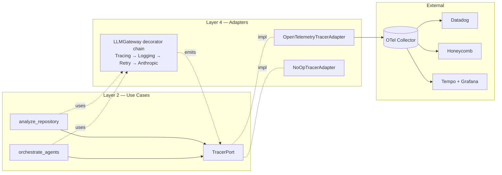

# ADR-023: OpenTelemetry Tracing + Per-Agent Spans + Cost Attribution

## Status

Accepted (2026-04-30) — OpenTelemetry tracing + per-agent spans shipped (Q3)

## Context

The CTO ([cto-findings.md §3](../../strategy/cto-findings.md), [product-roadmap.md #30, #33](../../strategy/product-roadmap.md))
asks for two related things:

- **#30 — OpenTelemetry tracing + per-agent spans (RICE 75).** "Cannot
  operate what you cannot see." A platform team integrating Spectra into
  CI needs Honeycomb / Datadog / Tempo dashboards on `analyze_repository`
  latency, per-stage breakdown, per-agent failure rates.
- **#33 — Cost attribution per team / repo (RICE 65).** A CFO wants
  Anthropic spend broken down by engineering team and by repo so they can
  budget. The data lives in the same Anthropic usage payload that the
  cost tracker ([ADR-013](ADR-013-task-budget-and-rate-coordination.md))
  already records.

Both fall out of the same instrumentation pass — if traces carry
cost-shaped attributes, the CFO query is "filter spans by `team`, sum
`cost.usd`."

Three architectural questions:

1. **Where is the trace boundary?** If we instrument at Layer 4
   (`AnthropicAdapter`), we get LLM-call spans but lose use-case context.
   If we instrument at Layer 2 (use cases), spans survive an adapter swap
   (Bedrock, Vertex, Managed Agents) and we keep meaningful root spans.
2. **Exporter pluggability.** Same problem the audit log
   ([ADR-018](ADR-018-audit-log-and-identity.md)) solved: customers do not
   share one observability backend. Honeycomb shops, Datadog shops, Splunk
   shops, self-hosted Tempo + Grafana — all need the same spans through
   different pipes.
3. **Cost attribution as span attributes.** The CFO wants `team` and `repo`
   tags on every cost-bearing span. Identity already comes from
   [ADR-018](ADR-018-audit-log-and-identity.md) (`actor`, `confidence`).
   Team is one extra config.

## Decision

Six commitments.

### 1. Trace boundary — Layer 2 use cases, with Layer 4 hooks for I/O latency

The trace tree is rooted in `analyze_repository.run()`. Per-stage spans
(`stage.ingest`, `stage.plan`, `stage.cache_short_circuit`,
`stage.analyze`, `stage.merge`, `stage.critique`, `stage.report`) live as
children of the root. Per-agent spans live as children of `stage.analyze`
(one per parallel specialist). Per-LLM-call spans live as children of the
agent span.

```
analyze_repository (root)
 ├── stage.ingest                        — repo prep
 ├── stage.plan                          — MetaPrompter
 │    └── llm.call                       — one Anthropic call
 ├── stage.cache_short_circuit           — Phase 2 hit/miss
 ├── stage.analyze                       — fan-out
 │    ├── agent.architecture
 │    │    ├── cache.lookup              — Phase 3 hit/miss
 │    │    └── llm.call (× N batches)
 │    ├── agent.security
 │    │    ├── cache.lookup
 │    │    └── llm.call
 │    ├── agent.quality        ...
 │    ├── agent.documentation  ...
 │    ├── agent.dependency     ...
 │    └── agent.performance    ...
 ├── stage.merge                         — dedupe + scorecard
 ├── stage.critique
 │    └── llm.call
 └── stage.report                        — render + receipt + history.put
```

The use case opens a span, the orchestrator opens child spans for each
agent, and the LLM gateway opens leaf spans for each call. **No span lives
in Layer 4 alone** — every trace is rooted at a use case, so swapping
`AnthropicAdapter` for `BedrockAdapter` or `AnthropicManagedAgentAdapter`
([ADR-016](ADR-016-managed-agents-gateway.md)) changes the *attributes* on
the leaf span (`llm.provider = "bedrock"`) but not the trace tree shape.

This is the same boundary discipline as the audit log
([ADR-018](ADR-018-audit-log-and-identity.md)) and the cost tracker
([ADR-013](ADR-013-task-budget-and-rate-coordination.md)) — emit at the
boundary that owns the semantic event, not at the lowest-level I/O.

### 2. New `TracerPort` in Layer 2; OTel SDK adapter in Layer 4

```python
# src/spectra/use_cases/interfaces.py — additive

class TracerPort(Protocol):
    """Span lifecycle for distributed tracing. The use case neither knows
    nor cares about OpenTelemetry, Datadog APM, or proprietary backends.
    """

    def start_span(
        self,
        name: str,
        kind: SpanKind = SpanKind.INTERNAL,
        attributes: Mapping[str, str | int | float | bool] | None = None,
    ) -> Span: ...

    def get_current_span(self) -> Span | None: ...
    def inject_context(self, carrier: MutableMapping[str, str]) -> None: ...
    def extract_context(self, carrier: Mapping[str, str]) -> ContextToken | None: ...
```

`Span` is a frozen-shaped Protocol with `set_attribute`, `add_event`,
`record_exception`, `set_status`, `end`, and async-context-manager
support (`__aenter__` / `__aexit__`). It is intentionally close in shape
to OpenTelemetry's `Span` so the adapter is thin — but the use cases
import `TracerPort`, never `opentelemetry.*`.

Adapters:

```
src/spectra/infrastructure/observability/
├── __init__.py
├── otel_tracer.py             # OpenTelemetryTracerAdapter (default when configured)
└── noop_tracer.py             # NoOpTracerAdapter (default when not configured)
```

Composition root: `OpenTelemetryTracerAdapter` is wired when
`SPECTRA_OTEL_ENDPOINT` is set or `.spectra.yml` `observability.tracing`
is enabled; otherwise `NoOpTracerAdapter` is wired (zero-overhead fallback,
same Protocol, all `start_span` calls return a no-op span). Same shape as
the audit-log adapter selection in [ADR-018](ADR-018-audit-log-and-identity.md).

### 3. Exporter pluggability — OTLP only, customer routes via OTel collector

OTel SDK supports many exporters. We ship one: **OTLP/HTTP**. Customers who
want Datadog, Splunk, Honeycomb, Tempo, or Jaeger run an
[OpenTelemetry Collector](https://opentelemetry.io/docs/collector/) and
route from there. This is the standard answer; it keeps Spectra's
dependency surface small and makes us vendor-neutral.

```yaml
# .spectra.yml — observability section
observability:
  tracing:
    enabled: true
    endpoint: ${SPECTRA_OTEL_ENDPOINT}      # http://otel-collector:4318/v1/traces
    sample_ratio: 1.0                       # 0.0 - 1.0; default 1.0 (every scan)
    timeout_s: 5
  attributes:
    team: payments-platform                 # tags every span (cost attribution)
    environment: production
    custom:
      cost_center: eng-platform-2026
      compliance_mode: soc2
```

Why no native Datadog / Honeycomb adapter:

- We would maintain N×M (adapters × backends).
- The OTel Collector exists *exactly* so vendors do not have to.
- Same decision as audit-log adapters in [ADR-018](ADR-018-audit-log-and-identity.md).

For customers without a collector, the OTel Collector is one Docker
container; we ship a `docker-compose.yml` snippet documenting the path to
Tempo + Grafana + Prometheus (the open-source observability stack). FedRAMP
shops typically already run a collector.

### 4. Cost attribution — span attributes, computed once, queryable everywhere

Every cost-bearing span (`llm.call`, `agent.*`, `stage.*`, root) carries a
standard set of attributes:

| Attribute | Source | Example |
|-----------|--------|---------|
| `spectra.scan_id` | UUIDv7 from run start | `01963f8c-...-...` |
| `spectra.repo_signature` | `blake2b(file_tree)` | `4ba8...` |
| `spectra.repo_url` | from CLI arg, redacted of secrets | `github.com/acme/api` |
| `spectra.org_id` | `.spectra.yml` `observability.attributes.org_id` | `acme` |
| `spectra.team` | `.spectra.yml` `observability.attributes.team` | `payments-platform` |
| `spectra.environment` | `.spectra.yml` `observability.attributes.environment` | `production` |
| `spectra.actor` | from `IdentityResolver` (ADR-018) | `alice@acme.com` |
| `spectra.actor_source` | from `IdentityResolver` | `oidc` |
| `llm.provider` | from gateway adapter | `anthropic` / `bedrock` / `vertex` |
| `llm.model` | per-call | `claude-opus-4-7-20260301` |
| `llm.input_tokens` | from Anthropic usage | `42153` |
| `llm.output_tokens` | from Anthropic usage | `1857` |
| `llm.cached_tokens` | from Anthropic usage (ADR-024) | `38000` |
| `llm.cost.usd` | computed at write-time from `PRICING_TABLE` | `0.42` |
| `agent.role` | per-agent span | `security` |
| `agent.dimension` | per-agent span | `security` |
| `cache.l1_hit` | per cache lookup | `true` / `false` |
| `cache.l2_hit` | per cache lookup | `true` / `false` |

The CFO query is one PromQL / TraceQL filter:

```
sum by (spectra.team) (
  sum_over_time({spectra.scan_id != ""} | __spans__ | spectra.cost.usd[7d])
)
```

(Backend syntax varies; the point is the attribute set is the contract.)

The cost attribute is computed at span-write-time using the same
`PRICING_TABLE` constant from [ADR-013](ADR-013-task-budget-and-rate-coordination.md).
Historical accuracy: the price baked into the span survives Anthropic
price changes. This is the same discipline the audit log uses for
`cost_usd`.

### 5. Sensitive-attribute boundary — same redaction rules as audit log

OpenTelemetry attributes are sent to a third-party collector. The
[ADR-018](ADR-018-audit-log-and-identity.md) privacy boundary applies
identically:

| What spans carry | What spans never carry |
|------------------|------------------------|
| `repo_signature`, `org_id`, `team`, `actor` | Repo URL with credentials, file paths, code excerpts |
| `cost_usd`, token counts | Anthropic API key, model output text |
| `agent.role`, `dimension`, `cache_hit` | Finding text, finding description, recommendation |
| `pipeline_state`, `degraded_reason` | Critique reasoning text |

The `OpenTelemetryTracerAdapter` enforces this at attribute set-time:
attributes whose key matches `*key*`, `*secret*`, `*token*`, `*body*`,
`*content*`, `*code*` are dropped with a one-time-per-process WARN log.
Same defensive posture as `JsonlAuditAdapter`.

### 6. Composition + decorator order



The decorator chain on the LLM gateway grows by one: `TracingDecorator`
sits at the top (closest to the use case), so every retry, every
adapter call, every Anthropic invocation is captured under the agent
span context.

## Consequences

### Positive

- **The dependency rule is preserved.** Use cases import `TracerPort`;
  the OTel SDK lives in Layer 4. Swapping to a different tracer (or
  removing tracing entirely) is one composition-root edit.
- **One instrumentation pass solves both #30 and #33.** Tracing gives
  per-agent latency and failure breakdowns; cost-shaped attributes give
  the CFO answer. No second pass for cost attribution.
- **Adapter swap (Bedrock, Vertex, Managed Agents) preserves traces.**
  Spans are rooted in use cases, not adapters. `llm.provider` becomes the
  attribute that changes; the trace shape is invariant.
- **Vendor-neutral by default.** OTel + OTLP collector pattern means
  Honeycomb shops, Datadog shops, and self-hosted Tempo shops all get
  spans without a Spectra release.
- **Cost attribution is queryable from day one.** Every cost-bearing span
  carries `team`, `repo_url`, `actor`. CFO dashboards are
  TraceQL/PromQL away — no separate billing pipeline.
- **Zero-overhead off path.** When `observability.tracing.enabled: false`,
  the `NoOpTracerAdapter` is wired and `start_span` is a no-op. No OTel
  SDK initialisation, no allocation, no overhead.

### Negative

- **Sample-ratio decisions matter at fleet scale.** A 312-repo portfolio
  scan at sample_ratio 1.0 generates ~30K spans. Customers may want
  `sample_ratio: 0.1` for trace-volume budget. We default to 1.0 because
  Spectra runs are batch / bounded, not constant-traffic services — a
  100% sample is honest.
- **OTel SDK is 5+ MB of dependency.** It is optional via
  `pip install spectra-ai[otel]` extra so the default install does not
  pay the cost. `NoOpTracerAdapter` lives in the core; the OTel adapter
  is opt-in.
- **Span attribute privacy is an engineering discipline.** A new attribute
  added by a careless PR could leak code or secrets. Mitigated by the
  attribute-key allowlist in `OpenTelemetryTracerAdapter` and a unit
  test that asserts the attribute set on every span type.
- **No native Datadog adapter** — customers without an OTel collector
  must run one. Documented as the trade-off; matches industry
  consensus.

### Neutral

- The `TracerPort` shape mirrors OpenTelemetry semantics intentionally.
  Choosing the OTel data model as our reference is the same "stable
  upstream" bet as choosing JSON Lines for audit logs.
- We use OTel's standard semantic conventions for `llm.*` attributes
  ([opentelemetry-python-contrib `genai` semantic conventions](https://opentelemetry.io/docs/specs/semconv/gen-ai/))
  so dashboards built for any LLM-instrumented app work for Spectra.
- Trace context propagation across processes (CI runner → Spectra → Anthropic)
  uses W3C Trace Context (the OTel default). Anthropic does not yet
  return a `traceparent`; we do not block on it.
- `spectra trend` and `spectra portfolio` ([ADR-022](ADR-022-postgres-history-store.md))
  do not need tracing; they are interactive queries against Postgres.
  Tracing is for `analyze_repository` and the few async use cases that
  call the LLM.

## Alternatives Considered

| Alternative | Verdict |
|-------------|---------|
| **Instrument at Layer 4 only (`AnthropicAdapter`).** | Rejected. Loses use-case context (no `agent.role`, no `stage.*`). When customers swap to Bedrock or Managed Agents, the spans become uninterpretable. |
| **Native Datadog / Honeycomb / Splunk APM adapters.** | Rejected. Same N×M maintenance burden as the audit-log adapter rejection. OTel + collector covers everything. |
| **Roll our own tracing format (JSON over stdout).** | Rejected. Reinvents OTel poorly. The whole point of OTel is the ecosystem. |
| **Sample at 0.1 by default.** | Rejected. Spectra is bounded-batch; 100% sampling is honest, customers can lower. |
| **Cost attribution via a separate `CostAttributionPort`.** | Rejected. Cost is a span attribute, not a port. Splitting them duplicates the data path; querying the trace store gives both shapes. |
| **Use OpenTelemetry Logs OTLP for audit + traces in one pipeline.** | Aligned with [ADR-018](ADR-018-audit-log-and-identity.md) — both can route to the same OTel collector — but the use-case shapes (audit = events, tracing = spans) stay separate Ports. The adapter implementations may share connection pooling. |
| **`spectra metrics` Prometheus endpoint** ([product-roadmap.md #31](../../strategy/product-roadmap.md)). | Deferred to Q4. Spectra is CLI-bound; metrics endpoint requires a long-running process. Falls out of OTel metrics SDK if/when we ship a daemon mode. |
| **Make the `[otel]` extra a hard dependency.** | Rejected. Unjustified install-time cost for the 70% of users who do not have a collector. |

## Implementation effort

**M (5-8 days).** Breakdown: `TracerPort` Protocol + `Span` Protocol +
`SpanKind` enum + `ContextToken` (S, ~1 day);
`OpenTelemetryTracerAdapter` with attribute allowlist + key-redaction
(M, ~2 days); `NoOpTracerAdapter` + composition root selection (S, ~0.5
day); `TracingDecorator` for `LLMGateway` chain + propagation (S, ~1
day); use-case + orchestrator span instrumentation
(`stage.*`, `agent.*`) (M, ~1.5 days); cost-attribute computation +
`PRICING_TABLE` integration (S, ~0.5 day); `.spectra.yml`
`observability:` section (S, ~0.5 day); span-attribute redaction tests +
trace-shape contract tests (M, ~1 day); Tempo + Grafana
docker-compose snippet + operator docs (S, ~0.5 day).

## References

- Code: `src/spectra/use_cases/interfaces.py` — add `TracerPort`,
  `SpanKind`, `ContextToken`
- Code: `src/spectra/use_cases/analyze_repository.py` — span boundaries
- Code: `src/spectra/use_cases/orchestrate_agents.py` — per-agent span
  fan-out
- Code: `src/spectra/infrastructure/anthropic_adapter.py` —
  `TracingDecorator` insertion
- Code: `src/spectra/infrastructure/observability/otel_tracer.py` — new
- Findings: [`docs/strategy/cto-findings.md`](../../strategy/cto-findings.md) §3
  (observability, cost attribution)
- Roadmap: [`docs/strategy/q3-plan.md`](../../strategy/q3-plan.md)
  capabilities #30, #33
- Roadmap: [`docs/strategy/product-roadmap.md`](../../strategy/product-roadmap.md)
  capability #30 (RICE 75, Q3), #33 (RICE 65, Q3)
- Related: [ADR-018](ADR-018-audit-log-and-identity.md) — same exporter
  pattern, same privacy boundary
- Related: [ADR-013](ADR-013-task-budget-and-rate-coordination.md) —
  `PRICING_TABLE` and `cost_usd` reused
- Related: [ADR-016](ADR-016-managed-agents-gateway.md) — managed agent
  adapter changes `llm.provider` attribute, not trace shape
- Related: [ADR-022](ADR-022-postgres-history-store.md) — trace IDs can be
  joined to scan IDs in Postgres for forensic analysis
- Related: [ADR-024](ADR-024-anthropic-batch-api-and-prompt-caching.md) —
  `llm.cached_tokens` attribute surfaces prompt-cache savings
- OpenTelemetry: [Specification](https://opentelemetry.io/docs/specs/),
  [GenAI semantic conventions](https://opentelemetry.io/docs/specs/semconv/gen-ai/),
  [Collector](https://opentelemetry.io/docs/collector/)

---

*Last updated: 2026-04-30.*
