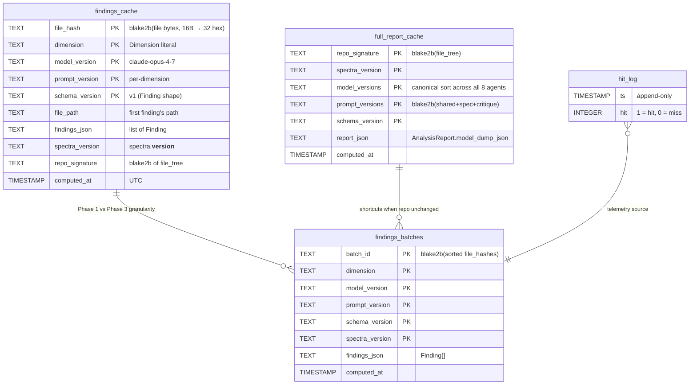
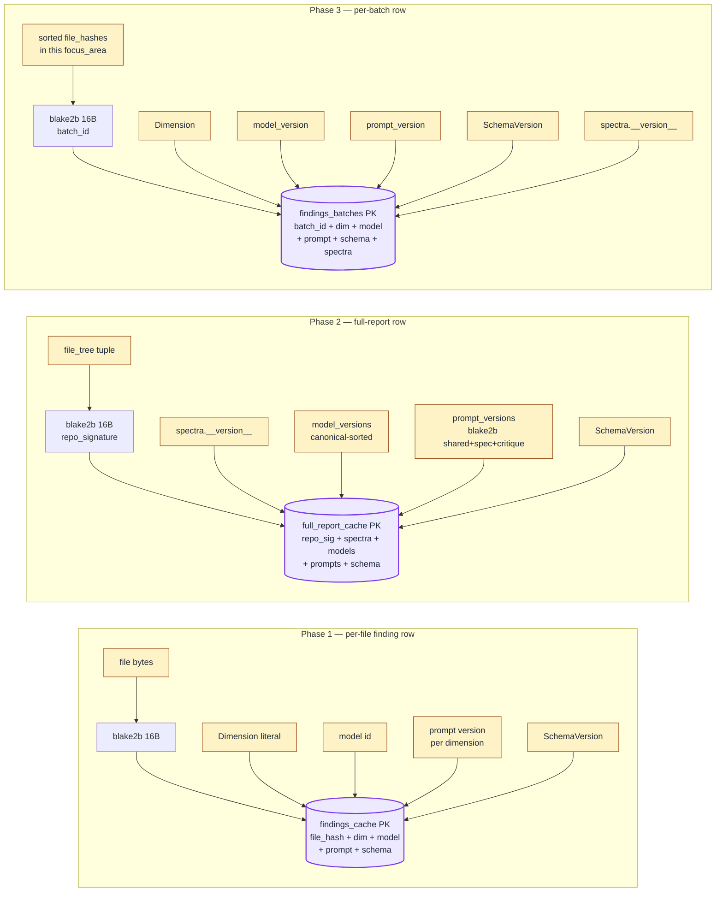
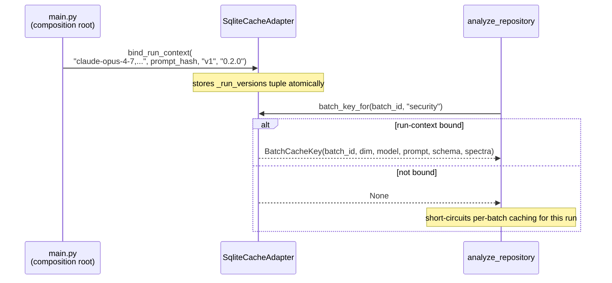
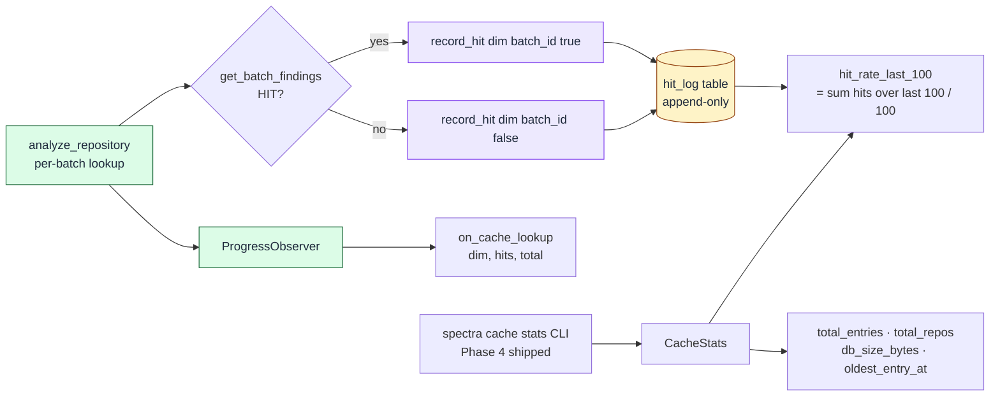

# Cache Subsystem — Schema, Keys, and Telemetry

Deep-dive on `CachePort` + `SqliteCacheAdapter`. Covers the four SQLite tables, the composite-key invalidation strategy, and the hit-log telemetry flow.

> The Excalidraw companion is at [`excalidraw/cache-schema.excalidraw`](excalidraw/cache-schema.excalidraw) — same content, hand-laid table boxes for editorial polish.

## SQLite schema (4 tables)



| Table | Phase | Purpose |
|-------|-------|---------|
| `findings_cache` | 1 | Per-`(file_hash, dimension)` rows. Foundation; survives intact even when `findings_batches` is the active read path. |
| `full_report_cache` | 2 | One row per `(file_tree, model+prompt+schema+spectra versions)`. Killer for the trivial "nothing changed" case — short-circuits Stages 3–5. |
| `findings_batches` | 3 | One row per `(focus_area, dimension)` batch. The killer feature: edit one file, invalidate one batch, all other batches keep returning instantly. |
| `hit_log` | 3 | Append-only telemetry. `_hit_rate_last_100` = rolling cache hit rate over the last 100 lookups, surfaced via `CacheStats.hit_rate_last_100`. Phase 4 will add `dimension`/`batch_id` columns. |

WAL mode (`PRAGMA journal_mode=WAL`) is set on every connect so concurrent reads don't block writes.

## Cache key composition



## Invalidation matrix

The composite primary key on every table makes invalidation a *no-op*: a stale row simply never matches a current-context lookup. There is no "cache invalidation logic" to maintain.

| Trigger | Detection | Tables affected | Scope |
|---------|-----------|-----------------|-------|
| `--force` flag | CLI: `force_cache_bypass=True` on `PipelineContext` | All reads bypassed; writes still occur | Whole run |
| `--no-cache` flag | Composition root: `cache_port=None` | All reads + writes skipped | Whole run |
| `spectra.__version__` bump | New `spectra_version` value in key | `full_report_cache`, `findings_batches` | Whole repo |
| Model version change | New `model_version` value in key | All three findings tables | Per dimension (or whole repo for full-report) |
| Prompt version bump | New `prompt_version` value (per-dim or `blake2b(prompt_text)`) in key | All three findings tables | Per dimension |
| Schema version bump | New `SchemaVersion` literal (manual bump in `cache_adapter.SCHEMA_VERSION`) | All three findings tables | Whole repo |
| File content change | `blake2b(file bytes)` differs → different `file_hash` | `findings_cache`, `findings_batches` (via `batch_id`) | Per file (and its containing batch) |
| File deleted | Path absent from new `file_tree` → different `repo_signature` | `full_report_cache` | Whole repo |
| Row >N days old | `computed_at < now - N` | All findings tables | Per row (lazy GC via Phase 4 `spectra cache prune`) |

Physical deletion of stale rows is deferred to `spectra cache prune` (Phase 4 — shipped in PR #19). The cache grows only as fast as you analyze new content; pruning is a maintenance task, not a hot-path operation.

## Run-context binding

Phase 3 introduced `bind_run_context(model_versions, prompt_versions, schema_version, spectra_version)` to eliminate the intermediate-inconsistent-state failure mode of the original Phase 1 setters. Composition-root callers configure the cache exactly once at startup; subsequent `batch_key_for()` calls inherit the four versions atomically.



## Hit-log telemetry flow



The terminal sees a per-dimension tally during ANALYZE (e.g. `security cache 7/8 hits`); the rolling rate is exposed via `spectra cache stats` once Phase 4 lands.

## Default cache location

```
$XDG_CACHE_HOME/spectra/cache.db          # if XDG_CACHE_HOME is set
~/.cache/spectra/cache.db                 # default fallback
~/.cache/spectra/cache.db-wal             # WAL sidecar
~/.cache/spectra/cache.db-shm             # shared-memory sidecar
```

Single-file SQLite; trivially backed up or wiped. The repos directory (`~/.cache/spectra/repos/<repo_signature>/last_report.json`) is reserved for `spectra cache stats` UX in Phase 4.

---

*Last updated: 2026-04-29 — schema for findings_cache, full_report_cache, findings_batches, hit_log; bind_run_context flow; SPEC-010 degradation reference.*
