# UML Class Diagram: Domain Model

All Pydantic models, Protocol interfaces, and agent class hierarchy traced from source.

```mermaid
classDiagram
    direction TB

    %% ── Literal Type Aliases (enums.py) ──
    class Severity {
        <<Literal>>
        critical
        high
        medium
        low
        info
    }

    class Dimension {
        <<Literal>>
        architecture
        security
        quality
        documentation
        maintainability
        performance
    }

    class Grade {
        <<Literal>>
        A+ A A-
        B+ B B-
        C+ C C-
        D+ D D-
        F
    }

    class AgentRole {
        <<Literal>>
        meta_prompter
        architecture
        security
        quality
        documentation
        dependency
        performance
        critique
    }

    class PipelineState {
        <<Literal>>
        pending
        ingesting
        analyzing
        merging
        critiquing
        reporting
        complete
        degraded
        failed
    }

    %% ── Frozen Pydantic Models (models.py) ──
    class FileLocation {
        <<frozen>>
        +file_path: str
        +line_start: int
        +line_end: int | None
    }

    class Finding {
        <<frozen>>
        +id: str
        +dimension: Dimension
        +severity: Severity
        +title: str
        +description: str
        +location: FileLocation
        +recommendation: str
        +agent_role: AgentRole
        +confidence: float [0.0-1.0]
        +validated_by_critique: bool
        +estimated_hours: float
        +code_snippet: str
        +__hash__() int
        +__eq__(other) bool
        +is_critical() bool
        +is_actionable() bool
    }

    class DimensionScore {
        <<frozen>>
        +dimension: Dimension
        +score: float [0-100]
        +grade: Grade
        +findings_count: int
        +weight: float
        +is_passing() bool
        +is_excellent() bool
    }

    class ScoreCard {
        <<frozen>>
        +overall_score: float [0-100]
        +overall_grade: Grade
        +dimensions: tuple~DimensionScore~
        +total_findings: int
        +worst_dimension() DimensionScore | None
        +best_dimension() DimensionScore | None
        +grade_for(dimension) Grade | None
    }

    class AgentOutput {
        <<frozen>>
        +agent_role: AgentRole
        +findings: tuple~Finding~
        +tokens_used: int
        +duration_seconds: float
        +raw_response: str
        +dimension_score: float | None
    }

    class AgentContext {
        <<frozen>>
        +agent_role: AgentRole
        +system_prompt: str
        +user_prompt: str
        +model: str
        +max_tokens: int
        +extended_thinking: bool
    }

    class AnalysisReport {
        <<frozen>>
        +repo_url: str
        +repo_name: str
        +score_card: ScoreCard
        +findings: tuple~Finding~
        +analysis_duration_seconds: float
        +total_tokens_used: int
        +total_cost_usd: float
        +agents_used: tuple~AgentRole~
        +is_degraded: bool
        +degraded_dimensions: tuple~Dimension~
        +cross_cutting_insights: tuple~str~
        +hallucination_removed_count: int
        +critical_finding_count() int
    }

    class Codebase {
        <<frozen>>
        +repo_url: str
        +repo_name: str
        +local_path: str
        +file_tree: tuple~str~
        +file_count() int
    }

    class AnalysisRequest {
        <<frozen>>
        +repo_url: str
        +quick: bool
        +output_format: str
    }

    class TokenBudget {
        <<frozen>>
        +total: int = 800_000
        +meta_prompter: int = 5_000
        +specialists_pool: int = 500_000
        +critique_reserved: int = 200_000
        +buffer: int = 95_000
        +has_remaining(used) bool
        +remaining(used) int
    }

    %% ── Protocol Interfaces (interfaces.py) ──
    class LLMGateway {
        <<Protocol>>
        +analyze(system_prompt, user_prompt, model, max_tokens)* str
        +analyze_with_thinking(system_prompt, user_prompt, model, max_tokens)* str
    }

    class GitPort {
        <<Protocol>>
        +clone(repo_url, target_dir)* None
        +get_file_tree(repo_dir)* list~str~
        +read_file(repo_dir, file_path)* str
        +validate_repo_size(repo_dir)* None
    }

    class TokenPort {
        <<Protocol>>
        +count(text)* int
        +fits_budget(text, budget)* bool
    }

    class ReportPort {
        <<Protocol>>
        +render(report, output_path)* str
    }

    class ProgressObserver {
        <<Protocol>>
        +on_stage_start(stage, message)* None
        +on_stage_complete(stage, message)* None
        +on_agent_start(agent)* None
        +on_agent_success(agent, duration)* None
        +on_agent_failure(agent, error)* None
        +on_error(stage, error)* None
    }

    class AnalysisAgent {
        <<Protocol>>
        +role: AgentRole
        +run(user_prompt)* AgentOutput
    }

    %% ── Agent Hierarchy (agents/) ──
    class BaseAgent {
        <<ABC>>
        #_role: AgentRole
        #_gateway: LLMGateway
        #_model: str
        #_system_prompt: str
        #_max_tokens: int
        +role: AgentRole
        +run(user_prompt) AgentOutput
        +validate_input(user_prompt)* None
        +build_prompt(user_prompt)* str
        +execute_llm(prompt) str
        +parse_output(raw) dict
        +validate_output(parsed)* tuple~Finding~
        +format_result(findings, raw, duration, tokens, score) AgentOutput
    }

    class MetaPrompter {
        -_SYSTEM_PROMPT: str
        +__init__(gateway)
        +validate_input(user_prompt) None
        +build_prompt(user_prompt) str
        +validate_output(parsed) tuple~Finding~
        +get_plan(raw_output) dict
    }

    class SpecialistAgent {
        -_dimension: Dimension
        -_id_prefix: str
        +__init__(role, gateway, dimension, id_prefix, system_prompt, model)
        +validate_input(user_prompt) None
        +build_prompt(user_prompt) str
        +validate_output(parsed) tuple~Finding~
    }

    class CritiqueAgent {
        -_SYSTEM_PROMPT: str
        +__init__(gateway)
        +validate_input(user_prompt) None
        +build_prompt(user_prompt) str
        +execute_llm(prompt) str
        +validate_output(parsed) tuple~Finding~
        +get_critique_result(raw_output) dict
    }

    %% ── Decorator Chain (infrastructure/) ──
    class AnthropicAdapter {
        -_client: AsyncAnthropic
        -_last_usage: tuple~int, int~
        -_closed: bool
        +last_usage: tuple~int, int~
        +analyze(...) str
        +analyze_with_thinking(...) str
        +close() None
    }

    class RetryDecorator {
        -_inner: LLMGateway
        -_max_retries: int = 3
        -_backoff_base: float = 1.0
        +last_usage: tuple~int, int~
        +analyze(...) str
        +analyze_with_thinking(...) str
    }

    class LoggingDecorator {
        -_inner: LLMGateway
        -_observer: ProgressObserver
        +last_usage: tuple~int, int~
        +analyze(...) str
        +analyze_with_thinking(...) str
    }

    class AgentFactory {
        -_gateway: LLMGateway
        +create(role) BaseAgent
        +create_specialists() list~BaseAgent~
    }

    %% ── Infrastructure Adapters ──
    class GitAdapter {
        +clone(repo_url, target_dir) None
        +get_file_tree(repo_dir) list~str~
        +read_file(repo_dir, file_path) str
        +validate_repo_size(repo_dir) None
    }

    class TiktokenAdapter {
        +count(text) int
        +fits_budget(text, budget) bool
    }

    class ReportAdapter {
        +render(report, output_path) str
    }

    class RichProgressReporter {
        +on_stage_start(stage, message) None
        +on_stage_complete(stage, message) None
        +on_agent_start(agent) None
        +on_agent_success(agent, duration) None
        +on_agent_failure(agent, error) None
        +on_error(stage, error) None
    }

    %% ── Composition Relationships ──
    Finding *-- FileLocation : location
    ScoreCard *-- DimensionScore : dimensions (1..6)
    AnalysisReport *-- ScoreCard : score_card
    AnalysisReport *-- Finding : findings (0..*)
    AgentOutput *-- Finding : findings (0..*)

    %% ── Inheritance ──
    BaseAgent <|-- MetaPrompter
    BaseAgent <|-- SpecialistAgent
    BaseAgent <|-- CritiqueAgent

    %% ── Protocol Implementations ──
    LLMGateway <|.. AnthropicAdapter : implements
    LLMGateway <|.. RetryDecorator : implements
    LLMGateway <|.. LoggingDecorator : implements
    GitPort <|.. GitAdapter : implements
    TokenPort <|.. TiktokenAdapter : implements
    ReportPort <|.. ReportAdapter : implements
    ProgressObserver <|.. RichProgressReporter : implements
    AnalysisAgent <|.. BaseAgent : implements

    %% ── Dependencies ──
    BaseAgent --> LLMGateway : _gateway
    RetryDecorator --> LLMGateway : _inner
    LoggingDecorator --> LLMGateway : _inner
    LoggingDecorator --> ProgressObserver : _observer
    AgentFactory --> LLMGateway : _gateway
    AgentFactory ..> MetaPrompter : creates
    AgentFactory ..> SpecialistAgent : creates
    AgentFactory ..> CritiqueAgent : creates
```

## Key Design Patterns

| Pattern | Where | Purpose |
|---------|-------|---------|
| **Decorator** | `LoggingDecorator` -> `RetryDecorator` -> `AnthropicAdapter` | Add logging + retry without modifying the adapter |
| **Factory** | `AgentFactory.create(role)` | Centralize agent construction, hide concrete classes |
| **Template Method** | `BaseAgent.run()` orchestrates `validate_input` -> `build_prompt` -> `execute_llm` -> `parse_output` -> `validate_output` -> `format_result` | Fixed lifecycle, subclasses customize steps |
| **Strategy** | `SpecialistAgent` parameterized by `dimension`, `id_prefix`, `system_prompt` | One class serves 6 different analysis dimensions |
| **Protocol (Structural Subtyping)** | `LLMGateway`, `GitPort`, `TokenPort`, `ReportPort`, `ProgressObserver`, `AnalysisAgent` | Dependency inversion without ABC inheritance |

## Layer Compliance

| Class | Layer | Imports From |
|-------|-------|-------------|
| `FileLocation`, `Finding`, `ScoreCard`, etc. | Layer 1 (entities) | Nothing from spectra |
| `LLMGateway`, `GitPort`, `ProgressObserver` | Layer 2 (use_cases) | entities only |
| `RichProgressReporter`, `cli_controller` | Layer 3 (adapters) | entities + use_cases |
| `AnthropicAdapter`, `AgentFactory`, `BaseAgent` | Layer 4 (infrastructure) | All inner layers |
