# UML Class Diagram: Domain Model

All Pydantic models, Protocol interfaces, and agent class hierarchy traced from source. Updated for the cache pipeline (Phases 1-3) and the `PipelineContext` value object.

```mermaid
classDiagram
    direction TB

    %% ── Literal Type Aliases (enums.py) ──
    class Severity {
        <<Literal>>
        critical
        high
        medium
        low
        info
    }

    class Dimension {
        <<Literal>>
        architecture
        security
        quality
        documentation
        maintainability
        performance
    }

    class Grade {
        <<Literal>>
        A+ A A-
        B+ B B-
        C+ C C-
        D+ D D-
        F
    }

    class AgentRole {
        <<Literal>>
        meta_prompter
        architecture
        security
        quality
        documentation
        dependency
        performance
        critique
    }

    class PipelineState {
        <<Literal>>
        pending
        ingesting
        analyzing
        merging
        critiquing
        reporting
        complete
        degraded
        failed
    }

    class SchemaVersion {
        <<Literal>>
        v1
    }

    %% ── Frozen Pydantic Models (models.py) ──
    class FileLocation {
        <<frozen>>
        +file_path: str
        +line_start: int
        +line_end: int | None
    }

    class Finding {
        <<frozen>>
        +id: str
        +dimension: Dimension
        +severity: Severity
        +title: str
        +description: str
        +location: FileLocation
        +recommendation: str
        +agent_role: AgentRole
        +confidence: float [0.0-1.0]
        +validated_by_critique: bool
        +estimated_hours: float
        +code_snippet: str
        +__hash__() int
        +__eq__(other) bool
        +is_critical() bool
        +is_actionable() bool
    }

    class DimensionScore {
        <<frozen>>
        +dimension: Dimension
        +score: float [0-100]
        +grade: Grade
        +findings_count: int
        +weight: float
        +is_passing() bool
        +is_excellent() bool
    }

    class ScoreCard {
        <<frozen>>
        +overall_score: float [0-100]
        +overall_grade: Grade
        +dimensions: tuple~DimensionScore~
        +total_findings: int
        +worst_dimension() DimensionScore | None
        +best_dimension() DimensionScore | None
        +grade_for(dimension) Grade | None
    }

    class AgentOutput {
        <<frozen>>
        +agent_role: AgentRole
        +findings: tuple~Finding~
        +tokens_used: int
        +duration_seconds: float
        +raw_response: str
        +dimension_score: float | None
    }

    class AgentContext {
        <<frozen>>
        +agent_role: AgentRole
        +system_prompt: str
        +user_prompt: str
        +model: str
        +max_tokens: int
    }

    class AnalysisReport {
        <<frozen>>
        +repo_url: str
        +repo_name: str
        +score_card: ScoreCard
        +findings: tuple~Finding~
        +analysis_duration_seconds: float
        +total_tokens_used: int
        +total_cost_usd: float
        +agents_used: tuple~AgentRole~
        +is_degraded: bool
        +degraded_dimensions: tuple~Dimension~
        +cross_cutting_insights: tuple~str~
        +hallucination_removed_count: int
        +critical_finding_count() int
    }

    class Codebase {
        <<frozen>>
        +repo_url: str
        +repo_name: str
        +local_path: str
        +file_tree: tuple~str~
        +file_count() int
    }

    class AnalysisRequest {
        <<frozen>>
        +repo_url: str
        +quick: bool
        +output_format: str
    }

    class TokenBudget {
        <<frozen>>
        +total: int = 800_000
        +meta_prompter: int = 5_000
        +specialists_pool: int = 500_000
        +critique_reserved: int = 200_000
        +buffer: int = 95_000
        +has_remaining(used) bool
        +remaining(used) int
    }

    %% ── Cache Entities (Phase 1-3) ──
    class CacheEntry {
        <<frozen>>
        +file_hash: str
        +file_path: str
        +dimension: Dimension
        +findings: tuple~Finding~
        +model_version: str
        +prompt_version: str
        +spectra_version: str
        +schema_version: SchemaVersion
        +computed_at: datetime
    }

    class CacheStats {
        <<frozen>>
        +total_entries: int
        +total_repos: int
        +db_size_bytes: int
        +hit_rate_last_100: float [0-1]
        +oldest_entry_at: datetime | None
    }

    class BatchPrompt {
        <<frozen — Phase 3>>
        +batch_id: str
        +file_paths: tuple~str~
        +file_hashes: tuple~str~
        +prompt_text: str
    }

    class BatchCacheKey {
        <<frozen — Phase 3>>
        +batch_id: str
        +dimension: Dimension
        +model_version: str
        +prompt_version: str
        +schema_version: str
        +spectra_version: str
    }

    class RepoCacheKey {
        <<frozen — Phase 2>>
        +repo_signature: str
        +spectra_version: str
        +model_versions: str
        +prompt_versions: str
        +schema_version: str
    }

    %% ── Use-case value objects (analyze_repository.py) ──
    class PipelineContext {
        <<dataclass frozen — facade input>>
        +request: AnalysisRequest
        +codebase: Codebase
        +source_files: dict~str,str~
        +specialists: list~AnalysisAgent~
        +critique: AnalysisAgent | None
        +meta_plan: AgentOutput
        +observer: ProgressObserver
        +token_budget: TokenBudget
        +git_port: GitPort | None
        +cache_port: CachePort | None
        +cache_key_factory: Callable | None
        +force_cache_bypass: bool
        +cache_versions: CacheVersions | None
    }

    class CacheVersions {
        <<dataclass frozen>>
        +model_versions: str
        +prompt_versions: str
        +schema_version: str
        +spectra_version: str
    }

    %% ── Protocol Interfaces (interfaces.py) ──
    class LLMGateway {
        <<Protocol>>
        +analyze(... effort?)* str
        +analyze_with_thinking(... effort?, task_budget_tokens?)* str
    }

    class GitPort {
        <<Protocol>>
        +prepare_workspace(source, target_dir)* str
        +clone(repo_url, target_dir)* None
        +get_file_tree(repo_dir)* list~str~
        +read_file(repo_dir, file_path)* str
        +validate_repo_size(repo_dir)* None
    }

    class TokenPort {
        <<Protocol>>
        +count(text)* int
        +fits_budget(text, budget)* bool
    }

    class ReportPort {
        <<Protocol>>
        +render(report, output_path)* str
    }

    class ProgressObserver {
        <<Protocol>>
        +on_stage_start(stage, message)* None
        +on_stage_complete(stage, message)* None
        +on_agent_start(agent)* None
        +on_agent_success(agent, duration)* None
        +on_agent_failure(agent, error)* None
        +on_error(stage, error)* None
        +on_cache_lookup(dimension, hits, total)* None
    }

    class CachePort {
        <<Protocol>>
        +get_findings(file_hash, dimension)* tuple~Finding~ | None
        +put_findings(file_hash, dimension, findings, model, prompt)* None
        +compute_repo_signature(file_tree)* str
        +stats()* CacheStats
        +clear(repo_signature?)* int
        +get_full_report(key)* AnalysisReport | None
        +put_full_report(key, report)* None
        +get_batch_findings(key)* tuple~Finding~ | None
        +put_batch_findings(key, findings)* None
        +record_hit(dimension, batch_id, hit)* None
        +bind_run_context(model, prompt, schema, spectra)* None
        +batch_key_for(batch_id, dimension)* BatchCacheKey | None
    }

    class AnalysisAgent {
        <<Protocol>>
        +role: AgentRole
        +run(user_prompt)* AgentOutput
    }

    %% ── Agent Hierarchy (agents/) ──
    class BaseAgent {
        <<ABC>>
        #_role: AgentRole
        #_gateway: LLMGateway
        #_model: str
        #_system_prompt: str
        #_max_tokens: int
        +role: AgentRole
        +run(user_prompt) AgentOutput
        +validate_input(user_prompt)* None
        +build_prompt(user_prompt)* str
        +execute_llm(prompt) str
        +parse_output(raw) dict
        +validate_output(parsed)* tuple~Finding~
        +format_result(...) AgentOutput
    }

    class MetaPrompter {
        +__init__(gateway)
        +execute_llm  effort=medium
    }

    class SpecialistAgent {
        -_dimension: Dimension
        -_id_prefix: str
        +__init__(role, gateway, dimension, id_prefix, system_prompt, model)
        +execute_llm  effort=xhigh
    }

    class CritiqueAgent {
        +__init__(gateway)
        +execute_llm  uses analyze_with_thinking
        +effort=high
        +task_budget=80_000
        +adaptive thinking, summarized
    }

    %% ── Decorator Chain (infrastructure/) ──
    class AnthropicAdapter {
        -_client: AsyncAnthropic
        -_last_usage: tuple~int,int~
        +analyze(... effort?) str
        +analyze_with_thinking(... effort?, task_budget_tokens?) str
        +close() None
    }

    class RetryDecorator {
        -_inner: LLMGateway
        -_max_retries: int = 3
        -_backoff_base: float = 1.0
        +analyze(... effort?) str
        +analyze_with_thinking(... effort?, task_budget_tokens?) str
    }

    class LoggingDecorator {
        -_inner: LLMGateway
        -_observer: ProgressObserver
        +analyze(... effort?) str
        +analyze_with_thinking(... effort?, task_budget_tokens?) str
    }

    class AgentFactory {
        -_gateway: LLMGateway
        +create(role) BaseAgent
        +create_specialists() list~BaseAgent~
    }

    %% ── Infrastructure Adapters ──
    class GitAdapter {
        +prepare_workspace(source, target_dir) str
        +clone(repo_url, target_dir) None
        +get_file_tree(repo_dir) list~str~
        +read_file(repo_dir, file_path) str
        +validate_repo_size(repo_dir) None
    }

    class TiktokenAdapter {
        +count(text) int
        +fits_budget(text, budget) bool
    }

    class ReportAdapter {
        +render(report, output_path) str
    }

    class RichProgressReporter {
        +on_stage_start(...) None
        +on_stage_complete(...) None
        +on_agent_start(...) None
        +on_agent_success(...) None
        +on_agent_failure(...) None
        +on_error(...) None
        +on_cache_lookup(dimension, hits, total) None
    }

    class SqliteCacheAdapter {
        -_conn: sqlite3.Connection
        -_db_path: Path
        -_run_versions: tuple | None
        +get_findings(...) tuple~Finding~ | None
        +put_findings(...) None
        +get_full_report(key) AnalysisReport | None
        +put_full_report(key, report) None
        +get_batch_findings(key) tuple~Finding~ | None
        +put_batch_findings(key, findings) None
        +record_hit(dimension, batch_id, hit) None
        +bind_run_context(...) None
        +batch_key_for(batch_id, dim) BatchCacheKey | None
        +compute_repo_signature(file_tree) str
        +stats() CacheStats
        +clear(repo_signature?) int
        +close() None
    }

    %% ── Composition Relationships ──
    Finding *-- FileLocation : location
    ScoreCard *-- DimensionScore : dimensions
    AnalysisReport *-- ScoreCard : score_card
    AnalysisReport *-- Finding : findings
    AgentOutput *-- Finding : findings
    CacheEntry --> Finding : findings

    PipelineContext --> AnalysisRequest : request
    PipelineContext --> Codebase : codebase
    PipelineContext --> CachePort : cache_port (optional)
    PipelineContext --> GitPort : git_port (optional)
    PipelineContext --> ProgressObserver : observer
    PipelineContext --> AnalysisAgent : specialists + critique
    PipelineContext --> CacheVersions : cache_versions

    %% ── Inheritance ──
    BaseAgent <|-- MetaPrompter
    BaseAgent <|-- SpecialistAgent
    BaseAgent <|-- CritiqueAgent

    %% ── Protocol Implementations ──
    LLMGateway <|.. AnthropicAdapter : implements
    LLMGateway <|.. RetryDecorator : implements
    LLMGateway <|.. LoggingDecorator : implements
    GitPort <|.. GitAdapter : implements
    TokenPort <|.. TiktokenAdapter : implements
    ReportPort <|.. ReportAdapter : implements
    ProgressObserver <|.. RichProgressReporter : implements
    CachePort <|.. SqliteCacheAdapter : implements
    AnalysisAgent <|.. BaseAgent : implements

    %% ── Dependencies ──
    BaseAgent --> LLMGateway : _gateway
    RetryDecorator --> LLMGateway : _inner
    LoggingDecorator --> LLMGateway : _inner
    LoggingDecorator --> ProgressObserver : _observer
    AgentFactory --> LLMGateway : _gateway
    AgentFactory ..> MetaPrompter : creates
    AgentFactory ..> SpecialistAgent : creates
    AgentFactory ..> CritiqueAgent : creates
    SqliteCacheAdapter ..> CacheEntry : reads/writes
    SqliteCacheAdapter ..> CacheStats : produces
    SqliteCacheAdapter ..> RepoCacheKey : keys full_report_cache
    SqliteCacheAdapter ..> BatchCacheKey : keys findings_batches
    BuildBatchPrompts ..> BatchPrompt : produces

    class BuildBatchPrompts {
        <<helper · use_cases>>
        +compute_file_hashes(git, codebase, paths) dict
        +build_batch_prompts(ctx, plan, state, hashes) dict
        +partition_by_cache(batches, cache, dim) tuple
    }
```

## Key Design Patterns

| Pattern | Where | Purpose |
|---------|-------|---------|
| **Decorator** | `LoggingDecorator` -> `RetryDecorator` -> `AnthropicAdapter` | Add logging + retry without modifying the adapter |
| **Factory** | `AgentFactory.create(role)` | Centralize agent construction, hide concrete classes |
| **Template Method** | `BaseAgent.run()` orchestrates lifecycle | Fixed lifecycle, subclasses customize steps |
| **Strategy** | `SpecialistAgent` parameterized by `dimension`, `id_prefix`, `system_prompt` | One class serves 6 different analysis dimensions |
| **Protocol (Structural Subtyping)** | `LLMGateway`, `GitPort`, `TokenPort`, `ReportPort`, `ProgressObserver`, `CachePort`, `AnalysisAgent` | Dependency inversion without ABC inheritance |
| **Parameter Object** | `PipelineContext` (Fowler) | Replaces 8-param `analyze_repository` signature with one frozen value object |
| **Repository / Cache** | `SqliteCacheAdapter` behind `CachePort` | Hides SQLite from the use-case layer; degrades to no-cache on SPEC-010 |

## Layer Compliance

| Class | Layer | Imports From |
|-------|-------|-------------|
| `FileLocation`, `Finding`, `ScoreCard`, `CacheEntry`, `BatchPrompt`, `BatchCacheKey`, `RepoCacheKey` | Layer 1 (entities) | Nothing from spectra |
| `LLMGateway`, `GitPort`, `ProgressObserver`, `CachePort`, `PipelineContext` | Layer 2 (use_cases) | entities only |
| `RichProgressReporter`, `cli_controller` | Layer 3 (adapters) | entities + use_cases |
| `AnthropicAdapter`, `AgentFactory`, `BaseAgent`, `SqliteCacheAdapter` | Layer 4 (infrastructure) | All inner layers |

The dependency rule is preserved end-to-end. Cache is additive: `CachePort` lives in Layer 2 with zero infrastructure imports; `SqliteCacheAdapter` lives in Layer 4 and may import from all inner layers.

---

*Last updated: 2026-04-29 — added all cache entities (Phases 1-3), `PipelineContext` value object, `prepare_workspace` on `GitPort`, `on_cache_lookup` on `ProgressObserver`, `SchemaVersion` literal.*
