# Container Diagram (C4 Level 2)

Inside the Spectra CLI software system: how the 4 Clean Architecture layers map onto Python modules and where the dependency arrows point.

```mermaid
flowchart TB
    classDef entities   fill:#dbeafe,stroke:#1e3a8a,stroke-width:2px,color:#1e293b
    classDef usecase    fill:#dcfce7,stroke:#166534,stroke-width:2px,color:#1e293b
    classDef adapter    fill:#fef3c7,stroke:#92400e,stroke-width:2px,color:#1e293b
    classDef infra      fill:#ede9fe,stroke:#7C3AED,stroke-width:2px,color:#1e293b
    classDef external   fill:#fee2e2,stroke:#7f1d1d,stroke-width:2px,color:#1e293b
    classDef storage    fill:#f3f4f6,stroke:#374151,stroke-width:2px,color:#1e293b

    subgraph L1 ["Layer 1 — Entities (entities/) · zero spectra imports"]
        direction LR
        Models["models.py<br/>Finding · ScoreCard · AnalysisReport<br/>Codebase · TokenBudget · AgentOutput<br/>CacheEntry · CacheStats · BatchPrompt<br/>BatchCacheKey · RepoCacheKey"]:::entities
        Enums["enums.py<br/>Severity · Dimension · Grade<br/>AgentRole · PipelineState<br/>SchemaVersion"]:::entities
        Errors["errors.py<br/>SpectraError hierarchy<br/>SPEC-001 … SPEC-010"]:::entities
    end

    subgraph L2 ["Layer 2 — Use Cases (use_cases/) · imports entities only"]
        direction LR
        Interfaces["interfaces.py<br/><b>Ports (Protocols):</b><br/>LLMGateway · GitPort · TokenPort<br/>ReportPort · ProgressObserver · CachePort"]:::usecase
        Analyze["analyze_repository.py<br/>Facade — accepts a single<br/>PipelineContext value object<br/>(Fowler 'Replace Long Param List')"]:::usecase
        Orch["orchestrate_agents.py<br/>asyncio.gather + Semaphore(4)<br/>partition_by_cache (Phase 3)"]:::usecase
        Budget["manage_token_budget.py<br/>DIMENSION_WEIGHTS<br/>allocate_specialist_budgets"]:::usecase
    end

    subgraph L3 ["Layer 3 — Adapters (adapters/) · imports entities + use_cases"]
        direction LR
        CLI["cli_controller.py<br/>Typer app<br/><b>analyze</b> · <b>cache stats|clear|prune</b>"]:::adapter
        Progress["progress_reporter.py<br/>RichProgressReporter<br/>impl ProgressObserver<br/>(incl. on_cache_lookup)"]:::adapter
        Presenter["analysis_presenter.py<br/>ScoreCard terminal display"]:::adapter
    end

    subgraph L4 ["Layer 4 — Infrastructure (infrastructure/) · imports all inner layers"]
        direction TB
        Main["main.py — Composition Root<br/>(single DI wiring point)"]:::infra
        subgraph L4Adapters [" "]
            direction LR
            Anthropic["anthropic_adapter.py<br/>AnthropicAdapter<br/>impl LLMGateway"]:::infra
            Retry["retry_decorator.py<br/>RetryDecorator<br/>impl LLMGateway"]:::infra
            Logging["logging_decorator.py<br/>LoggingDecorator<br/>impl LLMGateway"]:::infra
            Git["git_adapter.py<br/>GitAdapter<br/>impl GitPort + prepare_workspace"]:::infra
            Tik["tiktoken_adapter.py<br/>TiktokenAdapter<br/>impl TokenPort"]:::infra
            Report["report_adapter.py<br/>ReportAdapter<br/>impl ReportPort"]:::infra
            Cache["cache_adapter.py<br/>SqliteCacheAdapter<br/>impl CachePort"]:::infra
            Agents["agents/<br/>BaseAgent · AgentFactory<br/>MetaPrompter · SpecialistAgent ×6<br/>CritiqueAgent · specialist_prompts"]:::infra
        end
    end

    %% External dependencies (outside the package)
    AnthropicSaaS["Anthropic API<br/>Claude Opus 4.7"]:::external
    GitHubExt["GitHub.com<br/>git clone (HTTPS)"]:::external
    SQLiteFile[("~/.cache/spectra/cache.db<br/>SQLite + WAL")]:::storage
    Reports[("spectra-report.{html,json,sarif}")]:::storage

    %% Inward dependencies (Layer 4 → 3 → 2 → 1)
    Main --> Analyze
    Main --> Orch
    Main --> Budget
    Main --> Anthropic
    Main --> Retry
    Main --> Logging
    Main --> Git
    Main --> Tik
    Main --> Report
    Main --> Cache
    Main --> Agents
    Main --> CLI
    Main --> Progress
    Main --> Presenter

    CLI --> Analyze
    CLI --> Cache

    Progress --> Interfaces
    Presenter --> Models

    Analyze --> Interfaces
    Analyze --> Models
    Analyze --> Orch
    Analyze --> Budget
    Orch --> Interfaces
    Budget --> Models

    Interfaces --> Models
    Interfaces --> Enums

    Anthropic -.implements.-> Interfaces
    Retry -.implements.-> Interfaces
    Logging -.implements.-> Interfaces
    Git -.implements.-> Interfaces
    Tik -.implements.-> Interfaces
    Report -.implements.-> Interfaces
    Cache -.implements.-> Interfaces
    Agents -.uses.-> Interfaces
    Progress -.implements.-> Interfaces

    %% External boundary crossings
    Anthropic --> AnthropicSaaS
    Git --> GitHubExt
    Cache <--> SQLiteFile
    Report --> Reports

    Models -.dep.-> Enums
    Errors -.uses.-> Enums
```



## The Dependency Rule, made visible

| Layer | May Import From | Never Imports From | Concrete files |
|-------|----------------|-------------------|----------------|
| **1 — Entities** | stdlib + pydantic | Any spectra module | `entities/models.py`, `entities/enums.py`, `entities/errors.py` |
| **2 — Use Cases** | Layer 1 | Layers 3, 4 | `use_cases/interfaces.py`, `use_cases/analyze_repository.py`, `use_cases/orchestrate_agents.py`, `use_cases/manage_token_budget.py` |
| **3 — Adapters** | Layers 1, 2 | Layer 4 | `adapters/cli_controller.py`, `adapters/progress_reporter.py`, `adapters/analysis_presenter.py` |
| **4 — Infrastructure** | All inner layers | (outermost — nothing further out) | `infrastructure/main.py`, all `infrastructure/*_adapter.py`, `infrastructure/agents/*` |

Every solid arrow in the diagram above points **inward** (toward Layer 1). Every dotted `implements` arrow goes from a Layer-4 adapter up to the Layer-2 port it satisfies — that's the dependency-inversion lever that lets us swap adapters without touching use cases.

## Where the new pieces live

The cache pipeline (Phases 1–4) and the local-path branch are entirely additive — nothing in the layer map shifted, only new modules + entities slotted into existing layers:

| New piece | Layer | File |
|-----------|-------|------|
| `CachePort` Protocol | 2 | `use_cases/interfaces.py` |
| `SqliteCacheAdapter` | 4 | `infrastructure/cache_adapter.py` |
| `CacheEntry`, `CacheStats`, `BatchPrompt`, `BatchCacheKey`, `RepoCacheKey` | 1 | `entities/models.py` |
| `SchemaVersion` literal | 1 | `entities/enums.py` |
| `SPEC-010: Cache I/O failed` | 1 | `entities/errors.py` |
| `PipelineContext` value object | 2 | `use_cases/analyze_repository.py` |
| `prepare_workspace(source, target_dir)` (local-path) | 2 (port) + 4 (impl) | `interfaces.py` + `git_adapter.py` |
| `spectra cache stats|clear|prune` CLI subcommands | 3 | `adapters/cli_controller.py` *(Phase 4 — in flight)* |

## Composition Root

`infrastructure/main.py` is the **single** place where dependencies are wired:

```python
# Roughly (see main.py for the actual code)
adapter = AnthropicAdapter(api_key=api_key)
retry   = RetryDecorator(adapter, max_retries=3, backoff_base=1.0)
gateway = LoggingDecorator(retry, observer=observer)

cache    = None if no_cache else SqliteCacheAdapter(default_cache_path())
git      = GitAdapter()
factory  = AgentFactory(gateway)
ctx      = PipelineContext(
    request=request, codebase=codebase, source_files=source_files,
    specialists=factory.create_specialists(), critique=factory.create("critique"),
    git_port=git, cache_port=cache, cache_key_factory=..., observer=observer, ...,
)
report   = await analyze_repository(ctx)
```

No service locator, no framework magic, no DI container. Just function calls.

---

*Last updated: 2026-04-29 — initial container view; reflects PipelineContext refactor + cache adapter + local-path branch.*
