# Design Patterns Catalog — Spectra

> Every pattern documented here is traced from the actual source code.
> File:line references point to real implementations.

---

## Patterns Overview

All 11 patterns and how they connect across Spectra's Clean Architecture layers:

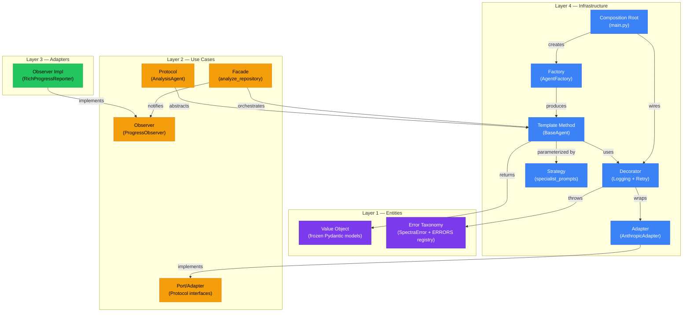

---

## 1. Template Method

**GoF Category:** Behavioral

**Why chosen:** All 8 agents share the same lifecycle (validate, build prompt, call LLM, parse, validate output, format) but differ in specific steps. Template Method eliminates duplication while enforcing a consistent pipeline.

**Implementation:** `src/spectra/infrastructure/agents/base_agent.py:23-147`

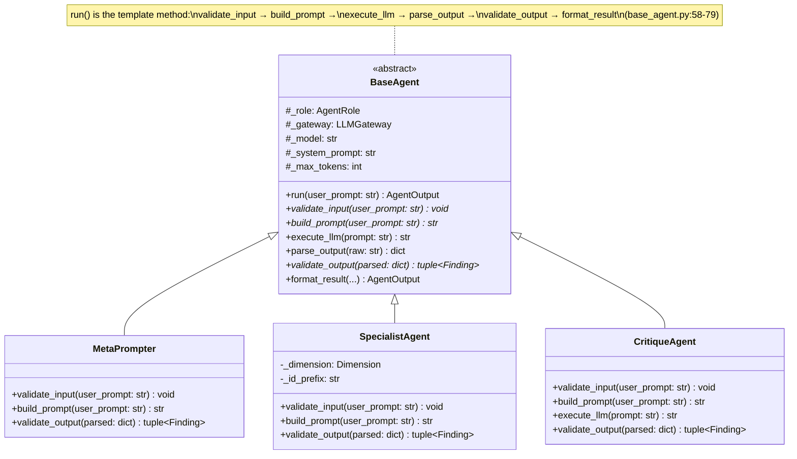

The `run()` method at line 58 defines the invariant algorithm. Subclasses override only what varies:
- **MetaPrompter** (`meta_prompter.py:127`) — validates plan JSON keys, never returns findings
- **SpecialistAgent** (`specialist_agent.py:17`) — filters findings by MIN_CONFIDENCE threshold
- **CritiqueAgent** (`critique_agent.py:127`) — overrides `execute_llm` to use `analyze_with_thinking`

---

## 2. Decorator (Structural)

**GoF Category:** Structural

**Why chosen:** LLM calls need retry logic and observability, but these concerns must remain separate from the API adapter itself. Decorator allows composing behaviors without modifying `AnthropicAdapter`.

**Implementation:**
- `src/spectra/infrastructure/logging_decorator.py:39-103`
- `src/spectra/infrastructure/retry_decorator.py:21-99`

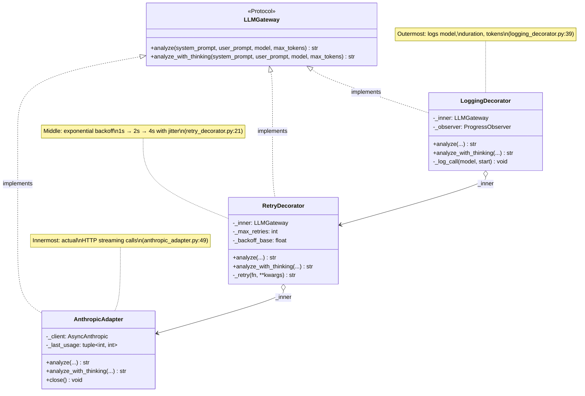

The chain is wired at `main.py:108-110`:
```python
adapter = AnthropicAdapter(api_key=api_key)
retry   = RetryDecorator(adapter, max_retries=3, backoff_base=1.0)
gateway = LoggingDecorator(retry, observer=observer)
```

All three satisfy `LLMGateway` via Python's structural subtyping (Protocol compliance) — no explicit inheritance required.

---

## 3. Adapter

**GoF Category:** Structural

**Why chosen:** The Anthropic SDK has its own API surface (`AsyncAnthropic`, streaming events, exception types). The Adapter translates this into Spectra's `LLMGateway` protocol while mapping SDK exceptions to domain error codes.

**Implementation:** `src/spectra/infrastructure/anthropic_adapter.py:49-258`

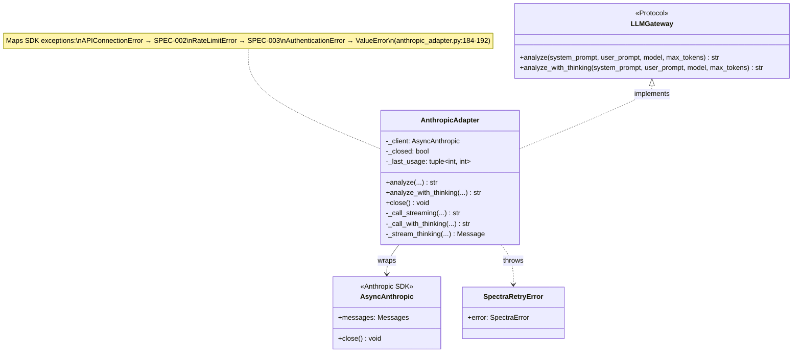

Key translations:
- `anthropic.APIConnectionError` → `SpectraRetryError(ERRORS["SPEC-002"])` (line 185)
- `anthropic.RateLimitError` → `SpectraRetryError(ERRORS["SPEC-003"])` (line 187)
- Streaming events are assembled into a single string response (lines 162-183)

---

## 4. Factory

**GoF Category:** Creational

**Why chosen:** The composition root needs to create all 8 agents without knowing their concrete constructors. The Factory centralizes creation logic and ensures all agents share the same decorated gateway.

**Implementation:** `src/spectra/infrastructure/agents/agent_factory.py:39-109`

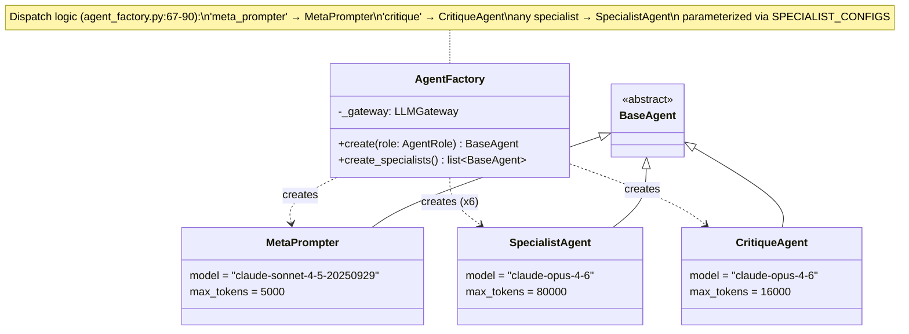

Factory dispatch at `agent_factory.py:55-90`:
- `"meta_prompter"` → `MetaPrompter(gateway)` (Sonnet 4.5, 5K tokens)
- `"critique"` → `CritiqueAgent(gateway)` (Opus 4.6, extended thinking)
- Any of 6 specialist roles → `SpecialistAgent(role, gateway, **config)` from `SPECIALIST_CONFIGS`

---

## 5. Strategy

**GoF Category:** Behavioral

**Why chosen:** Six specialist agents share identical execution logic but differ only in their analysis dimension and system prompt. Strategy allows parameterizing a single `SpecialistAgent` class with dimension-specific behavior.

**Implementation:** `src/spectra/infrastructure/agents/specialist_prompts.py:739-746`

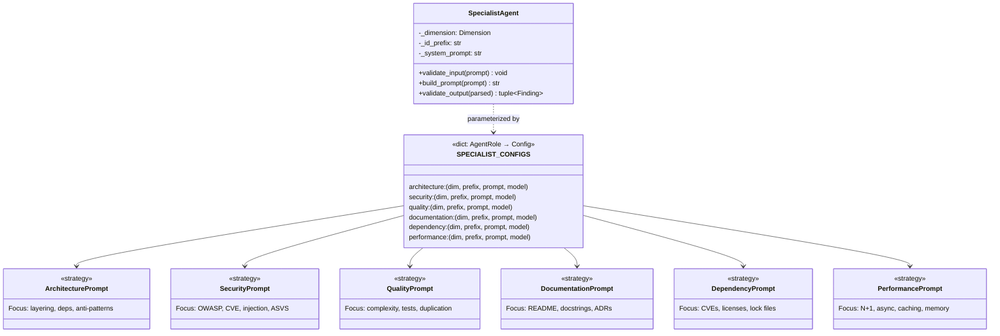

The `SPECIALIST_CONFIGS` dict at `specialist_prompts.py:739-746` maps each `AgentRole` to a 4-tuple of `(dimension, id_prefix, system_prompt, model)`. The `AgentFactory` reads this config and passes it to `SpecialistAgent.__init__()`, making each instance behave differently based on its strategy.

---

## 6. Facade

**GoF Category:** Structural

**Why chosen:** The 6-stage analysis pipeline (Plan, Analyze, Merge, Critique, Report) involves complex coordination. The Facade provides a single entry point that hides orchestration complexity from callers.

**Implementation:** `src/spectra/use_cases/analyze_repository.py:111-166`

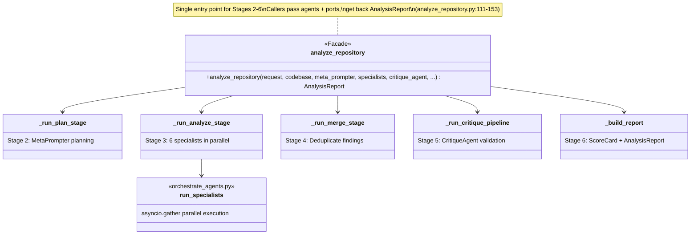

The internal pipeline at `analyze_repository.py:156-166`:
```
plan → resolve_source_files → analyze → merge → critique → build_report
```
Each stage is a pure function or async function. Callers (the composition root) never interact with individual stages.

---

## 7. Port/Adapter (Hexagonal Architecture)

**GoF Category:** Architectural (Ports and Adapters / Hexagonal)

**Why chosen:** Clean Architecture requires inner layers to define interfaces (ports) that outer layers implement (adapters). This inverts the dependency direction — use cases depend on abstractions, not on Anthropic/Git/Jinja2 specifics.

**Implementation:** `src/spectra/use_cases/interfaces.py:23-149`

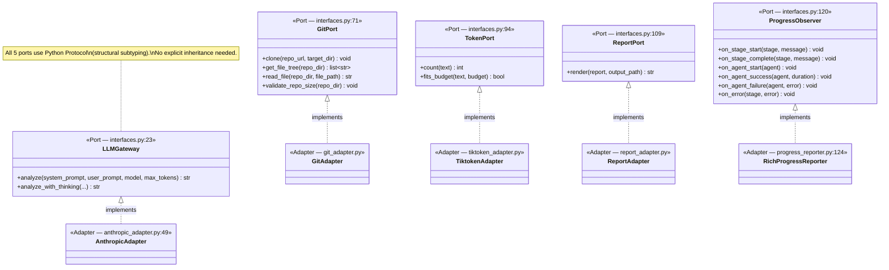

Five ports define the boundary between use cases and infrastructure. Each port has exactly one production adapter. The use-case layer (`analyze_repository.py`) depends only on port types, never on concrete adapters.

---

## 8. Observer

**GoF Category:** Behavioral

**Why chosen:** Pipeline stages and agent lifecycle events need to update the terminal display, but the orchestration logic (Layer 2) must not know about Rich Console (Layer 3). Observer decouples event production from consumption.

**Implementation:**
- Port: `src/spectra/use_cases/interfaces.py:120-149`
- Adapter: `src/spectra/adapters/progress_reporter.py:124-366`

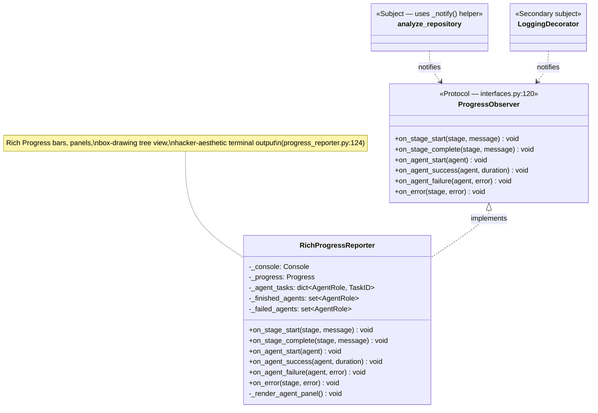

The `_notify()` helper at `analyze_repository.py:990-997` safely dispatches events:
```python
def _notify(observer, method, *args):
    if observer is not None:
        getattr(observer, method)(*args)
```

The `LoggingDecorator` also acts as a secondary subject, forwarding LLM call metadata (model, duration, tokens) to the same observer at `logging_decorator.py:95-102`.

---

## 9. Value Object (DDD)

**GoF Category:** Domain-Driven Design

**Why chosen:** Domain entities must be immutable and comparable by value, not identity. Frozen Pydantic models guarantee that findings, scores, and reports cannot be mutated after creation — critical for a pipeline where data flows through multiple stages.

**Implementation:** `src/spectra/entities/models.py:35-303`

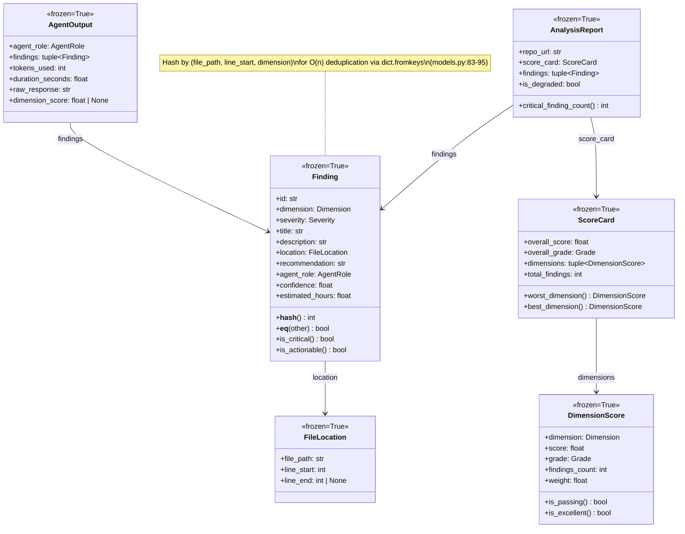

Key design choices:
- All models use `frozen=True` (immutability enforced by Pydantic)
- `Finding.__hash__` uses `(file_path, line_start, dimension)` for deduplication at `models.py:83-85`
- Tuples instead of lists for collection fields (immutable containers)
- `Field(ge=0.0, le=1.0)` constraints on `confidence` at `models.py:78`

---

## 10. Error Taxonomy with Retry Metadata

**GoF Category:** Domain Pattern

**Why chosen:** Fallible operations (API calls, git clone, validation) need structured error handling with retry decisions. The error taxonomy carries retry metadata so the `RetryDecorator` can make autonomous retry-or-abort decisions.

**Implementation:** `src/spectra/entities/errors.py:14-128`

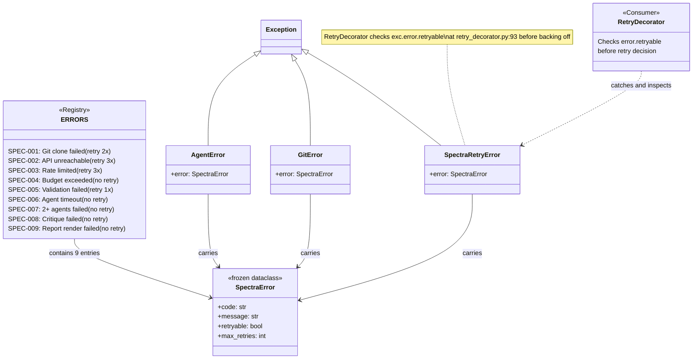

The retry decision at `retry_decorator.py:91-94`:
```python
except SpectraRetryError as exc:
    if not exc.error.retryable:
        raise  # Non-retryable: propagate immediately
```

---

## 11. Composition Root (DI Wiring)

**GoF Category:** Architectural

**Why chosen:** Clean Architecture mandates that dependency injection occurs at a single point — the outermost layer. The composition root wires the complete object graph: decorator chain, agent factory, infrastructure adapters, and pipeline entry point.

**Implementation:** `src/spectra/infrastructure/main.py:69-195`

```mermaid
classDiagram
    class CompositionRoot {
        <<main.py:69>>
        +_run_analysis(repo_url, output_path, ...) AnalysisReport
        +cli() void
    }

    class DecoratorChain {
        LoggingDecorator
        → RetryDecorator
        → AnthropicAdapter
    }

    class AgentFactory {
        +create(role) BaseAgent
        +create_specialists() list
    }

    class InfraAdapters {
        GitAdapter
        ReportAdapter
        TiktokenAdapter
    }

    class analyze_repository {
        <<Facade entry point>>
    }

    class cli_controller {
        <<Typer CLI>>
        set_analyzer_factory()
    }

    CompositionRoot --> DecoratorChain : wires (main.py:108-110)
    CompositionRoot --> AgentFactory : creates (main.py:144)
    CompositionRoot --> InfraAdapters : creates (main.py:115-116)
    CompositionRoot --> analyze_repository : delegates (main.py:161)
    CompositionRoot --> cli_controller : injects (main.py:341)

    note for CompositionRoot "ONLY module that imports\nfrom ALL layers.\nWires DI graph at startup.\n(main.py lines 43-54)"
```

The wiring sequence at `main.py:107-147`:
1. Create `AnthropicAdapter` (innermost)
2. Wrap with `RetryDecorator` (exponential backoff)
3. Wrap with `LoggingDecorator` (outermost, observability)
4. Create `AgentFactory` with the fully-decorated gateway
5. Factory creates MetaPrompter + 6 specialists + CritiqueAgent
6. Delegate to `analyze_repository()` facade

---

## Pattern Interaction Map

How all 11 patterns interact during a single analysis run:

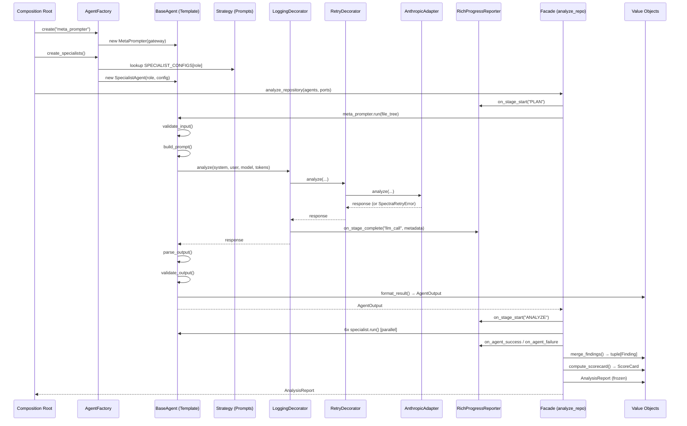

---

## Summary Table

| # | Pattern | GoF Category | Spectra Class(es) | File:Line |
|---|---------|-------------|-------------------|-----------|
| 1 | Template Method | Behavioral | `BaseAgent.run()` | `base_agent.py:58` |
| 2 | Decorator | Structural | `LoggingDecorator`, `RetryDecorator` | `logging_decorator.py:39`, `retry_decorator.py:21` |
| 3 | Adapter | Structural | `AnthropicAdapter` | `anthropic_adapter.py:49` |
| 4 | Factory | Creational | `AgentFactory` | `agent_factory.py:39` |
| 5 | Strategy | Behavioral | `SPECIALIST_CONFIGS` + `SpecialistAgent` | `specialist_prompts.py:739` |
| 6 | Facade | Structural | `analyze_repository()` | `analyze_repository.py:111` |
| 7 | Port/Adapter | Architectural | `LLMGateway`, `GitPort`, `TokenPort`, `ReportPort`, `ProgressObserver` | `interfaces.py:23-149` |
| 8 | Observer | Behavioral | `ProgressObserver` / `RichProgressReporter` | `interfaces.py:120`, `progress_reporter.py:124` |
| 9 | Value Object | DDD | `Finding`, `ScoreCard`, `AgentOutput`, et al. | `models.py:35-303` |
| 10 | Error Taxonomy | Domain | `SpectraError`, `ERRORS` registry | `errors.py:14-51` |
| 11 | Composition Root | Architectural | `main.py._run_analysis()` | `main.py:69` |
