# ER Diagram: Domain Entities

All entities with attributes, types, and cardinality traced from `entities/models.py`.

```mermaid
erDiagram
    AnalysisRequest {
        string repo_url PK
        bool quick
        string output_format
    }

    Codebase {
        string repo_url PK
        string repo_name
        string local_path
        tuple_str file_tree
    }

    TokenBudget {
        int total "800000"
        int meta_prompter "5000"
        int specialists_pool "500000"
        int critique_reserved "200000"
        int buffer "95000"
    }

    AgentContext {
        AgentRole agent_role PK
        string system_prompt
        string user_prompt
        string model
        int max_tokens
        bool adaptive_thinking
        string effort "low|medium|high|xhigh|max"
        int task_budget_tokens "nullable"
    }

    AgentOutput {
        AgentRole agent_role PK
        tuple_Finding findings
        int tokens_used
        float duration_seconds
        string raw_response
        float dimension_score "nullable"
    }

    FileLocation {
        string file_path PK
        int line_start PK
        int line_end "nullable"
    }

    Finding {
        string id PK
        Dimension dimension
        Severity severity
        string title
        string description
        string recommendation
        AgentRole agent_role
        float confidence "0.0-1.0"
        bool validated_by_critique
        float estimated_hours
        string code_snippet
    }

    DimensionScore {
        Dimension dimension PK
        float score "0-100"
        Grade grade
        int findings_count
        float weight
    }

    ScoreCard {
        float overall_score "0-100"
        Grade overall_grade
        int total_findings
    }

    AnalysisReport {
        string repo_url PK
        string repo_name
        float analysis_duration_seconds
        int total_tokens_used
        float total_cost_usd
        tuple_AgentRole agents_used
        bool is_degraded
        tuple_Dimension degraded_dimensions
        tuple_str cross_cutting_insights
        int hallucination_removed_count
    }

    %% ── Relationships ──
    AnalysisRequest ||--|| Codebase : "triggers clone of"
    Codebase ||--|| TokenBudget : "allocates budget for"
    Codebase ||--|{ AgentContext : "generates context for each agent"
    AgentContext ||--|| AgentOutput : "produces"
    AgentOutput ||--o{ Finding : "contains 0..N"
    Finding ||--|| FileLocation : "has location"
    Finding }o--|| DimensionScore : "contributes to score"
    DimensionScore }|--|| ScoreCard : "aggregated into (1..6)"
    ScoreCard ||--|| AnalysisReport : "embedded in"
    AnalysisReport ||--o{ Finding : "contains deduplicated 0..N"
    TokenBudget ||--|{ AgentContext : "constrains max_tokens"
```

## Entity Attribute Details

### Primary Identifiers

| Entity | Primary Key | Notes |
|--------|-------------|-------|
| `AnalysisRequest` | `repo_url` | User-initiated, immutable |
| `Codebase` | `repo_url` | 1:1 with AnalysisRequest |
| `Finding` | `id` (e.g. `sec-001`) | Dedup key: `(file_path, line_start, dimension)` |
| `FileLocation` | `(file_path, line_start)` | Composite key, value object |
| `AgentOutput` | `agent_role` | One output per agent per run |
| `DimensionScore` | `dimension` | One score per dimension (6 max) |
| `AnalysisReport` | `(repo_url, timestamp)` | Final aggregate, immutable |

### Cardinality Summary

| Relationship | Cardinality | Description |
|-------------|-------------|-------------|
| AnalysisRequest -> Codebase | 1:1 | Each request clones one repo |
| Codebase -> AgentContext | 1:N (8 max) | One context per agent (MetaPrompter + 6 specialists + Critique) |
| AgentContext -> AgentOutput | 1:1 | Each agent produces exactly one output |
| AgentOutput -> Finding | 1:N (0..*) | Each agent produces 0+ findings; MetaPrompter/Critique produce 0 |
| Finding -> FileLocation | 1:1 | Every finding references exactly one source location |
| Finding -> DimensionScore | N:1 | Multiple findings contribute to one dimension's score |
| DimensionScore -> ScoreCard | N:1 (1-6) | 1-6 dimensions aggregate into one ScoreCard |
| ScoreCard -> AnalysisReport | 1:1 | One ScoreCard per report |
| AnalysisReport -> Finding | 1:N | Report contains all deduplicated, validated findings |

### Immutability

All entities use `frozen=True` (Pydantic BaseModel). Mutations create new instances via `model_copy(update={...})`, used in severity adjustment during the critique stage.

---

*Last updated: 2026-04-29 — `AgentContext` reflects Opus 4.7 surface (`adaptive_thinking`, `effort`, `task_budget_tokens`).*
