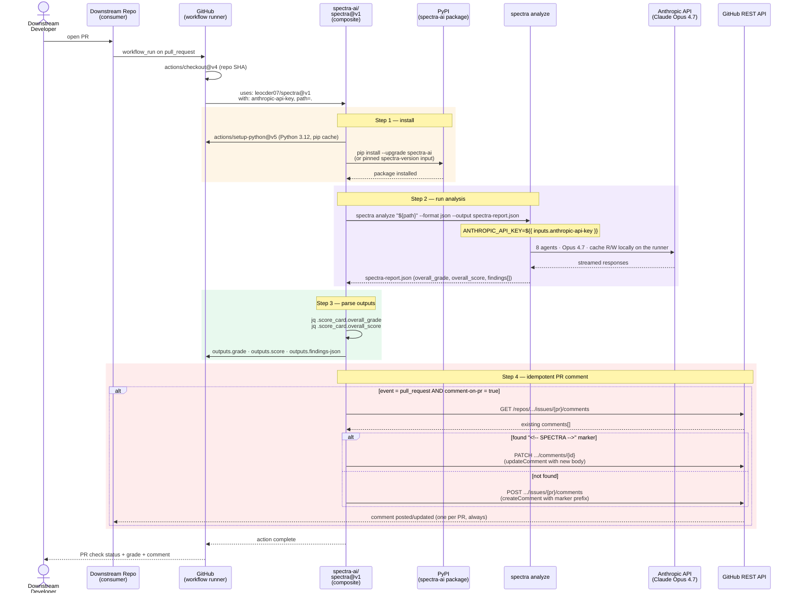
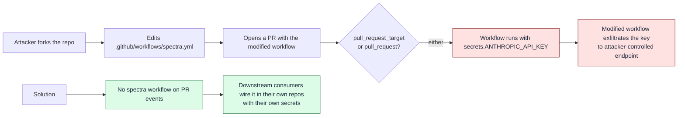
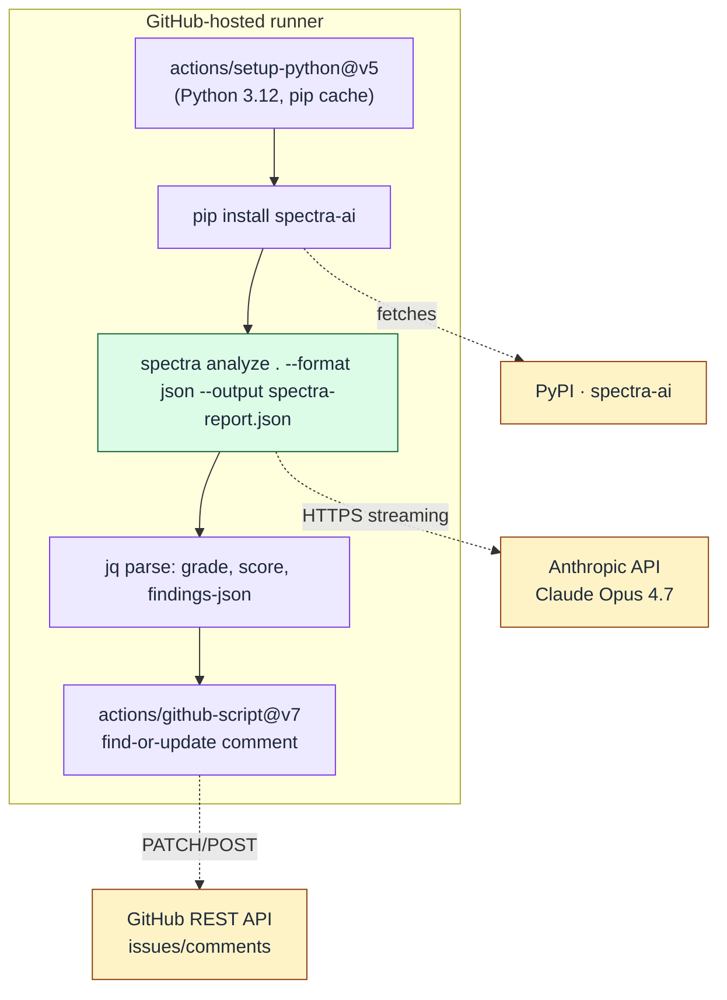

# GitHub Action Distribution Flow

How `leocder07/spectra@v1` lands in a downstream repository, what runs on every PR, and the deliberate non-dogfood decision recorded in [ADR-010](../architecture/adr/ADR-010-no-self-dogfooding.md).

## End-to-end PR flow (sequence)



## What the comment looks like

```html
<!-- SPECTRA -->
## Spectra · grade B+ (85.7 / 100)

| Dimension | Score | Grade |
|-----------|------:|:-----:|
| Architecture | 88 | A- |
| Security | 79 | C+ |
| Quality | 87 | A- |
| ...

### Top critical findings
1. Hard-coded API key in src/auth.py:42 ...
```

The first line — `<!-- SPECTRA -->` — is the load-bearing sentinel. It's invisible in rendered Markdown and unmistakable to a string-search comment scanner. Every re-run of the workflow finds the same comment and updates it in place. A PR with 14 force-pushes still has exactly one Spectra comment, always reflecting the latest run.

## Caller's workflow shape

```yaml
# .github/workflows/spectra.yml in a downstream repo
name: Spectra
on:
  pull_request:
    types: [opened, synchronize, reopened]

permissions:
  contents: read
  pull-requests: write   # required only when comment-on-pr=true

jobs:
  analyze:
    runs-on: ubuntu-latest
    steps:
      - uses: actions/checkout@v4
      - uses: leocder07/spectra@v1
        with:
          anthropic-api-key: ${{ secrets.ANTHROPIC_API_KEY }}
          # path: .            # default
          # format: json       # default
          # quick-mode: false  # default
          # comment-on-pr: true # default
          # spectra-version: "0.2.0"  # optional pin
```

## Action manifest — where the decisions live

| Concern | Location in `action.yml` | Note |
|---------|--------------------------|------|
| Required input | `inputs.anthropic-api-key` (`required: true`) | Caller must wire from `${{ secrets.* }}` |
| Optional path | `inputs.path` (`default: "."`) | CLI now accepts local paths directly (no clone-URL workaround needed) |
| Format | `inputs.format` (`default: json`) | JSON is recommended for CI parsing |
| Quick mode | `inputs.quick-mode` (`default: false`) | Skips CritiqueAgent; ~60s vs ~3min |
| Idempotency | `inputs.comment-on-pr` + `<!-- SPECTRA -->` marker | Single comment per PR |
| Python version | `inputs.python-version` (`default: 3.12`) | Spectra requires 3.12+ |
| Pinning | `inputs.spectra-version` (default: latest) | Caller can pin to a known-good release |
| Outputs | `outputs.grade`, `outputs.score`, `outputs.findings-json` | Other workflow steps can gate on these |
| 3rd-party Action SHAs | `actions/setup-python@0b93645…`, `actions/github-script@…` | Pinned by SHA, not by tag |

## Why this repo does NOT run its own Action on its own PRs

Most projects close the dogfood loop by running their own GitHub Action on their own pull requests. Spectra deliberately does **not**. The decision and its rationale are in [ADR-010](../architecture/adr/ADR-010-no-self-dogfooding.md). The short version:



The `pull_request` event scopes secrets carefully (read-only token, no env secrets exposed to forked-PR runs by default), but the surface area is non-trivial — and an organization API key attached to the *publisher* repository is a tier-1 incident if leaked. Removing the self-analysis workflows (`spectra.yml`, `spectra-analyze.yml`, `example-usage.yml`) eliminates the entire class of attack with no functional loss: we still test the Action in CI on push events to maintained branches, just not on untrusted PRs.

The Action itself is published, exercised externally, and supported normally — only the *self-application* is gone.

## Reference flow — Action component diagram



## References

- Action manifest: [`action.yml`](../../action.yml)
- ADR — distribution decision: [ADR-007](../architecture/adr/ADR-007-github-action-distribution.md)
- ADR — non-dogfood decision: [ADR-010](../architecture/adr/ADR-010-no-self-dogfooding.md)

---

*Last updated: 2026-04-29 — initial diagram covering the v1 composite Action, the idempotent comment pattern, and the non-dogfood rationale.*
