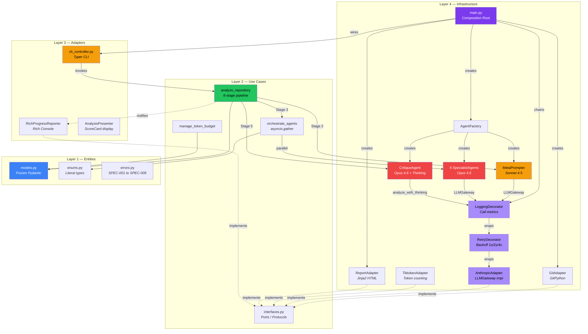
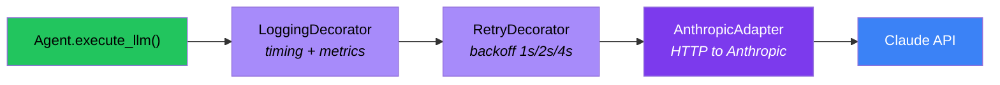
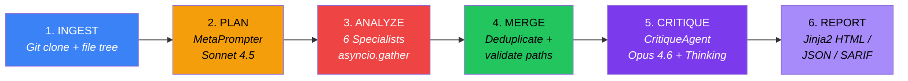
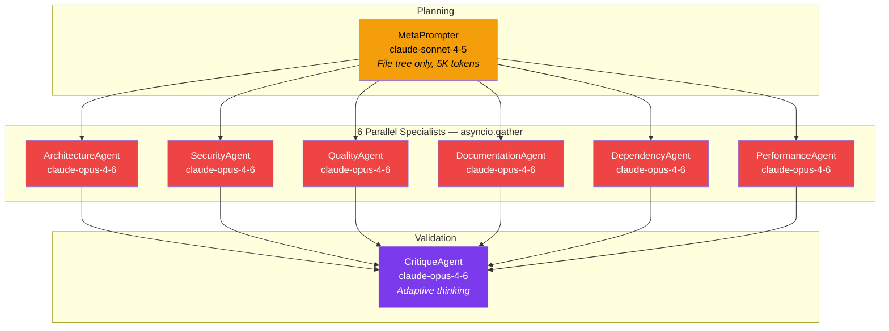

# High-Level System Architecture

## Clean Architecture Layers

## Decorator Chain (LLMGateway)

## 6-Stage Pipeline Overview

## 8 Agents — Model Assignment

## ScoreCard Weights

| Dimension | Weight | Agent | Model |
|-----------|--------|-------|-------|
| Architecture | 25% | ArchitectureAgent | Opus 4.6 |
| Security | 25% | SecurityAgent | Opus 4.6 |
| Quality | 20% | QualityAgent | Opus 4.6 |
| Documentation | 10% | DocumentationAgent | Opus 4.6 |
| Maintainability | 10% | DependencyAgent | Opus 4.6 |
| Performance | 10% | PerformanceAgent | Opus 4.6 |
