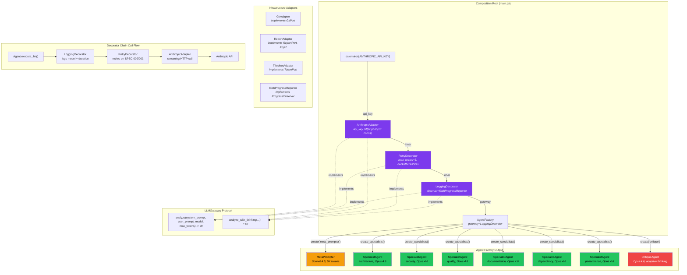
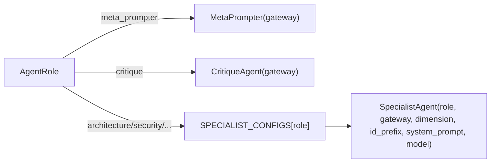

# LLD: Component Interaction Diagram

How `main.py` wires the dependency injection chain and how agents are created.

## Decorator Chain Detail

The chain wraps innermost-to-outermost. Each layer satisfies the `LLMGateway` Protocol via structural subtyping:

| Layer | Class | Responsibility |
|-------|-------|----------------|
| Innermost | `AnthropicAdapter` | Raw HTTP streaming, connection pooling (10 conns), error mapping |
| Middle | `RetryDecorator` | Exponential backoff (1s/2s/4s + jitter), max 3 retries for SPEC-002/003 |
| Outermost | `LoggingDecorator` | Logs model, duration, token count to `ProgressObserver` |

## Agent Factory Dispatch

The factory holds a single reference to the decorated `LLMGateway`. All 8 agents share this gateway instance.
