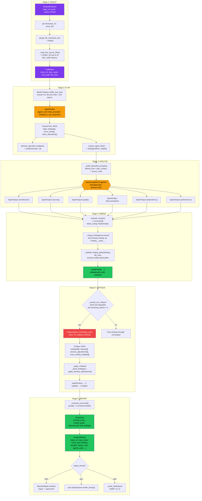

# LLD: Data Flow Diagram

Data transformations at each pipeline stage, traced from source code.



## Data Type Transformation Summary

| Stage | Input | Output | Key Transform |
|-------|-------|--------|---------------|
| INGEST | `repo_url: str` | `Codebase` | Git clone + file tree extraction + heuristic source read |
| PLAN | `Codebase.file_tree` (text) | `AgentOutput` (plan JSON) | MetaPrompter identifies focus areas + token allocations |
| ANALYZE | Per-agent prompts (tree + plan + source) | `list[AgentOutput]` (6x) | 6 parallel LLM calls, each returns `tuple[Finding, ...]` |
| MERGE | `list[AgentOutput]` | `tuple[Finding, ...]` | Dedup via `Finding.__hash__` + path validation vs file_tree |
| CRITIQUE | `findings_json: str` | Filtered `tuple[Finding, ...]` | Reject false positives, adjust severities, extract insights |
| REPORT | `tuple[Finding, ...]` | `AnalysisReport` | Compute ScoreCard (penalty + LLM blend), render HTML/JSON/SARIF |

## Finding Deduplication

Two `Finding` objects are equal when they share `(file_path, line_start, dimension)`. This is enforced by `Finding.__hash__` and `Finding.__eq__`. Deduplication uses `dict.fromkeys()` for O(n) single-pass with insertion-order preservation.

## Score Computation

```
penalty_score = 100 - min(sum(PENALTY[severity] * confidence for each finding), 55)
blended_score = 0.4 * llm_score + 0.6 * penalty_score   (when LLM score available)
overall_score = sum(dimension_score * normalized_weight)
```
