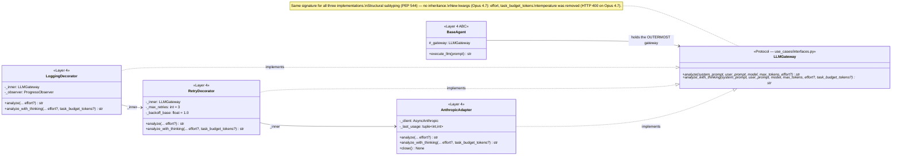
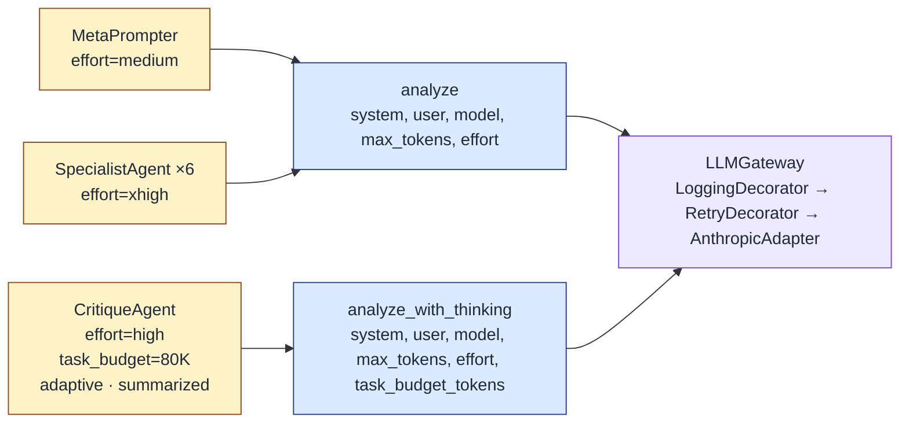
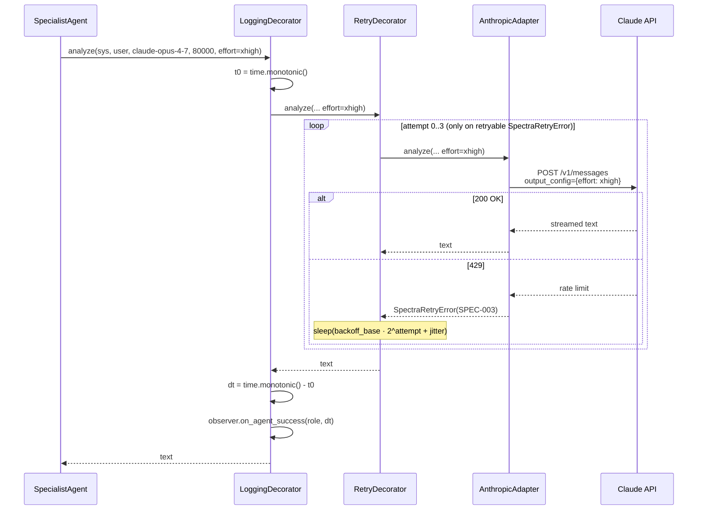
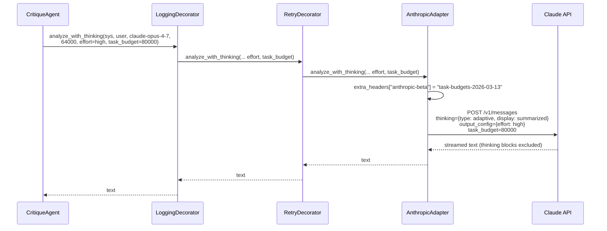

# LLD — Decorator Chain and `LLMGateway` Protocol

The single LLM call path. Every agent goes through three decorators before reaching Anthropic; the gateway protocol is the contract that lets us swap pieces in and out.

## Class diagram



## Wiring (composition root)

```python
# infrastructure/main.py — single DI wiring point
adapter = AnthropicAdapter(api_key=api_key)
retry   = RetryDecorator(adapter, max_retries=3, backoff_base=1.0)
gateway = LoggingDecorator(retry, observer=observer)
factory = AgentFactory(gateway)
```

The factory hands `gateway` to every `BaseAgent`. All 8 agents share one decorator chain — a single `AnthropicAdapter` connection pool serves the whole pipeline.

## Per-agent dispatch on the gateway



`analyze` and `analyze_with_thinking` are the only two methods on the protocol. Specialists and MetaPrompter use `analyze`; only CritiqueAgent uses `analyze_with_thinking`. That is the entire surface area.

## What each decorator owns

| Decorator | File | Responsibility | Errors raised |
|-----------|------|----------------|---------------|
| `LoggingDecorator` | `infrastructure/logging_decorator.py` | Wall-clock timing, token tally → `ProgressObserver`; sanitizes secrets in log lines | None — passes everything through |
| `RetryDecorator` | `infrastructure/retry_decorator.py` | Exponential backoff with jitter (1s/2s/4s, max 3); only retries `SpectraRetryError` with `retryable=True` | `SpectraRetryError(SPEC-002 / SPEC-003)` after exhaustion |
| `AnthropicAdapter` | `infrastructure/anthropic_adapter.py` | Streaming HTTP via httpx (10-conn pool); sets `output_config.effort`; sets `task_budget` and the `task-budgets-2026-03-13` beta header when present; maps SDK exceptions | `SpectraRetryError(SPEC-002)` (network), `SpectraRetryError(SPEC-003)` (429) |

## `LLMGateway` Protocol — Opus 4.7 surface

```python
class LLMGateway(Protocol):
    async def analyze(
        self,
        system_prompt: str,
        user_prompt: str,
        model: str,
        max_tokens: int,
        effort: str | None = None,                 # "low|medium|high|xhigh|max"
    ) -> str: ...

    async def analyze_with_thinking(
        self,
        system_prompt: str,
        user_prompt: str,
        model: str,
        max_tokens: int,
        effort: str | None = None,
        task_budget_tokens: int | None = None,     # min 20_000 — beta header
    ) -> str: ...
```

Two breaking changes from the pre-Opus-4.7 protocol:

1. **`temperature` removed.** Opus 4.7 returns HTTP 400 if `temperature` is present alongside `effort`. There is no compatibility mode. Reasoning depth is now steered exclusively via `effort`.
2. **`budget_tokens` → `task_budget_tokens`.** The deprecated per-call thinking budget is gone. The replacement is a *cumulative* loop budget gated behind the beta header `task-budgets-2026-03-13`. The model decides how to split between deeper reasoning and longer output, but the cumulative total cannot exceed the budget.

See [ADR-005](../architecture/adr/ADR-005-opus-4-7-migration.md) for the full migration rationale and per-role effort tuning.

## Sequence — single `analyze` call (specialist)



## Sequence — single `analyze_with_thinking` call (critique)



`display: "summarized"` keeps the SDK from streaming raw chain-of-thought back to the parser — only the final answer is delivered. See [ADR-008](../architecture/adr/ADR-008-adaptive-thinking-supersedes-extended.md).

---

*Last updated: 2026-04-29 — initial dedicated decorator-chain diagram covering the Opus 4.7 surface (effort + task_budget_tokens).*
