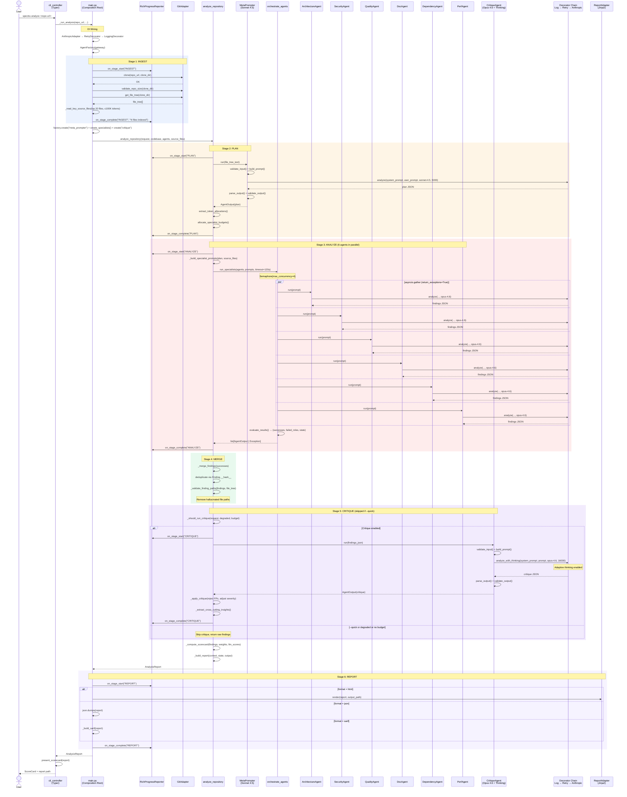
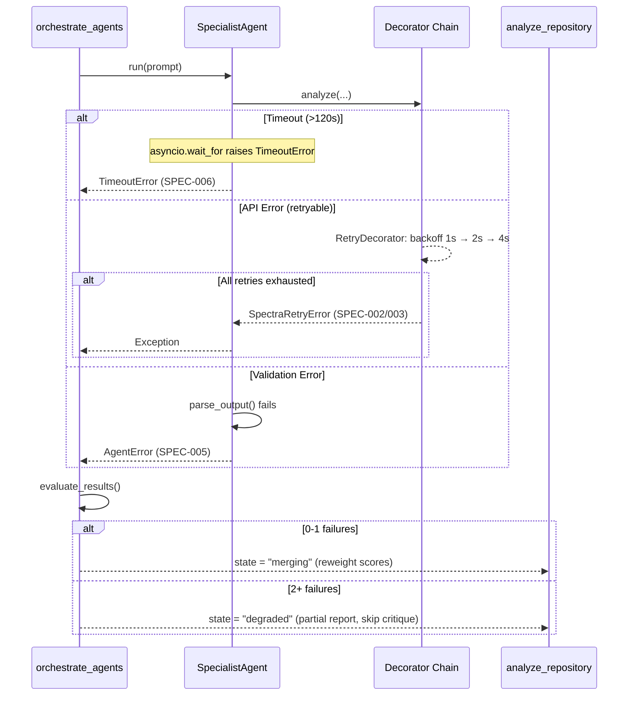
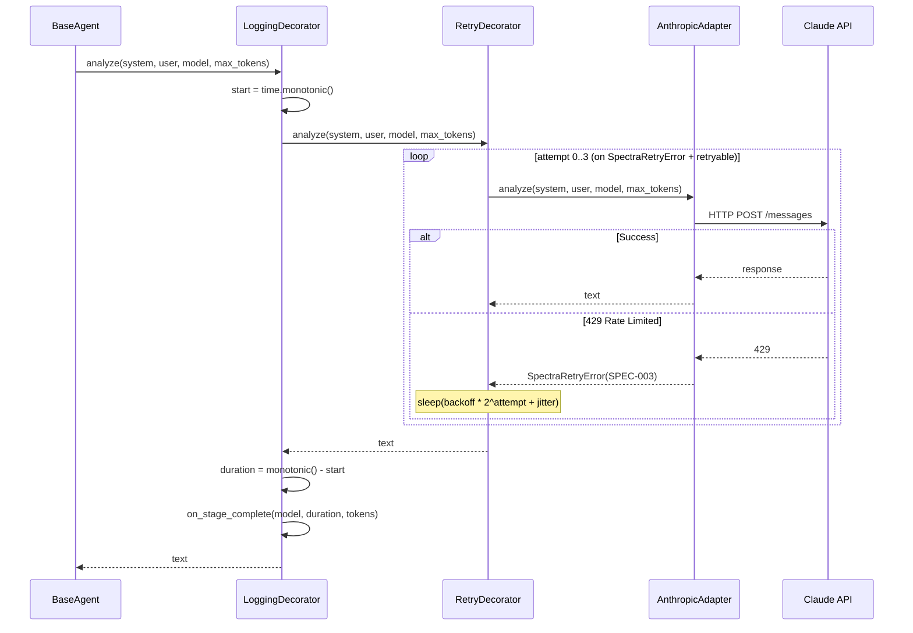

# Sequence Diagram — Full Analysis Pipeline

## Complete Pipeline Sequence

```mermaid
sequenceDiagram
    actor User
    participant CLI as cli_controller<br/>(Typer)
    participant Main as main.py<br/>(Composition Root)
    participant Observer as RichProgressReporter
    participant Git as GitAdapter
    participant Pipeline as analyze_repository
    participant MP as MetaPrompter<br/>(Sonnet 4.5)
    participant Orch as orchestrate_agents
    participant S1 as ArchitectureAgent
    participant S2 as SecurityAgent
    participant S3 as QualityAgent
    participant S4 as DocAgent
    participant S5 as DependencyAgent
    participant S6 as PerfAgent
    participant Critique as CritiqueAgent<br/>(Opus 4.6 + Thinking)
    participant LLM as Decorator Chain<br/>Log → Retry → Anthropic
    participant Report as ReportAdapter<br/>(Jinja2)

    User->>CLI: spectra analyze <repo-url>
    CLI->>Main: _run_analysis(repo_url, ...)

    Note over Main: DI Wiring
    Main->>Main: AnthropicAdapter → RetryDecorator → LoggingDecorator
    Main->>Main: AgentFactory(gateway)

    rect rgb(59, 130, 246, 0.1)
        Note over Main,Git: Stage 1: INGEST
        Main->>Observer: on_stage_start("INGEST")
        Main->>Git: clone(repo_url, clone_dir)
        Git-->>Main: OK
        Main->>Git: validate_repo_size(clone_dir)
        Main->>Git: get_file_tree(clone_dir)
        Git-->>Main: file_tree[]
        Main->>Main: _read_key_source_files(top 20 files, ≤100K tokens)
        Main->>Observer: on_stage_complete("INGEST", "N files indexed")
    end

    Main->>Main: factory.create("meta_prompter") + create_specialists() + create("critique")
    Main->>Pipeline: analyze_repository(request, codebase, agents, source_files)

    rect rgb(245, 158, 11, 0.1)
        Note over Pipeline,MP: Stage 2: PLAN
        Pipeline->>Observer: on_stage_start("PLAN")
        Pipeline->>MP: run(file_tree_text)
        MP->>MP: validate_input() + build_prompt()
        MP->>LLM: analyze(system_prompt, user_prompt, sonnet-4.5, 5000)
        LLM-->>MP: plan JSON
        MP->>MP: parse_output() + validate_output()
        MP-->>Pipeline: AgentOutput(plan)
        Pipeline->>Pipeline: extract_token_allocations()
        Pipeline->>Pipeline: allocate_specialist_budgets()
        Pipeline->>Observer: on_stage_complete("PLAN")
    end

    rect rgb(239, 68, 68, 0.1)
        Note over Pipeline,S6: Stage 3: ANALYZE (6 agents in parallel)
        Pipeline->>Observer: on_stage_start("ANALYZE")
        Pipeline->>Pipeline: _build_specialist_prompts(plan, source_files)
        Pipeline->>Orch: run_specialists(agents, prompts, timeout=120s)

        Note over Orch: Semaphore(max_concurrency=4)
        par asyncio.gather (return_exceptions=True)
            Orch->>S1: run(prompt)
            S1->>LLM: analyze(..., opus-4.6)
            LLM-->>S1: findings JSON
        and
            Orch->>S2: run(prompt)
            S2->>LLM: analyze(..., opus-4.6)
            LLM-->>S2: findings JSON
        and
            Orch->>S3: run(prompt)
            S3->>LLM: analyze(..., opus-4.6)
            LLM-->>S3: findings JSON
        and
            Orch->>S4: run(prompt)
            S4->>LLM: analyze(..., opus-4.6)
            LLM-->>S4: findings JSON
        and
            Orch->>S5: run(prompt)
            S5->>LLM: analyze(..., opus-4.6)
            LLM-->>S5: findings JSON
        and
            Orch->>S6: run(prompt)
            S6->>LLM: analyze(..., opus-4.6)
            LLM-->>S6: findings JSON
        end

        Orch->>Orch: evaluate_results() → (successes, failed_roles, state)
        Orch-->>Pipeline: list[AgentOutput | Exception]
        Pipeline->>Observer: on_stage_complete("ANALYZE")
    end

    rect rgb(34, 197, 94, 0.1)
        Note over Pipeline: Stage 4: MERGE
        Pipeline->>Pipeline: _merge_findings(successes)
        Pipeline->>Pipeline: deduplicate via Finding.__hash__
        Pipeline->>Pipeline: _validate_finding_paths(findings, file_tree)
        Note over Pipeline: Remove hallucinated file paths
    end

    rect rgb(124, 58, 237, 0.1)
        Note over Pipeline,Critique: Stage 5: CRITIQUE (skipped if --quick)
        Pipeline->>Pipeline: _should_run_critique(request, degraded, budget)

        alt Critique enabled
            Pipeline->>Observer: on_stage_start("CRITIQUE")
            Pipeline->>Critique: run(findings_json)
            Critique->>Critique: validate_input() + build_prompt()
            Critique->>LLM: analyze_with_thinking(system_prompt, prompt, opus-4.6, 16000)
            Note over LLM: Adaptive thinking enabled
            LLM-->>Critique: critique JSON
            Critique->>Critique: parse_output() + validate_output()
            Critique-->>Pipeline: AgentOutput(critique)
            Pipeline->>Pipeline: _apply_critique(reject FPs, adjust severity)
            Pipeline->>Pipeline: _extract_cross_cutting_insights()
            Pipeline->>Observer: on_stage_complete("CRITIQUE")
        else --quick or degraded or no budget
            Note over Pipeline: Skip critique, return raw findings
        end
    end

    Pipeline->>Pipeline: _compute_scorecard(findings, weights, llm_scores)
    Pipeline->>Pipeline: _build_report(context, state, output)
    Pipeline-->>Main: AnalysisReport

    rect rgb(167, 139, 250, 0.1)
        Note over Main,Report: Stage 6: REPORT
        Main->>Observer: on_stage_start("REPORT")
        alt format = html
            Main->>Report: render(report, output_path)
        else format = json
            Main->>Main: json.dumps(report)
        else format = sarif
            Main->>Main: _build_sarif(report)
        end
        Main->>Observer: on_stage_complete("REPORT")
    end

    Main-->>CLI: AnalysisReport
    CLI->>CLI: present_scorecard(report)
    CLI-->>User: ScoreCard + report path
```

## Error Path — Agent Failure

```mermaid
sequenceDiagram
    participant Orch as orchestrate_agents
    participant Agent as SpecialistAgent
    participant LLM as Decorator Chain
    participant Pipeline as analyze_repository

    Orch->>Agent: run(prompt)
    Agent->>LLM: analyze(...)

    alt Timeout (>120s)
        Note over Agent: asyncio.wait_for raises TimeoutError
        Agent-->>Orch: TimeoutError (SPEC-006)
    else API Error (retryable)
        LLM-->>LLM: RetryDecorator: backoff 1s → 2s → 4s
        alt All retries exhausted
            LLM-->>Agent: SpectraRetryError (SPEC-002/003)
            Agent-->>Orch: Exception
        end
    else Validation Error
        Agent->>Agent: parse_output() fails
        Agent-->>Orch: AgentError (SPEC-005)
    end

    Orch->>Orch: evaluate_results()
    alt 0-1 failures
        Orch-->>Pipeline: state = "merging" (reweight scores)
    else 2+ failures
        Orch-->>Pipeline: state = "degraded" (partial report, skip critique)
    end
```

## Decorator Chain — Single LLM Call

```mermaid
sequenceDiagram
    participant Agent as BaseAgent
    participant Log as LoggingDecorator
    participant Retry as RetryDecorator
    participant API as AnthropicAdapter
    participant Claude as Claude API

    Agent->>Log: analyze(system, user, model, max_tokens)
    Log->>Log: start = time.monotonic()
    Log->>Retry: analyze(system, user, model, max_tokens)

    loop attempt 0..3 (on SpectraRetryError + retryable)
        Retry->>API: analyze(system, user, model, max_tokens)
        API->>Claude: HTTP POST /messages
        alt Success
            Claude-->>API: response
            API-->>Retry: text
        else 429 Rate Limited
            Claude-->>API: 429
            API-->>Retry: SpectraRetryError(SPEC-003)
            Note over Retry: sleep(backoff * 2^attempt + jitter)
        end
    end

    Retry-->>Log: text
    Log->>Log: duration = monotonic() - start
    Log->>Log: on_stage_complete(model, duration, tokens)
    Log-->>Agent: text
```
