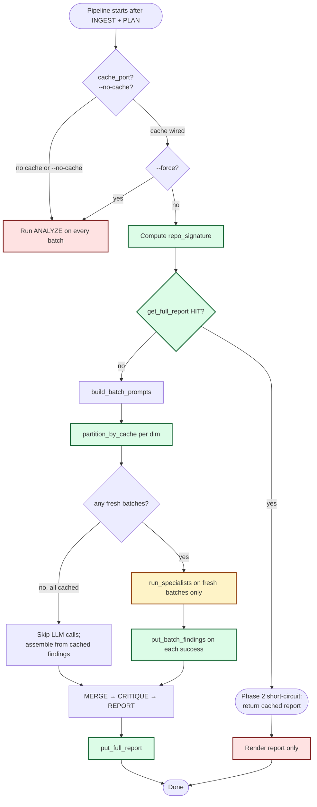
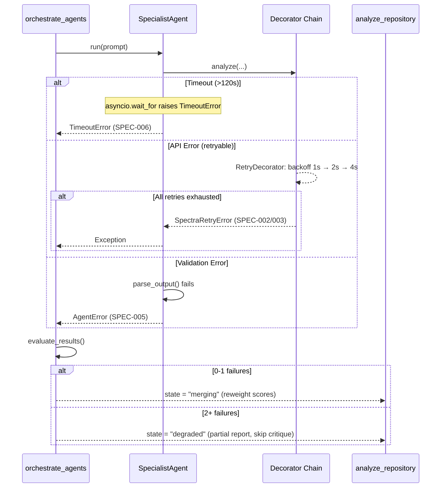
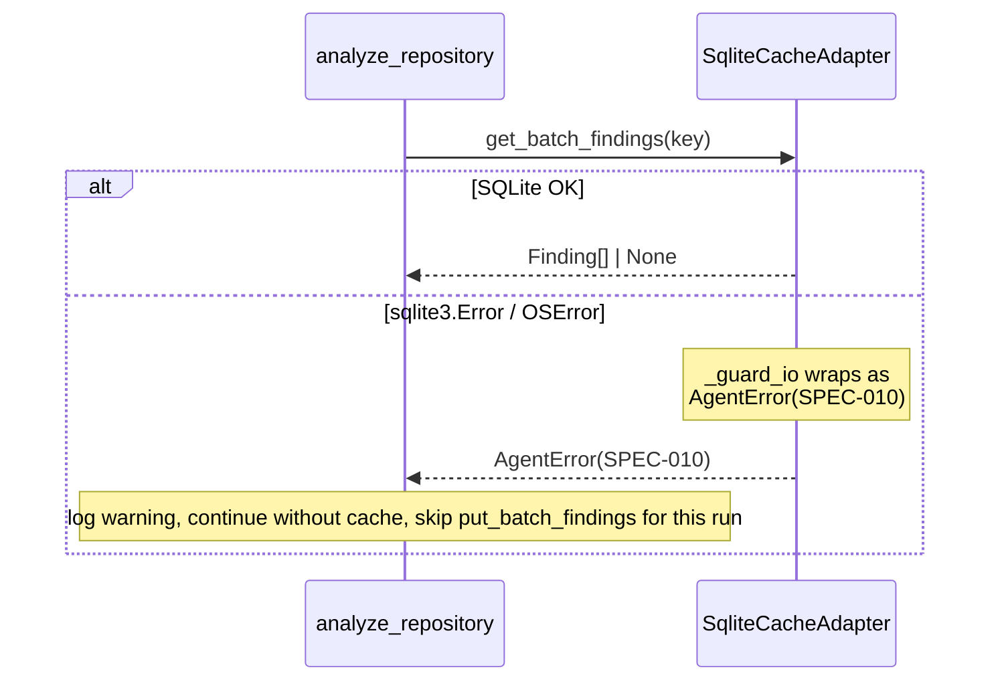
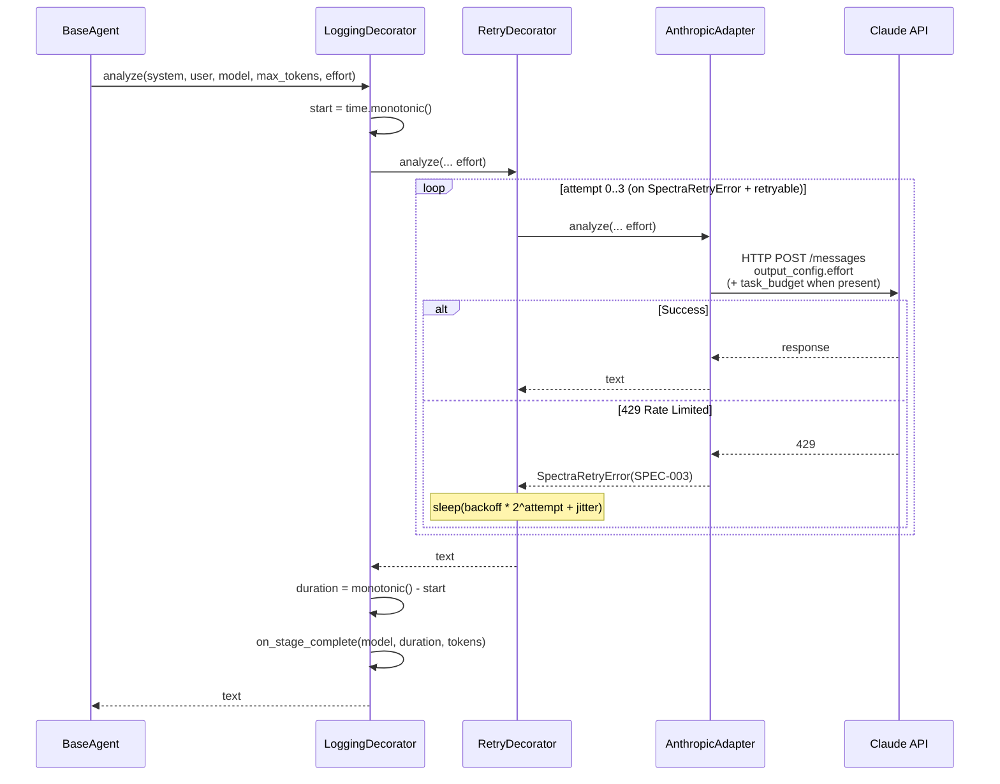

# Sequence Diagram — Full Analysis Pipeline (with Cache)

Refreshed for the Phase 1–3 cache pipeline. The cache short-circuits at two boundaries: a repo-level full-report check after PLAN (Phase 2) and per-`focus_area` batch checks during ANALYZE (Phase 3). Cache writes happen on every successful boundary.

## Complete Pipeline Sequence

```mermaid
sequenceDiagram
    actor User
    participant CLI as cli_controller<br/>(Typer)
    participant Main as main.py<br/>(Composition Root)
    participant Observer as RichProgressReporter
    participant Git as GitAdapter
    participant Cache as SqliteCacheAdapter<br/>(impl CachePort)
    participant Pipeline as analyze_repository<br/>(facade · PipelineContext)
    participant MP as MetaPrompter<br/>(Opus 4.7, effort=medium)
    participant Orch as orchestrate_agents<br/>(asyncio.gather + Sem(4))
    participant S1 as ArchitectureAgent<br/>(Opus 4.7, xhigh)
    participant S2 as SecurityAgent<br/>(Opus 4.7, xhigh)
    participant S3 as QualityAgent<br/>(Opus 4.7, xhigh)
    participant S4 as DocAgent<br/>(Opus 4.7, xhigh)
    participant S5 as DependencyAgent<br/>(Opus 4.7, xhigh)
    participant S6 as PerfAgent<br/>(Opus 4.7, xhigh)
    participant Critique as CritiqueAgent<br/>(Opus 4.7, high<br/>adaptive + task_budget=80K)
    participant LLM as Decorator Chain<br/>Log → Retry → Anthropic
    participant Report as ReportAdapter<br/>(Jinja2)

    User->>CLI: spectra analyze <source> [--no-cache | --force]
    CLI->>Main: _run_analysis(source, ...)

    Note over Main: DI Wiring (composition root)
    Main->>Main: AnthropicAdapter → RetryDecorator → LoggingDecorator
    Main->>Main: AgentFactory(gateway)
    Main->>Cache: SqliteCacheAdapter(default_cache_path())<br/>or None when --no-cache
    Main->>Cache: bind_run_context(model_versions, prompt_versions,<br/>schema_version, spectra_version)

    rect rgb(59, 130, 246, 0.1)
        Note over Main,Git: Stage 1: INGEST
        Main->>Observer: on_stage_start("INGEST")
        Main->>Git: prepare_workspace(source, target_dir)
        Note over Git: HTTPS URL → clone (depth=1)<br/>Local path → validate .git/, return absolute path
        Git-->>Main: repo_dir
        Main->>Git: validate_repo_size(repo_dir)
        Main->>Git: get_file_tree(repo_dir)
        Git-->>Main: file_tree[]
        Main->>Main: _read_key_source_files(top 20 files, ≤100K tokens)
        Main->>Observer: on_stage_complete("INGEST", "N files indexed")
    end

    Main->>Pipeline: analyze_repository(PipelineContext)

    rect rgb(245, 158, 11, 0.1)
        Note over Pipeline,MP: Stage 2: PLAN
        Pipeline->>Observer: on_stage_start("PLAN")
        Pipeline->>MP: run(file_tree_text)
        MP->>LLM: analyze(... claude-opus-4-7, 5000, effort="medium")
        LLM-->>MP: plan JSON
        MP-->>Pipeline: AgentOutput(plan)
        Pipeline->>Pipeline: extract_token_allocations()<br/>allocate_specialist_budgets()
        Pipeline->>Observer: on_stage_complete("PLAN")
    end

    rect rgb(34, 197, 94, 0.15)
        Note over Pipeline,Cache: Phase 2 — Repo-Level Cache Check
        alt cache_port set AND not --force
            Pipeline->>Cache: compute_repo_signature(file_tree)
            Cache-->>Pipeline: blake2b digest
            Pipeline->>Cache: get_full_report(RepoCacheKey)
            alt HIT
                Cache-->>Pipeline: AnalysisReport (cached)
                Pipeline->>Observer: on_stage_complete("CACHE",<br/>"full report served from cache")
                Pipeline-->>Main: cached AnalysisReport
                Note over Main,User: short-circuits Stages 3-5 — Stage 6 still renders
            else MISS or --force
                Note over Pipeline: Continue to ANALYZE
            end
        end
    end

    rect rgb(239, 68, 68, 0.1)
        Note over Pipeline,S6: Stage 3: ANALYZE (Phase 3 per-batch caching)
        Pipeline->>Observer: on_stage_start("ANALYZE")
        Pipeline->>Pipeline: build_batch_prompts(plan)<br/>→ dict[AgentRole, list[BatchPrompt]]<br/>(one batch per focus_area — fallback: 1 per dim)

        loop per (specialist, batch)
            Pipeline->>Cache: batch_key_for(batch_id, dimension)
            Cache-->>Pipeline: BatchCacheKey
            Pipeline->>Cache: get_batch_findings(BatchCacheKey)
            alt batch HIT
                Cache-->>Pipeline: cached Finding[]
                Pipeline->>Cache: record_hit(dim, batch_id, hit=true)
            else batch MISS
                Cache-->>Pipeline: None
                Pipeline->>Cache: record_hit(dim, batch_id, hit=false)
                Note over Pipeline: queue batch for fresh execution
            end
        end
        Pipeline->>Observer: on_cache_lookup(dim, hits, total)<br/>(once per dimension — "security cache 7/8 hits")

        Pipeline->>Orch: run_specialists(agents, FRESH batches only,<br/>timeout=120s)

        Note over Orch: Semaphore(max_concurrency=4)
        par asyncio.gather(return_exceptions=True)
            Orch->>S1: run(prompt)
            S1->>LLM: analyze(... effort="xhigh")
            LLM-->>S1: findings JSON
        and
            Orch->>S2: run(prompt)
        and
            Orch->>S3: run(prompt)
        and
            Orch->>S4: run(prompt)
        and
            Orch->>S5: run(prompt)
        and
            Orch->>S6: run(prompt)
        end

        Orch-->>Pipeline: dict[AgentRole, AgentOutput | Exception]

        loop per successful (agent, batch)
            Pipeline->>Cache: put_batch_findings(BatchCacheKey, findings)
        end

        Pipeline->>Pipeline: _assemble_phase3_result()<br/>merge cached + fresh per role
        Pipeline->>Pipeline: evaluate_results() →<br/>(successes, failed_roles, state)
        Pipeline->>Observer: on_stage_complete("ANALYZE")
    end

    rect rgb(34, 197, 94, 0.1)
        Note over Pipeline: Stage 4: MERGE
        Pipeline->>Pipeline: _merge_findings(successes)<br/>dedup via Finding.__hash__
        Pipeline->>Pipeline: _validate_finding_paths(findings, file_tree)
        Note over Pipeline: Remove hallucinated file paths
    end

    rect rgb(124, 58, 237, 0.1)
        Note over Pipeline,Critique: Stage 5: CRITIQUE (skipped if --quick)
        Pipeline->>Pipeline: _should_run_critique(request, degraded, budget)
        alt Critique enabled
            Pipeline->>Observer: on_stage_start("CRITIQUE")
            Pipeline->>Critique: run(findings_json)
            Critique->>LLM: analyze_with_thinking(... claude-opus-4-7,<br/>64000, effort="high", task_budget_tokens=80000)
            Note over LLM: thinking={type:"adaptive", display:"summarized"}<br/>beta header: task-budgets-2026-03-13
            LLM-->>Critique: critique JSON (thinking blocks excluded)
            Critique-->>Pipeline: AgentOutput(critique)
            Pipeline->>Pipeline: _apply_critique() + _extract_cross_cutting_insights()
            Pipeline->>Observer: on_stage_complete("CRITIQUE")
        else --quick or degraded or no budget
            Note over Pipeline: Skip critique, return raw findings
        end
    end

    Pipeline->>Pipeline: _compute_scorecard(findings, weights, llm_scores)
    Pipeline->>Pipeline: _build_report(context, state, output)

    rect rgb(34, 197, 94, 0.15)
        Note over Pipeline,Cache: Phase 2 — Repo-Level Cache Write
        alt cache_port set AND analysis succeeded
            Pipeline->>Cache: put_full_report(RepoCacheKey, report)
            Note over Cache: invalidates lazily on any version mismatch
        end
    end

    Pipeline-->>Main: AnalysisReport

    rect rgb(167, 139, 250, 0.1)
        Note over Main,Report: Stage 6: REPORT
        Main->>Observer: on_stage_start("REPORT")
        alt format = html
            Main->>Report: render(report, output_path)
        else format = json
            Main->>Main: json.dumps(report)
        else format = sarif
            Main->>Main: _build_sarif(report)
        end
        Main->>Observer: on_stage_complete("REPORT")
    end

    Main-->>CLI: AnalysisReport
    CLI->>CLI: present_scorecard(report)
    CLI-->>User: ScoreCard + report path + cache hit rate
```

## Cache decision tree (extracted from the sequence above)

## Error Path — Agent Failure

## Cache I/O failure path (SPEC-010)

`SqliteCacheAdapter` funnels every fallible I/O through `_guard_io`, which converts `sqlite3.Error` and `OSError` into `AgentError(SPEC-010)`. The pipeline catches these at the cache call sites and degrades to no-cache for the rest of the run — never aborts.

## Decorator Chain — Single LLM Call

---

*Last updated: 2026-04-29 — Phase 2 (full-report) and Phase 3 (per-batch) cache decision points threaded through the pipeline; SPEC-010 degrade path documented.*
