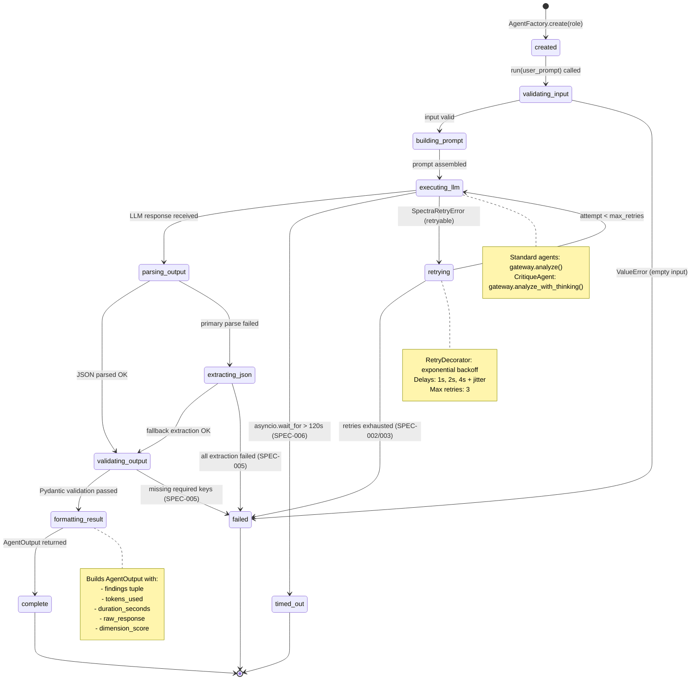
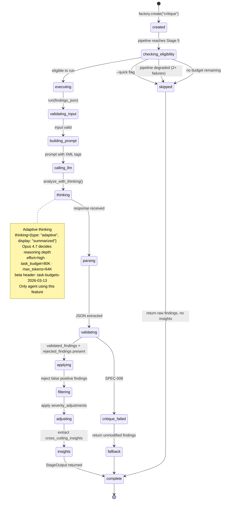

# State Diagram — Agent Lifecycle

## BaseAgent Template Method Lifecycle

States traced from `infrastructure/agents/base_agent.py` `run()` method.

## Specialist Agent — Parallel Execution Context

```mermaid
stateDiagram-v2
    [*] --> queued : created by AgentFactory

    state "Orchestrator (asyncio.gather)" as orch {
        queued --> waiting_semaphore : coroutine started
        waiting_semaphore --> executing : semaphore acquired

        state "Per-Agent Timeout (120s)" as timeout {
            executing --> validate_input
            validate_input --> build_prompt
            build_prompt --> call_llm
            call_llm --> parse_json
            parse_json --> validate_pydantic
            validate_pydantic --> format_output
        }

        executing --> timed_out : wait_for timeout
    }

    format_output --> success : AgentOutput
    timed_out --> failure : TimeoutError

    success --> [*]
    failure --> [*]

    note right of waiting_semaphore
        Semaphore(4) limits
        concurrent API calls
        to avoid 429 rate limits
    end note

    note right of timed_out
        Individual agent timeout
        does not cancel siblings
        (return_exceptions=True)
    end note
```

## CritiqueAgent — Adaptive Thinking Lifecycle

---

*Last updated: 2026-04-29 — terminology change ("extended" → "adaptive" thinking) and Opus 4.7 settings.*
