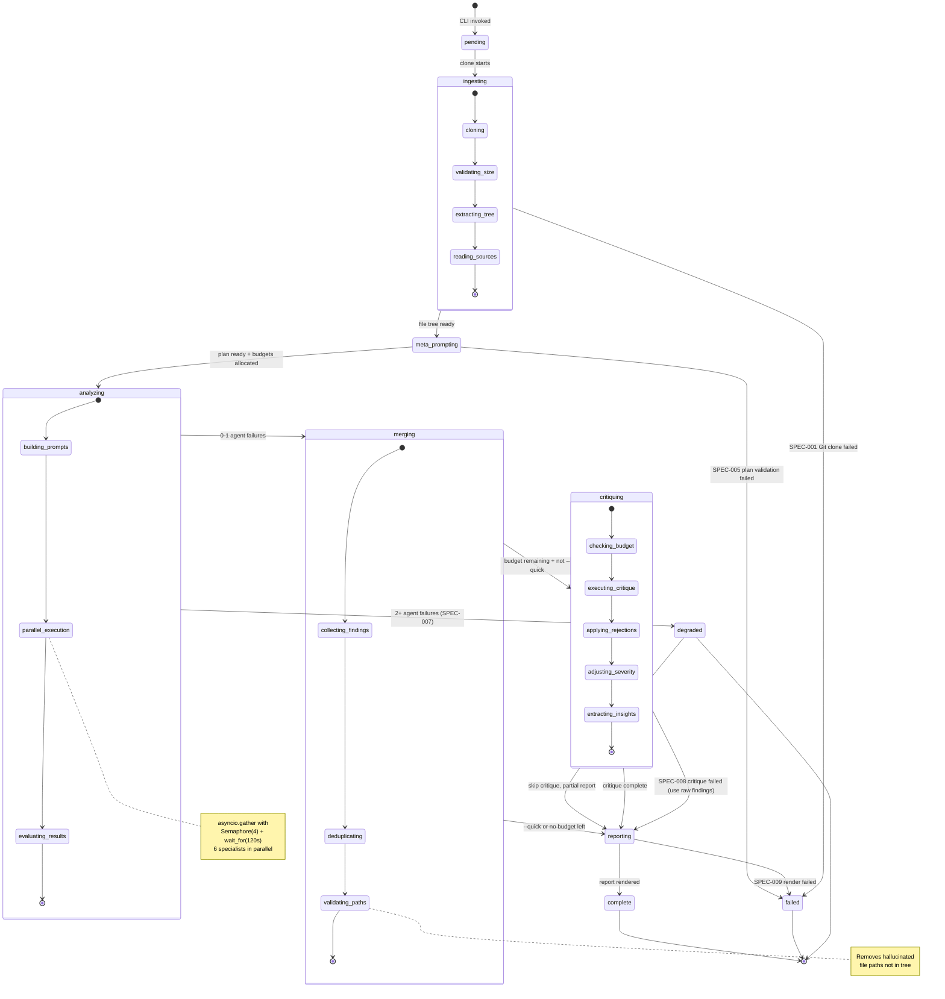

# State Diagram — Pipeline Lifecycle

## Pipeline State Machine

States sourced from `entities/enums.py` `PipelineState` literal type.

## Error Code to State Mapping

| Error Code | Trigger State | Transition | Retryable |
|------------|---------------|------------|-----------|
| SPEC-001 | ingesting | failed | Yes (2x) |
| SPEC-002 | analyzing | (retry in decorator) | Yes (3x) |
| SPEC-003 | analyzing | (retry in decorator) | Yes (3x) |
| SPEC-004 | merging | skip critique | No |
| SPEC-005 | meta_prompting / analyzing | failed / count failure | Yes (1x) |
| SPEC-006 | analyzing | count failure | No |
| SPEC-007 | analyzing | degraded | No |
| SPEC-008 | critiquing | reporting (fallback) | No |
| SPEC-009 | reporting | failed | No |
