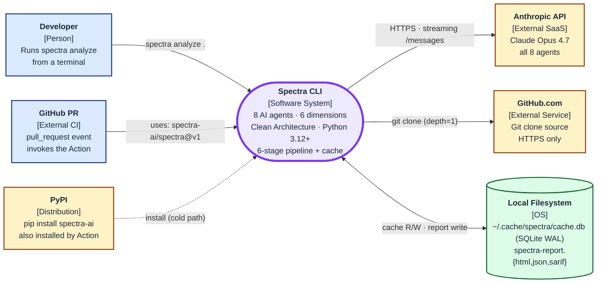

# System Context Diagram (C4 Level 1)

Spectra in its environment — the actors who invoke it and the external systems it depends on.

> **Editor's choice:** the Excalidraw version at [`excalidraw/system-context.excalidraw`](excalidraw/system-context.excalidraw) is the polished hand-laid-out edition. The Mermaid version below is the source of truth for CI rendering and review.



## Actors and external systems

| Element | Type | Why it matters |
|---------|------|----------------|
| **Developer** | Person | Primary user — invokes `spectra analyze .` against a local checkout or HTTPS URL |
| **GitHub PR** | External CI actor | Downstream consumers wire the composite Action into `.github/workflows/*.yml` and Spectra runs on every PR |
| **Spectra CLI** | Software system in scope | The 4-layer Clean Architecture Python package distributed on PyPI |
| **Anthropic API** | External SaaS | All 8 agents call `https://api.anthropic.com/v1/messages` via the streaming endpoint |
| **GitHub.com** | External service | `GitAdapter` clones repos via HTTPS only — `git://`, `ssh://`, `file://` are rejected at the protocol layer |
| **PyPI** | Distribution channel | Single canonical artifact (`spectra-ai`); the GitHub Action installs from here on every run |
| **Local Filesystem** | OS storage | SQLite cache DB (`cache.db` + WAL sidecars) and rendered reports are local-only |

## Distribution model

Two install paths, one PyPI package:

```
                ┌──────────────────┐
                │  spectra-ai      │   <- single source artifact
                │  (PyPI package)  │
                └────────┬─────────┘
                         │
        ┌────────────────┴────────────────┐
        │                                 │
┌───────▼─────────┐               ┌───────▼─────────┐
│ pip install     │               │ Composite Action│
│ spectra-ai      │               │ spectra-ai/     │
│ + run locally   │               │ spectra@v1      │
└─────────────────┘               └─────────────────┘
   Local developer                       CI / PR
```

The Action is just YAML that installs `spectra-ai` on the runner and shells out to `spectra analyze`. Versioning lives at the PyPI release; the Action consumes whatever is published. See [ADR-007](../architecture/adr/ADR-007-github-action-distribution.md).

## Deliberate non-dogfooding

This repo's own CI does not run `spectra-ai/spectra@v1` on its own pull requests. The reasoning is recorded in [ADR-010](../architecture/adr/ADR-010-no-self-dogfooding.md) — token-abuse risk on PR-triggered workflows. Downstream consumers are expected to wire the Action into their own repos with their own API keys; we publish the Action and exercise it externally rather than on this repository.

---

*Last updated: 2026-04-29 — initial system-context diagram covering the cache pipeline + Action distribution.*
