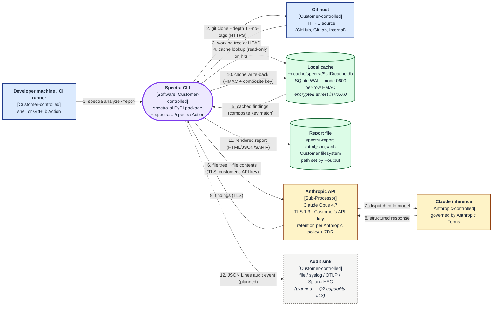

# Spectra — Data Flow Diagram

**Status:** Authoritative diagram for the v0.5.0 baseline.
**Version:** 0.1 (initial diagram, paired with [`DPA.md`](./DPA.md) §2)
**Last reviewed:** 2026-04-29
**Owner:** Spectra Engineering (Vivek Kumar, Head of Engineering)

This document depicts every flow of Customer Data through the Spectra
pipeline, who controls each endpoint, and what data crosses each edge.
It is the technical companion to the [`DPA.md`](./DPA.md) and the
[`SUBPROCESSORS.md`](./SUBPROCESSORS.md) declaration.

The diagram below describes Spectra `v0.5.0`. Edges marked "(planned)"
are on the Q2–Q4 roadmap and are called out so procurement reviewers can
see what is shipping versus what is committed.

---

## Diagram

---

## Legend — what crosses each edge

Each edge is numbered to match the diagram above.

1. **Developer / CI runner → Spectra CLI.** Command-line invocation
   (`spectra analyze <repo>` or the GitHub Action). Inputs: the repo URL
   or local path, the Customer's `ANTHROPIC_API_KEY` (read from environment
   or, in future, a secret backend per CISO §2 capability), and CLI flags.
   No Customer Data flows yet; this is process invocation.
   *Controller of the data: the Customer.*

2. **Spectra CLI → Git host.** A shallow clone over HTTPS:
   `git clone --depth 1 --no-tags`. SSRF resolver-fail-closed; symlink
   rejection at every parent; 60-second timeout; submodules disabled.
   No history, no tags, no branches other than the requested one cross
   the wire.
   *Controller of the data: the Customer.*

3. **Git host → Spectra CLI.** The working-tree bytes at `HEAD` of the
   requested ref are written to a temporary directory on the Customer's
   machine. Removed when the pipeline completes. No persistence beyond
   the run.
   *Controller of the data: the Customer.*

4. **Spectra CLI → Local cache (lookup).** Composite-key lookup against
   `~/.cache/spectra/$UID/cache.db`. Key bundle: content hash, dimension,
   model version, prompt version, schema version, Spectra version. A
   stale row never matches a current-context lookup; physical deletion
   is deferred to `spectra cache prune`. Cache I/O failures degrade to
   no-cache (SPEC-010); they never abort the run.
   *Controller of the data: the Customer (filesystem).*

5. **Local cache → Spectra CLI.** On hit, the cached findings (per file
   and per `focus_area` batch) are loaded; the corresponding files are
   omitted from the prompts in step 6. The `hit_log` table records the
   lookup for telemetry surfaced via `ProgressObserver.on_cache_lookup`.
   *Controller of the data: the Customer.*

6. **Spectra CLI → Anthropic API.** TLS 1.3 to `api.anthropic.com`,
   authenticated with the Customer's API key. The MetaPrompter agent
   sends the file tree only (paths and sizes, ≤5K tokens). The six
   specialist agents send file contents — restricted to the working tree
   at the analysed `HEAD` — partitioned into per-`focus_area` batches.
   Pre-flight stages have already excluded `.gitignore` matches,
   `.spectraignore` matches, and any file flagged by the secret pre-flight
   scanner (Capability #6 — bypass requires explicit `--allow-secrets`).
   Anthropic acts as a Sub-Processor under [`DPA.md`](./DPA.md) §5.
   *Controller of the data: the Customer (via the Customer's Anthropic
   contract); Spectra is the Processor; Anthropic is the Sub-Processor.*

7. **Anthropic API → Claude inference.** Internal Anthropic dispatch to
   the requested model (`claude-opus-4-7` by default). Governed entirely
   by Anthropic's Commercial Terms of Service, the Customer's Anthropic
   data-retention configuration (ZDR or default 30-day window), and any
   regional routing the Customer has configured on Anthropic's side.
   Spectra has no visibility or control over this hop.
   *Controller of the data: Anthropic, per the Customer's Anthropic
   agreement.*

8. **Claude inference → Anthropic API.** The model returns a structured
   response (JSON) per the Spectra prompt schema. Anthropic-side
   retention applies to both the request and response.
   *Controller of the data: Anthropic.*

9. **Anthropic API → Spectra CLI.** TLS 1.3. The decorator chain
   (LoggingDecorator → RetryDecorator → AnthropicAdapter) parses the
   response. Output is validated against the Pydantic finding model
   before merge — invalid output triggers `SPEC-005`.
   *Controller of the data: the Customer.*

10. **Spectra CLI → Local cache (write-back).** Findings and batch
    outputs are persisted under the same composite key used in step 4,
    with a per-row HMAC binding the row to the Spectra context tuple.
    The cache file lives under `~/.cache/spectra/$UID/cache.db` (mode
    `0600`); the per-`$UID` namespace prevents cross-tenant reads on
    shared developer hosts and CI runners (Capability #3, shipped in
    v0.5.0). Encryption at rest via SQLCipher is in flight as Q2
    capability #13.
    *Controller of the data: the Customer (filesystem).*

11. **Spectra CLI → Report file.** Jinja2 renders the merged findings
    into a self-contained HTML report (CSP-nonce'd inline assets) plus
    optional JSON and SARIF. Output path is Customer-specified
    (`--output`, default `spectra-report.html`). Spectra writes once and
    never reads the file back; report classification and watermarking
    will ship as Q2 capability #56.
    *Controller of the data: the Customer (filesystem).*

12. **Spectra CLI → Audit sink (planned).** Q2 capability #12 emits a
    JSON Lines audit event per scan: actor identity, repository
    signature, model versions, finding counts, critical-count, degraded
    flag, and request ID. The sink is Customer-controlled (file by
    default; pluggable to syslog, OTLP, Splunk HEC). Spectra emits; the
    Customer's SIEM is the system of record.
    *Controller of the data: the Customer.*

---

## What is not in the diagram (intentionally)

These are flows you might expect to see but that Spectra does not perform:

- **No Spectra-side telemetry.** Spectra does not phone home, does not
  send anonymised usage statistics, does not register installs.
- **No third-party error reporter.** Stack traces stay on the Customer's
  terminal and (if the Customer enables it) the Customer's audit sink.
- **No analytics provider.** Spectra has no Segment, no Mixpanel, no
  PostHog, no Amplitude integration — none.
- **No Spectra-operated control plane.** There is no Spectra-side server
  to which the CLI authenticates, no central database of users, scans,
  or repositories. The product is intentionally CLI-only at this
  baseline; a control plane is gated on the Q7+ "control plane" decision
  documented in the product roadmap, not implicit in the v0.5.0
  contract.

---

## Boundaries summary

| Boundary | Who controls it | What is sensitive |
|---|---|---|
| Developer machine / CI runner | Customer | API key, source code, reports, cache |
| Git host | Customer | Repository contents |
| Local cache (`~/.cache/spectra/$UID/cache.db`) | Customer (filesystem) | Findings, batch outputs, hit log |
| Report file | Customer (filesystem) | Findings, code excerpts, file paths |
| Anthropic API endpoint | Anthropic (Sub-Processor) | Repository contents (in flight), findings (in flight) |
| Audit sink (planned) | Customer | Scan metadata, finding counts |

The only Spectra-controlled component in this diagram is the Spectra CLI
binary itself, which executes on Customer infrastructure. Spectra does
not operate any data plane or control plane that holds Customer Data.

---

*Cross-references: [`DPA.md`](./DPA.md) · [`SUBPROCESSORS.md`](./SUBPROCESSORS.md)
· [`SECURITY.md`](../../SECURITY.md) · [`README.md`](../../README.md)
("Architecture — system context").*
