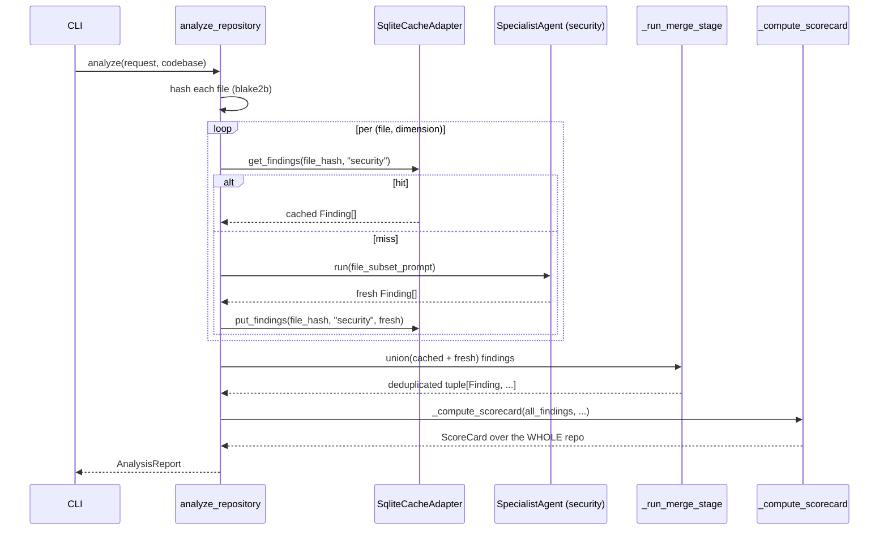

# Incremental Analysis — Design Document

**Author:** Vivek Kumar, Head of Engineering
**Status:** Ready for implementation
**Scope:** v1 — local single-user cache; per-file granularity

---

## 1. Why This Exists

Today, `spectra analyze <repo>` re-runs all 8 agents on every invocation, even when nothing meaningful has changed. On a typical mid-size repo (1.5K files, 90s wall-clock, ~$0.40 per run), a developer iterating on one PR pays the full cost three or four times a day. Incremental analysis turns Spectra into a daily-driver: re-run after a commit, only the changed files are re-analyzed, the report rebuilds in 5–15s, and the cost drops by 80–95% per run.

This design adds a new `CachePort` (Layer 2), a SQLite-backed adapter (Layer 4), per-file caching of specialist findings, and a deterministic cache invalidation policy keyed on `(file_hash, dimension, model_version, prompt_version)`. The merge and scoring stages still run on every invocation over the *union* of cached and freshly-computed findings, so the ScoreCard always reflects the whole repo — not just the delta.

---

## 2. User-Facing Behavior

### 2.1 CLI Surface

Caching is **always-on** (no flag needed for the happy path). Three new flags govern behavior:

```bash
spectra analyze <repo>                 # cache-aware (default)
spectra analyze <repo> --force         # ignore cache, re-analyze everything
spectra analyze <repo> --no-cache      # don't read or write cache (CI mode)
spectra cache stats                    # show cache size, hit rate, repos tracked
spectra cache clear [<repo>]           # purge entry for one repo or all
spectra cache prune --older-than 30d   # GC entries older than N days
```

Rationale for always-on: developers forget flags; the hit-rate signal is most valuable when caching is the default. `--no-cache` exists for CI runners where cache state would pollute results between branches.

### 2.2 Cache Location

**Decision: `~/.cache/spectra/` (XDG-respecting, with `$XDG_CACHE_HOME` override).**

Tradeoff matrix:

| Location              | Pros                                                      | Cons                                                                |
| --------------------- | --------------------------------------------------------- | ------------------------------------------------------------------- |
| `~/.cache/spectra/`   | Survives repo deletes/re-clones; one place to manage size | Cross-machine doesn't work; permissions hassle on shared dev hosts  |
| `.spectra-cache/` in repo | Travels with the worktree; trivially per-branch           | Bloats the worktree; needs `.gitignore` line; lost on `git clean -fdx` |
| `$TMPDIR/spectra/`    | Self-cleaning                                             | Throws away the whole point — first run after reboot is cold        |

We pick `~/.cache/spectra/` because the dominant use case is the same engineer re-running on the same machine across a workday. The repo-local variant (`.spectra-cache/`) is appealing for branch-isolated caching, but adds a `.gitignore` ceremony and confuses `git status` for users who don't add it. We can revisit per-branch keys (see §6, open questions) without changing the location.

Layout under `~/.cache/spectra/`:

```
~/.cache/spectra/
├── cache.db                    # SQLite, single file, WAL mode
├── cache.db-wal                # WAL sidecar
├── cache.db-shm                # shared memory sidecar
└── repos/
    └── <repo-signature>/
        └── last_report.json    # most recent full AnalysisReport (for `cache stats`)
```

The `<repo-signature>` is a 16-char hex prefix of `blake2b(repo_url || normalized_remote)` — stable across re-clones.

### 2.3 First-Run vs Subsequent-Run UX

**First run** (cold cache):

```
▸ INGEST: cloning repo (1,547 files)
▸ PLAN: running MetaPrompter
▸ ANALYZE: 6 specialists across 1,547 files (cache: 0/1547 hits)
▸ MERGE: 312 findings deduplicated
▸ CRITIQUE: validating findings
▸ REPORT: rendered to spectra-report.html
✓ Analyzed 1,547 files in 92.4s — cost $0.41
  Cache populated for next run
```

**Subsequent run** (warm cache, 12 files changed):

```
▸ INGEST: cloning repo (1,547 files)
▸ DIFF: 12 files changed since last run
▸ PLAN: running MetaPrompter (delta-aware)
▸ ANALYZE: 6 specialists across 12 files (cache: 1535/1547 hits)
▸ MERGE: 312 findings (298 cached + 14 fresh)
▸ CRITIQUE: validating 14 new findings
▸ REPORT: rendered to spectra-report.html
✓ Analyzed 12 of 1,547 files in 9.8s — cost $0.04 (saved $0.37)
  Cache hit rate: 99.2%
```

The `(cache: X/Y hits)` annotation on the ANALYZE line is load-bearing: it tells the user whether the cache is doing its job. The "saved $0.37" line is the marketing moment.

**Forced rerun**:

```
▸ ANALYZE: 6 specialists across 1,547 files (cache: bypassed via --force)
```

### 2.4 Cache Invalidation Triggers

Spectra **always** invalidates the cache and runs full analysis when any of the following changes:

| Trigger                        | Detection                                                           | Scope                |
| ------------------------------ | ------------------------------------------------------------------- | -------------------- |
| `--force` flag                 | CLI argument                                                        | Whole run            |
| Spectra version bump           | `spectra.__version__` differs from cache row's `spectra_version`    | Whole repo           |
| Model version change           | Model identifier differs (e.g. `claude-opus-4-7` → `claude-opus-4-8`) | Per dimension        |
| Prompt version bump            | `PROMPT_VERSION` constant per dimension differs                     | Per dimension        |
| Schema version bump            | `Finding`/`AgentOutput` schema hash differs                         | Whole repo           |
| File content hash differs      | `blake2b(file_bytes)` differs                                       | Per file             |
| File deleted from repo         | Path absent from new file tree                                      | Drop cached findings |
| Cache row older than 90 days   | `computed_at < now - 90d`                                           | Per row (lazy GC)    |

Critically, invalidation is **fine-grained** per `(file_hash, dimension)`. A prompt bump for the security agent does NOT invalidate cached architecture findings.

---

## 3. Architecture

### 3.1 New Port (Layer 2)

Add to `src/spectra/use_cases/interfaces.py`:

```python
class CachePort(Protocol):
    """Port for per-file finding cache.

    Implemented by SqliteCacheAdapter. All methods are sync — the
    cache is local I/O, not networked.
    """

    def get_findings(
        self,
        file_hash: str,
        dimension: Dimension,
    ) -> tuple[Finding, ...] | None:
        """Return cached findings or None on miss."""
        ...

    def put_findings(
        self,
        file_hash: str,
        dimension: Dimension,
        findings: tuple[Finding, ...],
        model_version: str,
        prompt_version: str,
    ) -> None:
        """Persist findings keyed by (file_hash, dimension)."""
        ...

    def compute_repo_signature(
        self,
        file_tree: tuple[str, ...],
    ) -> str:
        """Deterministic signature of the file tree (for repo-level keys)."""
        ...

    def stats(self) -> CacheStats:
        """Return aggregate cache statistics for `spectra cache stats`."""
        ...

    def clear(self, repo_signature: str | None = None) -> int:
        """Purge entries; return count removed."""
        ...
```

The port stays small (5 methods). Hashing of file bytes happens **outside** the port (in the use-case layer), because the file bytes are already read by the orchestration code via `GitPort.read_file`.

### 3.2 New Entities (Layer 1)

Add to `src/spectra/entities/models.py`:

```python
class CacheEntry(BaseModel, frozen=True):
    """One cached row: findings for (file_hash, dimension)."""

    file_hash: str                      # blake2b of file bytes (16-char hex prefix)
    file_path: str                      # repo-relative path at time of cache
    dimension: Dimension
    findings: tuple[Finding, ...]
    model_version: str                  # e.g. "claude-opus-4-7"
    prompt_version: str                 # e.g. "security-v3"
    spectra_version: str                # e.g. "0.2.0"
    schema_version: str                 # hash of Finding schema
    computed_at: datetime               # UTC


class CacheStats(BaseModel, frozen=True):
    """Aggregate cache metrics."""

    total_entries: int
    total_repos: int
    db_size_bytes: int
    hit_rate_last_100: float            # rolling
    oldest_entry_at: datetime | None
```

Add `Literal["v1"]` `SchemaVersion` alias to `enums.py` and bump it whenever `Finding`/`AgentOutput` shapes change.

### 3.3 New Adapter (Layer 4)

`src/spectra/infrastructure/cache_adapter.py` implements `CachePort` using SQLite.

**Why SQLite over alternatives:**

| Option            | Verdict                                                                                                              |
| ----------------- | -------------------------------------------------------------------------------------------------------------------- |
| **SQLite**        | **Chosen.** stdlib (zero deps), single file, ACID, WAL mode for concurrent reads, indexed lookups, easy GC, ~50 LoC. |
| JSON file per key | Filesystem fanout becomes painful at 10K+ files; no transactional invalidation; slow `cache stats`.                  |
| Pickle blob       | Brittle across Python versions; no partial reads.                                                                    |
| LevelDB / RocksDB | External native dep; over-engineered for ~50K row scale.                                                             |
| Redis             | Requires daemon; v1 is single-user local — out of scope.                                                              |

**Schema** (`cache.db`, set `PRAGMA journal_mode=WAL` on connect):

```sql
CREATE TABLE IF NOT EXISTS findings_cache (
    file_hash         TEXT NOT NULL,
    dimension         TEXT NOT NULL,
    file_path         TEXT NOT NULL,
    findings_json     TEXT NOT NULL,           -- JSON-serialized tuple[Finding, ...]
    model_version     TEXT NOT NULL,
    prompt_version    TEXT NOT NULL,
    spectra_version   TEXT NOT NULL,
    schema_version    TEXT NOT NULL,
    repo_signature    TEXT NOT NULL,
    computed_at       TIMESTAMP NOT NULL,
    PRIMARY KEY (file_hash, dimension, model_version, prompt_version, schema_version)
);
CREATE INDEX IF NOT EXISTS idx_repo ON findings_cache(repo_signature);
CREATE INDEX IF NOT EXISTS idx_age ON findings_cache(computed_at);

CREATE TABLE IF NOT EXISTS hit_log (
    ts        TIMESTAMP NOT NULL,
    hit       INTEGER NOT NULL                 -- 0 or 1
);
```

The composite primary key is the cache key itself: a row is reused only if all five components match. This makes invalidation a no-op — stale rows simply never match a lookup. Background GC (`spectra cache prune`) handles physical deletion.

### 3.4 Composition Root

Wire the adapter in `src/spectra/infrastructure/main.py` alongside the existing `GitAdapter`/`AnthropicAdapter`/`ReportAdapter`. The cache adapter is constructed once per CLI invocation; the SQLite connection lives for the duration of the run.

```
                           ┌─ AnthropicAdapter (LLMGateway)
                           ├─ GitAdapter (GitPort)
                           ├─ TiktokenAdapter (TokenPort)
analyze_repository ◀── DI ─┼─ ReportAdapter (ReportPort)
                           ├─ RichProgressReporter (ProgressObserver)
                           └─ SqliteCacheAdapter (CachePort)   ◀── NEW
```

`CachePort` is `None`-able in `PipelineContext` (additive change), the same way `git_port` and `observer` are today (see `analyze_repository.py:60-62`). When `--no-cache` is set, the adapter is constructed but operations are short-circuited at the call sites.

### 3.5 The Big Question: Per-File Findings vs Repo-Level Score

The ScoreCard is an aggregate over the whole repo. If a security finding is cached for `auth/login.py` and that file is unchanged, but `auth/jwt.py` was edited, the security agent re-runs *only* on `jwt.py` — but the dimension score must reflect findings from **both** files.

**Resolution: cache at the per-file granularity, but ALWAYS run merge + scoring over the union.**



Two consequences of this model:

1. **The ScoreCard is consistent with what a full re-run would produce** (modulo prompt/model identity), because the merge/score functions operate on the same input set.
2. **Cross-file findings are NOT cached** — see §4 for how we handle agents that need cross-file context (e.g. "this auth pattern is inconsistent across modules").

---

## 4. File-Level Analysis Change

This is the architectural shift. Today, `_build_specialist_prompts` (`analyze_repository.py:227`) builds **one prompt per agent** containing the (filtered) file tree plus the bundled source files. Each specialist then makes **one** LLM call. To cache per file, we need calls keyed per file (or per file batch).

### 4.1 Three Options

**Option A — Per-file calls.** Each specialist makes N calls (one per relevant file).

- Pros: Cache key is naturally `(file_hash, dimension)`. Simplest mental model. Maximum cache hit rate.
- Cons: 6× the API calls (1500 files × 6 dimensions = 9K calls cold). Loses cross-file context (the security agent can't see that `auth/login.py` and `auth/logout.py` share a vulnerable pattern). Cost balloons on the cold path.

**Option B — Repo-level call with file-tree-hash cache key.** Keep today's whole-repo call; the cache key is `blake2b(file_tree_signature || dimension)`.

- Pros: Tiny diff. No prompt structure change. Skips entire run if NOTHING changed.
- Cons: Useless when 1 file changes. Cache hit rate is binary (0% or 100%). Doesn't deliver the killer feature.

**Option C — Hybrid: file-batch caching by directory/module.** Group files into batches of 10–30 (by directory or by MetaPrompter's `focus_areas`). Cache key is `blake2b(sorted_file_hashes_in_batch)`.

- Pros: ~10× fewer calls than Option A on cold path. Preserves intra-batch context. Cache invalidation is at batch granularity.
- Cons: A single file change invalidates the whole batch (still much better than Option B). Batch boundary logic adds complexity (which files belong together?). Cross-batch findings still lost.

### 4.2 Recommendation: Option C with `focus_areas` as batches

**Use Option C, with the MetaPrompter's `focus_areas` as the batching unit.**

The MetaPrompter already produces a `focus_areas` array (see `_extract_agent_files`, `analyze_repository.py:789`) keyed by agent role with a list of files per agent. We co-opt this as the natural batch boundary: each `focus_area` becomes one cache key.

#### Worked Example

A 1,500-file repo. The MetaPrompter assigns the security agent 8 focus areas (auth/, payments/, api/, middleware/, db/, sessions/, oauth/, validators/) covering 180 files total.

**Cold run:** 8 LLM calls for security (one per focus area). 8 cache rows written.
**Warm run, edit 1 file in `auth/`:**
- Hash `auth/` files → focus area key changes.
- 1 cache miss → 1 LLM call.
- 7 cache hits → 0 LLM calls.
- Total: 1 security call vs 8 → 87.5% saving on this dimension.

**Warm run, edit 1 file in 3 different focus areas:**
- 3 misses → 3 LLM calls.
- 5 hits.
- Still 62.5% saving.

#### What about cross-cutting findings?

The CritiqueAgent already runs over the union of all findings (`_run_critique_pipeline`, `analyze_repository.py:284`) and produces `cross_cutting_insights`. Critique's input is the post-merge finding set, which means cross-cutting analysis still works after incremental — it operates on the union, not per-batch.

What we lose: a specialist noticing that two files in *different focus areas* share a vulnerability. This is acceptable for v1 because (a) `focus_areas` are designed by MetaPrompter to be cohesive concerns, (b) CritiqueAgent picks up cross-cutting patterns, (c) recommending a tighter batching strategy would be premature optimization without telemetry.

#### Why not Option A?

Option A turns Spectra into a chatty system. At ~1.5K files × 6 dims, a cold run costs ~9K Anthropic calls. Even with the parallel semaphore (`run_specialists`, `orchestrate_agents.py:75`), that's 30+ minutes wall-clock and ~$10 per cold run. Option C is the same cache fidelity at one-tenth the call volume.

#### Why not Option B as the destination?

Option B is great for the trivial "nothing changed, skip" case — and we ship it as **Phase 2**, an early checkpoint demo. But it does not deliver the killer experience: developers iterate, they change 1–10 files at a time, and Option B gives them a 0% hit rate every single time.

### 4.3 Required Changes to `_build_specialist_prompts`

Currently this function (`analyze_repository.py:227-248`) returns `dict[AgentRole, str]` — one prompt per agent. The new shape is `dict[AgentRole, list[BatchPrompt]]`, where `BatchPrompt` is a small entity:

```python
class BatchPrompt(BaseModel, frozen=True):
    batch_id: str                       # blake2b of sorted file_hashes
    file_paths: tuple[str, ...]
    file_hashes: tuple[str, ...]
    prompt_text: str
```

`run_specialists` (`orchestrate_agents.py:75`) is extended to accept `dict[AgentRole, list[BatchPrompt]]` and to consult the cache before each agent call. The asyncio.gather pattern is preserved — we just gather over (agent × batch) instead of (agent).

---

## 5. Implementation Plan

Each phase ends with a checkpoint demo. No phase exceeds 1 working week.

### Phase 1 — Cache Infrastructure (1 day)

**Goal:** SQLite adapter exists, port wired, no behavior change yet.

- [ ] Add `CacheEntry` and `CacheStats` to `entities/models.py` (frozen Pydantic).
- [ ] Add `SchemaVersion` literal to `entities/enums.py`; bump policy documented in `CLAUDE.md`.
- [ ] Add `CachePort` Protocol to `use_cases/interfaces.py`.
- [ ] Implement `infrastructure/cache_adapter.py` (`SqliteCacheAdapter`):
  - constructor opens `~/.cache/spectra/cache.db`, sets `PRAGMA journal_mode=WAL`
  - `_init_schema()` runs the `CREATE TABLE IF NOT EXISTS` statements
  - `get_findings`, `put_findings`, `clear`, `stats`, `compute_repo_signature`
  - JSON serialization of `tuple[Finding, ...]` via `Finding.model_dump_json`
- [ ] Wire into `infrastructure/main.py` composition root.
- [ ] Add `SPEC-010: Cache I/O failed` to `entities/errors.py` (non-fatal — degrade to no-cache).
- [ ] Tests in `tests/infrastructure/test_cache_adapter.py`: round-trip, schema versioning, concurrent reads, GC.

**Demo:** `python -c "from spectra.infrastructure.cache_adapter import SqliteCacheAdapter; ..."` round-trips a Finding through the cache.

### Phase 2 — Repo-Level Caching (1 day, quick win)

**Goal:** Skip the entire ANALYZE stage if the file tree signature is unchanged.

- [ ] In `analyze_repository.py`, after `_resolve_source_files`, compute `repo_signature = cache.compute_repo_signature(codebase.file_tree)`.
- [ ] Store `last_report.json` in `~/.cache/spectra/repos/<repo_signature>/`.
- [ ] If signature matches AND no invalidation triggers, short-circuit: load `last_report.json`, set a "served from cache" flag on the report.
- [ ] CLI message: `▸ CACHE: full report served from cache (use --force to re-analyze)`
- [ ] Add `--force` and `--no-cache` flags to `cli_controller.py`.
- [ ] Tests: integration test that a re-run with no changes hits the cache.

**Demo:** `spectra analyze <repo>` then `spectra analyze <repo>` — second run finishes in <2s.

### Phase 3 — Per-Batch Caching (3–5 days, the killer feature)

**Goal:** Per-`focus_area` cache hits. Mixed cached + fresh findings flow through merge.

- [ ] Add `BatchPrompt` entity to `entities/models.py`.
- [ ] Add file content hashing helper (use case layer): `compute_file_hashes(git_port, codebase, paths) -> dict[str, str]` using `blake2b(digest_size=16)` on file bytes.
- [ ] Refactor `_build_specialist_prompts` to return `dict[AgentRole, list[BatchPrompt]]` keyed by `focus_area`. When MetaPrompter returns no `focus_areas` (rare), fall back to one batch per dimension (Option B behavior).
- [ ] New use case helper `partition_by_cache(batch_prompts, cache, dimension) -> (cached_findings, fresh_batches)`.
- [ ] Refactor `run_specialists` (`orchestrate_agents.py:75`) to accept a list of `BatchPrompt` per agent, run only the fresh batches via `asyncio.gather`, and merge cached findings into the agent's `AgentOutput`.
- [ ] On success, write each batch's findings back to the cache (`put_findings`).
- [ ] Surface cache hit/miss counts in `ProgressObserver`: extend interface with `on_cache_lookup(dimension, hits, total)`.
- [ ] Update `_compute_scorecard` — no change required; it already operates on the union of findings.
- [ ] Tests: integration test that re-runs with edits to 1 file invalidate exactly that file's batches.

**Demo:** Edit one file in a known repo. Re-run; show that 5 of 6 dimensions re-analyze 0 batches and the changed dimension re-analyzes only the affected batch.

### Phase 4 — Cache Management CLI (1 day)

**Goal:** Operational ergonomics.

- [ ] `spectra cache stats` — prints `CacheStats`: total entries, repos tracked, DB size, hit rate over last 100 lookups, oldest entry.
- [ ] `spectra cache clear [<repo>]` — purge one repo (by URL or signature) or all.
- [ ] `spectra cache prune --older-than 30d` — delete rows where `computed_at < now - N days`.
- [ ] Telemetry: log every cache hit/miss to the `hit_log` table; rolling 100-entry window for `hit_rate_last_100`.
- [ ] Tests: CLI integration tests using `typer.testing.CliRunner`.

**Demo:** `spectra cache stats` after a few runs; show measurable hit rate.

---

## 6. Open Questions

1. **Per-branch caching?** Should the cache key include the git branch (so feature branches don't pollute main's cache, and vice versa)? Pro: avoids "wrong findings on the wrong branch" surprises during a `git checkout`. Con: doubles cache size for a developer working on two branches; more invalidation churn. **Recommendation: not in v1; revisit when telemetry shows branch-switching is common.**

2. **What is `prompt_version`?** Per-dimension constant `SECURITY_PROMPT_VERSION = "v3"` in `specialist_prompts.py`, manually bumped when prompts change? Or auto-derived from `blake2b(prompt_text)`? **Recommendation: auto-derive — eliminates a class of human-error invalidation bugs.** But this needs sign-off because it means prompt whitespace tweaks invalidate the entire cache.

3. **Cache size cap?** SQLite has no built-in size limit. At ~2KB per cache row × 50K rows × 10 repos = 1GB. Should we enforce a hard cap (LRU eviction) or just document the `prune` command? **Recommendation: hard cap of 500MB with LRU eviction in Phase 4.**

4. **Cross-file findings — accept the loss?** Option C means a specialist won't notice patterns that span two `focus_areas`. CritiqueAgent partially compensates but isn't a full substitute. Are we comfortable shipping this tradeoff, or do we need a "cross-cutting pass" agent post-merge that always runs uncached? **Recommendation: ship the tradeoff in v1; add a metric (`cross_area_findings_count`) to detect if it matters in practice.**

5. **Is the `last_report.json` Phase-2 shortcut safe?** It bypasses CritiqueAgent rerun on cache-hit. If CritiqueAgent's prompts/model change but file tree didn't, we'd serve a stale report. **Recommendation: include critique's prompt/model versions in the repo-level cache key as well.**

---

## 7. What This Doesn't Cover

- **Distributed cache.** Multi-developer team sharing a cache (Redis, S3 backend, etc.) — out of scope for v1. Per-user local cache only.
- **Cross-repo learning.** Reusing findings from one repo to inform another (e.g. "we've seen this auth bug pattern before") — separate feature, separate design doc.
- **Mid-run file changes.** If a developer edits files while `spectra analyze` is running, cached results may capture pre-edit state. We accept this; the next run will see the new hash and invalidate.
- **Partial-file caching.** Even if only function `foo()` changed inside a 500-line file, we re-analyze the whole file. Sub-file granularity is over-engineering for v1.
- **Cache warming.** No background pre-population of caches; first run on any new file is always cold.
- **Encryption at rest.** The cache contains source-code-derived findings (potentially sensitive). v1 trusts filesystem permissions on `~/.cache/spectra/`. Enterprise variant can add encryption.

---

## Summary

This design adds a `CachePort` (Layer 2) backed by a SQLite adapter (Layer 4) that caches specialist findings keyed by `(file_hash, dimension, model_version, prompt_version, schema_version)`. Granularity is per-`focus_area` batch (Option C in §4) — one cache row per MetaPrompter-defined module group, which preserves intra-batch context while delivering ~80–95% hit rates on typical edit patterns. Merge and scoring always run over the union of cached and fresh findings, so the ScoreCard remains consistent with a full re-run. The work ships in four phases: infrastructure (1d), repo-level shortcut for the trivial case (1d), per-batch caching for the killer experience (3–5d), and ops CLI (1d). The dependency rule is preserved (port in `use_cases/`, adapter in `infrastructure/`, no inward leaks); all new entities are frozen Pydantic models; `--force` and `--no-cache` cover the escape hatches; five open questions are surfaced for the project owner to resolve before Phase 3.
