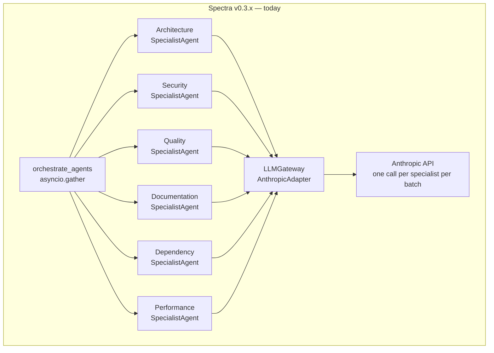
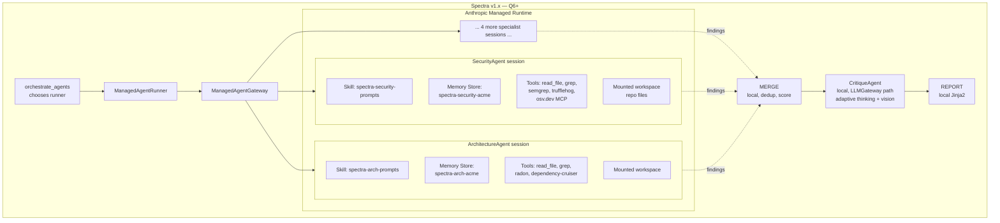
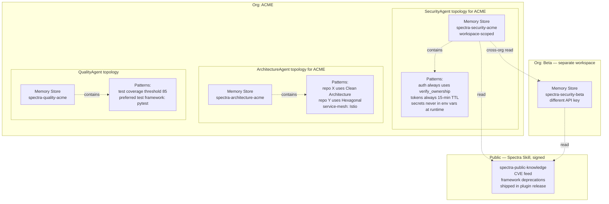
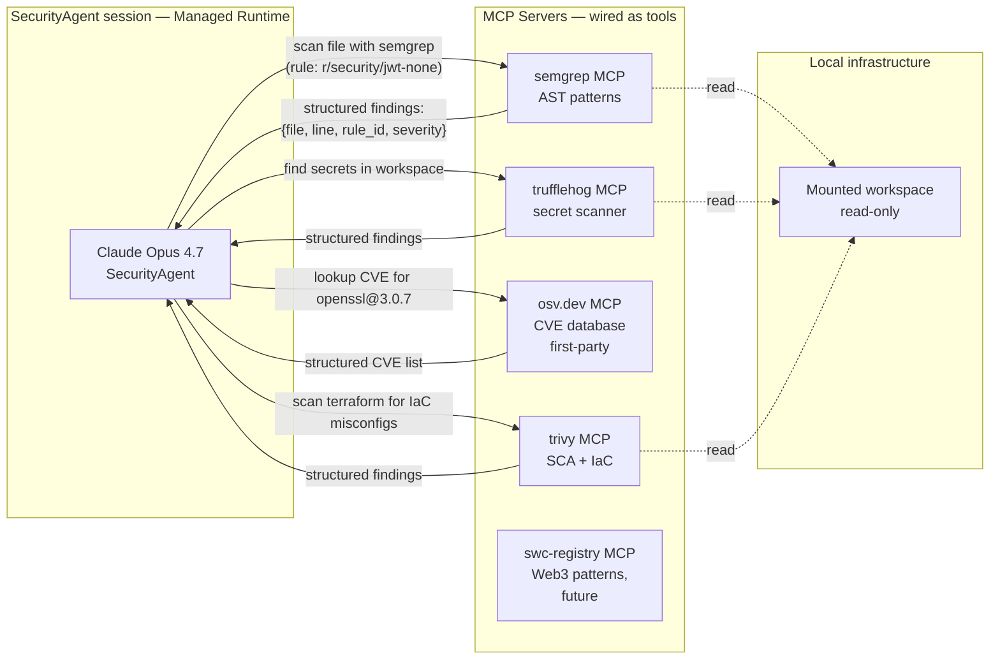

# Agentic Architecture — Spectra in 18 Months

**Author:** Chief Architect · 2026-04-29
**Status:** Vision document — companion to ADR-011 through ADR-020
**Scope:** What Spectra's agent loop becomes when Claude Opus 4.7 capabilities, Anthropic Managed Agents, MCP servers, and per-agent Memory Stores all land. Not a roadmap; a target steady-state to triangulate against.

---

## TL;DR

Spectra's 8-agent fan-out today is a static prompt orchestration. In 18 months it becomes a **dynamic agentic system** where:

1. **The 6 specialists are Managed Agents** with skills, tools, and per-agent memory stores. The orchestrator submits sessions; Anthropic owns the per-session container, retry, and concurrency. Spectra owns the `MERGE` / `CRITIQUE` / `REPORT` discipline and the scoring weights.
2. **Each specialist has its own Memory Store** of patterns it learned across past scans of the same org. The security agent remembers "this org's auth pattern always uses `verify_ownership(user_id, resource_id)`"; novel deviations become signal.
3. **Deterministic analyzers (Semgrep, TruffleHog, OSV.dev) ship as MCP servers**. Specialists call them as native tools and reason over structured output rather than over re-implemented regex packs in their prompts.
4. **The CritiqueAgent uses adaptive thinking + task budgets** to validate findings *across* specialists, with vision (high-res rendering of architecture diagrams) and code-execution sandbox to verify reproducibility claims.
5. **`spectra ask` becomes the daily-driver surface** — prompt-cached preambles over per-repo + per-org memory, $0.05 per cached call, conversational answers with citations.

The Dependency Rule survives every change. `LLMGateway` and `ManagedAgentGateway` are sibling Layer-2 Protocols. Memory Stores, MCP servers, Skills are all infrastructure-layer concerns. The use-case layer never knows where execution happens — Anthropic, Bedrock, or local.

---

## 1. What changes about Spectra's agent loop with Claude Opus 4.7's capabilities

Today the loop is six concurrent prompts, validated by one critique. Opus 4.7 (and the 2026 Anthropic API surface) introduces capabilities that change the *shape*, not just the *speed*, of the loop. Mapping per capability:

### 1.1 Adaptive thinking + task budgets

**Today:** Only CritiqueAgent uses it ([ADR-008](../../architecture/adr/ADR-008-adaptive-thinking-supersedes-extended.md)) with a hardcoded 80K budget.

**Target:** Every specialist gets a per-role `task_budget` ([ADR-013](../../architecture/adr/ADR-013-task-budget-and-rate-coordination.md)). Adaptive thinking expands beyond Critique on a per-finding basis — for example, the security specialist toggles thinking on for a single suspect finding ("is this really a SQL injection or just a parameterized query?") and off for routine findings. The Anthropic API exposes per-message thinking control; we pass it on a per-batch basis once we have telemetry on which findings need deep reasoning.

**Where Spectra uses it:** `SpecialistAgent` gains an optional per-batch thinking override; the per-role default stays "off" for cost discipline.

### 1.2 Effort dial

**Today:** Per-agent fixed effort (`MetaPrompter=medium, specialists=xhigh, Critique=high`).

**Target:** Effort becomes per-batch. A small focus_area with 5 well-named files might run at `medium` effort; a sprawling auth subsystem with 50 files runs at `xhigh`. The MetaPrompter outputs an `effort` recommendation per batch; the orchestrator honours it.

**Where Spectra uses it:** `BatchPrompt` gains an `effort` field; `MetaPrompter` plan output is extended.

### 1.3 Vision (high-res)

**Today:** Not used.

**Target:** The CritiqueAgent gets the rendered architecture diagram (via Mermaid → SVG → PNG conversion) attached as a high-res image. The agent reasons over the visual layering — "this layered diagram shows direct calls from Layer 4 to Layer 1, which contradicts the dependency rule." This is faster and more accurate than asking the agent to reconstruct the diagram from text.

**Where Spectra uses it:** `report_adapter.py` already renders Mermaid; we add a pre-critique step that converts the architecture diagram to PNG and attaches it to the critique call.

### 1.4 File operations via Memory Tool + Files API

**Today:** All file content is interpolated into the prompt.

**Target:** Large files (≥10K tokens) are uploaded once via Files API, referenced by `file_id` in subsequent calls. ADR bodies, design docs, large source files all use this path. The per-developer memory and per-org memory tiers ([ADR-014](../../architecture/adr/ADR-014-anthropic-memory-stores-for-team-org.md)) use the Memory Tool primitive directly.

**Where Spectra uses it:** `MemoryPort` adapters wrap Files API + Memory Tool. The `query_codebase` use case ([ADR-015](../../architecture/adr/ADR-015-query-codebase-use-case.md)) references files by `file_id` for ADR citations.

### 1.5 Code execution sandbox

**Today:** Not used.

**Target:** The CritiqueAgent can verify "this finding's recommended fix actually works" by running the patched snippet in a sandbox. For the performance specialist, the agent can verify "this query is N+1" by executing a synthetic load against the snippet. Limited to the critique stage to bound cost.

**Where Spectra uses it:** Optional `--verify-fixes` flag on `spectra analyze`. Not on by default; targeted at high-stakes findings (security critical only).

### 1.6 Web search + fetch

**Today:** Not used.

**Target:** The dependency specialist queries OSV.dev / NVD via the OSV.dev MCP server (preferred) or, when unavailable, via web fetch. The security specialist consults CVE feeds for the org's deployed dependency versions. The architecture specialist looks up framework-specific best practices for unfamiliar stacks.

**Where Spectra uses it:** Per-specialist tool wiring on the Managed Agents path ([ADR-016](../../architecture/adr/ADR-016-managed-agents-gateway.md)). Falls back to MCP servers when not on Managed Agents.

---

## 2. The 8 specialists today are fixed prompts to a generic LLM. Could they be Managed Agents?

Yes — and they should be by Q6 ([ADR-016](../../architecture/adr/ADR-016-managed-agents-gateway.md)). The migration is sequential, not big-bang.

### 2.1 What the loop looks like today

Every specialist receives the same shape of input (file batch as text in user prompt), produces the same shape of output (validated `Findings` JSON), runs in the same Python process, contends for the same per-process semaphore + httpx pool.

### 2.2 What the loop looks like in 18 months

### 2.3 What stays vs what moves

| Component | Today | 18 months | Migration trigger |
|-----------|-------|-----------|-------------------|
| `analyze_repository` facade | local | local | never moves |
| `orchestrate_agents` | local; uses `LLMGateway` | local; chooses `LLMGateway` or `ManagedAgentGateway` runner | ADR-016 lands |
| `SpecialistAgent` (the 6) | local Python class with prompt template | Managed Agent definition with Skill + tools + Memory Store | parity ≥95% on adversarial leaderboard |
| `MERGE` (dedup, cross-ref) | local | local | never moves — Spectra IP |
| `CritiqueAgent` | local with adaptive thinking | local with adaptive thinking + vision + (opt) code execution | grows in capability, stays local |
| `REPORT` | local Jinja2 | local Jinja2 | never moves |
| `MemoryPort` impls | not yet | local + Memory Tool + Memory Stores | ADR-014 lands |
| Tool calls (read_file, grep) | baked into prompt as text | MCP-style tool calls inside the managed session | Q6 |

### 2.4 Vendor-portability survives

`LLMGateway` stays as the Bedrock/Vertex baseline. Customers who refuse Managed Agents get the legacy path with the same use-case behaviour. The boundary is `ManagedAgentGateway` — a Layer-2 Protocol that two adapters implement (`AnthropicManagedAgentAdapter`, future `BedrockAgentAdapter`).

---

## 3. Memory stores per-agent

Each specialist gets its own per-org Memory Store. Cross-org reads are physically impossible (different store IDs, different API keys). Per-language patterns accumulate over time; novel deviations become signal.

### 3.1 Topology

### 3.2 What each specialist remembers

| Specialist | What it accumulates | How a new finding uses it |
|------------|--------------------|--------------------------|
| **Security** | "this org's auth pattern always uses `verify_ownership(user_id, resource_id)`"; common false-positive patterns this org tolerates | A new endpoint without the pattern is a high-confidence finding; a flagged pattern that matches a tolerated pattern is downgraded |
| **Architecture** | repo's chosen architecture style (Clean, Hexagonal, MVC, Onion); service mesh; messaging conventions | A PR that violates the established style is flagged as architectural drift, not as "no architecture" |
| **Quality** | preferred test framework, coverage thresholds, naming conventions | A new module without tests is a regression against the org norm, not a discovery |
| **Documentation** | preferred docstring format, README structure, ADR conventions | A missing ADR for a pattern this org always documents is a real finding |
| **Dependency** | approved package list, banned packages, license preferences | A newly-added unapproved package is high-severity even if it has no CVEs |
| **Performance** | known hot paths, established performance budgets | A regression against an established budget is signal; a new path on a cold surface is not |

### 3.3 Privacy invariants ([ADR-014](../../architecture/adr/ADR-014-anthropic-memory-stores-for-team-org.md))

- Per-org store keys are workspace-scoped; cross-org reads are physically impossible (different API keys held in OS keyring + AWS SM, never in process memory simultaneously).
- Each per-agent store holds findings *patterns*, not findings *content*. The pattern "auth uses `verify_ownership(...)`" goes in; the SQL excerpt that triggered the pattern stays in the per-repo SQLite cache (which is HMAC + per-user — [ADR-012](../../architecture/adr/ADR-012-cache-hmac-per-user-namespace.md)).
- CI mode disables per-developer + per-org writes ([ADR-014](../../architecture/adr/ADR-014-anthropic-memory-stores-for-team-org.md) Invariant 3).
- Right-to-be-forgotten is a one-call API.

---

## 4. MCP servers as analyzers

Today the security specialist's prompt contains regex packs and CWE lookups baked in. Tomorrow, deterministic analyzers (Semgrep, TruffleHog, OSV.dev) are MCP servers; the specialist calls them as tools and reasons over structured output.

### 4.1 Architecture

### 4.2 Why this shape vs pre-running deterministic analyzers and feeding their output as text

- **Tool calls are typed.** The agent gets structured findings, not strings to re-parse. Eliminates a class of hallucinated locations.
- **The agent decides when to call.** Today we run Semgrep on every scan — wasted on small repos. Tomorrow the security agent runs it only on files it suspects, dropping CI cost.
- **MCP is the standard.** OSV.dev ships an MCP server officially. Semgrep, TruffleHog, Trivy have community MCP servers (or will). Building our own wrapper for each is throwaway work.
- **The CTO's framing wins** ([cto-findings.md](../cto-findings.md) "How Anthropic Managed Agents could change the architecture"): "strictly better for grounding."

### 4.3 What stays in our prompts when MCP is available

The specialist's *judgement* — severity calibration, false-positive suppression, recommendation generation — stays in the system prompt + Skill. The *deterministic detection* — "this string is a secret," "this query is a CVE," "this AST pattern is a SQL injection" — moves to the MCP servers.

### 4.4 Fallback when MCP servers are unavailable

The specialist's system prompt is a superset — it can do the analysis without the tools, just less precisely. When an MCP server is unavailable, the agent gets a tool-error response and continues with its prompt-based reasoning. Cost: more tokens, lower precision. Same correctness contract.

---

## 5. Steady-state architecture in 18 months

The single C4-style view of how everything fits.

```mermaid
flowchart TB
    subgraph users[Users + Surfaces]
        Dev[Developer<br/>spectra analyze<br/>spectra ask<br/>spectra brief]
        CI[CI Runner<br/>action.yml<br/>parses JSON / SARIF]
        SIEM[Customer SIEM<br/>OTLP collector]
        Slack[Slack / Teams<br/>webhooks]
    end

    subgraph cli_layer[Spectra CLI — Layer 3 Adapters]
        CLIc[cli_controller.py<br/>Typer subcommands]
        Reporter[Rich Progress<br/>Audit emitter wiring]
    end

    subgraph use_cases[Spectra Use Cases — Layer 2]
        AR[analyze_repository<br/>6-stage pipeline]
        QC[query_codebase<br/>spectra ask]
        Memo[memory admin<br/>forget / export]

        subgraph ports[Layer 2 Ports — Protocols]
            LLMP[LLMGateway]
            MAGp[ManagedAgentGateway]
            CacheP[CachePort]
            MemP[MemoryPort]
            AuditP[AuditPort]
            CostP[CostTrackerPort]
            RateP[RateCoordinatorPort]
            SecP[SecretBackend]
            GitP[GitPort]
            ReportP[ReportPort]
            ObsP[ProgressObserver]
        end
    end

    subgraph entities[Spectra Entities — Layer 1]
        Models[Pydantic frozen models<br/>Finding, Score, Batch...,<br/>MemoryEntry, AuditEvent,<br/>CodebaseQuestion, Identity]
    end

    subgraph adapters[Spectra Infrastructure — Layer 4]
        subgraph llm_path[LLM execution]
            AnthA[AnthropicAdapter<br/>existing]
            BedA[BedrockAdapter<br/>Q4]
            VerA[VertexAdapter<br/>Q4]
            AMA[AnthropicManagedAgentAdapter<br/>Q5]
        end

        subgraph cache[Cache tier]
            SqlC[SqliteCacheAdapter<br/>L1, per-user, MAC]
            RedC[RedisCacheAdapter<br/>L2, fleet]
            S3C[S3CacheAdapter<br/>L2, alt]
            TierC[TieredCacheAdapter<br/>composite]
        end

        subgraph memory[Memory tier]
            LocalM[LocalFileMemoryAdapter<br/>per-repo SQLite]
            DevM[DeveloperMemoryAdapter<br/>Memory Tool]
            OrgM[ManagedAgentMemoryAdapter<br/>Memory Stores]
            CompM[CompositeMemoryAdapter<br/>routes by scope]
        end

        subgraph audit[Audit tier]
            JsonA[JsonlAuditAdapter]
            OtlpA[OtlpAuditAdapter]
            CWA[CloudWatchAuditAdapter]
        end

        subgraph rate[Rate / cost]
            IPC[InProcessRateCoordinator]
            RCC[RedisRateCoordinator]
            CostA[SqliteCostTrackerAdapter]
        end

        subgraph specialists[Specialist registry]
            Reg[specialist_registry.py<br/>entry-point discovery]
            Built[6 built-in specialists]
            Plug[3rd-party plugins<br/>web3, iac, ml, cicd<br/>Sigstore-signed]
        end

        subgraph skills[Spectra plugin .claude-plugin/]
            SkPub[spectra-public-knowledge]
            SkLang[per-language Skills]
            SkSpec[per-specialist Skills]
        end
    end

    subgraph external[External — vendor-managed]
        Anth[Anthropic API<br/>messages, files,<br/>memory_stores,<br/>memory tool, agents]
        Bed[AWS Bedrock<br/>Anthropic models]
        Ver[GCP Vertex AI<br/>Anthropic models]
        Redis[(Redis<br/>cache L2 + rate coord)]
        S3[(S3 bucket<br/>cache L2 alt)]
        AWSSM[AWS Secrets Manager<br/>per-org HMAC secrets]
        OTel[OTLP collector<br/>customer's SIEM]

        subgraph mcp[MCP servers]
            Sem[semgrep]
            TH[trufflehog]
            OSV[osv.dev]
            Triv[trivy]
        end
    end

    Dev --> CLIc
    CI --> CLIc
    CLIc --> AR
    CLIc --> QC
    CLIc --> Memo
    CLIc --> Reporter

    AR & QC --> ports
    ports --> entities

    LLMP --> AnthA & BedA & VerA
    MAGp --> AMA
    CacheP --> TierC
    TierC --> SqlC
    TierC --> RedC
    TierC --> S3C
    MemP --> CompM
    CompM --> LocalM & DevM & OrgM
    AuditP --> JsonA & OtlpA & CWA
    RateP --> IPC & RCC
    CostP --> CostA

    AnthA --> Anth
    BedA --> Bed
    VerA --> Ver
    AMA --> Anth
    DevM --> Anth
    OrgM --> Anth
    RedC --> Redis
    S3C --> S3
    RCC --> Redis
    OrgM -.HMAC secret.-> AWSSM
    OtlpA --> OTel
    OTel --> SIEM
    Reporter --> Slack

    AMA -. mounts .-> mcp
    AMA -. mounts .-> skills

    Reg --> Built
    Reg --> Plug

    AR -. uses .-> Reg
```

### 5.1 What is steady-state

- **Three execution modes** for the LLM substrate: `LLMGateway` direct (Anthropic / Bedrock / Vertex), `ManagedAgentGateway` (Anthropic Managed Agents), and the legacy fallback path. The use case never knows which; the composition root selects.
- **Three memory tiers** (per-repo / per-developer / per-org) under one `MemoryPort`. The composite adapter routes by scope.
- **Two cache tiers** (per-machine SQLite L1 + shared Redis or S3 L2) under the existing `CachePort`. The tiered composite handles policy.
- **Three audit sinks** (file, OTLP, CloudWatch) under one `AuditPort`. Customer picks.
- **Six built-in specialists + N plugins** discovered via entry points. All implement the same `Specialist` Protocol.
- **One CritiqueAgent** with adaptive thinking, vision (architecture diagrams), optional code execution sandbox (high-stakes only).

### 5.2 What is *not* in steady-state (deliberately deferred or rejected)

- **No Spectra-operated control plane.** CLI-only commitment ([product-roadmap.md TL;DR](../product-roadmap.md)) holds. SaaS is a separate product if/when greenlit (post-Q6).
- **No vector store / RAG over codebases.** [memory-second-brain-findings.md §3](../memory-second-brain-findings.md) — Anthropic prompt cache + Memory Store FUSE mount cover the use case.
- **No 7th dimension on the ScoreCard.** Plugins map findings to the existing 6 dimensions ([ADR-017](../../architecture/adr/ADR-017-custom-rules-plugin-architecture.md)). Adding a dimension is an entity-layer change deferred indefinitely.
- **No worker daemon / Temporal queue for the analyze loop.** The analyze loop is single-process; portfolio scheduling is a separate system (Q3 #24-#26) that orchestrates *invocations* of the analyze loop.

---

## 6. Why this shape passes the Dependency Rule audit

Every change above respects the inward-only dependency rule:

| New thing | Layer | Imports allowed | Verified |
|-----------|-------|-----------------|----------|
| `MemoryPort` Protocol | 2 | entities only | Yes |
| `ManagedAgentGateway` Protocol | 2 | entities only | Yes |
| `AuditPort` Protocol | 2 | entities only | Yes |
| `CostTrackerPort` Protocol | 2 | entities only | Yes |
| `RateCoordinatorPort` Protocol | 2 | entities only | Yes |
| `SecretBackend` Protocol | 2 | entities only | Yes |
| `Specialist` Protocol | 2 | entities only | Yes |
| `query_codebase` use case | 2 | entities + ports | Yes |
| `MemoryEntry`, `AuditEvent`, `Identity`, `CodebaseQuestion`, `Specialist` metadata | 1 | stdlib + pydantic only | Yes |
| All adapters (Anthropic, Redis, S3, OTLP, CloudWatch, Memory Tool, Memory Stores) | 4 | layers 1, 2, 3 | Yes |
| MCP server wiring | 4 (within `AnthropicManagedAgentAdapter`) | layers 1, 2, 3 | Yes |
| Skills | content (no layer) | n/a | Yes |
| Plugins | external Python packages | implement Layer-2 `Specialist` Protocol | Yes |

The architecture grows by *adding ports and adapters*, not by promoting infrastructure into use cases. Every Anthropic-native primitive (Memory Stores, Memory Tool, Managed Agents, Skills, Files API, prompt caching) sits behind a Protocol. A future swap to a different vendor is bounded — replace adapter, keep use cases.

---

## 7. The 18-month bet — what wins, what could be wrong

### What wins if this lands

1. **Spectra becomes a daily-driver tool, not a CI-only tool.** `spectra ask` + `spectra brief` + `spectra trend` reach the engineers who do not run scans, which is most of them.
2. **The grade becomes trustworthy.** Adversarial harness + prompt-injection isolation + signed receipts let the public leaderboard ship without becoming a gameable artifact.
3. **The cost story holds at scale.** Distributed cache + single-flight + Batch API + prompt caching + `task_budget` discipline keep $/scan below the price the market will pay.
4. **The Anthropic-native bet pays off.** Managed Agents shrink ~30% of `infrastructure/`; Memory Stores provide multi-tenant memory without us building Postgres-backed multi-tenancy; MCP servers obviate hand-rolled deterministic-analyzer wrappers.
5. **The Dependency Rule still holds.** Every Anthropic-native primitive sits behind a Protocol. Bedrock/Vertex are 2-week swaps. The boundary mitigates the lock-in.

### What could be wrong

1. **Anthropic deprecates a beta primitive.** `memory-2026-...` and `task-budgets-2026-03-13` are beta headers. A schema change forces an adapter refactor. Mitigation: every adapter has a fallback (`LocalFileMemoryAdapter` covers Memory Tool outages, `LLMGateway` covers Managed Agents outages).
2. **Managed Agents pricing model shifts to per-session-time, not per-token.** Cost prediction becomes harder. Mitigation: `CostTrackerPort` ([ADR-013](../../architecture/adr/ADR-013-task-budget-and-rate-coordination.md)) carries a `ManagedSessionCost` rate sheet updated per Anthropic pricing change.
3. **The plugin ecosystem fragments.** 50 third-party specialists with 50 different output qualities erode the "Spectra grade is consistent" story. Mitigation: Sigstore-signed plugins + leaderboard publishes per-plugin catch-rates ([ADR-017](../../architecture/adr/ADR-017-custom-rules-plugin-architecture.md)).
4. **The second-brain narrative does not land.** `spectra ask` is a bet that engineers will use a CLI Q&A surface over their codebase memory. If they do not, M3 onwards underperforms. Mitigation: instrument cache-hit and re-ask rate; if `spectra ask` adoption is < 5% of `spectra analyze` users by Q5, deprioritise M5+.
5. **Customers reject the Anthropic-native bet entirely.** Enterprise procurement teams that demand vendor-neutrality from day one are a real segment. Mitigation: Bedrock + Vertex `LLMGateway` adapters in Q4; documented fallback for every Anthropic-native primitive.

### What we are not betting on

- **A SaaS control plane.** Not in 18 months.
- **A vector database.** Not in 18 months.
- **A 7th ScoreCard dimension.** Not in 18 months.
- **On-prem worker mode.** Only if a regulated customer commits in writing.
- **Public bug bounty before $1M ARR.** Private invite-only ([product-roadmap.md §7](../product-roadmap.md) Q5).

---

## 8. Anthropic-native primitives — the canonical list

For reference across the 10 ADRs in this batch, the primitives we adopt:

| Primitive | Used by | Where in Spectra |
|-----------|---------|------------------|
| **Adaptive thinking** (`thinking={"type": "adaptive"}`) | CritiqueAgent (existing); per-batch on specialists (target) | [ADR-008](../../architecture/adr/ADR-008-adaptive-thinking-supersedes-extended.md), [ADR-013](../../architecture/adr/ADR-013-task-budget-and-rate-coordination.md) |
| **`task_budget`** (beta header `task-budgets-2026-03-13`) | All 8 agents | [ADR-013](../../architecture/adr/ADR-013-task-budget-and-rate-coordination.md) |
| **`output_config.effort`** | All 8 agents (per-batch eventually) | [ADR-013](../../architecture/adr/ADR-013-task-budget-and-rate-coordination.md), §1.2 above |
| **Prompt caching** (`cache_control: ephemeral`) | `query_codebase` preamble; per-specialist Skills (target) | [ADR-015](../../architecture/adr/ADR-015-query-codebase-use-case.md) |
| **Files API** | ADR ingest; large-file references | [ADR-014](../../architecture/adr/ADR-014-anthropic-memory-stores-for-team-org.md), [ADR-015](../../architecture/adr/ADR-015-query-codebase-use-case.md) |
| **Memory Tool** (beta header `memory-2026-...`) | Per-developer memory | [ADR-014](../../architecture/adr/ADR-014-anthropic-memory-stores-for-team-org.md) |
| **Memory Stores** (`/v1/memory_stores`, FUSE mount) | Per-team / per-org memory; per-agent memory (target) | [ADR-014](../../architecture/adr/ADR-014-anthropic-memory-stores-for-team-org.md), §3 above |
| **Managed Agents** (`/v1/agents`, `/v1/sessions`) | The 6 specialists in Q6+ | [ADR-016](../../architecture/adr/ADR-016-managed-agents-gateway.md) |
| **Skills** (`.claude-plugin/skills/`) | Public knowledge; per-language patterns; per-specialist prompts | [ADR-017](../../architecture/adr/ADR-017-custom-rules-plugin-architecture.md), [memory-second-brain-findings.md §3](../memory-second-brain-findings.md) |
| **Vision (high-res)** | CritiqueAgent reasoning over architecture diagrams | §1.3 above |
| **Code execution sandbox** | CritiqueAgent fix verification (opt-in) | §1.5 above |
| **Web fetch / web search** | DependencyAgent CVE lookups; ArchitectureAgent framework lookups | §1.6 above |
| **MCP tool wiring** (Semgrep, TruffleHog, OSV.dev) | SecurityAgent + DependencyAgent | §4 above, [ADR-016](../../architecture/adr/ADR-016-managed-agents-gateway.md) |
| **Batch API** | Portfolio overnight scans | [product-roadmap.md #23](../product-roadmap.md), Q3 |

---

*This document is the architectural target the 10 ADRs in this batch triangulate against. It is not a roadmap; the roadmap lives in [product-roadmap.md](../product-roadmap.md). It is not a spec; the specs live in the ADRs. It is the coherent picture that makes each individual ADR's trade-off legible.*

*Last updated: 2026-04-29.*
