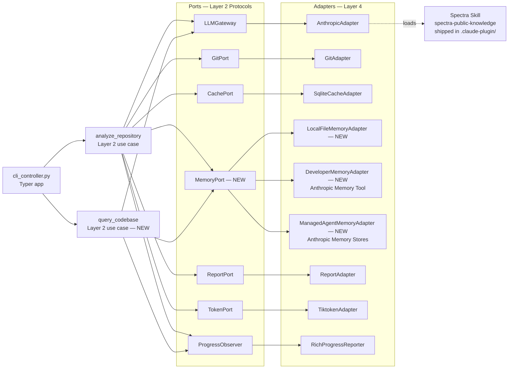

# Memory + 2nd Brain Capabilities for Spectra

**Author:** Memory architecture · 2026-04-29
**Status:** Strategy proposal — input for Head of Product
**Scope:** Adds `MemoryPort` + adapter trio + `query_codebase` use case to today's
analyze-only pipeline. Anthropic-native primitives mapped per capability.

---

## TL;DR

Spectra v0.3.3 has a **cache** (`CachePort` + `SqliteCacheAdapter`) — it skips work
when files haven't changed. It does not have **memory** — it cannot recall what was
decided, what was waived, what the engineer prefers, or what we learned across runs.
The five capabilities to build, ranked by user value × ease:

1. **Per-repo finding history + waiver list** — re-runs honor "this finding is waived
   because X" decisions. M1, 2 days. Highest user value, near-zero engineering risk.
   Hosted in the existing `cache.db` as new tables. Unlocks every other capability.
2. **Codebase Q&A (`spectra ask <question>`)** — "where do we handle auth?" answered
   from the per-repo memory + a small Claude call. M3, 4 days. Sells the product to
   non-Spectra-running team-mates (docs-as-product).
3. **Decision archeology + ADR auto-ingest** — auto-index `docs/adr/`, `RFC.md`,
   `ARCHITECTURE.md`, surface "what did we decide about X?" with provenance. M2,
   3 days. Cheap because the corpus is small (≤200 docs typical).
4. **Drift detection over time** — score deltas across runs ("Architecture dropped 12
   points in 6 weeks; here are the four PRs that caused it"). M4, 2 days. Pure
   leverage on the per-repo memory we already store.
5. **Per-developer reviewer profile** — route findings to the engineer most likely
   to act on them ("Vivek owns Architecture findings in `payments/`"). M5, 5 days.
   Highest cost, highest moat — privacy work is non-trivial and is what gates
   enterprise adoption.

**Anthropic primitive mapping in one sentence:** local SQLite for per-run +
per-repo (already shipping); **client-side Memory Tool** (files in `/memories/`)
for per-developer; **Managed Agent Memory Stores** (`/v1/memory_stores`,
FUSE-mounted at `/mnt/memory/<store>/`) for per-team and per-org with
prompt-cache preamble; **Files API** for big artifacts (ADRs, design docs,
transcripts); **Skills** for language/framework knowledge that ships with
Spectra; **prompt caching** on the read-heavy preamble of every Q&A call to
drop input cost ~90%.

---

## 1. Memory tiers

The single most important table in this document — get this wrong and either
data leaks across users or memory becomes useless dead weight.

| Tier                        | What lives here                                                                                                                       | Storage backend                                                                                                  | Lifetime                                          | Read pattern                                                                       | Privacy boundary                                                                                | Invalidation                                                                                                      |
| --------------------------- | ------------------------------------------------------------------------------------------------------------------------------------- | ---------------------------------------------------------------------------------------------------------------- | ------------------------------------------------- | ---------------------------------------------------------------------------------- | ----------------------------------------------------------------------------------------------- | ----------------------------------------------------------------------------------------------------------------- |
| **Per-run scratchpad**      | Mid-scan tool-call results, partial findings, cross-agent messages                                                                    | In-process Python dict + `tempfile.TemporaryDirectory()`                                                          | Hours (run lifetime)                              | Every agent in the run                                                             | Single OS process; never persisted                                                              | Process exit                                                                                                      |
| **Per-repo**                | Finding history, waivers (with reason + actor + timestamp), score timeline, ADR index, `last_report.json`                             | Existing `cache.db` (new tables: `finding_history`, `waivers`, `score_timeline`, `decision_log`)                  | Months — until repo is deleted or `cache clear`   | Every scan reads waivers + last report; Q&A reads everything                       | Filesystem permissions on `~/.cache/spectra/`                                                   | Repo URL hash mismatch; explicit `spectra cache clear <repo>`; row-level TTL on `decision_log` (default 365 days) |
| **Per-developer**           | Severity downgrades the engineer applies, dimensions they care about, repos they review, language preferences ("I work in Rust + Go") | **Client-side Memory Tool** files under `${XDG_CONFIG_HOME:-~/.config}/spectra/memories/<dev_id>/`                | Years — until engineer says "forget me"           | Every scan injects a 1-2KB preamble; Q&A reads on demand                           | OS user account; adapter rejects reads when `dev_id ≠ current_dev_id`                            | `spectra memory forget --me`; auto-prune entries unused for 18 months                                              |
| **Per-team / per-org**      | "We always use boto3 paginators", custom severity overrides, internal pattern library, runbook index                                  | **Managed Agent Memory Store** keyed `org:<org_id>` — FUSE-mounted at `/mnt/memory/spectra-org-<org_id>/`         | Years — until subscription ends                   | Every scan in the org reads org store; ADR ingest writes here                       | Workspace-scoped store; cross-org reads physically impossible (different store IDs + auth)       | Right-to-be-forgotten via `DELETE /v1/memory_stores/{id}`; per-key TTL                                            |
| **Cross-org / public**      | CVE feeds, emerging vuln patterns, framework deprecations, public ADRs from popular OSS                                                | **Spectra Skill** (`.claude-plugin/skills/spectra-public-knowledge/`) packaged into the CLI release                | Forever (or until Spectra release)                | Loaded by every scan, every org, every user                                        | None — public                                                                                   | Spectra release cycle                                                                                             |

Three invariants this table enforces:

1. **No tier reads above its scope.** A per-developer adapter cannot read another
   developer's memory because the adapter is constructed with `dev_id` and rejects
   any key not prefixed with that ID. Same for per-org.
2. **The public tier is not memory; it is a skill.** It does not write back. This
   keeps the supply chain auditable — an OSS CVE list ships in a Spectra release,
   not via runtime mutation.
3. **The per-run scratchpad is never persisted.** This eliminates a class of bugs
   where mid-run partial state leaks into the next run's cache.

---

## 2. Second-brain capabilities (10 ranked)

Rank order is `user value × (1 / engineering effort)`, normalized. Cost/call
estimates assume Opus 4.7 at current pricing with prompt caching enabled (the
"preamble" line in §6 is a 90%-discount cache hit on the second call onward).

| #   | Capability                            | User story                                                                                                                                  | Tiers consumed                              | First-call cost | Cached call cost | Effort | Rank score |
| --- | ------------------------------------- | ------------------------------------------------------------------------------------------------------------------------------------------- | ------------------------------------------- | --------------- | ---------------- | ------ | ---------- |
| 1   | **Waiver-aware re-runs**              | "I waived this XSS finding in `legacy/admin.js` because that surface is internal-only — don't show it again"                                | per-repo                                    | $0.00           | $0.00            | S      | 100        |
| 2   | **Codebase Q&A (`spectra ask`)**      | "Where do we handle auth?" / "Why did we choose Postgres over MySQL?"                                                                       | per-repo + per-org + public                 | $0.50           | $0.05            | M      | 88         |
| 3   | **Decision archeology + ADR ingest**  | "Show me every architectural decision touching `payments/`"                                                                                 | per-repo + per-org                          | $0.20           | $0.02            | S      | 84         |
| 4   | **Drift detection**                   | "Architecture score dropped 12 points in 6 weeks — what changed?"                                                                           | per-repo                                    | $0.00           | $0.00            | S      | 80         |
| 5   | **Reviewer profile + finding routing**| "Vivek cares about Architecture in `payments/`; Daisy cares about Security everywhere — route findings accordingly"                         | per-developer + per-team                    | $0.10           | $0.01            | L      | 65         |
| 6   | **Cross-repo pattern surfacing**      | "Repo A solved caching with `lru_cache(maxsize=1024)` and avg 18ms latency; Repo B has the same hot path uncached"                          | per-org + per-repo (multi)                  | $0.30           | $0.03            | L      | 55         |
| 7   | **Onboarding mode (`spectra brief`)** | "I'm new to this repo — give me the 10 things I need to know"                                                                               | per-repo + per-org + public                 | $0.40           | $0.04            | M      | 52         |
| 8   | **Continuous knowledge ingestion**    | New runbook lands in `docs/runbooks/` → auto-indexed; next scan can answer "what's the deploy rollback procedure?"                          | per-repo + per-org                          | $0.05           | $0.005           | M      | 50         |
| 9   | **Severity bias correction**          | "This dev consistently downgrades 'documentation' findings → de-prioritize doc findings in their reports"                                   | per-developer                               | $0.00           | $0.00            | M      | 45         |
| 10  | **Persistent decision log + provenance**| "Who decided to deprecate `auth/legacy.py`? When? Show the conversation."                                                                  | per-repo + per-developer                    | $0.00           | $0.00            | S      | 42         |

**Read 1, 3, 4, 10 first.** They share the same backend (per-repo SQLite tables),
ship as one increment (M1+M2), and create the data the higher-cost capabilities
need to be useful.

### Capability detail — top 5

**1. Waiver-aware re-runs.** A `spectra waive <finding-id> --reason "<text>"`
command writes to a `waivers` table keyed by `(repo_signature, finding_signature)`.
`finding_signature = blake2b(file_path || rule_id || severity)` — stable across
prompt versions, unstable across file moves (acceptable; moves trigger re-review).
The orchestrator's `_run_merge_stage` filters waived findings before they reach
the ScoreCard. Waivers expire after 180 days unless re-confirmed (forces periodic
review of "we'll fix it later" tech debt).

**2. Codebase Q&A.** New CLI: `spectra ask "where do we handle auth?"`. New
use case: `query_codebase(question, scope) -> Answer`. Reads per-repo memory
(file tree, finding history, ADR index, last report) into a cacheable preamble
(~10K tokens), appends the question, calls Claude. The first call seeds the
prompt cache; subsequent questions on the same repo cost ~$0.05.

**3. Decision archeology.** A `decision_log` table stores `{actor, when, what,
why, files_touched, source}` — sourced from waivers, scan-time agent outputs,
and ingested ADRs. Queryable via `spectra decisions --grep payments`. The
ingester scans the repo for files matching `**/{ADR,RFC,DESIGN,DECISION}*.md`
and `docs/adr/*.md` on every run, hashes them, and re-indexes only changed files.

**4. Drift detection.** `score_timeline` table stores
`{repo_signature, computed_at, dimension, score, n_findings}` per scan. New CLI:
`spectra trend --since 6w` plots per-dimension scores and lists top contributing
PRs (correlated by commit timestamp). Pure SQL — no LLM call needed.

**5. Reviewer profile.** Per-developer memory tracks which findings each
engineer dismissed, downgraded, or fixed. After ~20 scans the system has
enough signal to suggest "route this finding to <name>; they own this area
and dismiss low-severity doc findings 80% of the time." Implementation is
the most expensive of the top 5 because of multi-tenant + GDPR considerations
(see §5).

---

## 3. Anthropic-native primitives mapping

For each capability, recommend exactly one of: **Memory Tool** (client-side files
in `/memories/`), **Managed Memory Store** (server-side, FUSE-mounted via
`/v1/memory_stores`), **roll-our-own** (SQLite + filesystem), or **skip**
(don't build).

| #   | Capability                            | Recommendation                | Why                                                                                                                                                                                                              |
| --- | ------------------------------------- | ----------------------------- | ---------------------------------------------------------------------------------------------------------------------------------------------------------------------------------------------------------------- |
| 1   | Waiver-aware re-runs                  | **Roll-our-own** (SQLite)     | Already have `cache.db`; waivers are structured rows the orchestrator filters with — never sent to Claude. Memory Tool is overkill; Managed Store would force a network round-trip on every scan.                |
| 2   | Codebase Q&A                          | **Managed Memory Store + prompt cache** | The preamble (file tree, ADR snippets, finding history) is ~10K tokens of stable context — exactly what prompt caching is built for. Hosting in a Managed Store means Claude reads it via the FUSE mount, not via injected user message — saves round-trip bytes and unlocks server-side compaction. |
| 3   | Decision archeology + ADR ingest      | **Roll-our-own** index + **Files API** for the ADR bodies | The index (a `decision_log` table) is structured query territory. The ADR text itself is a binary-grade artifact (markdown, sometimes large) → upload to Files API once per ingest, reference by `file_id` in any Q&A call. |
| 4   | Drift detection                       | **Roll-our-own** (SQLite)     | Pure structured query (`SELECT score FROM score_timeline WHERE repo_signature = ? AND dimension = ?`). No LLM involvement until the user asks for narrative summary, in which case fall back to Q&A path.       |
| 5   | Reviewer profile                      | **Memory Tool** (client-side) | Per-developer is a single-tenant scope mapped to a single OS user account. Memory Tool's `/memories/<dev_id>/` directory model is the natural fit; no need for a Managed Store with org-level multi-tenancy.    |
| 6   | Cross-repo pattern surfacing          | **Managed Memory Store**      | Multiple repos in the same org need to read each other's pattern findings. Workspace-scoped Memory Stores make this trivially correct — one store per org, all repos in that org can read.                       |
| 7   | Onboarding mode                       | **Managed Memory Store + prompt cache** | Same shape as Q&A but with a fixed prompt template ("brief a new engineer"). Reuses #2's store + cache.                                                                                                          |
| 8   | Continuous knowledge ingestion        | **Files API + index in SQLite** | New docs land in the repo; ingester uploads to Files API, stores `(file_id, file_hash, indexed_at)` row in `ingested_docs` table. Q&A references files by `file_id`.                                            |
| 9   | Severity bias correction              | **Memory Tool** (client-side) | Same scope as #5.                                                                                                                                                                                                 |
| 10  | Decision log + provenance             | **Roll-our-own** (SQLite)     | Provenance is structured metadata (actor, timestamp, source). SQL fits; LLM doesn't help.                                                                                                                         |

### What we explicitly skip

- **Cross-org public memory store.** Tempting (everyone's CVE feed in one place)
  but it's a regulated CISO blocker. Public knowledge ships as a **Spectra Skill**
  in the plugin (`.claude-plugin/skills/spectra-public-knowledge/SKILL.md`) and is
  versioned with releases. No runtime cross-org writes.
- **Embeddings / RAG over the codebase.** Rejected. Anthropic's prompt cache + the
  Managed Memory Store FUSE mount cover the "stable context" use case at lower
  operational complexity than running our own vector DB. Revisit only if
  per-repo memory exceeds 200K tokens (won't for ~99% of repos).
- **Compaction.** Anthropic's compaction is for long-conversation flows; Spectra's
  Q&A is single-turn-per-question. We rely on prompt caching, not compaction.

---

## 4. Architecture — Clean Architecture extension

### 4.1 New `MemoryPort` (Layer 2)

Add to `src/spectra/use_cases/interfaces.py`:

```python
class MemoryPort(Protocol):
    """Port for cross-run memory.

    Implemented by ``LocalFileMemoryAdapter`` (per-run/per-repo),
    ``ManagedAgentMemoryAdapter`` (per-team/per-org), and
    ``DeveloperMemoryAdapter`` (per-developer, OS-user-scoped).

    All scopes flow through one port — the use-case layer never branches
    on scope; the composition root wires the right adapter per scope.
    """

    async def get(self, scope: MemoryScope, key: str) -> MemoryEntry | None:
        """Return the entry at ``key`` within ``scope``, or ``None`` on miss."""
        ...

    async def put(self, entry: MemoryEntry) -> None:
        """Persist ``entry``. Adapter validates scope/owner before write."""
        ...

    async def list(
        self,
        scope: MemoryScope,
        prefix: str | None = None,
        limit: int = 100,
    ) -> tuple[MemoryEntry, ...]:
        """List entries under ``scope`` filtered by optional ``prefix``."""
        ...

    async def forget(self, scope: MemoryScope, key: str) -> bool:
        """Right-to-be-forgotten — remove the entry. Returns True if removed."""
        ...

    async def preamble(self, scope: MemoryScope) -> str:
        """Return a cacheable text preamble for prompt-cache injection.

        Used by ``query_codebase`` to seed the prompt cache with stable
        per-repo / per-org context. Implementations MUST return identical
        bytes for identical inputs (cache key stability).
        """
        ...
```

### 4.2 New entities (Layer 1)

Add to `src/spectra/entities/models.py`:

```python
MemoryScope = Literal["run", "repo", "developer", "team", "org", "public"]
MemoryKind = Literal["finding-history", "waiver", "decision", "score-snapshot",
                     "adr-index", "preference", "pattern", "ingested-doc"]


class MemoryEntry(BaseModel, frozen=True):
    """One memory row. Every memory access goes through this shape."""

    scope: MemoryScope
    owner_id: str                      # repo_signature, dev_id, org_id, "public"
    kind: MemoryKind
    key: str                           # caller-defined; namespaced under owner_id
    value_json: str                    # opaque payload; max 64KB
    provenance: Provenance
    ttl_days: int | None = None        # None = no expiry
    created_at: datetime


class Provenance(BaseModel, frozen=True):
    """Who created this memory entry, when, from what source."""

    actor: str                         # OS user, agent role, or "ingester"
    source: str                        # CLI command, agent name, file path
    spectra_version: str
    parent_run_id: str | None          # links memory back to the scan that created it


class Waiver(BaseModel, frozen=True):
    """A finding the engineer chose to suppress."""

    repo_signature: str
    finding_signature: str             # stable across prompt versions
    reason: str
    waived_by: str                     # OS user
    waived_at: datetime
    expires_at: datetime               # default created_at + 180 days


class ScoreSnapshot(BaseModel, frozen=True):
    """One row in the per-repo score timeline."""

    repo_signature: str
    computed_at: datetime
    dimension: Dimension
    score: float
    n_findings: int
    git_commit: str | None             # if known


class CodebaseQuestion(BaseModel, frozen=True):
    """Input to ``query_codebase``."""

    question: str
    repo_signature: str
    scope: MemoryScope                 # default "repo"; can widen to "org"


class CodebaseAnswer(BaseModel, frozen=True):
    """Output of ``query_codebase``."""

    answer: str
    citations: tuple[Citation, ...]
    cost_usd: float
    cache_hit: bool                    # prompt cache hit on the preamble
```

### 4.3 Adapter trio (Layer 4)

```
src/spectra/infrastructure/
├── memory/
│   ├── __init__.py
│   ├── local_file_adapter.py         # per-repo + per-run; SQLite tables in cache.db
│   ├── developer_adapter.py          # per-developer; client-side Memory Tool files
│   └── managed_agent_adapter.py      # per-team + per-org; Anthropic Memory Stores
```

| Adapter                       | Scopes covered      | Backend                                                                     | Key API methods                                                                                                  |
| ----------------------------- | ------------------- | --------------------------------------------------------------------------- | ---------------------------------------------------------------------------------------------------------------- |
| `LocalFileMemoryAdapter`      | run, repo           | New tables in existing `cache.db` (`memory_entries`, `waivers`, `score_timeline`, `decision_log`, `ingested_docs`) | SQLite — `INSERT OR REPLACE`, `SELECT … WHERE owner_id = ?`                                                       |
| `DeveloperMemoryAdapter`      | developer           | Client-side **Memory Tool** files at `${XDG_CONFIG_HOME:-~/.config}/spectra/memories/<dev_id>/` | Anthropic SDK `client.beta.memory.read_file()` / `write_file()` (memory tool beta header `memory-2026-...`)         |
| `ManagedAgentMemoryAdapter`   | team, org           | Anthropic **Memory Stores** — `POST /v1/memory_stores` once at signup; FUSE-mounted at `/mnt/memory/spectra-org-<org_id>/` during agent calls | `client.beta.memory_stores.create()`, `mount_id` referenced in agent runs; reads happen server-side via the mount   |

The public scope is **not** an adapter — it ships as a Spectra Skill bundled in
`.claude-plugin/`. Adapters refuse `scope="public"` writes.

### 4.4 Use-case integration

`analyze_repository.py` integration (additive — no breaking changes):

```python
# In _run_merge_stage, BEFORE deduplication:
waivers = await memory.list(MemoryScope.REPO, prefix=f"waiver:{repo_sig}:")
findings = tuple(f for f in findings if not _is_waived(f, waivers))

# At end of pipeline, AFTER scoring:
await memory.put(MemoryEntry(
    scope="repo", owner_id=repo_sig, kind="score-snapshot",
    key=f"snapshot:{run_id}", value_json=score_snapshot.model_dump_json(),
    provenance=Provenance(actor="orchestrator", source="analyze_repository", ...),
))
```

### 4.5 New use case — `query_codebase` (Layer 2)

```
src/spectra/use_cases/
└── query_codebase.py                 # NEW
```

```python
async def query_codebase(
    question: CodebaseQuestion,
    memory: MemoryPort,
    llm: LLMGateway,
    observer: ProgressObserver,
) -> CodebaseAnswer:
    """Answer a free-form question about a repo using accumulated memory.

    1. Load preamble (cacheable, ~10K tokens stable across questions).
    2. Append question (variable, ~50 tokens).
    3. Call Claude with prompt-cache markers on the preamble.
    4. Persist Q+A to `decision_log` for archeology.
    """
    preamble = await memory.preamble(question.scope)
    response = await llm.analyze(
        system_prompt=_QUERY_SYSTEM_PROMPT,
        user_prompt=f"{preamble}\n\nQuestion: {question.question}",
        model="claude-opus-4-7",
        max_tokens=2_000,
    )
    answer = _parse_answer(response)
    await memory.put(MemoryEntry(scope="repo", kind="decision",
                                 key=f"qa:{uuid4()}", ...))
    return answer
```

The new use case lives **in parallel** to `analyze_repository`, not inside it.
Both depend on `MemoryPort`, both are entry points called by the CLI controller.

### 4.6 Composition root + ports diagram



The dependency rule holds: `query_codebase` imports only from entities; the
three memory adapters live in `infrastructure/`; nothing in entities or
use_cases knows about Anthropic Memory Stores or the Memory Tool API.

---

## 5. Privacy + multi-tenant invariants

These are non-negotiable. Each is enforced at the adapter layer, not by
convention.

1. **Per-developer memory keys are namespaced by `${dev_id}:${key}`.**
   `DeveloperMemoryAdapter.get(scope=developer, key=k)` rejects with
   `MemoryError("SPEC-011: cross-tenant read")` unless the bound `dev_id`
   matches the current OS user's `dev_id`. Bound at composition root from
   `getpass.getuser()` hashed to a 16-char ID; never accept `dev_id` as
   user input.

2. **Per-org Memory Stores are workspace-scoped.** One Memory Store per org
   (`spectra-org-<org_id>`). The adapter holds the org's API key in an
   OS keyring entry; reading another org's store would require a different
   key Spectra never sees. Cross-org reads are physically impossible, not
   policy-impossible.

3. **CI mode disables per-developer + per-org writes by default.**
   `SPECTRA_CI=1` (auto-detected from `CI=true`) sets the dev/org adapters
   to read-only. Prevents shared CI runners from accumulating "the CI bot's"
   preferences.

4. **Right-to-be-forgotten.**
   - Engineer leaving: `spectra memory forget --developer <dev_id>` cascades
     to local files + Memory Tool delete + index-row removal.
   - Org churn: `DELETE /v1/memory_stores/{store_id}` via
     `ManagedAgentMemoryAdapter.purge_org(org_id)` — single API call removes
     everything.
   - GDPR request flow documented in M8 trust pack; admin CLI: `spectra
     memory export --org <org_id>` produces a JSON dump.

5. **Encryption at rest.**
   - Local memory: relies on FileVault / LUKS / EFS encryption. Not Spectra's
     job to re-encrypt — but `spectra memory doctor` warns when the cache
     directory is on an unencrypted volume.
   - Org memory: Anthropic Memory Stores encrypt at rest server-side.
   - In-flight: TLS to Anthropic; mutual auth via API key.

6. **Audit log.** Every `MemoryPort` write appends a row to a local
   `audit_log` table — `(ts, actor, scope, owner_id, kind, key, op, source)`.
   Reads are logged at sample rate (1%) to avoid log bloat. Org-tier audit
   logs are mirrored to Anthropic's Memory Store metadata for compliance.

7. **No memory bytes in error messages.** `MemoryError.__str__` returns the
   error code + scope + key prefix only — never the value. Avoids accidental
   PII leakage to terminal logs and CI artifacts.

8. **Public skill is supply-chain-gated.** The `spectra-public-knowledge`
   skill is signed at release time; `spectra memory doctor` verifies the
   signature on load. Prevents a tampered plugin from injecting hostile
   "public" knowledge into every scan.

---

## 6. Phased implementation plan

Each phase is one demo-able increment. Phases are independent — M1 can ship
without M2; M5 can be cut entirely if privacy review takes too long.

| Phase  | What                                                                                                         | Effort   | Demo at end                                                                          |
| ------ | ------------------------------------------------------------------------------------------------------------ | -------- | ------------------------------------------------------------------------------------ |
| **M1** | `MemoryPort` + `LocalFileMemoryAdapter`; `waivers` + `score_timeline` tables; `spectra waive` + `spectra trend` CLI; orchestrator filters waived findings before merge | 2 days   | `spectra waive <id> --reason "X"` — re-run shows the finding suppressed; `spectra trend` plots scores over the last 6 weeks |
| **M2** | ADR ingester + `decision_log` + `ingested_docs` tables; Files API integration for ADR bodies; `spectra decisions --grep <term>` CLI | 3 days   | Drop a new ADR into `docs/adr/` → next scan ingests it → `spectra decisions --grep payments` returns it with provenance |
| **M3** | `query_codebase` use case + `spectra ask <question>` CLI; `MemoryPort.preamble` impl with prompt-cache markers; **Managed Agent Memory Store** wiring (one store per repo to start, org-store comes later) | 4 days   | `spectra ask "where do we handle auth?"` returns a cited answer in <3s for $0.05 (warm cache) |
| **M4** | Drift narrative — extend `spectra trend` with `--explain` flag that calls Claude to summarize the score drop with PR links | 2 days   | `spectra trend --explain --since 6w` produces "Architecture dropped 12 points; 4 PRs implicated: #421, #438, #455, #471" |
| **M5** | `DeveloperMemoryAdapter` (Memory Tool); reviewer profile; `--route-to <dev_id>` finding routing; full privacy invariants (§5) shipped + audited | 5 days   | After 20 scans, `spectra report` annotates findings with "owner: vivek" and routes them in the HTML report |
| **M6** | `ManagedAgentMemoryAdapter` upgraded from per-repo to per-org store; cross-repo pattern surfacing; `spectra patterns` CLI | 5 days   | Two repos in the same org — one solves caching well; second-repo scan surfaces the pattern as a fix recommendation |
| **M7** | Public knowledge skill (`spectra-public-knowledge`) — packaged CVE feed, framework deprecation list; signed release artifact; `spectra memory doctor` verifies | 3 days   | New CVE in the skill release → next scan flags affected dependencies without any user action |

**Total: ~24 days of focused engineering.** M1+M2+M3 (9 days) is the minimum
shipping cut that unlocks the "second brain" narrative. M5 is the gate for
enterprise deal acceleration. M7 is the moat over time.

---

## 7. Open questions for the Head of Product

1. **Default memory tier in the open-source CLI.** Per-repo + per-developer ship
   "free." Per-org needs a Spectra-hosted Memory Store, which costs us per-call
   on Anthropic. Do we (a) gate per-org behind a paid tier from day one, or
   (b) ship per-org free for ≤3 repos to seed adoption, then gate? Recommendation:
   (b) — the cost is bounded and the conversion signal is stronger.

2. **ADR ingest scope.** Should the ingester read **only** files matching the
   conventional ADR globs (`docs/adr/*`, `**/ADR-*.md`), or should it also
   ingest `README.md`, `ARCHITECTURE.md`, `CONTRIBUTING.md`, `DESIGN.md`?
   Trade-off: more docs = better Q&A answers but more $ per ingest call and
   more noise. Recommendation: ship strict globs in M2; widen in M3 once we
   measure Q&A answer quality.

3. **Q&A answer permanence.** When a user asks `spectra ask "why Postgres?"`,
   do we (a) store the answer in `decision_log` (cheap; risks stale answers
   becoming "facts"), or (b) re-derive every time (expensive; always fresh)?
   Recommendation: (a) with a 30-day TTL — stale-but-fast beats fresh-but-slow
   for the conversational flow.

4. **Per-developer ID strategy.** OS username (`getpass.getuser()`) is local,
   private, but doesn't survive machine changes. Email-hash is portable but
   collects PII. GitHub login is portable + low-PII but requires OAuth.
   Recommendation: OS-username-hash for v1 (private by construction); offer
   GitHub-OAuth opt-in in M5 for cross-machine sync.

5. **Org store vs per-repo store as the M3 default.** Starting with per-repo
   stores is simpler but creates N stores per org and complicates cross-repo
   surfacing in M6. Starting with org stores is cleaner architecturally but
   forces an org-bootstrap flow in M3. Recommendation: per-repo in M3
   (faster shipping); migrate to org-store in M6 with a `spectra memory migrate
   --to org` one-shot.

---

## Summary

Spectra today is a high-quality stateless analyzer. The roadmap above turns it
into a stateful second brain in 24 engineering days, with three demo-able
increments along the way. The architecture is additive — a new `MemoryPort`
beside the existing `CachePort`, with three adapters mapping cleanly to the
three Anthropic primitives most appropriate for each scope (SQLite for
per-repo, Memory Tool for per-developer, Managed Memory Stores for per-org).
The privacy invariants in §5 are written first because they are the hardest
to retrofit and the most expensive to get wrong.
